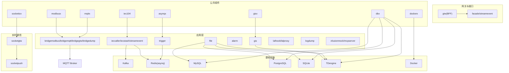
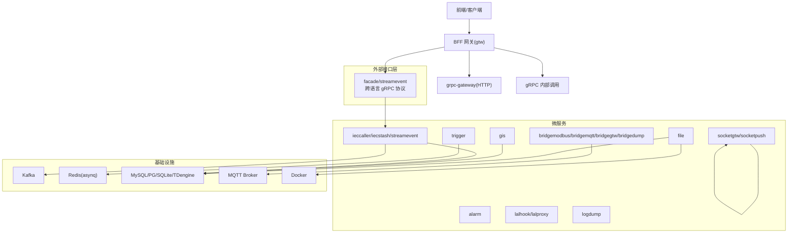
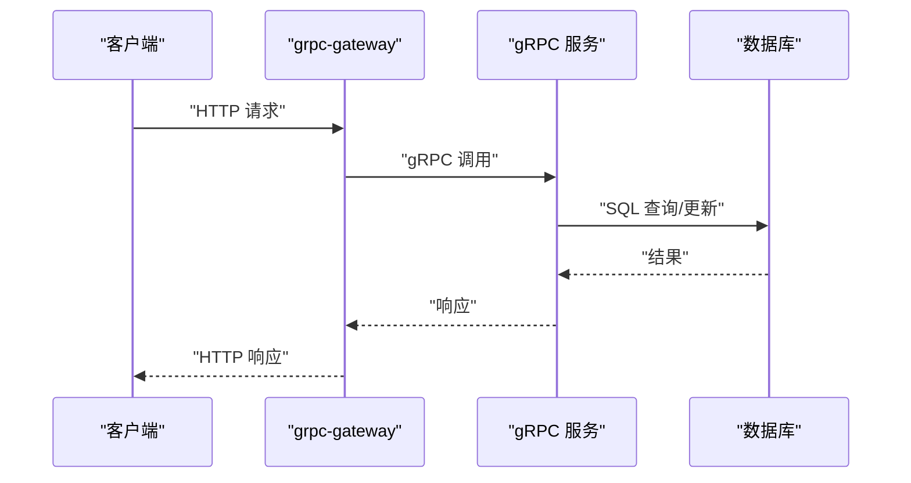
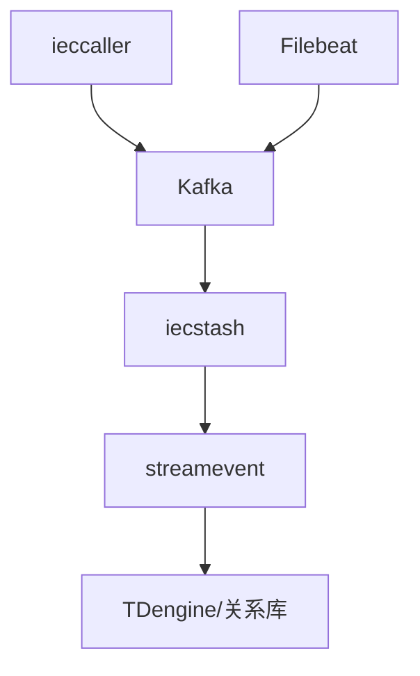
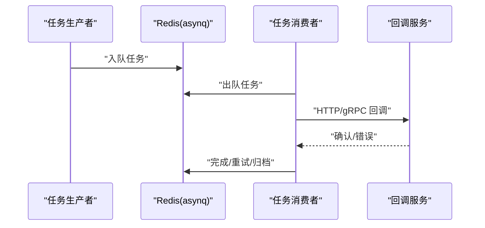
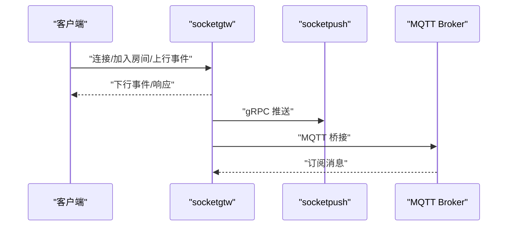
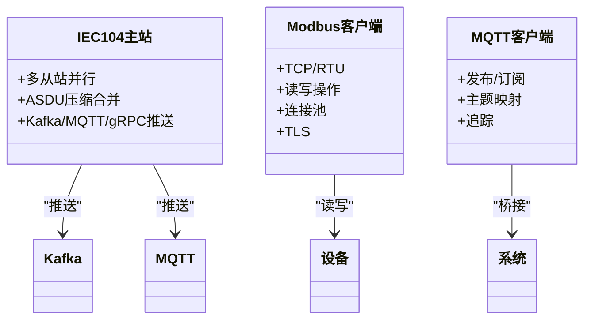
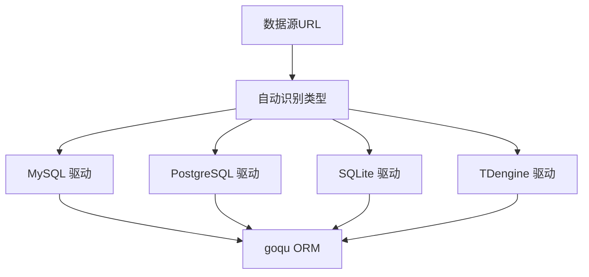
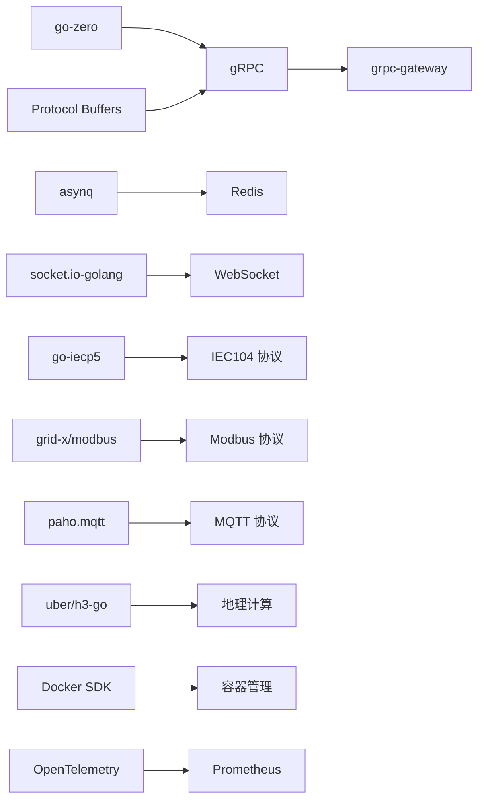

# 技术栈介绍

<cite>
**本文引用的文件**
- [go.mod](file://go.mod)
- [README.md](file://README.md)
- [deploy/docker-compose.yml](file://deploy/docker-compose.yml)
- [common/asynqx/asynqClient.go](file://common/asynqx/asynqClient.go)
- [common/socketiox/server.go](file://common/socketiox/server.go)
- [common/iec104/types/types.go](file://common/iec104/types/types.go)
- [common/modbusx/client.go](file://common/modbusx/client.go)
- [common/mqttx/mqttx.go](file://common/mqttx/mqttx.go)
- [common/dbx/dbx.go](file://common/dbx/dbx.go)
- [common/gisx/gisx.go](file://common/gisx/gisx.go)
- [common/dockerx/dockerx.go](file://common/dockerx/dockerx.go)
- [facade/streamevent/streamevent/streamevent.pb.go](file://facade/streamevent/streamevent/streamevent.pb.go)
- [swagger/iecstream.swagger.json](file://swagger/iecstream.swagger.json)
</cite>

## 目录
1. [简介](#简介)
2. [项目结构](#项目结构)
3. [核心组件](#核心组件)
4. [架构总览](#架构总览)
5. [详细组件分析](#详细组件分析)
6. [依赖分析](#依赖分析)
7. [性能考虑](#性能考虑)
8. [故障排查指南](#故障排查指南)
9. [结论](#结论)
10. [附录](#附录)

## 简介
Zero-Service 是基于 go-zero 的工业级微服务脚手架，聚焦物联网数据采集、异步任务调度与实时通信等场景，提供开箱即用的多协议接入与高性能数据处理能力。项目采用 gRPC + grpc-gateway + Protocol Buffers 构建 RPC 与 HTTP 接口，结合 Kafka、asynq + Redis、SocketIO、IEC 60870-5-104/Modbus/MQTT 等技术栈，形成从协议接入、消息传输、任务调度到实时通信的完整链路。

## 项目结构
项目采用“微服务 + 公共组件库 + 外部接口层”的组织方式：
- app/：核心微服务集合（如 ieccaller、iecstash、trigger、file、gis、alarm、podengine、bridgemodbus、bridgemqtt、bridgegtw、bridgedump、lalhook、lalproxy、logdump、xfusionmock、mcpserver 等）
- socketapp/：实时通信模块（socketgtw、socketpush）
- gtw/：BFF 网关（统一 HTTP/gRPC 聚合入口）
- facade/：对外接口层（streamevent，跨语言 gRPC 协议）
- common/：公共组件库（协议、消息、任务、地理、容器、拦截器等）
- model/：数据库模型与 SQL 脚本
- deploy/：Docker Compose 编排
- swagger/：Swagger API 文档
- third_party/：第三方 Proto 定义

图表来源
- [README.md:59-108](file://README.md#L59-L108)
- [deploy/docker-compose.yml:1-110](file://deploy/docker-compose.yml#L1-L110)

章节来源
- [README.md:59-108](file://README.md#L59-L108)

## 核心组件
- 微服务框架：go-zero
- RPC 通信：gRPC + grpc-gateway + Protocol Buffers
- 消息队列：Kafka（go-queue）
- 任务队列：asynq + Redis
- 实时通信：SocketIO（fork of socket.io-golang）
- 工业协议：IEC 60870-5-104（go-iecp5）、Modbus（grid-x/modbus）、MQTT（paho.mqtt）
- 关系数据库：MySQL、PostgreSQL、SQLite
- 时序数据库：TDengine
- 对象存储：MinIO、阿里 OSS、腾讯 COS
- 服务发现：Nacos
- 地理计算：H3（uber/h3-go）、GeoHash、orb、go-geom
- 容器管理：Docker SDK
- 监控追踪：OpenTelemetry、Prometheus
- 容器编排：Docker Compose、Kubernetes（可选）

章节来源
- [README.md:207-225](file://README.md#L207-L225)
- [go.mod:5-62](file://go.mod#L5-L62)

## 架构总览
系统采用“BFF 网关 + 微服务 + 外部接口层 + 基础设施”的分层架构：
- BFF 网关（gtw）聚合 gRPC 与 HTTP，提供统一入口与认证、文件上传下载、CORS 等能力
- 外部接口层（facade/streamevent）定义跨语言流数据事件协议，统一接入 Kafka/MQTT/WebSocket/IEC104 等上游
- 微服务围绕协议接入、任务调度、实时通信、地理信息、容器管理等职责划分
- 基础设施层提供消息、存储、服务发现与监控

图表来源
- [README.md:15-51](file://README.md#L15-L51)
- [deploy/docker-compose.yml:1-110](file://deploy/docker-compose.yml#L1-L110)

## 详细组件分析

### 微服务框架（go-zero）
- 作用：提供高性能微服务开发框架，内置路由、中间件、配置、日志、限流、熔断、追踪等能力
- 优势：生态完善、代码生成器高效、与 gRPC/HTTP 无缝集成
- 应用场景：所有微服务均基于 go-zero 构建，统一开发体验与运维标准

章节来源
- [README.md:3-13](file://README.md#L3-L13)

### RPC 通信（gRPC + grpc-gateway + Protocol Buffers）
- 作用：定义服务契约，提供高性能二进制 RPC，并通过 grpc-gateway 暴露 HTTP 接口
- 优势：强类型、跨语言、性能优异、与 OpenTelemetry 集成良好
- 应用场景：各微服务间内部调用、BFF 网关对外暴露 HTTP

图表来源
- [README.md:189-196](file://README.md#L189-L196)
- [swagger/iecstream.swagger.json:105-150](file://swagger/iecstream.swagger.json#L105-L150)

章节来源
- [README.md:189-206](file://README.md#L189-L206)
- [swagger/iecstream.swagger.json:105-150](file://swagger/iecstream.swagger.json#L105-L150)

### 消息队列（Kafka）
- 作用：高吞吐、持久化的消息总线，支撑 IEC104 数据采集、文件导出、日志汇聚等场景
- 优势：水平扩展、分区并行、事务支持
- 应用场景：ieccaller -> Kafka -> iecstash -> streamevent 的数据通道；bridgedump 通过 Filebeat 将日志写入 Kafka

图表来源
- [README.md:122-127](file://README.md#L122-L127)
- [deploy/docker-compose.yml:4-30](file://deploy/docker-compose.yml#L4-L30)

章节来源
- [README.md:122-127](file://README.md#L122-L127)
- [deploy/docker-compose.yml:4-30](file://deploy/docker-compose.yml#L4-L30)

### 任务队列（asynq + Redis）
- 作用：分布式任务队列，支持定时/延时任务、重试、归档与生命周期管理
- 优势：基于 Redis，轻量可靠；与 OpenTelemetry 集成，可观测性强
- 应用场景：trigger 服务的异步任务调度与回调

图表来源
- [README.md:133-154](file://README.md#L133-L154)
- [common/asynqx/asynqClient.go:17-31](file://common/asynqx/asynqClient.go#L17-L31)

章节来源
- [README.md:133-154](file://README.md#L133-L154)
- [common/asynqx/asynqClient.go:17-31](file://common/asynqx/asynqClient.go#L17-L31)

### 实时通信（SocketIO）
- 作用：提供 WebSocket 实时通信能力，支持房间管理、广播、鉴权与 MQTT 桥接
- 优势：事件驱动、灵活扩展、内置统计与错误上报
- 应用场景：socketgtw + socketpush 的消息网关与推送服务

图表来源
- [README.md:156-173](file://README.md#L156-L173)
- [common/socketiox/server.go:314-335](file://common/socketiox/server.go#L314-L335)

章节来源
- [README.md:156-173](file://README.md#L156-L173)
- [common/socketiox/server.go:314-335](file://common/socketiox/server.go#L314-L335)

### 工业协议（IEC 60870-5-104、Modbus、MQTT）
- IEC 104：完整的主站实现，支持多从站并行、Kafka/MQTT/gRPC 三协议推送、ASDU 压缩合并
- Modbus：TCP/RTU 读写、设备配置管理、连接池与 TLS 支持
- MQTT：发布/订阅、带追踪的消息透传、主题映射与事件桥接

图表来源
- [README.md:112-131](file://README.md#L112-L131)
- [common/iec104/types/types.go:17-54](file://common/iec104/types/types.go#L17-L54)
- [common/modbusx/client.go:107-143](file://common/modbusx/client.go#L107-L143)
- [common/mqttx/mqttx.go:98-178](file://common/mqttx/mqttx.go#L98-L178)

章节来源
- [README.md:112-131](file://README.md#L112-L131)
- [common/iec104/types/types.go:17-54](file://common/iec104/types/types.go#L17-L54)
- [common/modbusx/client.go:107-143](file://common/modbusx/client.go#L107-L143)
- [common/mqttx/mqttx.go:98-178](file://common/mqttx/mqttx.go#L98-L178)

### 数据库支持（MySQL/PostgreSQL/TDengine/SQLite）
- 作用：统一数据库抽象与方言支持，自动识别数据源类型并选择合适驱动
- 优势：零样板代码、方言透明、与 goqu ORM 集成
- 应用场景：file、gis、alarm 等服务的数据持久化；streamevent 将 IEC104 数据写入 TDengine

图表来源
- [common/dbx/dbx.go:31-64](file://common/dbx/dbx.go#L31-L64)
- [common/dbx/dbx.go:106-138](file://common/dbx/dbx.go#L106-L138)

章节来源
- [common/dbx/dbx.go:31-64](file://common/dbx/dbx.go#L31-L64)
- [common/dbx/dbx.go:106-138](file://common/dbx/dbx.go#L106-L138)

### 地理计算（H3、GeoHash、orb、go-geom）
- 作用：提供网格编码、电子围栏、坐标转换与空间分析能力
- 优势：高性能网格索引、丰富的几何库
- 应用场景：gis 服务的围栏生成与检测、坐标系转换

章节来源
- [README.md:179-179](file://README.md#L179-L179)
- [common/gisx/gisx.go:11-41](file://common/gisx/gisx.go#L11-L41)

### 容器管理（Docker SDK）
- 作用：封装 Docker 客户端，提供容器生命周期管理与资源解析
- 优势：与 OpenTelemetry 集成，可观测性友好
- 应用场景：podengine 服务的容器 CRUD、资源统计与镜像管理

章节来源
- [README.md:181-181](file://README.md#L181-L181)
- [common/dockerx/dockerx.go:11-95](file://common/dockerx/dockerx.go#L11-L95)

### 对外接口层（facade/streamevent）
- 作用：统一跨语言流数据事件协议，聚合多种上游协议（MQTT、WebSocket、Kafka、IEC104）
- 优势：协议稳定、跨语言、易于扩展
- 应用场景：任何语言实现 streamevent.proto 即可与数采平台交互

章节来源
- [README.md:197-205](file://README.md#L197-L205)
- [facade/streamevent/streamevent/streamevent.pb.go:435-470](file://facade/streamevent/streamevent/streamevent.pb.go#L435-L470)

## 依赖分析
- go.mod 中声明了 go-zero、grpc-gateway、protobuf、asynq、socket.io、IEC104、Modbus、MQTT、H3、GeoHash、Docker SDK、OpenTelemetry、Prometheus 等核心依赖
- 版本替换：socketio/v4 替换为 maomao94/socket.io-golang/v4，确保兼容性
- 基础设施：Kafka、Redis、MySQL、PostgreSQL、TDengine、Docker Compose

图表来源
- [go.mod:5-62](file://go.mod#L5-L62)
- [go.mod:244-244](file://go.mod#L244-L244)

章节来源
- [go.mod:5-62](file://go.mod#L5-L62)
- [go.mod:244-244](file://go.mod#L244-L244)

## 性能考虑
- gRPC 优先：内部服务间尽量使用 gRPC，减少序列化与协议开销
- 连接池与复用：Modbus 客户端池、Redis 连接池、HTTP 客户端连接池
- 异步解耦：Kafka 与 asynq 降低同步阻塞，提升吞吐
- 监控与追踪：OpenTelemetry + Prometheus，定位瓶颈与异常
- 数据库优化：根据场景选择合适数据库（MySQL/PG/SQLite/TD），合理索引与分页

## 故障排查指南
- 协议接入问题：检查 IEC104 从站配置、Modbus 地址与寄存器映射、MQTT Broker 连接参数
- 消息丢失：核查 Kafka 分区与副本、消费者组偏移、重试策略
- 任务堆积：查看 asynq 队列长度、重试次数、回调服务健康状态
- 实时通信异常：确认 SocketIO 连接鉴权、房间加入/离开事件、MQTT 桥接映射
- 数据落库失败：核对 streamevent 的点位配置、TDengine 表结构与写入权限

章节来源
- [README.md:112-188](file://README.md#L112-L188)

## 结论
Zero-Service 通过 go-zero 与 gRPC 生态构建高性能微服务体系，结合 Kafka、asynq、SocketIO、IEC104/Modbus/MQTT 等技术，形成从协议接入、消息传输、任务调度到实时通信的完整闭环。配合统一的对外接口层与多数据库抽象，满足工业物联网复杂场景下的高并发、低延迟与高可用需求。

## 附录

### 版本兼容性与升级注意事项
- Go 版本：项目使用 Go 1.25+，升级时需验证 go.mod 中依赖版本与 go-zero 版本兼容性
- gRPC 生态：grpc-gateway 与 protobuf 版本需匹配，升级时注意 proto 文件变更与生成代码差异
- asynq：升级时关注 Redis 兼容性与任务序列化格式，必要时迁移存量任务
- 协议库：IEC104、Modbus、MQTT 客户端升级需验证配置项与行为差异
- 数据库驱动：MySQL/PG 驱动升级需测试连接参数与 SQL 方言差异
- Docker SDK：升级时关注 API 变更与追踪 Provider 配置

章节来源
- [README.md:228-232](file://README.md#L228-L232)
- [go.mod:3-3](file://go.mod#L3-L3)