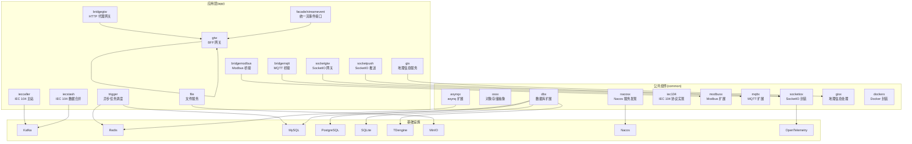
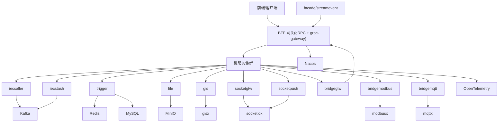
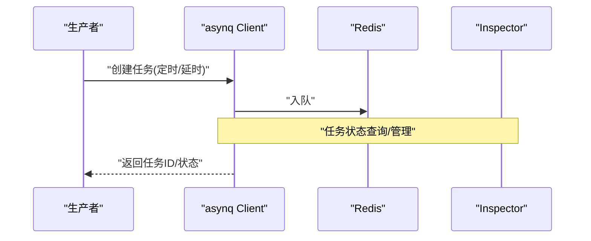
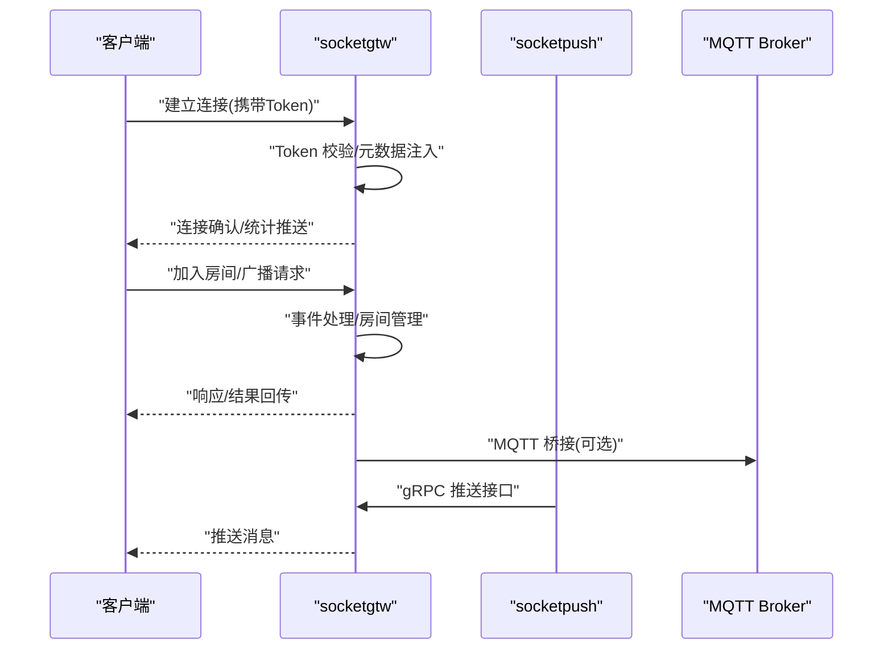
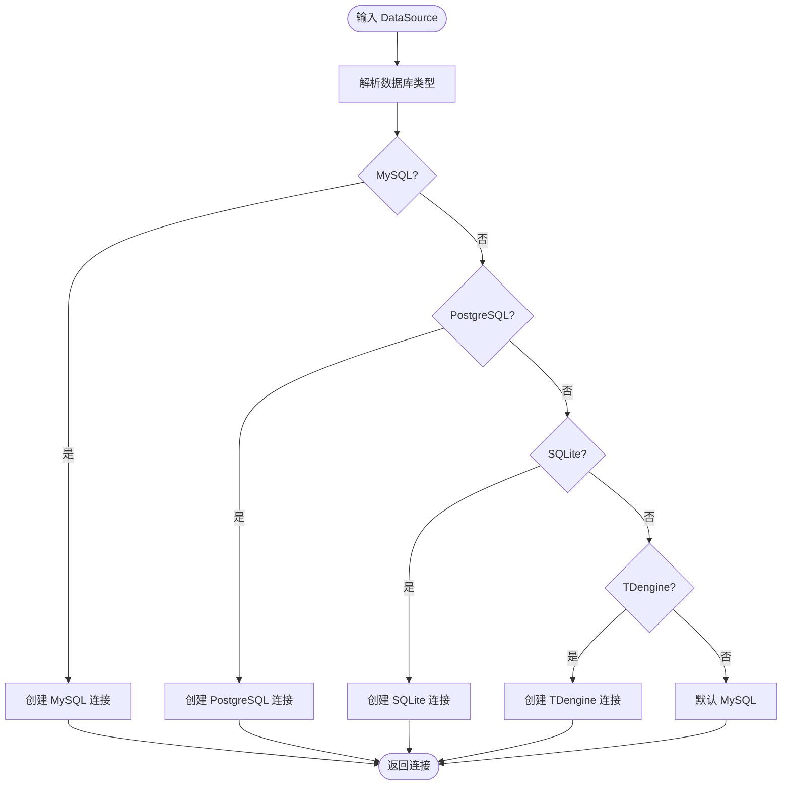

# 技术栈概览

<cite>
**本文引用的文件**
- [go.mod](file://go.mod)
- [README.md](file://README.md)
- [deploy/docker-compose.yml](file://deploy/docker-compose.yml)
- [common/dbx/dbx.go](file://common/dbx/dbx.go)
- [common/ossx/ossx.go](file://common/ossx/ossx.go)
- [common/gisx/gisx.go](file://common/gisx/gisx.go)
- [common/asynqx/asynqClient.go](file://common/asynqx/asynqClient.go)
- [common/socketiox/server.go](file://common/socketiox/server.go)
- [app/trigger/etc/trigger.yaml](file://app/trigger/etc/trigger.yaml)
- [app/ieccaller/etc/ieccaller.yaml](file://app/ieccaller/etc/ieccaller.yaml)
- [app/gis/etc/gis.yaml](file://app/gis/etc/gis.yaml)
- [zerorpc/etc/zerorpc.yaml](file://zerorpc/etc/zerorpc.yaml)
- [common/configx/kqConfig.go](file://common/configx/kqConfig.go)
</cite>

## 目录
1. [简介](#简介)
2. [项目结构](#项目结构)
3. [核心组件](#核心组件)
4. [架构总览](#架构总览)
5. [详细组件分析](#详细组件分析)
6. [依赖分析](#依赖分析)
7. [性能考量](#性能考量)
8. [故障排查指南](#故障排查指南)
9. [结论](#结论)
10. [附录](#附录)

## 简介
本文件为 zero-service 项目的技术栈概览，系统性梳理项目采用的核心技术与框架，并解释其在项目中的职责、选型原因、版本要求、依赖关系与兼容性信息。项目围绕 go-zero 微服务框架构建，覆盖 IEC 104 数采、异步任务调度、实时通信、容器管理、地理信息、对象存储、消息队列、gRPC RPC 框架、工业协议、OpenTelemetry 监控等能力，形成面向物联网与工业自动化场景的完整技术方案。

## 项目结构
项目采用“多微服务 + 公共组件 + 外部接口层”的分层组织方式：
- app/：核心微服务集合，涵盖 IEC 104 数采、异步任务、文件服务、GIS、SocketIO 网关与推送、桥接服务、BFF 网关、对外接口层 facade 等
- common/：公共组件库，包含数据库扩展、对象存储抽象、SocketIO 封装、asynq 扩展、工业协议适配、Nacos 服务发现、地理信息处理、Docker 封装、MQTT/Modbus 扩展等
- model/：数据库模型与 SQL 脚本
- deploy/：Docker Compose 编排与部署样例
- docs/swagger/third_party：文档、Swagger API 文档与第三方 proto 定义
- util/：工具集与脚本

图表来源
- [README.md:59-108](file://README.md#L59-L108)
- [go.mod:5-62](file://go.mod#L5-L62)

章节来源
- [README.md:59-108](file://README.md#L59-L108)

## 核心组件
本节对项目的关键技术组件进行分类说明，包括微服务框架、RPC 与协议、消息队列与任务队列、实时通信、数据库与对象存储、地理信息、容器与编排、监控与可观测性等。

- 微服务框架与 RPC
  - go-zero：统一的服务开发框架，提供路由、中间件、配置、日志、缓存、数据库、服务注册与发现等能力
  - gRPC + grpc-gateway + Protocol Buffers：服务间通信与 HTTP 访问统一
  - OpenTelemetry：链路追踪与指标采集，结合 Prometheus/Grafana 实现可观测性
- 消息队列与任务队列
  - Kafka：IEC 104 数据采集与桥接的数据通道
  - asynq + Redis：分布式异步任务队列，支持定时/延时任务与回调
- 实时通信
  - SocketIO（fork of socket.io-golang）：房间管理、广播、MQTT 桥接、Token 鉴权
- 工业协议
  - IEC 104（go-iecp5）、Modbus（grid-x/modbus）、MQTT（paho.mqtt）
- 数据库与对象存储
  - 关系数据库：MySQL、PostgreSQL、SQLite
  - 时序数据库：TDengine
  - 对象存储：MinIO（当前实现）、阿里 OSS、腾讯 COS（预留抽象）
- 容器与编排
  - Docker 容器生命周期管理；Docker Compose 编排；可选 Kubernetes
- 服务发现与治理
  - Nacos：服务注册与发现
- 地理信息
  - H3（uber/h3-go）、GeoHash（mmcloughlin/geohash）、orb/go-geom：网格编码、围栏、坐标转换
- 监控与可观测性
  - OpenTelemetry + Prometheus + Grafana

章节来源
- [README.md:207-225](file://README.md#L207-L225)
- [go.mod:5-62](file://go.mod#L5-L62)

## 架构总览
项目整体架构围绕“BFF 网关 + 微服务集群 + 消息中间件 + 数据存储 + 监控”展开，支持 IEC 104 数采、异步任务调度、实时通信、容器管理、地理信息、对象存储等能力。

图表来源
- [README.md:15-51](file://README.md#L15-L51)
- [deploy/docker-compose.yml:1-110](file://deploy/docker-compose.yml#L1-L110)

章节来源
- [README.md:15-51](file://README.md#L15-L51)
- [deploy/docker-compose.yml:1-110](file://deploy/docker-compose.yml#L1-L110)

## 详细组件分析

### go-zero 微服务框架
- 角色：统一微服务开发框架，提供路由、中间件、配置、日志、缓存、数据库、服务注册与发现等能力
- 选型原因：高性能、易扩展、生态完善，适合工业级微服务场景
- 版本与兼容性：Go 1.25+；与 go-zero v1.10.0 兼容
- 配置要点：服务名、监听地址、日志、超时、Nacos 配置、数据库连接、Redis 连接等

章节来源
- [README.md:228-232](file://README.md#L228-L232)
- [go.mod](file://go.mod#L3)

### gRPC RPC 框架与 grpc-gateway
- 角色：服务间通信与 HTTP 访问统一，支持 Protocol Buffers
- 选型原因：强类型、高性能、跨语言互操作
- 配置要点：Proto 定义、Swagger 文档生成、grpc-gateway HTTP 映射

章节来源
- [README.md:191-196](file://README.md#L191-L196)
- [swagger/trigger.swagger.json](file://swagger/trigger.swagger.json)

### Kafka 消息队列
- 角色：IEC 104 数据采集与桥接的数据通道，支持广播与分区
- 选型原因：高吞吐、持久化、水平扩展
- 配置要点：Broker 列表、Topic、消费者组、推送策略

章节来源
- [app/ieccaller/etc/ieccaller.yaml:35-41](file://app/ieccaller/etc/ieccaller.yaml#L35-L41)
- [deploy/docker-compose.yml:4-30](file://deploy/docker-compose.yml#L4-L30)

### asynq 异步任务调度
- 角色：基于 Redis 的分布式任务队列，支持定时/延时任务与回调
- 选型原因：轻量、可靠、易于集成 OpenTelemetry
- 集成：与 OpenTelemetry 链路追踪集成，支持生产者 Span 标注
- 配置要点：Redis 连接、DB 选择、任务类型标注

图表来源
- [common/asynqx/asynqClient.go:17-31](file://common/asynqx/asynqClient.go#L17-L31)

章节来源
- [README.md:133-154](file://README.md#L133-L154)
- [app/trigger/etc/trigger.yaml:19-24](file://app/trigger/etc/trigger.yaml#L19-L24)
- [common/asynqx/asynqClient.go:1-31](file://common/asynqx/asynqClient.go#L1-L31)

### SocketIO 实时通信
- 角色：SocketIO 网关与推送服务，支持房间管理、广播、MQTT 桥接、Token 鉴权
- 选型原因：成熟的实时通信生态，支持事件驱动与房间模型
- 能力：连接管理、房间加入/离开/广播、全局广播、会话剔除、元数据管理、统计推送、MQTT 桥接
- 配置要点：Token 校验、事件处理器、连接钩子、断开钩子、预加入房间钩子

图表来源
- [common/socketiox/server.go:314-335](file://common/socketiox/server.go#L314-L335)
- [common/socketiox/server.go:337-676](file://common/socketiox/server.go#L337-L676)

章节来源
- [README.md:156-173](file://README.md#L156-L173)
- [common/socketiox/server.go:1-814](file://common/socketiox/server.go#L1-L814)

### 工业协议（IEC 104/Modbus/MQTT）
- IEC 104：go-iecp5 实现完整主站能力，支持 Kafka/MQTT/gRPC 三协议推送
- Modbus：grid-x/modbus 提供 TCP/RTU 读写与设备配置管理
- MQTT：paho.mqtt 提供发布/订阅与带追踪的推送
- 配置要点：从站地址、端口、定时任务、推送 Topic、QoS、用户名/密码

章节来源
- [README.md:7-13](file://README.md#L7-L13)
- [app/ieccaller/etc/ieccaller.yaml:22-57](file://app/ieccaller/etc/ieccaller.yaml#L22-L57)
- [go.mod:48-50](file://go.mod#L48-L50)

### 多数据库支持（SQLite/MySQL/PostgreSQL/TDengine）
- 角色：统一数据库连接与方言适配，支持关系型与时序数据库
- 能力：自动识别数据源类型、创建连接、SQL 构建与日志输出
- 配置要点：DataSource 字符串、方言注册、事务与原生 DB 访问

图表来源
- [common/dbx/dbx.go:31-64](file://common/dbx/dbx.go#L31-L64)

章节来源
- [README.md:217-218](file://README.md#L217-L218)
- [common/dbx/dbx.go:1-155](file://common/dbx/dbx.go#L1-L155)

### 对象存储（OSS）与 MinIO
- 角色：文件上传、签名 URL、桶与文件管理
- 能力：MinIO 模板、租户模式、路径前缀、UUID 文件名生成
- 配置要点：Endpoint、AccessKey/SecretKey、BucketName、区域与应用 ID（不同厂商）

章节来源
- [README.md:178-179](file://README.md#L178-L179)
- [common/ossx/ossx.go:1-152](file://common/ossx/ossx.go#L1-L152)

### H3/GeoHash 地理位置处理
- 角色：地理围栏、网格编码、坐标转换
- 能力：H3 多边形转换、GeoHash 编解码、orb/go-geom 几何处理
- 配置要点：坐标系（WGS84/GCJ02/BD09）、精度与范围

章节来源
- [README.md:12-12](file://README.md#L12-L12)
- [common/gisx/gisx.go:1-60](file://common/gisx/gisx.go#L1-L60)

### Docker 容器化与编排
- 角色：容器生命周期管理、Docker Compose 编排、可选 Kubernetes
- 能力：镜像构建、卷挂载、环境变量、网络模式（host）
- 配置要点：Compose 服务定义、端口映射、依赖关系

章节来源
- [README.md:11-11](file://README.md#L11-L11)
- [deploy/docker-compose.yml:1-110](file://deploy/docker-compose.yml#L1-L110)

### OpenTelemetry 监控与追踪
- 角色：链路追踪、指标导出、与 asynq 生产者 Span 集成
- 能力：Tracer 创建、Span 属性设置、Exporter 配置
- 配置要点：服务名、导出端点、采样策略

章节来源
- [README.md:223-223](file://README.md#L223-L223)
- [common/asynqx/asynqClient.go:25-30](file://common/asynqx/asynqClient.go#L25-L30)

## 依赖分析
- 语言与运行时
  - Go 1.25+
- 微服务与 RPC
  - go-zero v1.10.0、grpc、grpc-gateway、Protocol Buffers
- 消息与任务
  - Kafka（go-queue）、asynq v0.26.0、Redis
- 实时通信
  - socket.io-golang fork、gorilla/websocket
- 工业协议
  - go-iecp5、grid-x/modbus、paho.mqtt.golang
- 数据库与 ORM
  - go-sql-driver/mysql、lib/pq、modernc.org/sqlite、goqu、squirrel
- 对象存储
  - minio/minio-go/v7
- 地理信息
  - uber/h3-go、mmcloughlin/geohash、paulmach/orb、twpayne/go-geom
- 服务发现
  - nacos-sdk-go/v2
- 监控与可观测性
  - opentelemetry-go、prometheus 客户端

章节来源
- [go.mod:5-62](file://go.mod#L5-L62)

## 性能考量
- 并发与异步
  - asynq 任务队列与 goroutine 并发处理，结合 Redis 高性能存储
  - SocketIO 事件处理采用安全 goroutine，避免阻塞
- 数据库
  - goqu/squirrel 提供高性能 SQL 构建与方言适配，支持事务与原生 DB 访问
- 消息队列
  - Kafka 分区与副本提升吞吐与可靠性；合理设置 Topic 与分区数量
- 缓存
  - Redis 作为 asynq 存储与通用缓存，建议配置集群与持久化
- 监控
  - OpenTelemetry 链路追踪与指标采集，建议配合 Prometheus/Grafana 实现可视化

## 故障排查指南
- 配置检查
  - 服务配置文件（如 trigger.yaml、ieccaller.yaml、gis.yaml、zerorpc.yaml）确保监听地址、日志路径、Redis/Kafka/数据库连接正确
- 连接问题
  - Redis/数据库/Kafka/Nacos 服务连通性检查；确认网络与防火墙策略
- 任务队列
  - asynq 任务堆积时检查 Redis 连接、任务类型与回调接口；查看 Inspector 状态
- 实时通信
  - SocketIO 连接鉴权失败时检查 Token 校验逻辑与事件处理器；关注统计推送与房间加载错误
- 对象存储
  - MinIO/其他 OSS 的 Endpoint、AccessKey/SecretKey、Bucket 权限与路径前缀
- 地理信息
  - H3/GeoHash 输入坐标精度与闭合性校验，多边形洞处理

章节来源
- [app/trigger/etc/trigger.yaml:1-37](file://app/trigger/etc/trigger.yaml#L1-L37)
- [app/ieccaller/etc/ieccaller.yaml:1-79](file://app/ieccaller/etc/ieccaller.yaml#L1-L79)
- [app/gis/etc/gis.yaml:1-19](file://app/gis/etc/gis.yaml#L1-L19)
- [zerorpc/etc/zerorpc.yaml:1-39](file://zerorpc/etc/zerorpc.yaml#L1-L39)
- [common/socketiox/server.go:337-676](file://common/socketiox/server.go#L337-L676)

## 结论
zero-service 项目以 go-zero 为核心，结合 Kafka/asynq、SocketIO、多数据库与对象存储、工业协议与地理信息、容器化与 OpenTelemetry，构建了面向工业与物联网场景的完整微服务体系。通过清晰的模块划分与公共组件抽象，项目具备良好的可扩展性与可维护性，适合在复杂工业环境中落地与演进。

## 附录
- 版本与兼容性摘要
  - Go：1.25+
  - go-zero：v1.10.0
  - asynq：v0.26.0
  - Kafka：3.9.0
  - Redis：作为 asynq 与缓存
  - MySQL/PostgreSQL/SQLite：通过 go-sql-driver/lib/pq/modernc.org/sqlite
  - TDengine：通过 taosdata driver-go
  - MinIO：minio-go/v7
  - SocketIO：fork of socket.io-golang
  - IEC 104：go-iecp5
  - Modbus：grid-x/modbus
  - MQTT：paho.mqtt.golang
  - H3/GeoHash：uber/h3-go、mmcloughlin/geohash
  - Nacos：nacos-sdk-go/v2
  - OpenTelemetry：otel v1.42.0

章节来源
- [go.mod:3-62](file://go.mod#L3-L62)
- [README.md:228-232](file://README.md#L228-L232)