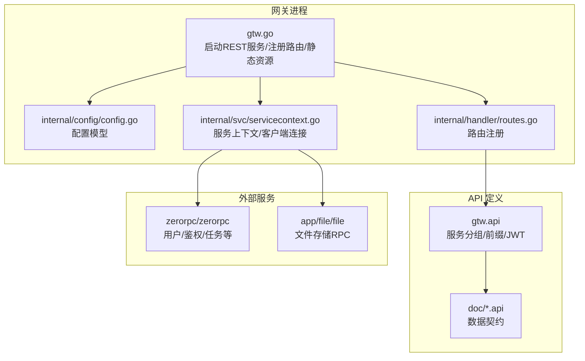
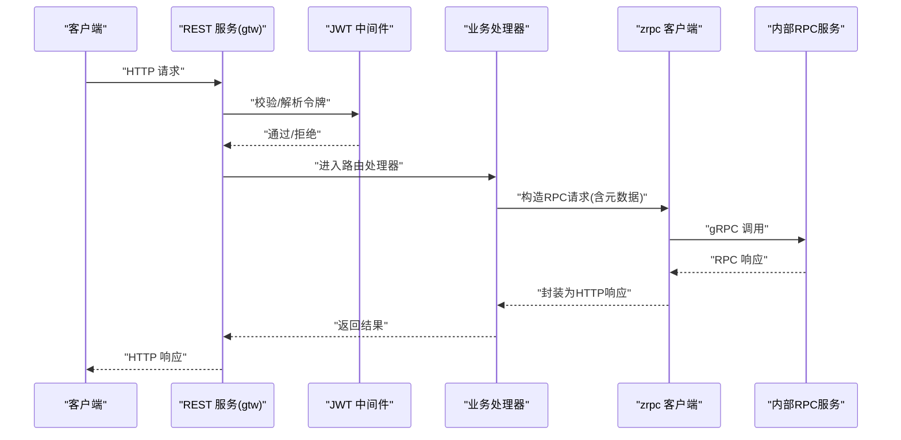
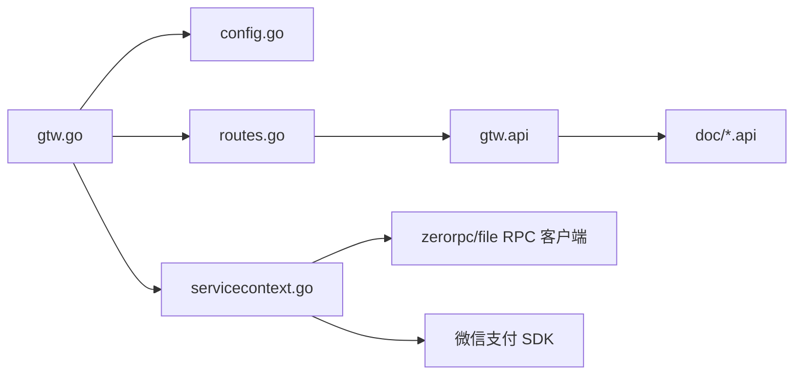

# BFF 网关服务

<cite>
**本文引用的文件**
- [gtw.go](file://gtw/gtw.go)
- [gtw.yaml](file://gtw/etc/gtw.yaml)
- [config.go](file://gtw/internal/config/config.go)
- [servicecontext.go](file://gtw/internal/svc/servicecontext.go)
- [routes.go](file://gtw/internal/handler/routes.go)
- [gtw.api](file://gtw/gtw.api)
- [base.api](file://gtw/doc/base.api)
- [common.api](file://gtw/doc/common.api)
- [user.api](file://gtw/doc/user.api)
- [file.api](file://gtw/doc/file.api)
- [metadataInterceptor.go](file://common/Interceptor/rpcclient/metadataInterceptor.go)
- [loggerInterceptor.go](file://common/Interceptor/rpcserver/loggerInterceptor.go)
</cite>

## 目录
1. [简介](#简介)
2. [项目结构](#项目结构)
3. [核心组件](#核心组件)
4. [架构总览](#架构总览)
5. [详细组件分析](#详细组件分析)
6. [依赖分析](#依赖分析)
7. [性能考虑](#性能考虑)
8. [故障排查指南](#故障排查指南)
9. [结论](#结论)
10. [附录](#附录)

## 简介
本文件为 BFF（Backend For Frontend）网关服务的技术文档，聚焦于 gtw 网关的架构设计、路由配置、中间件链与安全控制机制。文档说明网关如何作为统一入口处理各类请求，包括用户认证、权限校验、请求转发与协议适配（HTTP 与 gRPC）。同时给出典型 API 使用示例（用户管理、文件上传、支付回调），并覆盖配置项、性能优化与故障处理建议。

## 项目结构
- 应用入口与配置
  - 启动入口：gtw/gtw.go
  - 配置文件：gtw/etc/gtw.yaml
  - 内部配置模型：gtw/internal/config/config.go
  - 服务上下文：gtw/internal/svc/servicecontext.go
- 路由与 API 定义
  - 路由注册：gtw/internal/handler/routes.go
  - API 规范：gtw/gtw.api
  - 数据契约：gtw/doc/*.api（base、common、user、file）
- 中间件与拦截器
  - RPC 客户端元数据注入：common/Interceptor/rpcclient/metadataInterceptor.go
  - RPC 服务端日志拦截：common/Interceptor/rpcserver/loggerInterceptor.go

图表来源
- [gtw.go:25-95](file://gtw/gtw.go#L25-L95)
- [config.go:8-20](file://gtw/internal/config/config.go#L8-L20)
- [servicecontext.go:23-65](file://gtw/internal/svc/servicecontext.go#L23-L65)
- [routes.go:20-160](file://gtw/internal/handler/routes.go#L20-L160)
- [gtw.api:16-123](file://gtw/gtw.api#L16-L123)

章节来源
- [gtw.go:25-95](file://gtw/gtw.go#L25-L95)
- [config.go:8-20](file://gtw/internal/config/config.go#L8-L20)
- [servicecontext.go:23-65](file://gtw/internal/svc/servicecontext.go#L23-L65)
- [routes.go:20-160](file://gtw/internal/handler/routes.go#L20-L160)
- [gtw.api:16-123](file://gtw/gtw.api#L16-L123)

## 核心组件
- REST 服务器与 CORS
  - 使用 go-zero REST 服务，启用自定义 CORS 处理，支持动态 Origin、凭证、跨方法与跨头。
- 配置模型
  - 扩展 rest.RestConf，新增 JWT 密钥、ZeroRpc/FileRpc/AdminRpc 客户端配置、NFS 根路径、下载 URL、Swagger 路径等。
- 服务上下文
  - 初始化微信支付客户端、参数校验器、ZeroRpc/FileRpc 客户端（带元数据拦截器）、以及各业务依赖。
- 路由注册
  - 按前缀分组注册：/gtw/v1、/gtw/v1/pay、/app/user/v1、/app/common/v1、/file/v1。
  - 部分路由启用 JWT 认证（如用户信息相关）。
- Swagger 静态资源
  - 可选暴露 Swagger JSON 文件，通过 /swagger/:fileName 访问。

章节来源
- [gtw.go:51-95](file://gtw/gtw.go#L51-L95)
- [config.go:8-20](file://gtw/internal/config/config.go#L8-L20)
- [servicecontext.go:23-65](file://gtw/internal/svc/servicecontext.go#L23-L65)
- [routes.go:20-160](file://gtw/internal/handler/routes.go#L20-L160)
- [gtw.yaml:47-61](file://gtw/etc/gtw.yaml#L47-L61)

## 架构总览
网关采用“REST API + gRPC 客户端”的混合架构：
- REST 层负责路由、鉴权、CORS、静态资源与 Swagger。
- 业务层通过 zrpc 客户端调用内部 RPC 服务（如用户、文件、触发器等）。
- 中间件链包含元数据注入与日志记录，确保请求可追踪与可观测。

图表来源
- [gtw.go:51-95](file://gtw/gtw.go#L51-L95)
- [routes.go:20-160](file://gtw/internal/handler/routes.go#L20-L160)
- [servicecontext.go:59-63](file://gtw/internal/svc/servicecontext.go#L59-L63)
- [metadataInterceptor.go](file://common/Interceptor/rpcclient/metadataInterceptor.go)

## 详细组件分析

### REST 服务与 CORS
- 自定义 CORS 策略：动态 Origin、允许凭证、支持常用方法与头部、暴露必要响应头。
- Swagger 静态路由：按文件名返回 JSON，便于前端调试。

章节来源
- [gtw.go:51-95](file://gtw/gtw.go#L51-L95)

### 配置模型与外部依赖
- 配置字段
  - JwtAuth.AccessSecret：JWT 密钥，用于用户相关路由的签名校验。
  - ZeroRpcConf/FileRpcConf/AdminRpcConf：RPC 客户端连接与超时。
  - NfsRootPath/DownloadUrl：本地文件系统根路径与下载链接前缀。
  - SwaggerPath：Swagger JSON 路径，用于静态暴露。
- 外部依赖
  - 微信支付 SDK：初始化支付、证书、通知回调地址、HTTP 超时与日志驱动。
  - 参数校验器：基于 validator 的通用校验能力。

章节来源
- [config.go:8-20](file://gtw/internal/config/config.go#L8-L20)
- [servicecontext.go:23-65](file://gtw/internal/svc/servicecontext.go#L23-L65)
- [gtw.yaml:47-61](file://gtw/etc/gtw.yaml#L47-L61)

### 服务上下文与中间件
- 服务上下文
  - 提供 ZeroRpcCli、FileRpcCli、WxPayCli、Validate 等依赖。
  - 客户端均使用 UnaryClientInterceptor 注入元数据（如用户标识、TraceId 等）。
- 日志拦截器
  - 服务端拦截器用于记录请求日志，便于问题定位与审计。

章节来源
- [servicecontext.go:59-63](file://gtw/internal/svc/servicecontext.go#L59-L63)
- [metadataInterceptor.go](file://common/Interceptor/rpcclient/metadataInterceptor.go)
- [loggerInterceptor.go](file://common/Interceptor/rpcserver/loggerInterceptor.go)

### 路由注册与 API 分组
- 路由分组
  - /gtw/v1：基础能力（ping、forward、mfs 下载）。
  - /gtw/v1/pay：支付回调（微信支付通知/退款通知）。
  - /app/user/v1：用户相关（登录、小程序登录、发送短信验证码、获取/编辑当前用户）。
  - /app/common/v1：通用能力（区域列表、MFS 上传）。
  - /file/v1：文件存储（putFile、putChunkFile、putStreamFile、signUrl、statFile）。
- 认证策略
  - 用户相关路由启用 JWT（WithJwt），其余路由未强制。
- 超时设置
  - 文件相关路由显式设置较长超时，满足大文件传输需求。

章节来源
- [routes.go:20-160](file://gtw/internal/handler/routes.go#L20-L160)
- [gtw.api:16-123](file://gtw/gtw.api#L16-L123)

### 数据契约与请求体
- 基础类型
  - PingReply、ForwardRequest/Reply、UploadFileRequest/Reply、DownloadFileRequest、ImageMeta 等。
- 通用类型
  - GetRegionListRequest/Reply、Region 等。
- 用户类型
  - LoginRequest/Reply、MiniProgramLoginRequest/Reply、SendSMSVerifyCode、GetCurrentUserRequest/Reply、EditCurrentUserRequest/Reply、User 等。
- 文件类型
  - PutFileRequest、GetFileReply、SignUrlRequest/Reply、StatFileRequest/Reply、File/OssFile 等。

章节来源
- [base.api:3-51](file://gtw/doc/base.api#L3-L51)
- [common.api:3-24](file://gtw/doc/common.api#L3-L24)
- [user.api:3-47](file://gtw/doc/user.api#L3-L47)
- [file.api:5-60](file://gtw/doc/file.api#L5-L60)

### API 使用示例

- 用户管理
  - 登录
    - 方法：POST
    - 路径：/app/user/v1/login
    - 请求体：LoginRequest
    - 返回：LoginReply（包含访问令牌与过期间隔）
  - 小程序登录
    - 方法：POST
    - 路径：/app/user/v1/miniProgramLogin
    - 请求体：MiniProgramLoginRequest
    - 返回：MiniProgramLoginReply（包含 OpenId/UnionId/SessionKey）
  - 获取当前用户
    - 方法：GET
    - 路径：/app/user/v1/getCurrentUser
    - 需要 JWT
    - 返回：GetCurrentUserReply（包含 User）
  - 编辑当前用户
    - 方法：POST
    - 路径：/app/user/v1/editCurrentUser
    - 需要 JWT
    - 请求体：EditCurrentUserRequest
    - 返回：空

- 文件上传与下载
  - 通用上传（MFS）
    - 方法：POST
    - 路径：/app/common/v1/mfs/uploadFile
    - 请求体：UploadFileRequest（含文件类型、是否缩略图等）
    - 返回：UploadFileReply（含文件名、路径、URL、缩略图等）
  - OSS 上传（三类）
    - PUT/POST /file/v1/oss/endpoint/putFile
    - PUT/POST /file/v1/oss/endpoint/putChunkFile
    - PUT/POST /file/v1/oss/endpoint/putStreamFile
    - 请求体：PutFileRequest（租户ID、资源编号、存储桶、是否缩略图等）
    - 返回：GetFileReply（包含 File 信息）
  - 签名 URL
    - 方法：POST
    - 路径：/file/v1/oss/endpoint/signUrl
    - 请求体：SignUrlRequest（租户ID、资源编号、存储桶、文件名、过期时间）
    - 返回：SignUrlReqly（包含签名 URL）
  - 文件信息
    - 方法：POST
    - 路径：/file/v1/oss/endpoint/statFile
    - 请求体：StatFileRequest（租户ID、资源编号、文件名、是否签名、过期时间）
    - 返回：StatFileReply（包含 OssFile 信息）
  - 下载文件
    - 方法：GET
    - 路径：/gtw/v1/mfs/downloadFile
    - 查询参数：path
    - 返回：文件内容

- 支付处理
  - 微信支付通知
    - 方法：POST
    - 路径：/gtw/v1/pay/wechat/paidNotify
    - 请求体：微信支付回调数据（由微信异步推送）
    - 返回：处理结果（网关负责验签与落库）
  - 微信退款通知
    - 方法：POST
    - 路径：/gtw/v1/pay/wechat/refundedNotify
    - 请求体：微信支付退款回调数据
    - 返回：处理结果

章节来源
- [gtw.api:20-123](file://gtw/gtw.api#L20-L123)
- [routes.go:20-160](file://gtw/internal/handler/routes.go#L20-L160)
- [base.api:3-51](file://gtw/doc/base.api#L3-L51)
- [common.api:3-24](file://gtw/doc/common.api#L3-L24)
- [user.api:3-47](file://gtw/doc/user.api#L3-L47)
- [file.api:5-60](file://gtw/doc/file.api#L5-L60)

### 安全控制机制
- JWT 认证
  - 对 /app/user/v1 下的用户相关路由启用 WithJwt，使用配置中的 AccessSecret 进行签名校验。
- CORS 控制
  - 动态 Origin、允许凭证、暴露必要响应头，避免缓存污染。
- 元数据注入
  - RPC 客户端拦截器自动注入请求上下文元数据（如用户 ID、TraceId），便于后端链路追踪与鉴权。

章节来源
- [routes.go:157-159](file://gtw/internal/handler/routes.go#L157-L159)
- [gtw.go:51-63](file://gtw/gtw.go#L51-L63)
- [servicecontext.go:59-63](file://gtw/internal/svc/servicecontext.go#L59-L63)
- [metadataInterceptor.go](file://common/Interceptor/rpcclient/metadataInterceptor.go)

### 协议适配与请求转发
- HTTP -> gRPC
  - REST 层接收 HTTP 请求，解析参数与 Body，构造 RPC 请求并通过 zrpc 客户端转发至内部 RPC 服务。
- gRPC 客户端
  - 使用 WithUnaryClientInterceptor 注入元数据拦截器，保证跨服务传递上下文。
- 文件流式上传
  - 提供 putChunkFile（双向流）与 putStreamFile（单向流）以适配不同场景的大文件传输。

章节来源
- [servicecontext.go:59-63](file://gtw/internal/svc/servicecontext.go#L59-L63)
- [routes.go:42-74](file://gtw/internal/handler/routes.go#L42-L74)
- [file.api:28-57](file://gtw/doc/file.api#L28-L57)

## 依赖分析
- 组件耦合
  - gtw.go 依赖配置、服务上下文与路由注册；路由注册依赖各模块处理器；服务上下文依赖 RPC 客户端与微信支付 SDK。
- 外部依赖
  - go-zero REST 与 RPC 框架、validator 参数校验、微信支付 SDK、Nacos（已导入但未在配置中启用）。
- 潜在风险
  - 文件路由超时较长，需结合后端服务能力与网络环境评估。
  - 支付回调依赖微信平台证书与通知地址，需确保证书与回调地址正确配置。

图表来源
- [gtw.go:25-95](file://gtw/gtw.go#L25-L95)
- [config.go:8-20](file://gtw/internal/config/config.go#L8-L20)
- [servicecontext.go:23-65](file://gtw/internal/svc/servicecontext.go#L23-L65)
- [routes.go:20-160](file://gtw/internal/handler/routes.go#L20-L160)
- [gtw.api:16-123](file://gtw/gtw.api#L16-L123)

章节来源
- [gtw.go:25-95](file://gtw/gtw.go#L25-L95)
- [config.go:8-20](file://gtw/internal/config/config.go#L8-L20)
- [servicecontext.go:23-65](file://gtw/internal/svc/servicecontext.go#L23-L65)
- [routes.go:20-160](file://gtw/internal/handler/routes.go#L20-L160)
- [gtw.api:16-123](file://gtw/gtw.api#L16-L123)

## 性能考虑
- 超时与并发
  - 文件相关路由设置较长超时，适合大文件传输；建议根据实际带宽与磁盘 IO 调整。
  - REST 层默认并发模型由 go-zero 管理，建议结合压测结果调整资源配置。
- RPC 客户端
  - 使用 UnaryClientInterceptor 注入元数据，避免额外开销；建议在高并发场景下启用连接池与重试策略。
- CORS 与静态资源
  - 动态 Origin 会增加少量 CPU 开销，建议生产环境固定允许域名并开启缓存。
- 日志与监控
  - 服务端拦截器可用于统计 QPS、延迟与错误率；建议接入链路追踪与指标采集。

## 故障排查指南
- CORS 问题
  - 现象：浏览器跨域失败或凭证无法使用。
  - 排查：确认请求头 Origin、Credentials 设置与服务端 CORS 配置一致。
- JWT 认证失败
  - 现象：用户相关接口返回 401。
  - 排查：核对 AccessSecret 一致性、Token 格式与有效期。
- RPC 调用异常
  - 现象：用户/文件等接口报错。
  - 排查：检查 ZeroRpcConf/FileRpcConf 地址、超时、网络连通性；查看拦截器注入的元数据是否完整。
- 支付回调失败
  - 现象：微信支付通知未被处理。
  - 排查：确认证书路径、NotifyURL、回调签名与解密流程；查看微信支付日志输出。
- Swagger 无法访问
  - 现象：/swagger/:fileName 返回 404。
  - 排查：确认 SwaggerPath 配置与文件存在。

章节来源
- [gtw.go:51-95](file://gtw/gtw.go#L51-L95)
- [routes.go:157-159](file://gtw/internal/handler/routes.go#L157-L159)
- [servicecontext.go:23-65](file://gtw/internal/svc/servicecontext.go#L23-L65)
- [gtw.yaml:47-61](file://gtw/etc/gtw.yaml#L47-L61)

## 结论
本 BFF 网关以 go-zero 为基础，结合 REST 与 gRPC，实现了统一入口、灵活路由、安全认证与可观测性。通过清晰的 API 分组与数据契约，支撑用户管理、文件上传与支付回调等常见场景。建议在生产环境中完善证书与回调配置、优化 CORS 与超时策略，并接入链路追踪与监控体系以提升稳定性与可维护性。

## 附录
- 关键配置项
  - JwtAuth.AccessSecret：JWT 密钥
  - ZeroRpcConf/FileRpcConf/AdminRpcConf：RPC 客户端配置
  - NfsRootPath/DownloadUrl：本地文件系统与下载前缀
  - SwaggerPath：Swagger JSON 路径
- 常用 API 路径速览
  - /gtw/v1/ping、/gtw/v1/forward、/gtw/v1/mfs/downloadFile
  - /gtw/v1/pay/wechat/paidNotify、/gtw/v1/pay/wechat/refundedNotify
  - /app/user/v1/login、/app/user/v1/miniProgramLogin、/app/user/v1/sendSMSVerifyCode、/app/user/v1/getCurrentUser、/app/user/v1/editCurrentUser
  - /app/common/v1/getRegionList、/app/common/v1/mfs/uploadFile
  - /file/v1/oss/endpoint/putFile、/file/v1/oss/endpoint/putChunkFile、/file/v1/oss/endpoint/putStreamFile、/file/v1/oss/endpoint/signUrl、/file/v1/oss/endpoint/statFile