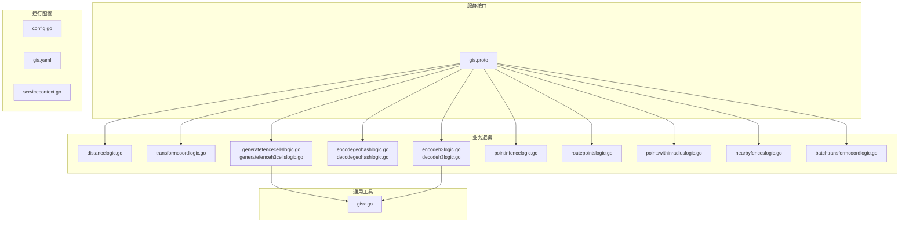
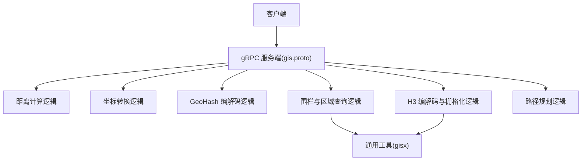
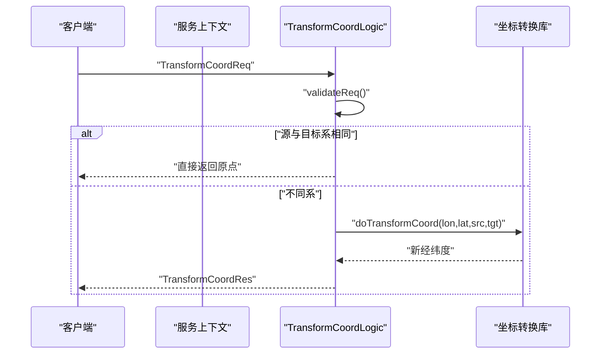
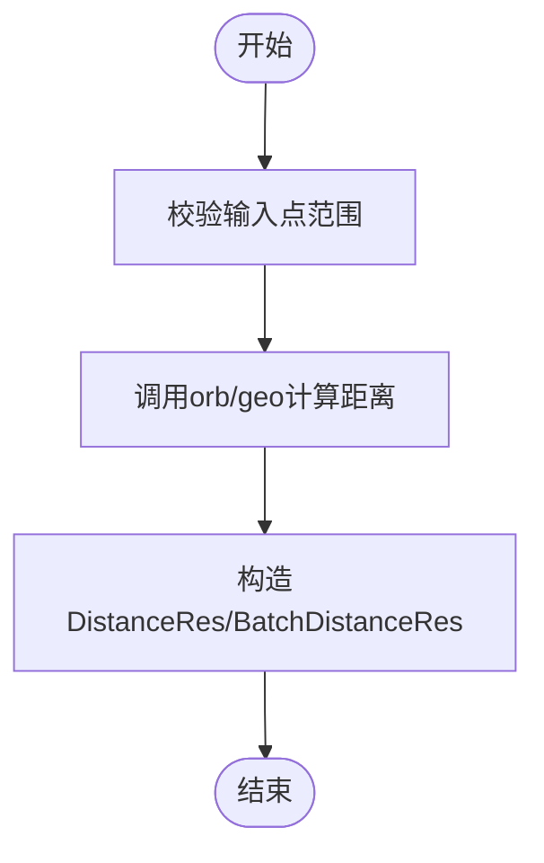
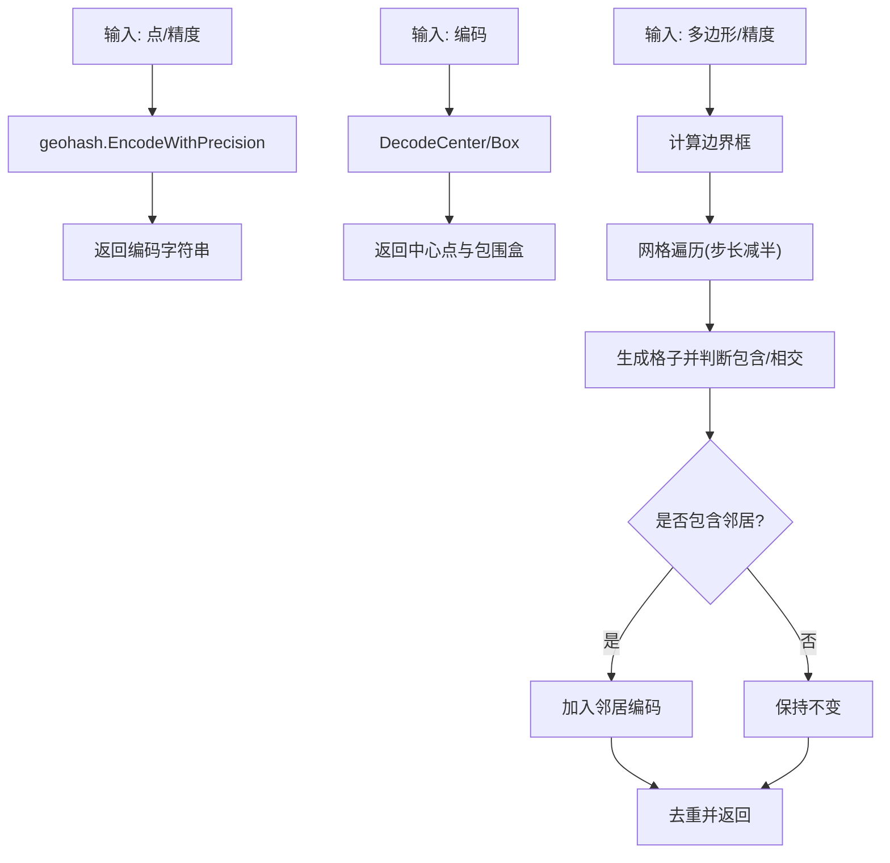
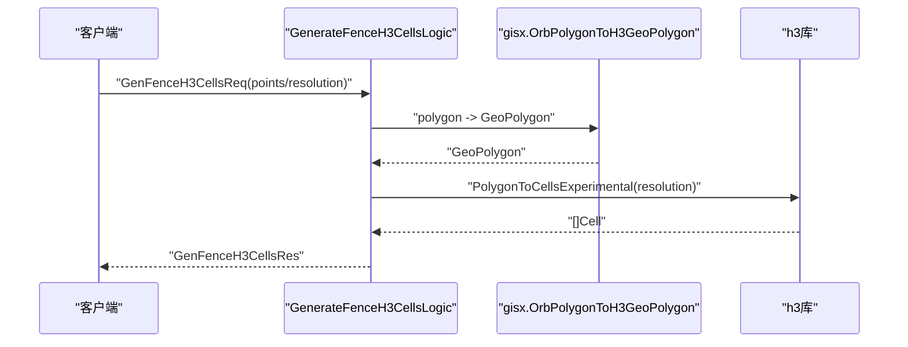
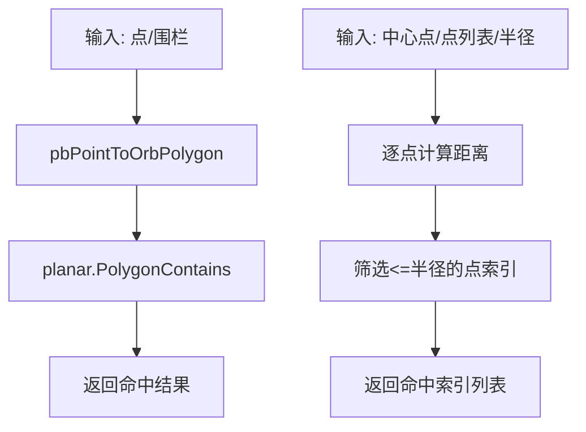
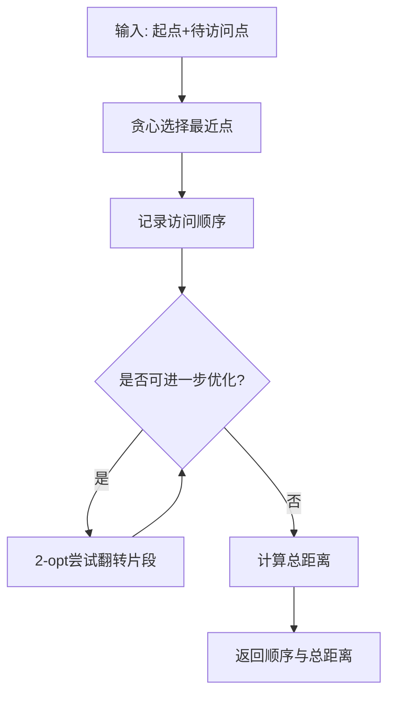
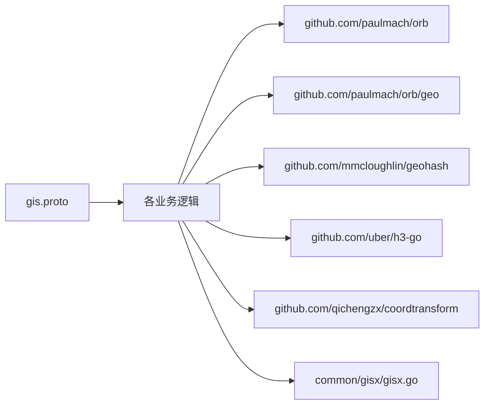

# GIS 地理位置服务

<cite>
**本文引用的文件**
- [app/gis/gis.proto](file://app/gis/gis.proto)
- [common/gisx/gisx.go](file://common/gisx/gisx.go)
- [app/gis/internal/logic/distancelogic.go](file://app/gis/internal/logic/distancelogic.go)
- [app/gis/internal/logic/transformcoordlogic.go](file://app/gis/internal/logic/transformcoordlogic.go)
- [app/gis/internal/logic/encodeh3logic.go](file://app/gis/internal/logic/encodeh3logic.go)
- [app/gis/internal/logic/decodeh3logic.go](file://app/gis/internal/logic/decodeh3logic.go)
- [app/gis/internal/logic/encodegeohashlogic.go](file://app/gis/internal/logic/encodegeohashlogic.go)
- [app/gis/internal/logic/decodegeohashlogic.go](file://app/gis/internal/logic/decodegeohashlogic.go)
- [app/gis/internal/logic/generatefencecellslogic.go](file://app/gis/internal/logic/generatefencecellslogic.go)
- [app/gis/internal/logic/generatefenceh3cellslogic.go](file://app/gis/internal/logic/generatefenceh3cellslogic.go)
- [app/gis/internal/logic/pointinfencelogic.go](file://app/gis/internal/logic/pointinfencelogic.go)
- [app/gis/internal/logic/routepointslogic.go](file://app/gis/internal/logic/routepointslogic.go)
- [app/gis/internal/logic/pointswithinradiuslogic.go](file://app/gis/internal/logic/pointswithinradiuslogic.go)
- [app/gis/internal/logic/nearbyfenceslogic.go](file://app/gis/internal/logic/nearbyfenceslogic.go)
- [app/gis/internal/logic/batchtransformcoordlogic.go](file://app/gis/internal/logic/batchtransformcoordlogic.go)
- [app/gis/etc/gis.yaml](file://app/gis/etc/gis.yaml)
- [app/gis/internal/config/config.go](file://app/gis/internal/config/config.go)
- [app/gis/internal/svc/servicecontext.go](file://app/gis/internal/svc/servicecontext.go)
</cite>

## 目录
1. [简介](#简介)
2. [项目结构](#项目结构)
3. [核心组件](#核心组件)
4. [架构总览](#架构总览)
5. [详细组件分析](#详细组件分析)
6. [依赖关系分析](#依赖关系分析)
7. [性能考量](#性能考量)
8. [故障排查指南](#故障排查指南)
9. [结论](#结论)
10. [附录](#附录)

## 简介
本项目围绕 GIS 地理位置服务，提供坐标转换、距离计算、地理围栏、空间索引（H3 与 GeoHash）、区域查询与路径规划等能力。通过 gRPC 接口对外提供统一能力，内部以 GoZero RPC 服务承载，结合第三方几何与空间索引库实现高性能的空间分析。

## 项目结构
- 服务定义位于 gis.proto，描述坐标系枚举、围栏与点对象、以及各类 RPC 接口。
- 业务逻辑集中在 app/gis/internal/logic 下，按功能拆分文件，职责清晰。
- 通用 GIS 工具位于 common/gisx，封装 orb.Polygon 到 H3 的转换等复用逻辑。
- 配置位于 app/gis/etc/gis.yaml，包含监听地址、日志、中间件统计等。
- 服务上下文与配置封装在 internal/svc 与 internal/config。

**图表来源**
- [app/gis/gis.proto:1-219](file://app/gis/gis.proto#L1-L219)
- [app/gis/internal/logic/distancelogic.go:1-67](file://app/gis/internal/logic/distancelogic.go#L1-L67)
- [app/gis/internal/logic/transformcoordlogic.go:1-102](file://app/gis/internal/logic/transformcoordlogic.go#L1-L102)
- [app/gis/internal/logic/encodeh3logic.go:1-46](file://app/gis/internal/logic/encodeh3logic.go#L1-L46)
- [app/gis/internal/logic/decodeh3logic.go:1-57](file://app/gis/internal/logic/decodeh3logic.go#L1-L57)
- [app/gis/internal/logic/encodegeohashlogic.go:1-45](file://app/gis/internal/logic/encodegeohashlogic.go#L1-L45)
- [app/gis/internal/logic/decodegeohashlogic.go:1-48](file://app/gis/internal/logic/decodegeohashlogic.go#L1-L48)
- [app/gis/internal/logic/generatefencecellslogic.go:1-294](file://app/gis/internal/logic/generatefencecellslogic.go#L1-L294)
- [app/gis/internal/logic/generatefenceh3cellslogic.go:1-78](file://app/gis/internal/logic/generatefenceh3cellslogic.go#L1-L78)
- [app/gis/internal/logic/pointinfencelogic.go:1-59](file://app/gis/internal/logic/pointinfencelogic.go#L1-L59)
- [app/gis/internal/logic/routepointslogic.go:1-113](file://app/gis/internal/logic/routepointslogic.go#L1-L113)
- [app/gis/internal/logic/pointswithinradiuslogic.go:1-75](file://app/gis/internal/logic/pointswithinradiuslogic.go#L1-L75)
- [app/gis/internal/logic/nearbyfenceslogic.go:1-32](file://app/gis/internal/logic/nearbyfenceslogic.go#L1-L32)
- [app/gis/internal/logic/batchtransformcoordlogic.go:1-66](file://app/gis/internal/logic/batchtransformcoordlogic.go#L1-L66)
- [common/gisx/gisx.go:1-60](file://common/gisx/gisx.go#L1-L60)
- [app/gis/etc/gis.yaml:1-19](file://app/gis/etc/gis.yaml#L1-L19)
- [app/gis/internal/config/config.go:1-17](file://app/gis/internal/config/config.go#L1-L17)
- [app/gis/internal/svc/servicecontext.go:1-14](file://app/gis/internal/svc/servicecontext.go#L1-L14)

**章节来源**
- [app/gis/gis.proto:1-219](file://app/gis/gis.proto#L1-L219)
- [app/gis/etc/gis.yaml:1-19](file://app/gis/etc/gis.yaml#L1-L19)
- [app/gis/internal/config/config.go:1-17](file://app/gis/internal/config/config.go#L1-L17)
- [app/gis/internal/svc/servicecontext.go:1-14](file://app/gis/internal/svc/servicecontext.go#L1-L14)

## 核心组件
- 坐标系统与消息模型：gis.proto 定义了坐标系枚举、点、围栏、请求与响应消息，统一了输入输出结构。
- 距离计算：基于 orb/geo 的球面距离计算，支持单点对与批量点对。
- 坐标转换：支持 WGS84、GCJ02、BD09 三类坐标系互转，提供单点与批量转换。
- 空间索引：GeoHash 编解码；H3 编解码与多边形栅格化。
- 围栏与区域查询：多边形内点判断、围栏栅格生成（GeoHash/H3），半径内点查询，附近围栏粗过滤占位。
- 路径规划：贪心 + 2-opt 局部优化的近似最短路径求解。

**章节来源**
- [app/gis/gis.proto:9-219](file://app/gis/gis.proto#L9-L219)
- [app/gis/internal/logic/distancelogic.go:30-41](file://app/gis/internal/logic/distancelogic.go#L30-L41)
- [app/gis/internal/logic/transformcoordlogic.go:28-50](file://app/gis/internal/logic/transformcoordlogic.go#L28-L50)
- [app/gis/internal/logic/encodegeohashlogic.go:28-44](file://app/gis/internal/logic/encodegeohashlogic.go#L28-L44)
- [app/gis/internal/logic/decodegeohashlogic.go:28-47](file://app/gis/internal/logic/decodegeohashlogic.go#L28-L47)
- [app/gis/internal/logic/encodeh3logic.go:28-45](file://app/gis/internal/logic/encodeh3logic.go#L28-L45)
- [app/gis/internal/logic/decodeh3logic.go:28-56](file://app/gis/internal/logic/decodeh3logic.go#L28-L56)
- [app/gis/internal/logic/generatefencecellslogic.go:32-126](file://app/gis/internal/logic/generatefencecellslogic.go#L32-L126)
- [app/gis/internal/logic/generatefenceh3cellslogic.go:29-77](file://app/gis/internal/logic/generatefenceh3cellslogic.go#L29-L77)
- [app/gis/internal/logic/pointinfencelogic.go:29-58](file://app/gis/internal/logic/pointinfencelogic.go#L29-L58)
- [app/gis/internal/logic/pointswithinradiuslogic.go:28-74](file://app/gis/internal/logic/pointswithinradiuslogic.go#L28-L74)
- [app/gis/internal/logic/routepointslogic.go:29-112](file://app/gis/internal/logic/routepointslogic.go#L29-L112)
- [app/gis/internal/logic/nearbyfenceslogic.go:26-31](file://app/gis/internal/logic/nearbyfenceslogic.go#L26-L31)

## 架构总览
服务采用 GoZero RPC 架构，gRPC 接口由 proto 定义，logic 层负责具体算法与调用第三方库，common/gisx 提供跨库转换工具，配置文件控制监听、日志与中间件。

**图表来源**
- [app/gis/gis.proto:18-50](file://app/gis/gis.proto#L18-L50)
- [app/gis/internal/logic/distancelogic.go:30-41](file://app/gis/internal/logic/distancelogic.go#L30-L41)
- [app/gis/internal/logic/transformcoordlogic.go:28-50](file://app/gis/internal/logic/transformcoordlogic.go#L28-L50)
- [app/gis/internal/logic/encodegeohashlogic.go:28-44](file://app/gis/internal/logic/encodegeohashlogic.go#L28-L44)
- [app/gis/internal/logic/decodegeohashlogic.go:28-47](file://app/gis/internal/logic/decodegeohashlogic.go#L28-L47)
- [app/gis/internal/logic/encodeh3logic.go:28-45](file://app/gis/internal/logic/encodeh3logic.go#L28-L45)
- [app/gis/internal/logic/decodeh3logic.go:28-56](file://app/gis/internal/logic/decodeh3logic.go#L28-L56)
- [app/gis/internal/logic/generatefencecellslogic.go:32-126](file://app/gis/internal/logic/generatefencecellslogic.go#L32-L126)
- [app/gis/internal/logic/generatefenceh3cellslogic.go:29-77](file://app/gis/internal/logic/generatefenceh3cellslogic.go#L29-L77)
- [common/gisx/gisx.go:11-60](file://common/gisx/gisx.go#L11-L60)

## 详细组件分析

### 坐标转换（WGS84/GCJ02/BD09）
- 支持单点与批量转换，内部通过第三方库进行坐标系互转，并在同系切换时直接返回。
- 输入校验包括经纬度范围与坐标系枚举有效性。
- 批量转换通过循环调用单点转换逻辑实现。

**图表来源**
- [app/gis/internal/logic/transformcoordlogic.go:28-50](file://app/gis/internal/logic/transformcoordlogic.go#L28-L50)
- [app/gis/internal/logic/transformcoordlogic.go:52-76](file://app/gis/internal/logic/transformcoordlogic.go#L52-L76)
- [app/gis/internal/logic/transformcoordlogic.go:78-101](file://app/gis/internal/logic/transformcoordlogic.go#L78-L101)
- [app/gis/internal/logic/batchtransformcoordlogic.go:28-65](file://app/gis/internal/logic/batchtransformcoordlogic.go#L28-L65)

**章节来源**
- [app/gis/internal/logic/transformcoordlogic.go:28-101](file://app/gis/internal/logic/transformcoordlogic.go#L28-L101)
- [app/gis/internal/logic/batchtransformcoordlogic.go:28-66](file://app/gis/internal/logic/batchtransformcoordlogic.go#L28-L66)

### 距离计算与批量距离
- 单点对距离：使用 orb/geo 的球面距离计算，返回米级距离。
- 批量距离：接收点对列表，逐对计算并返回距离数组。
- 输入点均进行范围校验，避免非法值进入计算。

**图表来源**
- [app/gis/internal/logic/distancelogic.go:30-41](file://app/gis/internal/logic/distancelogic.go#L30-L41)
- [app/gis/internal/logic/distancelogic.go:43-66](file://app/gis/internal/logic/distancelogic.go#L43-L66)
- [app/gis/internal/logic/pointswithinradiuslogic.go:28-74](file://app/gis/internal/logic/pointswithinradiuslogic.go#L28-L74)

**章节来源**
- [app/gis/internal/logic/distancelogic.go:30-66](file://app/gis/internal/logic/distancelogic.go#L30-L66)
- [app/gis/internal/logic/pointswithinradiuslogic.go:28-74](file://app/gis/internal/logic/pointswithinradiuslogic.go#L28-L74)

### GeoHash 空间索引
- 编码：根据给定精度（默认 7）对点进行 GeoHash 编码。
- 解码：返回中心点与包围盒（最小/最大经纬度）。
- 围栏栅格生成：基于多边形边界框与精度，网格采样，结合多边形包含与相交进行精过滤，可选扩展邻居格子。

**图表来源**
- [app/gis/internal/logic/encodegeohashlogic.go:28-44](file://app/gis/internal/logic/encodegeohashlogic.go#L28-L44)
- [app/gis/internal/logic/decodegeohashlogic.go:28-47](file://app/gis/internal/logic/decodegeohashlogic.go#L28-L47)
- [app/gis/internal/logic/generatefencecellslogic.go:32-126](file://app/gis/internal/logic/generatefencecellslogic.go#L32-L126)

**章节来源**
- [app/gis/internal/logic/encodegeohashlogic.go:28-45](file://app/gis/internal/logic/encodegeohashlogic.go#L28-L45)
- [app/gis/internal/logic/decodegeohashlogic.go:28-48](file://app/gis/internal/logic/decodegeohashlogic.go#L28-L48)
- [app/gis/internal/logic/generatefencecellslogic.go:32-126](file://app/gis/internal/logic/generatefencecellslogic.go#L32-L126)

### H3 空间索引
- 编码：将经纬度映射到 H3 Cell，支持分辨率 0-15。
- 解码：返回中心点与边界顶点序列。
- 围栏栅格生成：将 orb.Polygon 转换为 H3 GeoPolygon，调用 PolygonToCellsExperimental 进行栅格化，返回去重后的 H3 Index 列表。

**图表来源**
- [app/gis/internal/logic/generatefenceh3cellslogic.go:29-77](file://app/gis/internal/logic/generatefenceh3cellslogic.go#L29-L77)
- [common/gisx/gisx.go:11-60](file://common/gisx/gisx.go#L11-L60)
- [app/gis/internal/logic/encodeh3logic.go:28-45](file://app/gis/internal/logic/encodeh3logic.go#L28-L45)
- [app/gis/internal/logic/decodeh3logic.go:28-56](file://app/gis/internal/logic/decodeh3logic.go#L28-L56)

**章节来源**
- [app/gis/internal/logic/encodeh3logic.go:28-46](file://app/gis/internal/logic/encodeh3logic.go#L28-L46)
- [app/gis/internal/logic/decodeh3logic.go:28-57](file://app/gis/internal/logic/decodeh3logic.go#L28-L57)
- [app/gis/internal/logic/generatefenceh3cellslogic.go:29-78](file://app/gis/internal/logic/generatefenceh3cellslogic.go#L29-L78)
- [common/gisx/gisx.go:11-60](file://common/gisx/gisx.go#L11-L60)

### 围栏与区域查询
- 点是否命中围栏：将围栏点序列转换为 orb.Polygon，使用平面几何判断点是否在多边形内。
- 半径内点查询：对点列表逐一计算与中心点距离，返回命中索引。
- 附近围栏粗过滤：预留接口，当前返回空结果，后续可结合空间索引快速筛选候选围栏 ID。

**图表来源**
- [app/gis/internal/logic/pointinfencelogic.go:29-58](file://app/gis/internal/logic/pointinfencelogic.go#L29-L58)
- [app/gis/internal/logic/pointswithinradiuslogic.go:28-74](file://app/gis/internal/logic/pointswithinradiuslogic.go#L28-L74)
- [app/gis/internal/logic/nearbyfenceslogic.go:26-31](file://app/gis/internal/logic/nearbyfenceslogic.go#L26-L31)

**章节来源**
- [app/gis/internal/logic/pointinfencelogic.go:29-59](file://app/gis/internal/logic/pointinfencelogic.go#L29-L59)
- [app/gis/internal/logic/pointswithinradiuslogic.go:28-75](file://app/gis/internal/logic/pointswithinradiuslogic.go#L28-L75)
- [app/gis/internal/logic/nearbyfenceslogic.go:26-32](file://app/gis/internal/logic/nearbyfenceslogic.go#L26-L32)

### 路径规划（巡检点最优访问顺序）
- 算法流程：贪心策略选择最近点作为下一个访问点，随后使用 2-opt 局部优化改进路径，最终计算总距离。
- 输入：起点与待访问点列表；输出：访问顺序索引与总距离（米）。

**图表来源**
- [app/gis/internal/logic/routepointslogic.go:29-112](file://app/gis/internal/logic/routepointslogic.go#L29-L112)

**章节来源**
- [app/gis/internal/logic/routepointslogic.go:29-113](file://app/gis/internal/logic/routepointslogic.go#L29-L113)

## 依赖关系分析
- gRPC 接口与消息模型：gis.proto 定义了所有 RPC 方法与消息体。
- 第三方库：
  - orb/geo：球面距离与平面几何运算。
  - mmcloughlin/geohash：GeoHash 编解码与邻域。
  - uber/h3-go：H3 编解码与多边形栅格化。
  - qichengzx/coordtransform：坐标系转换。
- 通用工具：gisx 提供 orb.Polygon 到 H3 GeoPolygon 的转换，确保多边形外环与洞结构正确。

**图表来源**
- [app/gis/gis.proto:1-219](file://app/gis/gis.proto#L1-L219)
- [app/gis/internal/logic/generatefencecellslogic.go:1-16](file://app/gis/internal/logic/generatefencecellslogic.go#L1-L16)
- [app/gis/internal/logic/generatefenceh3cellslogic.go:1-13](file://app/gis/internal/logic/generatefenceh3cellslogic.go#L1-L13)
- [app/gis/internal/logic/transformcoordlogic.go:10-11](file://app/gis/internal/logic/transformcoordlogic.go#L10-L11)
- [common/gisx/gisx.go:7-8](file://common/gisx/gisx.go#L7-L8)

**章节来源**
- [app/gis/gis.proto:1-219](file://app/gis/gis.proto#L1-L219)
- [common/gisx/gisx.go:1-60](file://common/gisx/gisx.go#L1-L60)

## 性能考量
- GeoHash 网格生成
  - 步长按精度与中心纬度估算，遍历时步长减半以避免漏筛。
  - 使用 map 去重，预估容量降低扩容成本。
  - 可选扩展邻居格子，提升召回但增加结果集大小。
- H3 栅格化
  - PolygonToCellsExperimental 支持重叠包含与上限参数，需根据场景调整分辨率与上限。
- 路径规划
  - 贪心初始化 + 2-opt 局部优化，适合中小规模点集；大规模场景建议引入更优启发式或并行化。
- 批量转换
  - 当源/目标系相同时直接返回，避免重复计算。
- 日志与中间件
  - 配置中对特定接口启用统计忽略，有助于降低高吞吐场景的日志开销。

**章节来源**
- [app/gis/internal/logic/generatefencecellslogic.go:65-126](file://app/gis/internal/logic/generatefencecellslogic.go#L65-L126)
- [app/gis/internal/logic/generatefenceh3cellslogic.go:63-77](file://app/gis/internal/logic/generatefenceh3cellslogic.go#L63-L77)
- [app/gis/internal/logic/routepointslogic.go:44-97](file://app/gis/internal/logic/routepointslogic.go#L44-L97)
- [app/gis/etc/gis.yaml:4-11](file://app/gis/etc/gis.yaml#L4-L11)

## 故障排查指南
- 常见错误与定位
  - 输入点范围非法：检查纬度[-90,90]、经度[-180,180]。
  - GeoHash/H3 参数越界：精度/分辨率需在允许范围内。
  - 多边形无效：至少三点且首尾闭合，洞环数量与点数需满足要求。
  - 围栏 ID 加载占位：当前未实现，调用会返回错误。
- 建议
  - 在接入层对请求参数做前置校验，减少无效调用。
  - 对批量操作设置合理超时与并发限制，避免单次请求过长。
  - 结合日志级别与中间件统计，定位热点接口与异常模式。

**章节来源**
- [app/gis/internal/logic/distancelogic.go:43-66](file://app/gis/internal/logic/distancelogic.go#L43-L66)
- [app/gis/internal/logic/encodegeohashlogic.go:33-37](file://app/gis/internal/logic/encodegeohashlogic.go#L33-L37)
- [app/gis/internal/logic/encodeh3logic.go:33-35](file://app/gis/internal/logic/encodeh3logic.go#L33-L35)
- [app/gis/internal/logic/generatefencecellslogic.go:272-293](file://app/gis/internal/logic/generatefencecellslogic.go#L272-L293)
- [app/gis/internal/logic/generatefenceh3cellslogic.go:40-45](file://app/gis/internal/logic/generatefenceh3cellslogic.go#L40-L45)
- [app/gis/internal/logic/nearbyfenceslogic.go:26-31](file://app/gis/internal/logic/nearbyfenceslogic.go#L26-L31)

## 结论
本 GIS 服务以清晰的接口与模块化设计，覆盖坐标转换、距离计算、空间索引与围栏查询、路径规划等核心能力。通过 orb、geohash、h3-go、coordtransform 等成熟库，兼顾准确性与性能。建议后续完善围栏粗过滤、批量转换的并发优化与 H3 栅格化参数调优，以支撑更大规模的空间分析场景。

## 附录
- 配置说明
  - 监听地址与超时：由 gis.yaml 控制。
  - 日志：控制台明文输出，路径与级别可配置。
  - 中间件统计：针对特定接口忽略统计，降低日志噪声。
- 服务上下文
  - ServiceContext 持有配置结构，便于在各逻辑中获取运行参数。

**章节来源**
- [app/gis/etc/gis.yaml:1-19](file://app/gis/etc/gis.yaml#L1-L19)
- [app/gis/internal/config/config.go:5-16](file://app/gis/internal/config/config.go#L5-L16)
- [app/gis/internal/svc/servicecontext.go:5-7](file://app/gis/internal/svc/servicecontext.go#L5-L7)