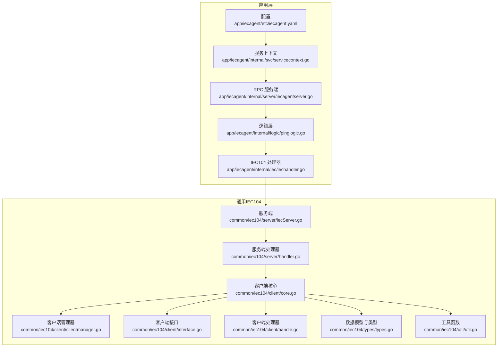
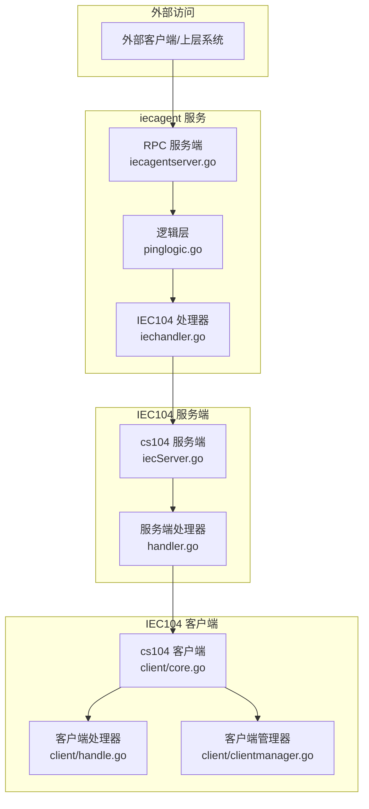
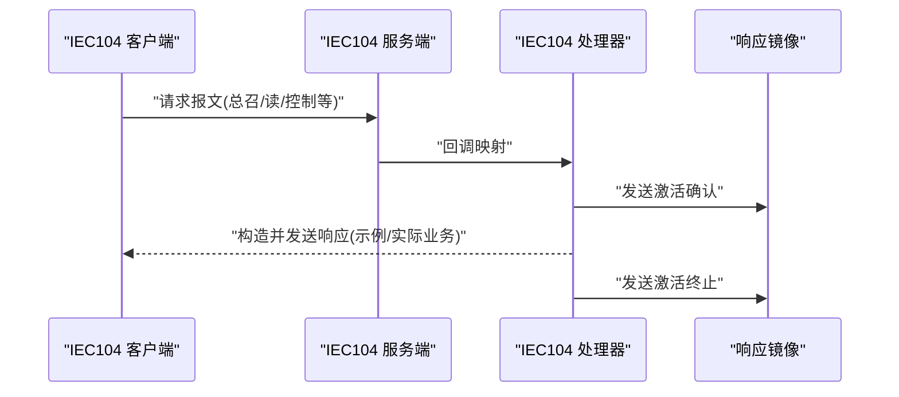
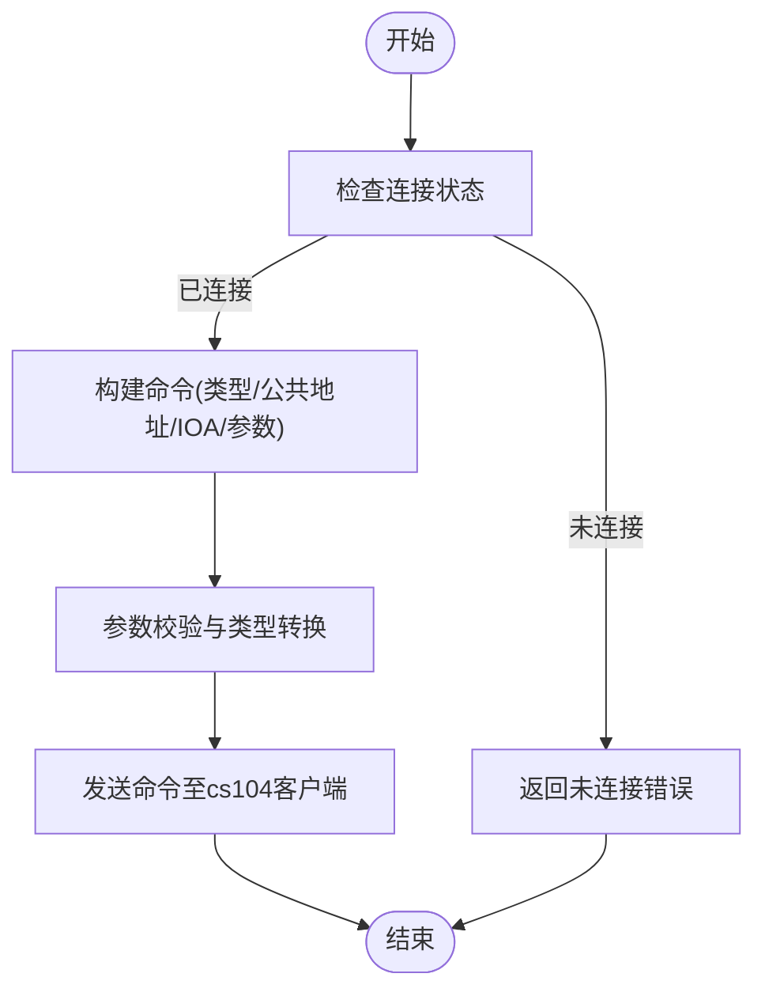
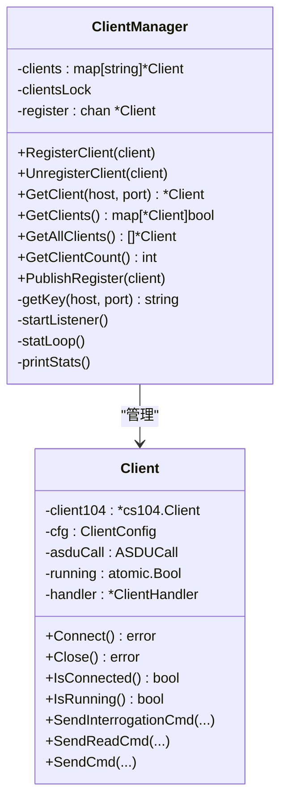
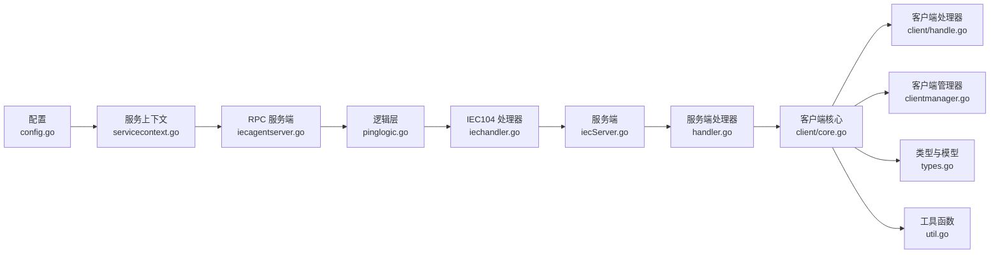

# IEC104 代理服务 (iecagent)

<cite>
**本文引用的文件**
- [app/iecagent/etc/iecagent.yaml](file://app/iecagent/etc/iecagent.yaml)
- [app/iecagent/internal/config/config.go](file://app/iecagent/internal/config/config.go)
- [app/iecagent/internal/iec/iechandler.go](file://app/iecagent/internal/iec/iechandler.go)
- [app/iecagent/internal/svc/servicecontext.go](file://app/iecagent/internal/svc/servicecontext.go)
- [app/iecagent/internal/server/iecagentserver.go](file://app/iecagent/internal/server/iecagentserver.go)
- [app/iecagent/internal/logic/pinglogic.go](file://app/iecagent/internal/logic/pinglogic.go)
- [common/iec104/client/clientmanager.go](file://common/iec104/client/clientmanager.go)
- [common/iec104/client/core.go](file://common/iec104/client/core.go)
- [common/iec104/client/interface.go](file://common/iec104/client/interface.go)
- [common/iec104/client/errors.go](file://common/iec104/client/errors.go)
- [common/iec104/client/handle.go](file://common/iec104/client/handle.go)
- [common/iec104/server/handler.go](file://common/iec104/server/handler.go)
- [common/iec104/server/iecServer.go](file://common/iec104/server/iecServer.go)
- [common/iec104/types/types.go](file://common/iec104/types/types.go)
- [common/iec104/util/util.go](file://common/iec104/util/util.go)
</cite>

## 目录
1. [简介](#简介)
2. [项目结构](#项目结构)
3. [核心组件](#核心组件)
4. [架构总览](#架构总览)
5. [详细组件分析](#详细组件分析)
6. [依赖关系分析](#依赖关系分析)
7. [性能考虑](#性能考虑)
8. [故障排查指南](#故障排查指南)
9. [结论](#结论)
10. [附录](#附录)

## 简介
本文件为 IEC104 代理服务（iecagent）的系统化技术文档，聚焦于其作为 IEC104 协议代理与网关的核心能力：协议转换、设备管理、远程控制、多客户端连接管理、会话处理与资源调度、请求转发、响应聚合与状态同步。文档基于仓库现有实现进行深入分析，并提供架构图、流程图与序列图帮助理解。

## 项目结构
iecagent 位于应用层，采用 go-zero RPC 架构，结合 IEC104 客户端与服务端库实现协议代理与网关功能。核心目录与职责如下：
- app/iecagent：服务入口、配置、RPC 服务端与逻辑层
- common/iec104：IEC104 协议通用实现，含客户端、服务端、类型定义与工具函数
- 配置文件：服务监听、日志级别、IEC104 服务端绑定地址与端口、日志模式等

图表来源
- [app/iecagent/etc/iecagent.yaml:1-14](file://app/iecagent/etc/iecagent.yaml#L1-L14)
- [app/iecagent/internal/svc/servicecontext.go:1-14](file://app/iecagent/internal/svc/servicecontext.go#L1-L14)
- [app/iecagent/internal/server/iecagentserver.go:1-30](file://app/iecagent/internal/server/iecagentserver.go#L1-L30)
- [app/iecagent/internal/logic/pinglogic.go:1-29](file://app/iecagent/internal/logic/pinglogic.go#L1-L29)
- [app/iecagent/internal/iec/iechandler.go:1-124](file://app/iecagent/internal/iec/iechandler.go#L1-L124)
- [common/iec104/client/core.go:1-446](file://common/iec104/client/core.go#L1-L446)
- [common/iec104/client/clientmanager.go:1-145](file://common/iec104/client/clientmanager.go#L1-L145)
- [common/iec104/client/interface.go:1-71](file://common/iec104/client/interface.go#L1-L71)
- [common/iec104/client/handle.go:1-155](file://common/iec104/client/handle.go#L1-L155)
- [common/iec104/server/handler.go:1-60](file://common/iec104/server/handler.go#L1-L60)
- [common/iec104/server/iecServer.go:1-38](file://common/iec104/server/iecServer.go#L1-L38)
- [common/iec104/types/types.go:1-323](file://common/iec104/types/types.go#L1-L323)
- [common/iec104/util/util.go:1-242](file://common/iec104/util/util.go#L1-L242)

章节来源
- [app/iecagent/etc/iecagent.yaml:1-14](file://app/iecagent/etc/iecagent.yaml#L1-L14)
- [app/iecagent/internal/config/config.go:1-14](file://app/iecagent/internal/config/config.go#L1-L14)

## 核心组件
- 配置与服务上下文
  - 配置项包含 RPC 监听地址、日志路径与级别、IEC104 服务端绑定地址、端口与日志模式。
  - 服务上下文承载配置，供 RPC 服务端与逻辑层使用。
- IEC104 服务端
  - 基于 cs104 服务端封装，支持宽参数集、可选日志模式与统一日志提供者。
- IEC104 客户端
  - 支持自动重连、重连间隔、连接事件回调、命令发送（总召、计数器、读、时钟同步、复位进程、测试、各类控制命令）、参数校验与类型转换。
- 客户端管理器
  - 提供客户端注册、注销、查询、统计与周期性状态打印。
- IEC104 处理器（服务端侧）
  - 实现各类 IEC104 请求回调（总召、计数器、读、时钟同步、复位进程、延迟获取、控制），并进行响应镜像与状态反馈。
- 类型与工具
  - 定义报文结构、点映射、质量描述符工具、主题生成模板等。

章节来源
- [app/iecagent/internal/config/config.go:5-13](file://app/iecagent/internal/config/config.go#L5-L13)
- [app/iecagent/internal/svc/servicecontext.go:5-13](file://app/iecagent/internal/svc/servicecontext.go#L5-L13)
- [common/iec104/server/iecServer.go:17-37](file://common/iec104/server/iecServer.go#L17-L37)
- [common/iec104/client/core.go:87-117](file://common/iec104/client/core.go#L87-L117)
- [common/iec104/client/clientmanager.go:17-27](file://common/iec104/client/clientmanager.go#L17-L27)
- [app/iecagent/internal/iec/iechandler.go:25-123](file://app/iecagent/internal/iec/iechandler.go#L25-L123)
- [common/iec104/types/types.go:11-58](file://common/iec104/types/types.go#L11-L58)
- [common/iec104/util/util.go:197-241](file://common/iec104/util/util.go#L197-L241)

## 架构总览
下图展示了 iecagent 的整体架构：RPC 服务端接收外部请求，逻辑层进行业务处理，IEC104 处理器对接 IEC104 服务端；服务端通过 cs104 接收来自 IEC104 客户端的请求，客户端负责与远端 IEC104 服务器通信并执行命令。

图表来源
- [app/iecagent/internal/server/iecagentserver.go:26-29](file://app/iecagent/internal/server/iecagentserver.go#L26-L29)
- [app/iecagent/internal/logic/pinglogic.go:26-28](file://app/iecagent/internal/logic/pinglogic.go#L26-L28)
- [app/iecagent/internal/iec/iechandler.go:25-123](file://app/iecagent/internal/iec/iechandler.go#L25-L123)
- [common/iec104/server/iecServer.go:31-37](file://common/iec104/server/iecServer.go#L31-L37)
- [common/iec104/server/handler.go:33-59](file://common/iec104/server/handler.go#L33-L59)
- [common/iec104/client/core.go:162-175](file://common/iec104/client/core.go#L162-L175)
- [common/iec104/client/handle.go:40-109](file://common/iec104/client/handle.go#L40-L109)
- [common/iec104/client/clientmanager.go:35-47](file://common/iec104/client/clientmanager.go#L35-L47)

## 详细组件分析

### 配置与启动
- 配置文件包含 RPC 监听地址、日志路径与级别、IEC104 服务端绑定地址、端口与日志模式。
- 服务上下文承载配置，RPC 服务端通过上下文注入配置。
- IEC104 服务端由配置中的 Host/Port 启动，支持可选日志模式。

章节来源
- [app/iecagent/etc/iecagent.yaml:1-14](file://app/iecagent/etc/iecagent.yaml#L1-L14)
- [app/iecagent/internal/config/config.go:5-13](file://app/iecagent/internal/config/config.go#L5-L13)
- [app/iecagent/internal/svc/servicecontext.go:5-13](file://app/iecagent/internal/svc/servicecontext.go#L5-L13)
- [common/iec104/server/iecServer.go:17-29](file://common/iec104/server/iecServer.go#L17-L29)

### IEC104 服务端与处理器
- 服务端封装 cs104 服务端，设置参数集与日志模式，监听指定地址。
- 服务端处理器将 IEC104 请求回调映射到 IEC104 处理器方法，实现总召、计数器、读、时钟同步、复位进程、延迟获取与控制命令的处理。
- IEC104 处理器对各类请求进行响应镜像与状态反馈，部分场景构造模拟数据以演示协议交互。

图表来源
- [common/iec104/server/iecServer.go:31-37](file://common/iec104/server/iecServer.go#L31-L37)
- [common/iec104/server/handler.go:33-59](file://common/iec104/server/handler.go#L33-L59)
- [app/iecagent/internal/iec/iechandler.go:25-123](file://app/iecagent/internal/iec/iechandler.go#L25-L123)

章节来源
- [common/iec104/server/iecServer.go:17-37](file://common/iec104/server/iecServer.go#L17-L37)
- [common/iec104/server/handler.go:16-60](file://common/iec104/server/handler.go#L16-L60)
- [app/iecagent/internal/iec/iechandler.go:25-123](file://app/iecagent/internal/iec/iechandler.go#L25-L123)

### IEC104 客户端与命令发送
- 客户端支持多种命令发送：总召唤、计数器、读、时钟同步、复位进程、测试以及各类控制命令（单点、双点、步位、设定值、位串等）。
- 参数校验与类型转换确保命令参数合法，错误处理返回“未连接”等错误。
- 自动重连与连接事件回调保证链路稳定性。

图表来源
- [common/iec104/client/core.go:305-436](file://common/iec104/client/core.go#L305-L436)
- [common/iec104/client/errors.go:6-7](file://common/iec104/client/errors.go#L6-L7)

章节来源
- [common/iec104/client/core.go:182-231](file://common/iec104/client/core.go#L182-L231)
- [common/iec104/client/core.go:305-436](file://common/iec104/client/core.go#L305-L436)
- [common/iec104/client/errors.go:6-7](file://common/iec104/client/errors.go#L6-L7)

### 客户端管理器与资源调度
- 客户端管理器维护客户端集合，支持注册、注销、查询、统计与周期性状态打印。
- 通过通道与 goroutine 实现异步注册与统计循环，降低锁竞争。

图表来源
- [common/iec104/client/clientmanager.go:11-144](file://common/iec104/client/clientmanager.go#L11-L144)
- [common/iec104/client/core.go:48-117](file://common/iec104/client/core.go#L48-L117)

章节来源
- [common/iec104/client/clientmanager.go:17-144](file://common/iec104/client/clientmanager.go#L17-L144)
- [common/iec104/client/core.go:87-117](file://common/iec104/client/core.go#L87-L117)

### 数据模型与质量描述符
- 定义报文结构、点映射、质量描述符与主题生成模板，支持根据报文动态生成订阅主题。
- 工具函数提供质量描述符判断与字符串化，便于诊断与日志记录。

章节来源
- [common/iec104/types/types.go:11-58](file://common/iec104/types/types.go#L11-L58)
- [common/iec104/types/types.go:60-322](file://common/iec104/types/types.go#L60-L322)
- [common/iec104/util/util.go:13-93](file://common/iec104/util/util.go#L13-L93)
- [common/iec104/util/util.go:197-241](file://common/iec104/util/util.go#L197-L241)

### 远程控制实现
- 控制命令通过客户端发送，支持单点、双点、步位、设定值（规一化/标度化/短浮点）、位串等类型。
- 参数校验与时间戳处理确保命令合法性与时序一致性。
- IEC104 处理器在收到控制请求时进行响应镜像与状态反馈。

章节来源
- [common/iec104/client/core.go:327-431](file://common/iec104/client/core.go#L327-L431)
- [app/iecagent/internal/iec/iechandler.go:111-123](file://app/iecagent/internal/iec/iechandler.go#L111-L123)

### 设备管理与连接状态监控
- 客户端管理器提供连接状态统计与周期性打印，便于运维监控。
- 客户端配置支持自动重连与重连间隔，提升链路鲁棒性。
- IEC104 客户端提供连接事件回调，区分连接、断开与服务器主动激活。

章节来源
- [common/iec104/client/clientmanager.go:117-144](file://common/iec104/client/clientmanager.go#L117-L144)
- [common/iec104/client/core.go:19-37](file://common/iec104/client/core.go#L19-L37)
- [common/iec104/client/core.go:129-144](file://common/iec104/client/core.go#L129-L144)

### 协议转换与状态同步
- 服务端处理器将 IEC104 请求映射到 IEC104 处理器，实现请求转发与响应镜像。
- 客户端处理器将远端 IEC104 服务器的响应回调转交给业务接口，完成状态同步。

章节来源
- [common/iec104/server/handler.go:33-59](file://common/iec104/server/handler.go#L33-L59)
- [common/iec104/client/handle.go:40-109](file://common/iec104/client/handle.go#L40-L109)

## 依赖关系分析
- 应用层依赖通用 IEC104 模块，形成清晰的分层：配置与服务上下文 -> RPC 层 -> IEC104 处理器 -> cs104 客户端/服务端。
- 客户端管理器与客户端核心耦合度低，通过接口与通道解耦，便于扩展与测试。
- 类型与工具模块为上层提供统一的数据结构与质量描述符处理能力。

图表来源
- [app/iecagent/internal/config/config.go:5-13](file://app/iecagent/internal/config/config.go#L5-L13)
- [app/iecagent/internal/svc/servicecontext.go:5-13](file://app/iecagent/internal/svc/servicecontext.go#L5-L13)
- [app/iecagent/internal/server/iecagentserver.go:26-29](file://app/iecagent/internal/server/iecagentserver.go#L26-L29)
- [app/iecagent/internal/logic/pinglogic.go:26-28](file://app/iecagent/internal/logic/pinglogic.go#L26-L28)
- [app/iecagent/internal/iec/iechandler.go:25-123](file://app/iecagent/internal/iec/iechandler.go#L25-L123)
- [common/iec104/server/iecServer.go:31-37](file://common/iec104/server/iecServer.go#L31-L37)
- [common/iec104/server/handler.go:33-59](file://common/iec104/server/handler.go#L33-L59)
- [common/iec104/client/core.go:162-175](file://common/iec104/client/core.go#L162-L175)
- [common/iec104/client/handle.go:40-109](file://common/iec104/client/handle.go#L40-L109)
- [common/iec104/client/clientmanager.go:35-47](file://common/iec104/client/clientmanager.go#L35-L47)
- [common/iec104/types/types.go:11-58](file://common/iec104/types/types.go#L11-L58)
- [common/iec104/util/util.go:197-241](file://common/iec104/util/util.go#L197-L241)

章节来源
- [common/iec104/client/interface.go:5-23](file://common/iec104/client/interface.go#L5-L23)
- [common/iec104/client/handle.go:34-37](file://common/iec104/client/handle.go#L34-L37)

## 性能考虑
- 日志与指标
  - 客户端处理器在各回调中记录耗时指标，便于性能分析与瓶颈定位。
- 连接与重连
  - 自动重连与可配置重连间隔提升链路稳定性，减少人工干预。
- 并发与锁
  - 客户端管理器使用读写锁与通道，降低锁竞争，提高并发性能。
- 主题生成与质量描述符
  - 模板化的主题生成与质量描述符工具减少重复计算，提升报文处理效率。

章节来源
- [common/iec104/client/handle.go:40-109](file://common/iec104/client/handle.go#L40-L109)
- [common/iec104/client/core.go:22-26](file://common/iec104/client/core.go#L22-L26)
- [common/iec104/client/clientmanager.go:117-144](file://common/iec104/client/clientmanager.go#L117-L144)
- [common/iec104/util/util.go:197-241](file://common/iec104/util/util.go#L197-L241)

## 故障排查指南
- 未连接错误
  - 当客户端未连接时发送命令会返回“未连接”错误，需检查连接状态与自动重连配置。
- 连接事件
  - 通过连接事件回调区分连接、断开与服务器主动激活，便于定位网络问题。
- 日志与统计
  - 开启 IEC104 日志模式与周期性统计，有助于快速定位异常。
- 质量描述符
  - 使用质量描述符工具函数判断状态，辅助诊断数据质量与异常。

章节来源
- [common/iec104/client/errors.go:6-7](file://common/iec104/client/errors.go#L6-L7)
- [common/iec104/client/core.go:129-144](file://common/iec104/client/core.go#L129-L144)
- [common/iec104/client/clientmanager.go:126-144](file://common/iec104/client/clientmanager.go#L126-L144)
- [common/iec104/util/util.go:13-93](file://common/iec104/util/util.go#L13-L93)

## 结论
iecagent 通过清晰的分层与模块化设计，实现了 IEC104 协议代理与网关的关键能力：协议转换、设备管理、远程控制、多客户端连接管理与状态同步。结合自动重连、指标统计与日志模式，具备良好的可运维性与扩展性。建议在生产环境中进一步完善命令参数校验、异常处理与安全策略配置。

## 附录

### 配置文件解析
- 服务名称与监听
  - Name：服务名称
  - ListenOn：RPC 监听地址
  - Mode：运行模式
- 日志配置
  - Encoding：日志编码
  - Path：日志路径
  - Level：日志级别
- IEC104 设置
  - Host：IEC104 服务端绑定地址
  - Port：IEC104 服务端绑定端口
  - LogMode：是否开启 IEC104 日志模式

章节来源
- [app/iecagent/etc/iecagent.yaml:1-14](file://app/iecagent/etc/iecagent.yaml#L1-L14)
- [app/iecagent/internal/config/config.go:5-13](file://app/iecagent/internal/config/config.go#L5-L13)

### 代码示例（路径）
- 设备接入（客户端创建与连接）
  - [common/iec104/client/core.go:87-117](file://common/iec104/client/core.go#L87-L117)
  - [common/iec104/client/core.go:162-175](file://common/iec104/client/core.go#L162-L175)
- 命令路由（总召/读/控制）
  - [common/iec104/client/core.go:182-231](file://common/iec104/client/core.go#L182-L231)
  - [common/iec104/client/core.go:327-431](file://common/iec104/client/core.go#L327-L431)
- 异常处理（未连接）
  - [common/iec104/client/errors.go:6-7](file://common/iec104/client/errors.go#L6-L7)
  - [common/iec104/client/core.go:306-308](file://common/iec104/client/core.go#L306-L308)