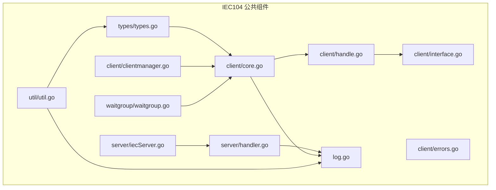
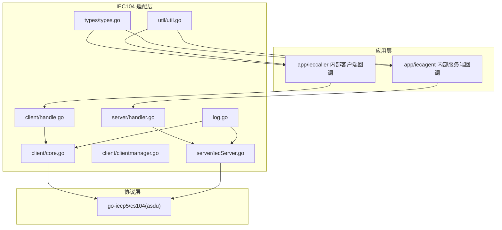
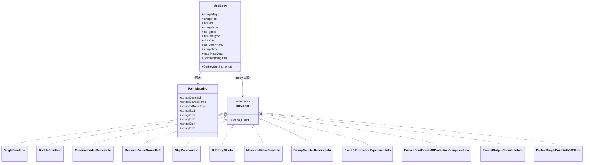
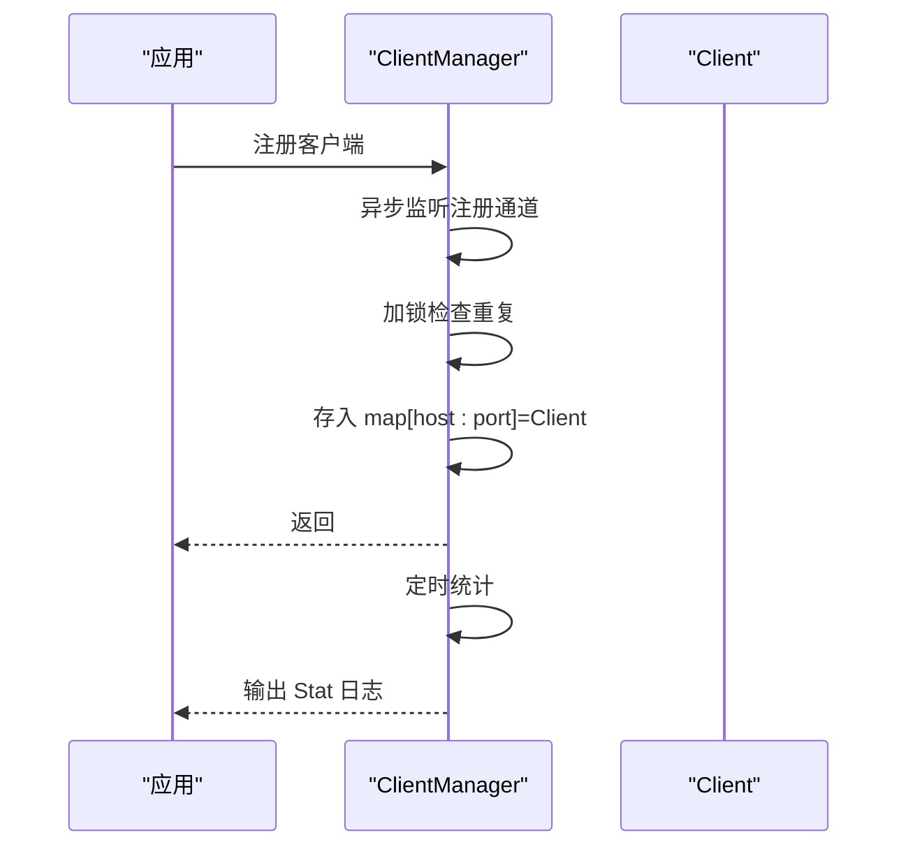
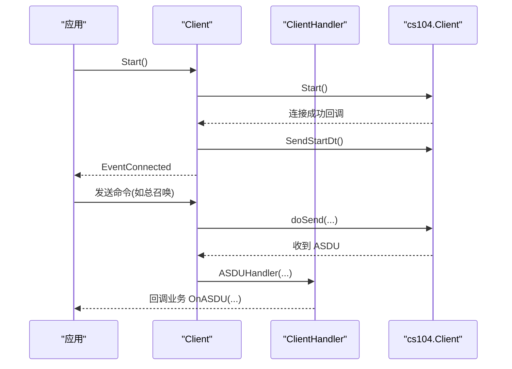
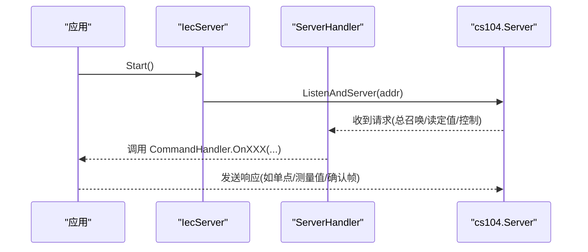
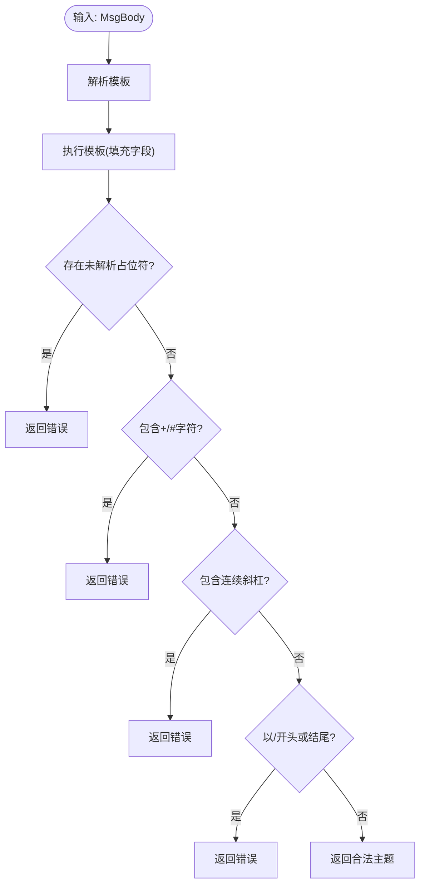

# IEC104 公共组件

<cite>
**本文引用的文件**
- [types.go](file://common/iec104/types/types.go)
- [clientmanager.go](file://common/iec104/client/clientmanager.go)
- [core.go](file://common/iec104/client/core.go)
- [interface.go](file://common/iec104/client/interface.go)
- [handle.go](file://common/iec104/client/handle.go)
- [errors.go](file://common/iec104/client/errors.go)
- [iecServer.go](file://common/iec104/server/iecServer.go)
- [handler.go](file://common/iec104/server/handler.go)
- [util.go](file://common/iec104/util/util.go)
- [log.go](file://common/iec104/log.go)
- [waitgroup.go](file://common/iec104/waitgroup/waitgroup.go)
- [clienthandler.go](file://app/ieccaller/internal/iec/clienthandler.go)
- [iechandler.go](file://app/iecagent/internal/iec/iechandler.go)
</cite>

## 目录
1. [简介](#简介)
2. [项目结构](#项目结构)
3. [核心组件](#核心组件)
4. [架构总览](#架构总览)
5. [组件详解](#组件详解)
6. [依赖关系分析](#依赖关系分析)
7. [性能与内存优化](#性能与内存优化)
8. [故障排查指南](#故障排查指南)
9. [结论](#结论)
10. [附录：使用示例与最佳实践](#附录使用示例与最佳实践)

## 简介
本文件系统性梳理 IEC104 公共组件，覆盖类型定义、客户端管理器、服务器实现与工具函数，并结合应用示例说明如何基于这些组件快速构建自定义 IEC104 客户端与服务器。内容重点包括：
- IEC104 协议数据模型：ASDU 结构、信息对象、品质描述词与时间编码
- 客户端生命周期与重连机制：连接池管理、会话状态、资源清理
- 服务器实现：TCP 服务、消息解析、并发处理与错误处理
- 工具函数：数据转换、编码解码、质量描述词解析、主题生成与调试辅助
- 性能优化与内存管理建议，以及常见问题排查

## 项目结构
IEC104 公共组件位于 common/iec104 下，按“功能域”组织：
- types：协议数据模型与消息体定义
- client：客户端与客户端管理器
- server：服务器与服务端处理器
- util：工具函数
- waitgroup：超时等待封装
- log：统一日志适配



图表来源
- [types.go:1-323](file://common/iec104/types/types.go#L1-L323)
- [core.go:1-446](file://common/iec104/client/core.go#L1-L446)
- [clientmanager.go:1-145](file://common/iec104/client/clientmanager.go#L1-L145)
- [handle.go:1-155](file://common/iec104/client/handle.go#L1-L155)
- [interface.go:1-71](file://common/iec104/client/interface.go#L1-L71)
- [errors.go:1-8](file://common/iec104/client/errors.go#L1-L8)
- [iecServer.go:1-38](file://common/iec104/server/iecServer.go#L1-L38)
- [handler.go:1-60](file://common/iec104/server/handler.go#L1-L60)
- [util.go:1-242](file://common/iec104/util/util.go#L1-L242)
- [log.go:1-49](file://common/iec104/log.go#L1-L49)
- [waitgroup.go:1-113](file://common/iec104/waitgroup/waitgroup.go#L1-L113)

章节来源
- [types.go:1-323](file://common/iec104/types/types.go#L1-L323)
- [clientmanager.go:1-145](file://common/iec104/client/clientmanager.go#L1-L145)
- [core.go:1-446](file://common/iec104/client/core.go#L1-L446)
- [handle.go:1-155](file://common/iec104/client/handle.go#L1-L155)
- [interface.go:1-71](file://common/iec104/client/interface.go#L1-L71)
- [errors.go:1-8](file://common/iec104/client/errors.go#L1-L8)
- [iecServer.go:1-38](file://common/iec104/server/iecServer.go#L1-L38)
- [handler.go:1-60](file://common/iec104/server/handler.go#L1-L60)
- [util.go:1-242](file://common/iec104/util/util.go#L1-L242)
- [log.go:1-49](file://common/iec104/log.go#L1-L49)
- [waitgroup.go:1-113](file://common/iec104/waitgroup/waitgroup.go#L1-L113)

## 核心组件
- 类型定义与消息体：定义通用消息体、点映射、各类 ASDU 信息对象（单点、双点、测量值、步位置、位串、累计量、保护设备事件、打包信息、带变位检出的成组单点）及 IoaGetter 接口，用于派生唯一键。
- 客户端与客户端管理器：提供配置化客户端、连接/断开、命令发送、自动重连、连接事件回调；客户端管理器负责注册/注销、统计与并发安全访问。
- 服务器与处理器：封装 cs104 服务器，设置参数与日志，暴露命令回调接口，接收并分发请求。
- 工具函数：质量描述词解析与字符串化、规一化与浮点互转、主题模板生成、站址 ID 生成等。
- 日志适配：统一日志提供者，兼容 go-zero 日志上下文。
- 并发等待：带超时的 WaitGroup 封装，避免阻塞导致的资源泄漏。

章节来源
- [types.go:11-54](file://common/iec104/types/types.go#L11-L54)
- [core.go:19-117](file://common/iec104/client/core.go#L19-L117)
- [clientmanager.go:11-145](file://common/iec104/client/clientmanager.go#L11-L145)
- [iecServer.go:12-38](file://common/iec104/server/iecServer.go#L12-L38)
- [handler.go:8-60](file://common/iec104/server/handler.go#L8-L60)
- [util.go:13-242](file://common/iec104/util/util.go#L13-L242)
- [log.go:8-49](file://common/iec104/log.go#L8-L49)
- [waitgroup.go:9-113](file://common/iec104/waitgroup/waitgroup.go#L9-L113)

## 架构总览
IEC104 客户端/服务器采用“协议库 + 业务适配层”的分层设计：
- 协议层：基于 go-iecp5/cs104 实现 IEC104 通信细节（帧、参数、连接、命令）。
- 适配层：types 定义消息模型；client 提供客户端生命周期与命令封装；server 提供服务器监听与命令回调；util 提供数据转换与主题生成；log 提供统一日志。
- 应用层：在 app/ieccaller 与 app/iecagent 中通过实现回调接口完成具体业务逻辑。



图表来源
- [client/core.go:1-446](file://common/iec104/client/core.go#L1-L446)
- [client/clientmanager.go:1-145](file://common/iec104/client/clientmanager.go#L1-L145)
- [client/handle.go:1-155](file://common/iec104/client/handle.go#L1-L155)
- [server/iecServer.go:1-38](file://common/iec104/server/iecServer.go#L1-L38)
- [server/handler.go:1-60](file://common/iec104/server/handler.go#L1-L60)
- [types/types.go:1-323](file://common/iec104/types/types.go#L1-L323)
- [util/util.go:1-242](file://common/iec104/util/util.go#L1-L242)
- [log.go:1-49](file://common/iec104/log.go#L1-L49)

## 组件详解

### 类型定义与 ASDU 数据模型
- 通用消息体 MsgBody：包含消息标识、远端地址、ASDU 类型、IOA、时间戳、元数据与点映射。
- 点映射 PointMapping：设备标识、名称与扩展字段，便于主题拆分与存储。
- IoaGetter 接口：统一获取 IOA 的能力，配合 MsgBody.GetKey 生成唯一键。
- 各类信息对象：
  - 单点/双点：Ioa、Value、Qds 及其描述、品质位（溢出、封锁、替代、非实时、无效）、时间
  - 测量值：标度化值、规一化值（Normalize 与 NVA 映射）、短浮点
  - 步位置：带瞬变状态指示的整数值
  - 位串：32 位位串
  - 累计量：二进制计数器读数、序列号、进位、调整标记、无效标记
  - 保护设备事件：事件类型、Qdp、时间编码
  - 打包信息：成组事件、输出回路信息
  - 带变位检出的成组单点：当前状态与状态变化掩码



图表来源
- [types.go:11-323](file://common/iec104/types/types.go#L11-L323)

章节来源
- [types.go:11-54](file://common/iec104/types/types.go#L11-L54)
- [types.go:62-323](file://common/iec104/types/types.go#L62-L323)

### 客户端管理器（ClientManager）
- 职责：集中管理多个 IEC104 客户端实例，提供注册/注销、查询、遍历与统计。
- 并发：读写锁保证并发安全；内部注册通道异步处理注册请求；定时统计连接状态。
- 统计：每分钟输出连接总数、已连接、未连接数量，便于运维监控。



图表来源
- [clientmanager.go:29-145](file://common/iec104/client/clientmanager.go#L29-L145)

章节来源
- [clientmanager.go:11-145](file://common/iec104/client/clientmanager.go#L11-L145)

### 客户端（Client）与处理器（ClientHandler）
- 客户端配置：主机、端口、自动重连间隔、日志开关、元数据。
- 生命周期：Start/Stop、Connect/Close、IsConnected/IsRunning。
- 命令封装：总召唤、计数器召唤、时钟同步、读命令、复位进程、测试命令、各类控制命令（单点、双点、步位置、定值等），统一通过 doSend 分发。
- 连接事件：连接建立、连接丢失、服务器激活，分别触发对应事件回调。
- 处理器：ClientHandler 将收到的 ASDU 分发到业务回调接口（ASDUCall），并记录耗时指标。



图表来源
- [core.go:149-210](file://common/iec104/client/core.go#L149-L210)
- [core.go:304-436](file://common/iec104/client/core.go#L304-L436)
- [handle.go:39-109](file://common/iec104/client/handle.go#L39-L109)

章节来源
- [core.go:19-117](file://common/iec104/client/core.go#L19-L117)
- [core.go:149-210](file://common/iec104/client/core.go#L149-L210)
- [core.go:304-436](file://common/iec104/client/core.go#L304-L436)
- [handle.go:34-155](file://common/iec104/client/handle.go#L34-L155)
- [interface.go:5-71](file://common/iec104/client/interface.go#L5-L71)
- [errors.go:5-8](file://common/iec104/client/errors.go#L5-L8)

### 服务器实现（IecServer）与处理器（ServerHandler）
- IecServer：封装 cs104 服务器，设置参数与日志，绑定地址并启动监听。
- ServerHandler：将 cs104 的回调适配为 CommandHandler 接口，包括总召唤、计数器、读定值、时钟同步、进程复位、延迟获取与通用 ASDU 控制命令。
- 应用示例：在 app/iecagent 中实现 CommandHandler，向客户端发送模拟数据或响应控制命令。



图表来源
- [iecServer.go:17-38](file://common/iec104/server/iecServer.go#L17-L38)
- [handler.go:16-60](file://common/iec104/server/handler.go#L16-L60)

章节来源
- [iecServer.go:12-38](file://common/iec104/server/iecServer.go#L12-L38)
- [handler.go:8-60](file://common/iec104/server/handler.go#L8-L60)

### 工具函数详解
- 品质描述词解析：Qds/Qdp 的包含判断、是否良好、字符串化（含二进制位图与语义标签）。
- 数值转换：浮点到规一化值、规一化值到浮点。
- 主题生成：基于模板与 MsgBody 生成最终主题，进行占位符解析与格式校验。
- 站址 ID：将主机名中的点替换后与端口拼接，形成稳定标识。
- 日志适配：统一 Critical/Error/Warn/Debug 输出，支持上下文字段。



图表来源
- [util.go:197-242](file://common/iec104/util/util.go#L197-L242)

章节来源
- [util.go:13-242](file://common/iec104/util/util.go#L13-L242)
- [log.go:8-49](file://common/iec104/log.go#L8-L49)

### 并发等待与资源清理
- WaitGroup：提供 WaitTimeout/Await/AwaitWithError，避免长时间阻塞导致 goroutine 泄漏。
- 客户端关闭：发送 StopDt 后关闭连接，确保有序释放资源。
- 管理器统计：定期输出连接状态，便于发现异常断开与资源占用。

章节来源
- [waitgroup.go:9-113](file://common/iec104/waitgroup/waitgroup.go#L9-L113)
- [core.go:156-170](file://common/iec104/client/core.go#L156-L170)
- [clientmanager.go:117-145](file://common/iec104/client/clientmanager.go#L117-L145)

## 依赖关系分析
- 客户端依赖 cs104 与 asdu，通过 ClientHandler 将协议事件映射到业务接口。
- 服务器依赖 cs104，通过 ServerHandler 将外部请求映射到业务 CommandHandler。
- 工具函数依赖 types 与 asdu，提供跨模块的数据转换与主题生成。
- 日志适配统一由 iec104 包提供，贯穿客户端与服务器。

```mermaid
graph LR
P5["go-iecp5(asdu/cs104)"] <- --> C["client/core.go"]
P5 <- --> S["server/iecServer.go"]
LG["log.go"] --> C
LG --> S
T["types/types.go"] --> C
T --> S
U["util/util.go"] --> C
U --> S
CH["client/handle.go"] --> C
SH["server/handler.go"] --> S
```

图表来源
- [core.go:1-17](file://common/iec104/client/core.go#L1-L17)
- [iecServer.go:3-10](file://common/iec104/server/iecServer.go#L3-L10)
- [types.go:1-9](file://common/iec104/types/types.go#L1-L9)
- [util.go:3-11](file://common/iec104/util/util.go#L3-L11)
- [log.go:3-6](file://common/iec104/log.go#L3-L6)
- [handle.go:3-7](file://common/iec104/client/handle.go#L3-L7)
- [handler.go:3-6](file://common/iec104/server/handler.go#L3-L6)

## 性能与内存优化
- 并发处理
  - 使用任务调度器对不同类型的 ASDU 进行异步处理，避免阻塞主协议栈。
  - 在应用层通过并发任务运行器限制并发度，防止过载。
- 日志与指标
  - ClientHandler 对每个回调记录耗时指标，便于定位慢路径。
  - 客户端管理器定时统计连接状态，及时发现异常。
- 内存管理
  - 避免在热路径上频繁分配临时对象；尽量复用结构体或使用对象池（建议在上层业务中实现）。
  - 主题生成与模板解析仅在必要时执行，避免重复解析。
- 网络与重连
  - 自动重连间隔合理配置，避免频繁抖动；在断开期间缓存必要的状态，减少重复请求。
  - 关闭时先发送 StopDt，再关闭连接，确保协议层面有序释放。

[本节为通用建议，不直接分析具体文件]

## 故障排查指南
- 连接失败
  - 检查客户端配置（主机、端口、自动重连间隔）与网络可达性。
  - 查看连接事件日志（连接/断开/服务器激活）与统计输出。
- 发送命令失败
  - 确认客户端已连接；若提示未连接，检查连接状态与重连策略。
  - 核对命令类型与参数类型转换（布尔、字节、整数、浮点）。
- 主题生成错误
  - 模板解析失败、未解析占位符、包含非法字符或斜杠格式错误均会导致失败。
- 品质描述词异常
  - 使用 Qds/Qdp 字符串化函数核对二进制位图与语义标签，确认是否为保留位或组合标志。

章节来源
- [errors.go:5-8](file://common/iec104/client/errors.go#L5-L8)
- [util.go:197-242](file://common/iec104/util/util.go#L197-L242)
- [clientmanager.go:126-145](file://common/iec104/client/clientmanager.go#L126-L145)

## 结论
IEC104 公共组件提供了从协议适配到业务回调的完整链路，具备良好的可扩展性与可观测性。通过类型定义、客户端管理器、服务器实现与工具函数的协同，能够快速搭建稳定可靠的 IEC104 应用。建议在生产环境中结合并发控制、日志与指标体系，持续优化性能与稳定性。

[本节为总结性内容，不直接分析具体文件]

## 附录：使用示例与最佳实践

### 如何使用客户端组件
- 创建客户端配置并初始化客户端，设置元数据与自动重连策略。
- 实现 ASDUCall 接口，处理各类 ASDU 回调（总召唤、计数器、读定值、测试、时钟同步、进程复位、延迟获取与通用 ASDU）。
- 通过客户端发送命令（总召唤、读命令、控制命令等），并在回调中解析与转换数据。
- 使用 WaitGroup 或任务调度器进行并发处理，避免阻塞。

参考路径
- [core.go:81-117](file://common/iec104/client/core.go#L81-L117)
- [interface.go:5-23](file://common/iec104/client/interface.go#L5-L23)
- [clienthandler.go:21-140](file://app/ieccaller/internal/iec/clienthandler.go#L21-L140)

### 如何使用服务器组件
- 初始化 IecServer，设置参数与日志模式，绑定监听地址。
- 实现 CommandHandler 接口，处理来自客户端的请求（总召唤、计数器、读定值、时钟同步、进程复位、延迟获取与控制命令）。
- 在回调中构造响应（如单点、测量值、确认帧等），确保遵循 IEC104 帧序列。

参考路径
- [iecServer.go:17-38](file://common/iec104/server/iecServer.go#L17-L38)
- [handler.go:16-60](file://common/iec104/server/handler.go#L16-L60)
- [iechandler.go:25-123](file://app/iecagent/internal/iec/iechandler.go#L25-L123)

### 最佳实践
- 在应用层实现回调时，优先进行参数校验与类型转换，避免协议层抛错。
- 使用工具函数进行品质描述词解析与主题生成，保持一致性。
- 对高频回调进行异步处理与限流，避免阻塞协议栈。
- 定期检查连接统计与日志，及时发现异常并告警。

[本节为实践建议，不直接分析具体文件]