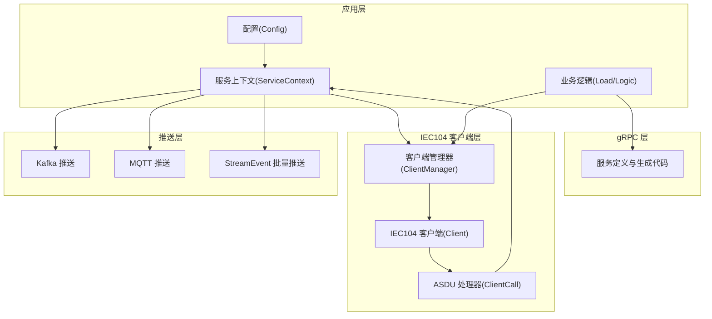
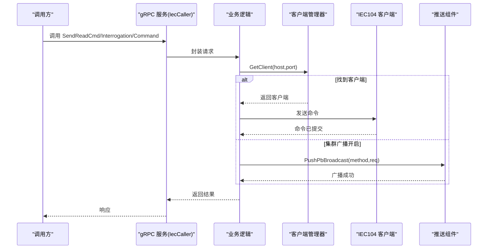
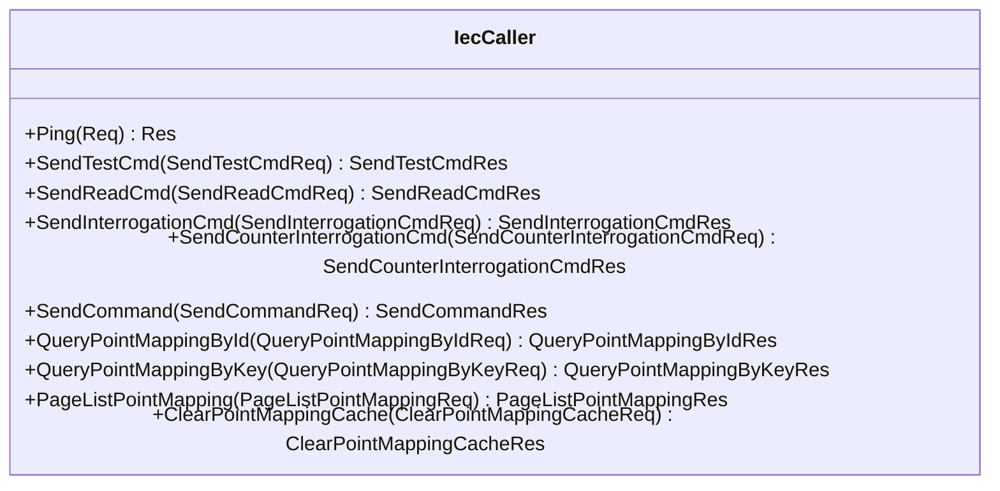
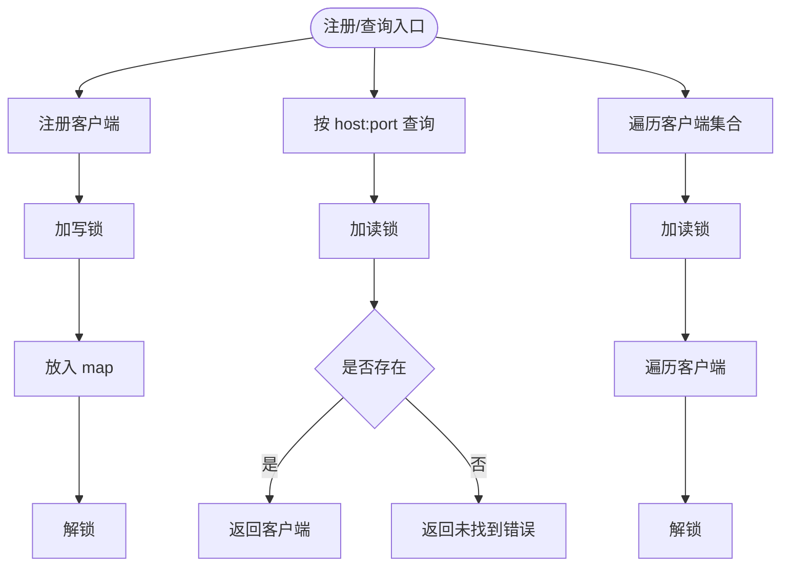
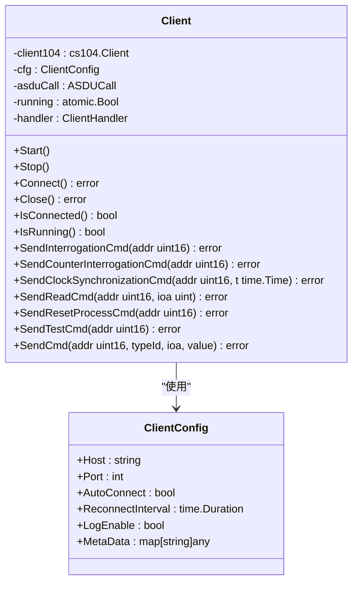
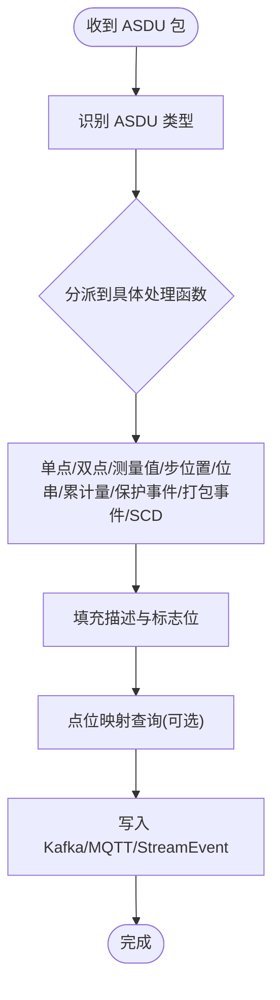
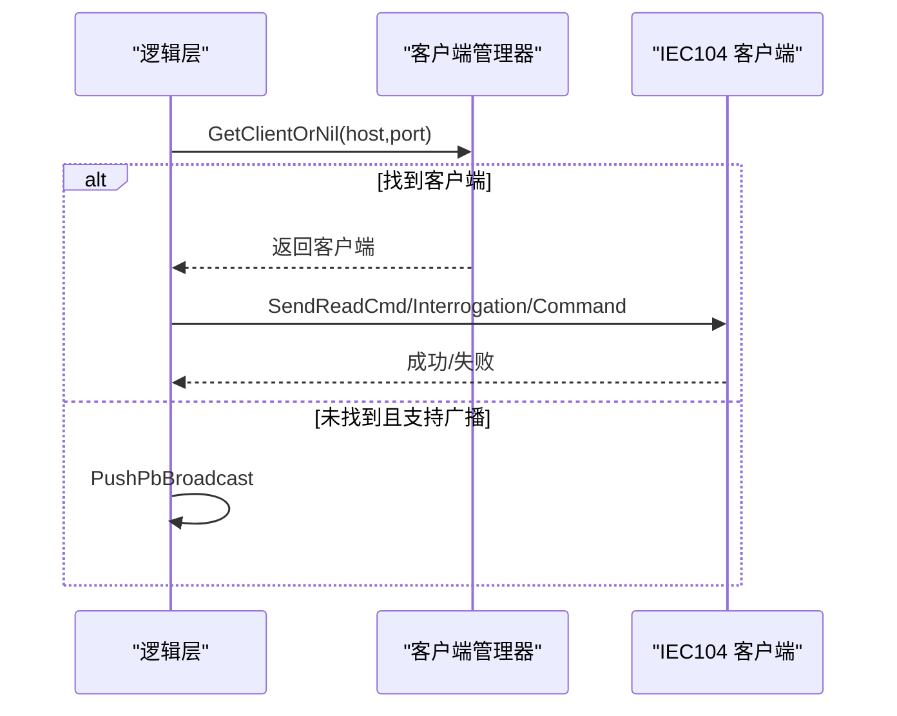
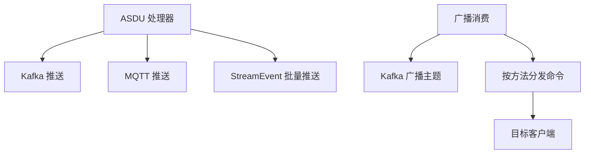
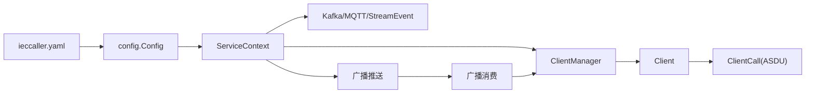

# IEC104 客户端服务 (ieccaller)

<cite>
**本文引用的文件**
- [ieccaller.yaml](file://app/ieccaller/etc/ieccaller.yaml)
- [config.go](file://app/ieccaller/internal/config/config.go)
- [ieccaller.pb.go](file://app/ieccaller/ieccaller/ieccaller.pb.go)
- [ieccaller_grpc.pb.go](file://app/ieccaller/ieccaller/ieccaller_grpc.pb.go)
- [clientmanager.go](file://common/iec104/client/clientmanager.go)
- [core.go](file://common/iec104/client/core.go)
- [interface.go](file://common/iec104/client/interface.go)
- [errors.go](file://common/iec104/client/errors.go)
- [types.go](file://common/iec104/types/types.go)
- [clienthandler.go](file://app/ieccaller/internal/iec/clienthandler.go)
- [sendreadcmdlogic.go](file://app/ieccaller/internal/logic/sendreadcmdlogic.go)
- [sendinterrogationcmdlogic.go](file://app/ieccaller/internal/logic/sendinterrogationcmdlogic.go)
- [sendcommandlogic.go](file://app/ieccaller/internal/logic/sendcommandlogic.go)
- [broadcast.go](file://app/ieccaller/kafka/broadcast.go)
- [servicecontext.go](file://app/ieccaller/internal/svc/servicecontext.go)
</cite>

## 目录
1. [简介](#简介)
2. [项目结构](#项目结构)
3. [核心组件](#核心组件)
4. [架构总览](#架构总览)
5. [详细组件分析](#详细组件分析)
6. [依赖分析](#依赖分析)
7. [性能考虑](#性能考虑)
8. [故障排查指南](#故障排查指南)
9. [结论](#结论)
10. [附录](#附录)

## 简介
IEC104 客户端服务（ieccaller）是一个基于 gRPC 的 IEC60870-5-104 协议客户端，负责与远端 IED 设备建立连接、执行读取命令、发起总召唤与累计量召唤、下发控制命令，并将 ASDU 数据进行格式化、路由与推送。服务内置 gRPC 服务器、客户端管理器、ASDU 处理器、连接池与任务调度、以及与 Kafka/MQTT/StreamEvent 的集成，支持集群广播与故障转移。

## 项目结构
- 配置层：应用配置定义与 YAML 加载
- gRPC 层：服务定义与生成代码
- 业务逻辑层：命令下发逻辑封装
- IEC104 客户端层：连接管理、命令发送、ASDU 解析与回调
- 推送层：Kafka 广播、MQTT 主题发布、StreamEvent 批量推送
- 工具与类型：ASDU 数据模型、点位映射、主题生成工具

图表来源
- [config.go:18-58](file://app/ieccaller/internal/config/config.go#L18-L58)
- [servicecontext.go:33-43](file://app/ieccaller/internal/svc/servicecontext.go#L33-L43)
- [clientmanager.go:11-27](file://common/iec104/client/clientmanager.go#L11-L27)
- [core.go:49-117](file://common/iec104/client/core.go#L49-L117)
- [clienthandler.go:21-44](file://app/ieccaller/internal/iec/clienthandler.go#L21-L44)

章节来源
- [ieccaller.yaml:1-79](file://app/ieccaller/etc/ieccaller.yaml#L1-L79)
- [config.go:18-58](file://app/ieccaller/internal/config/config.go#L18-L58)

## 核心组件
- gRPC 服务器与服务定义：提供心跳、读命令、总召唤、累计量召唤、测试命令、控制命令下发与点位映射查询等接口。
- 客户端管理器：维护多路 IEC104 客户端实例，提供注册、注销、查询与统计。
- IEC104 客户端：封装连接、自动重连、命令发送、事件回调。
- ASDU 处理器：按 ASDU 类型解析数据体，构造统一消息体并推送。
- 推送组件：Kafka 广播、MQTT 主题发布、StreamEvent 批量推送。
- 服务上下文：整合配置、客户端管理器、推送通道与点位映射模型。

章节来源
- [ieccaller_grpc.pb.go:21-57](file://app/ieccaller/ieccaller/ieccaller_grpc.pb.go#L21-L57)
- [clientmanager.go:11-145](file://common/iec104/client/clientmanager.go#L11-L145)
- [core.go:49-446](file://common/iec104/client/core.go#L49-L446)
- [clienthandler.go:21-541](file://app/ieccaller/internal/iec/clienthandler.go#L21-L541)
- [servicecontext.go:33-311](file://app/ieccaller/internal/svc/servicecontext.go#L33-L311)

## 架构总览
IEC104 客户端服务采用“配置驱动 + gRPC 服务 + IEC104 客户端 + 多路推送”的架构。每个 IEC104 从站由一个客户端实例管理；ASDU 到达后经处理器按类型解析并写入 Kafka、MQTT、StreamEvent；同时支持集群模式下的广播转发以实现故障转移与负载均衡。

图表来源
- [sendreadcmdlogic.go:25-43](file://app/ieccaller/internal/logic/sendreadcmdlogic.go#L25-L43)
- [sendinterrogationcmdlogic.go:26-42](file://app/ieccaller/internal/logic/sendinterrogationcmdlogic.go#L26-L42)
- [sendcommandlogic.go:28-44](file://app/ieccaller/internal/logic/sendcommandlogic.go#L28-L44)
- [servicecontext.go:246-285](file://app/ieccaller/internal/svc/servicecontext.go#L246-L285)

## 详细组件分析

### gRPC 服务与接口定义
- 服务名：IecCaller
- 方法：Ping、SendTestCmd、SendReadCmd、SendInterrogationCmd、SendCounterInterrogationCmd、SendCommand、QueryPointMappingById、QueryPointMappingByKey、PageListPointMapping、ClearPointMappingCache
- 请求/响应：均使用 Protobuf 定义，包含设备地址、公共地址、信息对象地址、命令类型与值等字段

图表来源
- [ieccaller_grpc.pb.go:34-191](file://app/ieccaller/ieccaller/ieccaller_grpc.pb.go#L34-L191)

章节来源
- [ieccaller.pb.go:24-59](file://app/ieccaller/ieccaller/ieccaller.pb.go#L24-L59)
- [ieccaller.pb.go:112-170](file://app/ieccaller/ieccaller/ieccaller.pb.go#L112-L170)
- [ieccaller.pb.go:208-274](file://app/ieccaller/ieccaller/ieccaller.pb.go#L208-L274)
- [ieccaller.pb.go:312-370](file://app/ieccaller/ieccaller/ieccaller.pb.go#L312-L370)
- [ieccaller.pb.go:408-466](file://app/ieccaller/ieccaller/ieccaller.pb.go#L408-L466)
- [ieccaller.pb.go:504-586](file://app/ieccaller/ieccaller/ieccaller.pb.go#L504-L586)
- [ieccaller.pb.go:624-778](file://app/ieccaller/ieccaller/ieccaller.pb.go#L624-L778)
- [ieccaller.pb.go:780-850](file://app/ieccaller/ieccaller/ieccaller.pb.go#L780-L850)

### 客户端管理器（ClientManager）
- 功能：注册/注销 IEC104 客户端、按 host:port 查询、统计在线/离线数量、周期性打印统计
- 并发：读写锁保护客户端字典，注册通道异步监听
- 输出：每分钟打印一次客户端总数、连接中、断开数量

图表来源
- [clientmanager.go:35-100](file://common/iec104/client/clientmanager.go#L35-L100)
- [clientmanager.go:117-144](file://common/iec104/client/clientmanager.go#L117-L144)

章节来源
- [clientmanager.go:11-145](file://common/iec104/client/clientmanager.go#L11-L145)

### IEC104 客户端（Client）
- 配置：Host、Port、AutoConnect、ReconnectInterval、LogEnable、MetaData
- 生命周期：Start/Stop、Connect/Close、IsConnected/IsRunning
- 命令发送：总召唤、累计量召唤、读命令、时钟同步、测试命令、复位进程、各类控制命令（单点、双点、步位置、定值、位串）
- 事件回调：连接建立、连接丢失、服务器活动

图表来源
- [core.go:49-117](file://common/iec104/client/core.go#L49-L117)
- [core.go:19-37](file://common/iec104/client/core.go#L19-L37)
- [core.go:182-231](file://common/iec104/client/core.go#L182-L231)

章节来源
- [core.go:49-446](file://common/iec104/client/core.go#L49-L446)
- [interface.go:5-23](file://common/iec104/client/interface.go#L5-L23)
- [errors.go:5-8](file://common/iec104/client/errors.go#L5-L8)

### ASDU 处理器（ClientCall）
- 任务并发：基于 TaskRunner，按配置并发度处理不同类型的 ASDU
- 类型解析：单点、双点、标度化/规一化/浮点测量值、步位置、位串、累计量、保护设备事件、打包事件/输出回路、带变位检出的成组单点
- 数据增强：填充 QDS/QDP 描述、溢出/封锁/替代/无效标记、时间戳、点位映射（可选）
- 推送：统一写入 Kafka、MQTT、StreamEvent

图表来源
- [clienthandler.go:94-140](file://app/ieccaller/internal/iec/clienthandler.go#L94-L140)
- [clienthandler.go:142-536](file://app/ieccaller/internal/iec/clienthandler.go#L142-L536)

章节来源
- [clienthandler.go:21-541](file://app/ieccaller/internal/iec/clienthandler.go#L21-L541)
- [types.go:17-58](file://common/iec104/types/types.go#L17-L58)
- [types.go:60-323](file://common/iec104/types/types.go#L60-L323)

### 业务逻辑（命令下发）
- 读命令：根据 host/port 查找客户端并发送读命令
- 总召唤/累计量召唤：同上，或在集群模式下广播
- 控制命令：根据 TypeId 选择具体控制类型并下发

图表来源
- [sendreadcmdlogic.go:25-43](file://app/ieccaller/internal/logic/sendreadcmdlogic.go#L25-L43)
- [sendinterrogationcmdlogic.go:26-42](file://app/ieccaller/internal/logic/sendinterrogationcmdlogic.go#L26-L42)
- [sendcommandlogic.go:28-44](file://app/ieccaller/internal/logic/sendcommandlogic.go#L28-L44)

章节来源
- [sendreadcmdlogic.go:1-44](file://app/ieccaller/internal/logic/sendreadcmdlogic.go#L1-L44)
- [sendinterrogationcmdlogic.go:1-43](file://app/ieccaller/internal/logic/sendinterrogationcmdlogic.go#L1-L43)
- [sendcommandlogic.go:1-45](file://app/ieccaller/internal/logic/sendcommandlogic.go#L1-L45)

### 推送与广播
- Kafka：ASDU 主题与广播主题；广播时携带方法名与请求体，接收端按方法分发
- MQTT：按模板动态生成主题并发布
- StreamEvent：批量聚合推送，按配置的批次大小切片

图表来源
- [servicecontext.go:144-244](file://app/ieccaller/internal/svc/servicecontext.go#L144-L244)
- [servicecontext.go:246-285](file://app/ieccaller/internal/svc/servicecontext.go#L246-L285)
- [broadcast.go:24-148](file://app/ieccaller/kafka/broadcast.go#L24-L148)

章节来源
- [servicecontext.go:33-311](file://app/ieccaller/internal/svc/servicecontext.go#L33-L311)
- [broadcast.go:1-149](file://app/ieccaller/kafka/broadcast.go#L1-L149)

## 依赖分析
- 配置依赖：ieccaller.yaml -> config.Config -> ServiceContext
- 服务依赖：gRPC 生成代码 -> 业务逻辑 -> 客户端管理器 -> IEC104 客户端
- 推送依赖：ServiceContext -> Kafka/MQTT/StreamEvent
- 广播依赖：Kafka 广播主题 -> 广播消费 -> 目标客户端

图表来源
- [ieccaller.yaml:1-79](file://app/ieccaller/etc/ieccaller.yaml#L1-L79)
- [config.go:18-58](file://app/ieccaller/internal/config/config.go#L18-L58)
- [servicecontext.go:33-43](file://app/ieccaller/internal/svc/servicecontext.go#L33-L43)
- [clientmanager.go:11-27](file://common/iec104/client/clientmanager.go#L11-L27)
- [core.go:49-117](file://common/iec104/client/core.go#L49-L117)
- [clienthandler.go:21-44](file://app/ieccaller/internal/iec/clienthandler.go#L21-L44)

章节来源
- [ieccaller.yaml:1-79](file://app/ieccaller/etc/ieccaller.yaml#L1-L79)
- [config.go:18-58](file://app/ieccaller/internal/config/config.go#L18-L58)
- [servicecontext.go:33-311](file://app/ieccaller/internal/svc/servicecontext.go#L33-L311)

## 性能考虑
- 并发处理：ASDU 处理使用 TaskRunner，可通过配置提升并发度以应对高吞吐
- 批量推送：StreamEvent 使用 ChunkMessagesPusher，按字节阈值切片，降低网络压力
- 异步广播：客户端管理器注册通道异步处理，避免阻塞主流程
- 日志与统计：客户端管理器每分钟统计连接状态，便于容量与稳定性评估
- 超时控制：Kafka/MQTT 推送设置超时，防止阻塞导致资源泄漏

## 故障排查指南
- 连接问题
  - 现象：命令发送失败，错误提示“尚未连接”
  - 排查：确认客户端已 Connect，检查 AutoConnect 与 ReconnectInterval；查看连接事件回调日志
  - 参考
    - [errors.go:5-8](file://common/iec104/client/errors.go#L5-L8)
    - [core.go:120-147](file://common/iec104/client/core.go#L120-L147)
- 广播未生效
  - 现象：集群模式下命令未转发
  - 排查：确认 DeployMode=cluster，Kafka 配置不为空；检查广播组 ID 与本地一致；查看广播消费日志
  - 参考
    - [servicecontext.go:287-289](file://app/ieccaller/internal/svc/servicecontext.go#L287-L289)
    - [broadcast.go:24-38](file://app/ieccaller/kafka/broadcast.go#L24-L38)
- 推送失败
  - 现象：Kafka/MQTT 推送报错
  - 排查：确认对应推送开关与配置；检查超时与网络；查看推送通道状态
  - 参考
    - [servicecontext.go:186-242](file://app/ieccaller/internal/svc/servicecontext.go#L186-L242)
- 点位映射未生效
  - 现象：ASDU 不推送或缺少设备信息
  - 排查：确认启用点位映射模型；检查 EnablePush 标志；清理缓存后重试
  - 参考
    - [servicecontext.go:144-180](file://app/ieccaller/internal/svc/servicecontext.go#L144-L180)
    - [broadcast.go:111-143](file://app/ieccaller/kafka/broadcast.go#L111-L143)

## 结论
IEC104 客户端服务（ieccaller）通过清晰的分层设计与模块化组件，实现了对 IED 设备的稳定连接、高效数据采集与命令下发，并提供了完善的推送与广播能力。结合配置化的并发与批量策略，可在高吞吐场景下保持良好的性能与可观测性。

## 附录

### 配置项详解（ieccaller.yaml）
- 服务基础
  - Name：服务名
  - ListenOn：监听地址
  - DeployMode：部署模式（standalone/cluster）
  - Mode/Timeout/Log：运行模式、超时、日志配置
- IEC 从站配置（IecServerConfig）
  - Host/Port：远端 IED 地址
  - IcCoaList/CcCoaList：定时总召唤/累计量召唤的公共地址列表
  - MetaData：元数据（如 stationId、arrayId）
  - LogEnable：是否启用 IEC 日志
  - TaskConcurrency：ASDU 处理并发度
- Kafka 配置（KafkaConfig）
  - Brokers：Kafka 地址列表
  - Topic/BroadcastTopic/BroadcastGroupId：ASDU 主题、广播主题、广播组 ID
  - IsPush：是否推送
- MQTT 配置（MqttConfig）
  - Broker/Username/Password/Qos/Topic/IsPush：Broker 地址、认证、QoS、主题列表、是否推送
- StreamEvent 配置（StreamEventConf）
  - Endpoints/NonBlock/Timeout：目标端点、非阻塞、超时
- 数据库配置（DB）
  - DataSource：启用后将根据点位表推送数据
- 其他
  - DisableStmtLog：禁用 SQL 语句日志
  - InterrogationCmdCron/CounterInterrogationCmd：定时总召唤/累计量召唤表达式
  - PushAsduChunkBytes：批量推送字节阈值
  - GracePeriod：优雅停机窗口

章节来源
- [ieccaller.yaml:1-79](file://app/ieccaller/etc/ieccaller.yaml#L1-L79)
- [config.go:18-58](file://app/ieccaller/internal/config/config.go#L18-L58)

### 常用操作示例（路径指引）
- 建立设备连接
  - 初始化客户端：[core.go:87-117](file://common/iec104/client/core.go#L87-L117)
  - 启动连接：[core.go:149-154](file://common/iec104/client/core.go#L149-L154)
- 发送读取命令
  - 业务逻辑入口：[sendreadcmdlogic.go:25-43](file://app/ieccaller/internal/logic/sendreadcmdlogic.go#L25-L43)
  - 客户端发送：[core.go:197-200](file://common/iec104/client/core.go#L197-L200)
- 发送总召唤/累计量召唤
  - 业务逻辑入口：[sendinterrogationcmdlogic.go:26-42](file://app/ieccaller/internal/logic/sendinterrogationcmdlogic.go#L26-L42)
  - 客户端发送：[core.go:182-190](file://common/iec104/client/core.go#L182-L190)
- 下发控制命令
  - 业务逻辑入口：[sendcommandlogic.go:28-44](file://app/ieccaller/internal/logic/sendcommandlogic.go#L28-L44)
  - 客户端发送：[core.go:212-231](file://common/iec104/client/core.go#L212-L231)
- 处理数据更新
  - ASDU 解析与推送：[clienthandler.go:94-140](file://app/ieccaller/internal/iec/clienthandler.go#L94-L140)
  - 写入 Kafka/MQTT/StreamEvent：[servicecontext.go:144-244](file://app/ieccaller/internal/svc/servicecontext.go#L144-L244)
- 实现故障转移（集群广播）
  - 广播推送：[servicecontext.go:246-285](file://app/ieccaller/internal/svc/servicecontext.go#L246-L285)
  - 广播消费与命令分发：[broadcast.go:24-148](file://app/ieccaller/kafka/broadcast.go#L24-L148)