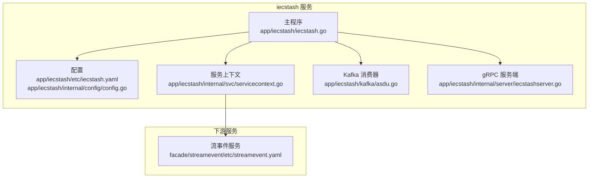
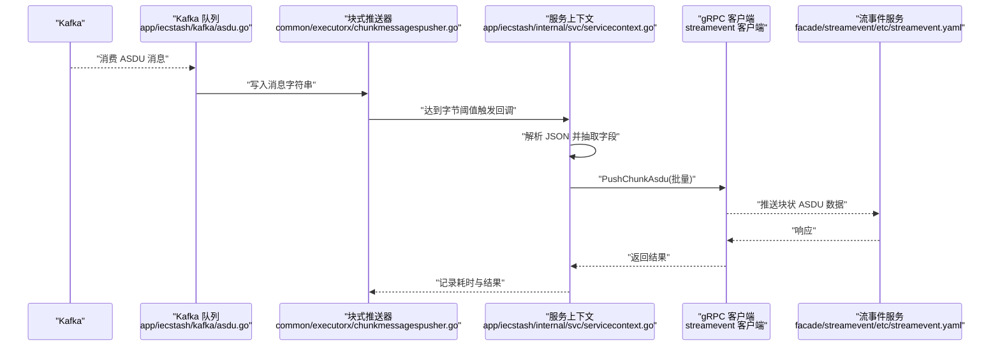
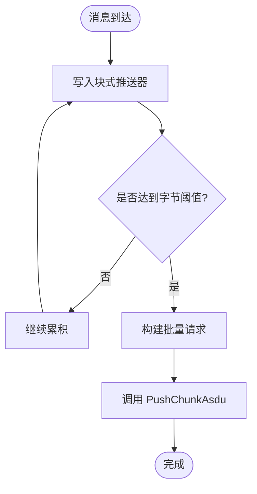
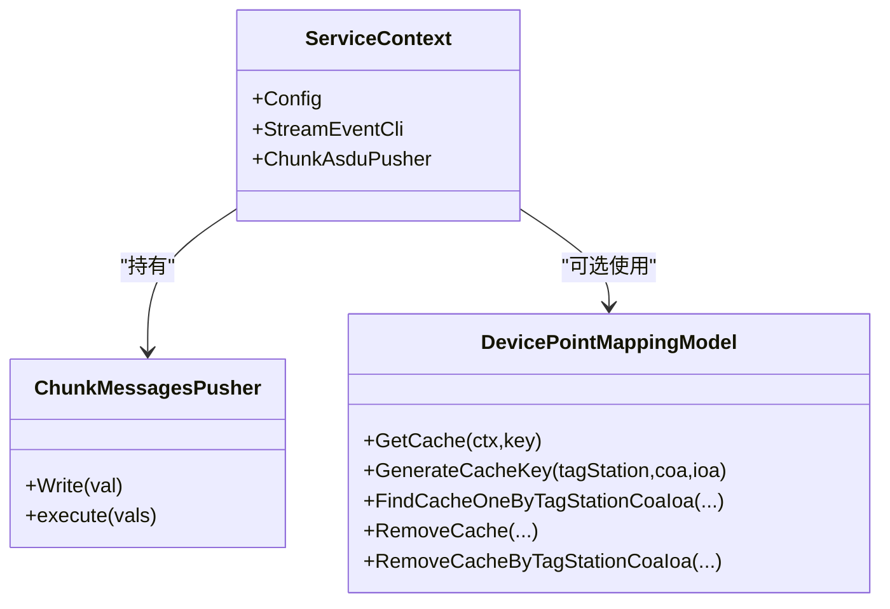
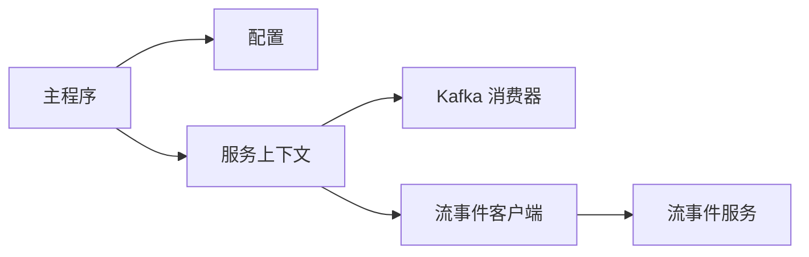

# IEC104 数据存储服务 (iecstash)

<cite>
**本文引用的文件**
- [app/iecstash/etc/iecstash.yaml](file://app/iecstash/etc/iecstash.yaml)
- [app/iecstash/internal/config/config.go](file://app/iecstash/internal/config/config.go)
- [app/iecstash/kafka/asdu.go](file://app/iecstash/kafka/asdu.go)
- [app/iecstash/iecstash.go](file://app/iecstash/iecstash.go)
- [app/iecstash/internal/svc/servicecontext.go](file://app/iecstash/internal/svc/servicecontext.go)
- [app/iecstash/internal/server/iecstashserver.go](file://app/iecstash/internal/server/iecstashserver.go)
- [common/executorx/chunkmessagespusher.go](file://common/executorx/chunkmessagespusher.go)
- [facade/streamevent/etc/streamevent.yaml](file://facade/streamevent/etc/streamevent.yaml)
- [model/devicepointmappingmodel.go](file://model/devicepointmappingmodel.go)
- [model/devicepointmappingmodel_gen.go](file://model/devicepointmappingmodel_gen.go)
- [app/ieccaller/kafka/broadcast.go](file://app/ieccaller/kafka/broadcast.go)
- [docs/iec104-protocol.md](file://docs/iec104-protocol.md)
- [model/sql/tdengine_insert_example.sql](file://model/sql/tdengine_insert_example.sql)
</cite>

## 目录
1. [简介](#简介)
2. [项目结构](#项目结构)
3. [核心组件](#核心组件)
4. [架构总览](#架构总览)
5. [详细组件分析](#详细组件分析)
6. [依赖分析](#依赖分析)
7. [性能考虑](#性能考虑)
8. [故障排查指南](#故障排查指南)
9. [结论](#结论)
10. [附录](#附录)

## 简介
IEC104 数据存储服务（iecstash）是 IEC60870-5-104 数采平台中的核心数据接收与转发组件，负责从 Kafka 接收 ASDU 消息，进行轻量解析与批量化聚合，随后通过 gRPC 将“块状”ASDU 数据推送到流事件服务（streamevent），由后者完成后续的时序数据入库与索引构建。该服务以高吞吐、低延迟为目标，结合 Kafka 分区并行消费、协程池并发处理以及基于字节大小的批量写入策略，确保在大规模 IEC104 数据接入场景下的稳定与高效。

## 项目结构
iecstash 的工程组织遵循“服务入口 + 配置 + 业务上下文 + Kafka 消费器 + gRPC 服务”的分层设计：
- 服务入口与注册：在主程序中加载配置、初始化服务上下文、注册 gRPC 服务，并将 Kafka 队列加入统一生命周期管理。
- 配置模块：集中定义 Kafka 消费参数、日志、Nacos 注册、流事件客户端配置、数据库连接与批处理阈值等。
- 服务上下文：封装流事件客户端、块式消息推送器（ChunkMessagesPusher）等运行期资源。
- Kafka 消费器：将 Kafka 消息键值对直接透传到块式推送器，避免重复解析。
- gRPC 服务：提供最小化的 Ping 接口，便于健康检查与调试。

图表来源
- [app/iecstash/iecstash.go:35-84](file://app/iecstash/iecstash.go#L35-L84)
- [app/iecstash/etc/iecstash.yaml:1-46](file://app/iecstash/etc/iecstash.yaml#L1-L46)
- [app/iecstash/internal/config/config.go:10-28](file://app/iecstash/internal/config/config.go#L10-L28)
- [app/iecstash/internal/svc/servicecontext.go:25-91](file://app/iecstash/internal/svc/servicecontext.go#L25-L91)
- [app/iecstash/kafka/asdu.go:20-24](file://app/iecstash/kafka/asdu.go#L20-L24)
- [app/iecstash/internal/server/iecstashserver.go:20-29](file://app/iecstash/internal/server/iecstashserver.go#L20-L29)
- [facade/streamevent/etc/streamevent.yaml:1-28](file://facade/streamevent/etc/streamevent.yaml#L1-L28)

章节来源
- [app/iecstash/iecstash.go:35-84](file://app/iecstash/iecstash.go#L35-L84)
- [app/iecstash/etc/iecstash.yaml:1-46](file://app/iecstash/etc/iecstash.yaml#L1-L46)
- [app/iecstash/internal/config/config.go:10-28](file://app/iecstash/internal/config/config.go#L10-L28)
- [app/iecstash/internal/svc/servicecontext.go:25-91](file://app/iecstash/internal/svc/servicecontext.go#L25-L91)
- [app/iecstash/kafka/asdu.go:20-24](file://app/iecstash/kafka/asdu.go#L20-L24)
- [app/iecstash/internal/server/iecstashserver.go:20-29](file://app/iecstash/internal/server/iecstashserver.go#L20-L29)
- [facade/streamevent/etc/streamevent.yaml:1-28](file://facade/streamevent/etc/streamevent.yaml#L1-L28)

## 核心组件
- 配置中心
  - KafkaASDUConfig：Kafka 连接、主题、消费者组、连接数、每个连接的消费者数、处理器数、每次拉取的最小/最大字节数、是否按顺序提交、起始偏移策略等。
  - StreamEventConf：流事件服务的 gRPC 客户端配置（目标、非阻塞、超时等）。
  - PushAsduChunkBytes：块式推送阈值（字节）。
  - GracePeriod：优雅停机等待时间。
- 服务上下文
  - 构造流事件客户端，设置最大 gRPC 消息尺寸，启用元数据拦截器。
  - 初始化块式消息推送器，将字符串消息按字节阈值聚合，回调函数内完成 JSON 解析与字段抽取，最终调用 PushChunkAsdu 批量推送。
- Kafka 消费器
  - Asdu.Consume 将 Kafka 消息值直接写入块式推送器，避免重复解析。
- gRPC 服务
  - 提供 Ping 接口，便于健康检查。

章节来源
- [app/iecstash/etc/iecstash.yaml:18-46](file://app/iecstash/etc/iecstash.yaml#L18-L46)
- [app/iecstash/internal/config/config.go:10-28](file://app/iecstash/internal/config/config.go#L10-L28)
- [app/iecstash/internal/svc/servicecontext.go:25-91](file://app/iecstash/internal/svc/servicecontext.go#L25-L91)
- [app/iecstash/kafka/asdu.go:20-24](file://app/iecstash/kafka/asdu.go#L20-L24)
- [app/iecstash/internal/server/iecstashserver.go:26-28](file://app/iecstash/internal/server/iecstashserver.go#L26-L28)

## 架构总览
下图展示了 iecstash 从 Kafka 到 streamevent 的完整数据链路，以及关键的并发与批处理控制点。

图表来源
- [app/iecstash/kafka/asdu.go:20-24](file://app/iecstash/kafka/asdu.go#L20-L24)
- [common/executorx/chunkmessagespusher.go:26-44](file://common/executorx/chunkmessagespusher.go#L26-L44)
- [app/iecstash/internal/svc/servicecontext.go:36-84](file://app/iecstash/internal/svc/servicecontext.go#L36-L84)
- [facade/streamevent/etc/streamevent.yaml:1-28](file://facade/streamevent/etc/streamevent.yaml#L1-L28)

## 详细组件分析

### 组件一：Kafka 消费与批处理
- 消费流程
  - Asdu.Consume 接收 Kafka 消息键值对，将消息值写入块式推送器。
  - 块式推送器根据字节阈值（PushAsduChunkBytes）聚合消息，触发回调。
- 并发与分区
  - Kafka 配置支持多连接（Conns）、每连接多消费者（Consumers）、多处理器（Processors），可按 CPU 核数与分区数进行调优。
  - 偏移量提交策略可通过 CommitInOrder 与 Offset 控制。
- 批量提交
  - 回调函数内部一次性调用 PushChunkAsdu，减少 RPC 调用次数，提升吞吐。

图表来源
- [app/iecstash/kafka/asdu.go:20-24](file://app/iecstash/kafka/asdu.go#L20-L24)
- [common/executorx/chunkmessagespusher.go:26-44](file://common/executorx/chunkmessagespusher.go#L26-L44)
- [app/iecstash/etc/iecstash.yaml:28-35](file://app/iecstash/etc/iecstash.yaml#L28-L35)

章节来源
- [app/iecstash/kafka/asdu.go:20-24](file://app/iecstash/kafka/asdu.go#L20-L24)
- [common/executorx/chunkmessagespusher.go:26-44](file://common/executorx/chunkmessagespusher.go#L26-L44)
- [app/iecstash/etc/iecstash.yaml:28-35](file://app/iecstash/etc/iecstash.yaml#L28-L35)

### 组件二：服务上下文与消息解析
- 流事件客户端
  - 使用 zrpc.NewClient 构建，启用元数据拦截器与大消息支持（最大发送 2GB）。
  - 配置项来自 StreamEventConf，支持 Nacos 注册与超时控制。
- 块式推送器
  - 在回调中将字符串数组解析为结构化 MsgBody 列表，抽取关键字段（消息 ID、主机、端口、ASDU 类型、类型标识、公共地址、原始体、时间、元数据、点位映射等）。
  - 记录推送耗时与结果，便于监控与排障。
- 点位映射缓存
  - 通过设备点映射模型（DevicePointMappingModel）提供缓存能力，支持按 tag_station/coa/ioa 生成缓存键，降低重复查询成本。

图表来源
- [app/iecstash/internal/svc/servicecontext.go:19-91](file://app/iecstash/internal/svc/servicecontext.go#L19-L91)
- [common/executorx/chunkmessagespusher.go:11-44](file://common/executorx/chunkmessagespusher.go#L11-L44)
- [model/devicepointmappingmodel.go:30-107](file://model/devicepointmappingmodel.go#L30-L107)

章节来源
- [app/iecstash/internal/svc/servicecontext.go:25-91](file://app/iecstash/internal/svc/servicecontext.go#L25-L91)
- [model/devicepointmappingmodel.go:30-107](file://model/devicepointmappingmodel.go#L30-L107)

### 组件三：gRPC 服务与健康检查
- Ping 接口
  - 提供最小化响应，便于外部探活与集成测试。
- 服务注册
  - 支持 Nacos 注册，便于服务发现与负载均衡。

章节来源
- [app/iecstash/internal/server/iecstashserver.go:26-28](file://app/iecstash/internal/server/iecstashserver.go#L26-L28)
- [app/iecstash/iecstash.go:55-72](file://app/iecstash/iecstash.go#L55-L72)

### 组件四：数据模型与索引策略
- 设备点映射模型
  - 提供按 tag_station/coa/ioa 查询与缓存能力，支持软删除、版本号、扩展字段等。
  - 缓存键生成规则与缓存命中策略，有助于降低下游查询压力。
- 时序数据存储
  - 文档中给出 TDengine 插入示例，包含原始报文表与遥测表的标签（station、device、coa、ioa）与时间戳字段，体现以时间为主索引、以设备/站点为二级索引的设计思路。

章节来源
- [model/devicepointmappingmodel_gen.go:59-83](file://model/devicepointmappingmodel_gen.go#L59-L83)
- [model/devicepointmappingmodel.go:30-107](file://model/devicepointmappingmodel.go#L30-L107)
- [model/sql/tdengine_insert_example.sql:60-76](file://model/sql/tdengine_insert_example.sql#L60-L76)

### 组件五：Kafka 集成与广播联动
- 广播机制
  - ieccaller 服务通过 Kafka 广播命令或缓存清理指令，iecstash 不直接消费广播主题，但其点位映射缓存可被广播清理指令影响，从而保持一致性。
- IEC104 消息格式
  - 文档定义了 ASDU 消息的 JSON 结构、点位映射（pm）字段、时间戳与时标等，为 iecstash 的解析与转发提供契约基础。

章节来源
- [app/ieccaller/kafka/broadcast.go:14-148](file://app/ieccaller/kafka/broadcast.go#L14-L148)
- [docs/iec104-protocol.md:18-82](file://docs/iec104-protocol.md#L18-L82)

## 依赖分析
- 组件耦合
  - 主程序依赖配置与服务上下文；服务上下文依赖流事件客户端与块式推送器；块式推送器依赖回调函数完成批量处理。
- 外部依赖
  - Kafka：用于接收 IEC104 ASDU 消息。
  - Streamevent：负责时序数据入库与索引。
  - Nacos：服务注册与发现（可选）。
- 循环依赖
  - 当前结构清晰，无循环依赖迹象。

图表来源
- [app/iecstash/iecstash.go:35-84](file://app/iecstash/iecstash.go#L35-L84)
- [app/iecstash/internal/svc/servicecontext.go:25-91](file://app/iecstash/internal/svc/servicecontext.go#L25-L91)
- [facade/streamevent/etc/streamevent.yaml:1-28](file://facade/streamevent/etc/streamevent.yaml#L1-L28)

章节来源
- [app/iecstash/iecstash.go:35-84](file://app/iecstash/iecstash.go#L35-L84)
- [app/iecstash/internal/svc/servicecontext.go:25-91](file://app/iecstash/internal/svc/servicecontext.go#L25-L91)

## 性能考虑
- Kafka 并发参数
  - Conns × Consumers ≤ 分区数，Processors 建议为 Conns × Consumers 的倍数，以充分利用 CPU 并发。
  - MinBytes/MaxBytes 根据网络与 IO 调整，平衡延迟与吞吐。
- 批量阈值
  - PushAsduChunkBytes 决定块式推送的字节阈值，过大导致单次 RPC 响应时间增长，过小增加 RPC 次数，需结合下游 streamevent 的处理能力权衡。
- gRPC 大消息
  - 发送端设置最大消息尺寸为 2GB，避免大块 ASDU 被截断。
- 缓存策略
  - 设备点映射缓存可显著降低重复查询开销，结合广播清理机制维持一致性。

章节来源
- [app/iecstash/etc/iecstash.yaml:24-35](file://app/iecstash/etc/iecstash.yaml#L24-L35)
- [app/iecstash/internal/svc/servicecontext.go:29-33](file://app/iecstash/internal/svc/servicecontext.go#L29-L33)
- [model/devicepointmappingmodel.go:30-107](file://model/devicepointmappingmodel.go#L30-L107)

## 故障排查指南
- Kafka 消费异常
  - 检查 KafkaASDUConfig 中的 Broker、Topic、Group、Offset 设置是否正确。
  - 关注 Conns/Consumers/Processors 与分区数匹配情况，避免过度并发导致资源争用。
- 块式推送失败
  - 查看服务上下文回调中的错误日志，定位 PushChunkAsdu 调用失败原因。
  - 核对 PushAsduChunkBytes 是否过大导致下游超时。
- gRPC 调用问题
  - 确认 StreamEventConf 的 Target、NonBlock、Timeout 设置。
  - 检查 Streamevent 服务端日志与中间件统计配置。
- 缓存一致性
  - 若出现点位映射不一致，可通过广播清理缓存指令触发失效，再由缓存层自动回源查询。

章节来源
- [app/iecstash/etc/iecstash.yaml:18-46](file://app/iecstash/etc/iecstash.yaml#L18-L46)
- [app/iecstash/internal/svc/servicecontext.go:74-80](file://app/iecstash/internal/svc/servicecontext.go#L74-L80)
- [app/ieccaller/kafka/broadcast.go:111-143](file://app/ieccaller/kafka/broadcast.go#L111-L143)

## 结论
iecstash 通过“Kafka 接收 + 块式聚合 + gRPC 下推”的架构，在 IEC104 数据接入场景中实现了高吞吐、低延迟与可扩展的数据通路。配合设备点映射缓存与广播清理机制，可在保证一致性的同时降低查询成本。建议在生产环境中根据分区数与 CPU 资源合理配置 Kafka 并发参数，并结合下游 streamevent 的处理能力调整块式推送阈值与 gRPC 超时，以获得最佳性能。

## 附录
- 配置清单与含义
  - KafkaASDUConfig：Kafka 连接、主题、消费者组、并发与批处理参数。
  - StreamEventConf：流事件服务 gRPC 客户端配置。
  - PushAsduChunkBytes：块式推送阈值（字节）。
  - GracePeriod：优雅停机等待时间。
- 数据模型要点
  - 设备点映射模型提供按 tag_station/coa/ioa 的缓存与查询能力。
  - TDengine 插入示例体现了以时间为主索引、以设备/站点为二级索引的时序数据组织方式。

章节来源
- [app/iecstash/etc/iecstash.yaml:18-46](file://app/iecstash/etc/iecstash.yaml#L18-L46)
- [model/devicepointmappingmodel_gen.go:59-83](file://model/devicepointmappingmodel_gen.go#L59-L83)
- [model/sql/tdengine_insert_example.sql:60-76](file://model/sql/tdengine_insert_example.sql#L60-L76)