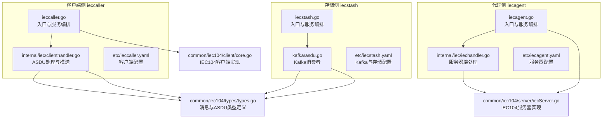
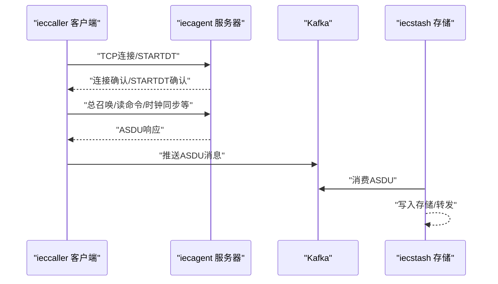
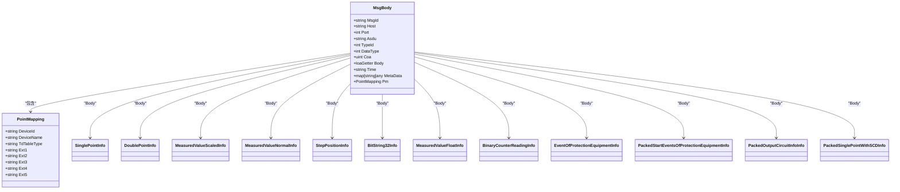
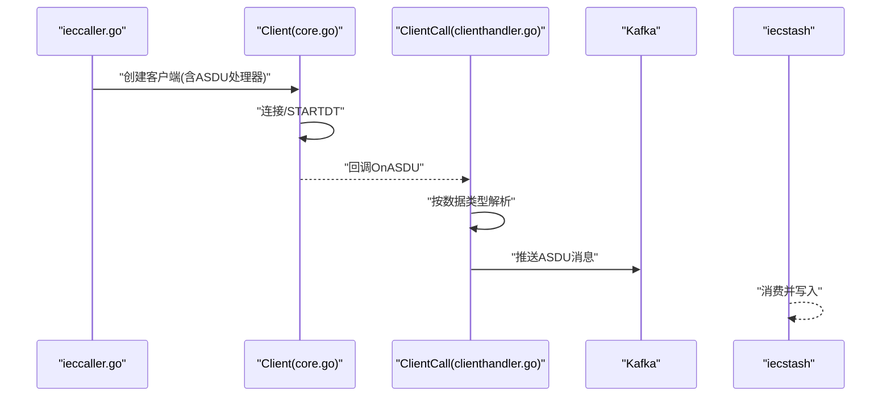
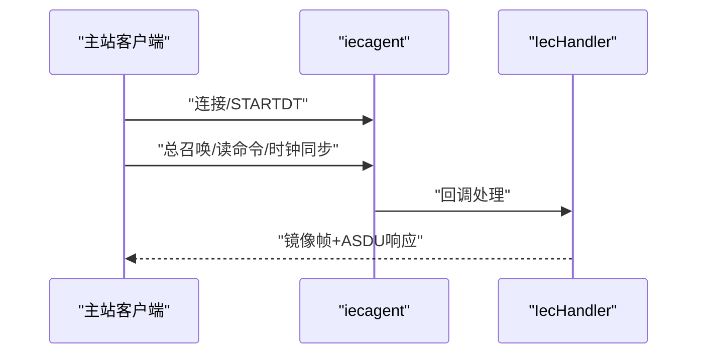
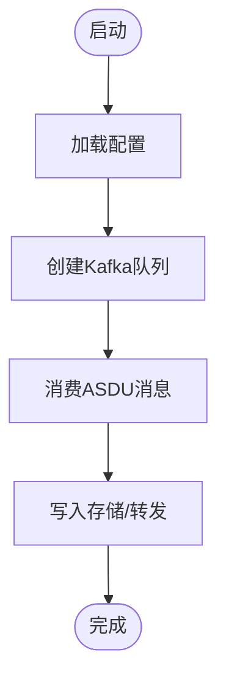
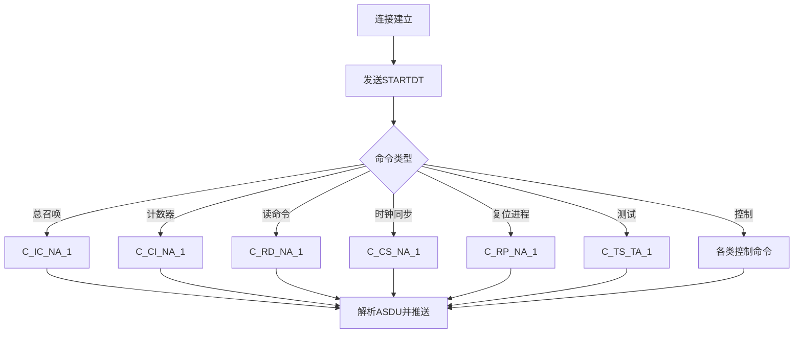
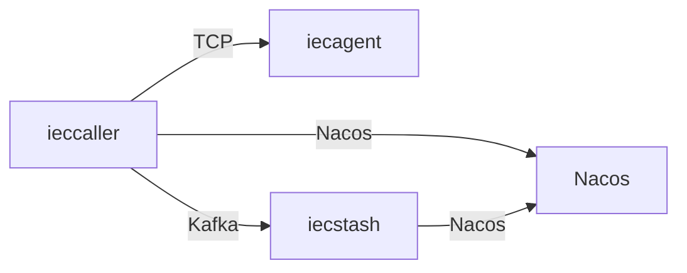

# IEC104 数采平台

<cite>
**本文引用的文件**   
- [app/ieccaller/ieccaller.go](file://app/ieccaller/ieccaller.go)
- [app/iecagent/iecagent.go](file://app/iecagent/iecagent.go)
- [app/iecstash/iecstash.go](file://app/iecstash/iecstash.go)
- [common/iec104/types/types.go](file://common/iec104/types/types.go)
- [common/iec104/client/core.go](file://common/iec104/client/core.go)
- [common/iec104/server/iecServer.go](file://common/iec104/server/iecServer.go)
- [app/ieccaller/internal/iec/clienthandler.go](file://app/ieccaller/internal/iec/clienthandler.go)
- [app/iecagent/internal/iec/iechandler.go](file://app/iecagent/internal/iec/iechandler.go)
- [app/ieccaller/etc/ieccaller.yaml](file://app/ieccaller/etc/ieccaller.yaml)
- [app/iecagent/etc/iecagent.yaml](file://app/iecagent/etc/iecagent.yaml)
- [app/iecstash/etc/iecstash.yaml](file://app/iecstash/etc/iecstash.yaml)
- [app/iecstash/kafka/asdu.go](file://app/iecstash/kafka/asdu.go)
- [common/iec104/client/errors.go](file://common/iec104/client/errors.go)
- [common/iec104/client/interface.go](file://common/iec104/client/interface.go)
- [app/ieccaller/internal/logic/sendreadcmdlogic.go](file://app/ieccaller/internal/logic/sendreadcmdlogic.go)
- [app/ieccaller/internal/logic/sendinterrogationcmdlogic.go](file://app/ieccaller/internal/logic/sendinterrogationcmdlogic.go)
</cite>

## 目录
1. [引言](#引言)
2. [项目结构](#项目结构)
3. [核心组件](#核心组件)
4. [架构总览](#架构总览)
5. [详细组件分析](#详细组件分析)
6. [依赖分析](#依赖分析)
7. [性能考量](#性能考量)
8. [故障排查指南](#故障排查指南)
9. [结论](#结论)
10. [附录](#附录)

## 引言
本技术文档面向 IEC104 数采平台，系统性阐述 IEC60870-5-104 协议在工业自动化中的应用，覆盖数据采集、设备通信与实时监控。平台由三大核心服务组成：
- ieccaller（客户端）：主动连接 IEC104 从站，发起总召唤、读定值、时钟同步等命令，并解析各类 ASDU 数据。
- iecagent（代理服务）：作为 IEC104 服务器，接收来自调度主站的请求并模拟设备响应，便于联调与测试。
- iecstash（数据存储）：消费 Kafka 中的 ASDU 消息，进行批量写入与转发。

文档将深入解释 IEC104 的数据结构、ASDU 类型与通信流程，提供设备配置、参数设置与故障诊断的实用指南，并给出建立连接、读取数据点与处理异常的代码路径参考。

## 项目结构
平台采用多服务微架构，每个服务独立部署、通过 gRPC 对外提供能力，并通过 Kafka 实现异步解耦与广播。

**图表来源**
- [app/ieccaller/ieccaller.go:1-123](file://app/ieccaller/ieccaller.go#L1-L123)
- [app/iecagent/iecagent.go:1-59](file://app/iecagent/iecagent.go#L1-L59)
- [app/iecstash/iecstash.go:1-85](file://app/iecstash/iecstash.go#L1-L85)
- [common/iec104/types/types.go:1-323](file://common/iec104/types/types.go#L1-L323)
- [common/iec104/client/core.go:1-446](file://common/iec104/client/core.go#L1-L446)
- [common/iec104/server/iecServer.go:1-38](file://common/iec104/server/iecServer.go#L1-L38)
- [app/ieccaller/internal/iec/clienthandler.go:1-541](file://app/ieccaller/internal/iec/clienthandler.go#L1-L541)
- [app/iecagent/internal/iec/iechandler.go:1-124](file://app/iecagent/internal/iec/iechandler.go#L1-L124)
- [app/iecstash/kafka/asdu.go:1-25](file://app/iecstash/kafka/asdu.go#L1-L25)

**章节来源**
- [app/ieccaller/ieccaller.go:1-123](file://app/ieccaller/ieccaller.go#L1-L123)
- [app/iecagent/iecagent.go:1-59](file://app/iecagent/iecagent.go#L1-L59)
- [app/iecstash/iecstash.go:1-85](file://app/iecstash/iecstash.go#L1-L85)

## 核心组件
- ieccaller（客户端）
  - 负责建立到 IEC104 服务器的 TCP 连接，自动重连与 STARTDT/STOPDT 控制。
  - 支持发送总召唤、计数器召唤、读命令、时钟同步、复位进程、测试命令及各类控制命令。
  - 解析各类 ASDU，按数据类型分发到对应处理函数，构建统一 MsgBody 结构并通过服务上下文推送。
- iecagent（代理服务）
  - 作为 IEC104 服务器监听指定地址与端口，处理来自主站的各类命令并返回模拟数据。
  - 提供 OnInterrogation、OnCounterInterrogation、OnRead、OnClockSync、OnResetProcess、OnDelayAcquisition、OnASDU 等回调。
- iecstash（数据存储）
  - 通过 Kafka 消费 ASDU 消息，将数据写入下游（如数据库或流式事件），并可按配置进行广播。

**章节来源**
- [common/iec104/client/core.go:1-446](file://common/iec104/client/core.go#L1-L446)
- [app/ieccaller/internal/iec/clienthandler.go:1-541](file://app/ieccaller/internal/iec/clienthandler.go#L1-L541)
- [app/iecagent/internal/iec/iechandler.go:1-124](file://app/iecagent/internal/iec/iechandler.go#L1-L124)
- [app/iecstash/kafka/asdu.go:1-25](file://app/iecstash/kafka/asdu.go#L1-L25)

## 架构总览
下图展示了三者之间的交互关系与数据流向：

**图表来源**
- [app/ieccaller/ieccaller.go:89-93](file://app/ieccaller/ieccaller.go#L89-L93)
- [common/iec104/client/core.go:120-147](file://common/iec104/client/core.go#L120-L147)
- [app/iecagent/iecagent.go:53-54](file://app/iecagent/iecagent.go#L53-L54)
- [app/iecstash/iecstash.go:80-81](file://app/iecstash/iecstash.go#L80-L81)

## 详细组件分析

### IEC104 协议与数据模型
- 消息体与关键字段
  - MsgBody：包含消息标识、远端主机与端口、ASDU 类型、数据类型、公共地址、时间戳、元数据与点位映射等。
  - PointMapping：设备标识、设备名称、TDengine 表类型、扩展字段等，用于主题拆分与下游路由。
- 常见 ASDU 类型与信息体
  - 单点信息（M_SP_*）、双点信息（M_DP_*）、测量值（标度化/规一化/短浮点）（M_ME_*）、步位置（M_ST_*）、位串（M_BO_*）、累计量（M_IT_*）、继电保护事件（M_EP_*）、带变位检出的成组单点（M_PS_*）等。
- 数据质量与时间戳
  - QDS/QDP 描述质量状态（溢出、封锁、替代、非实时、无效等），部分类型携带 CP56/CP24 时间戳。

**图表来源**
- [common/iec104/types/types.go:17-40](file://common/iec104/types/types.go#L17-L40)
- [common/iec104/types/types.go:62-322](file://common/iec104/types/types.go#L62-L322)

**章节来源**
- [common/iec104/types/types.go:1-323](file://common/iec104/types/types.go#L1-L323)

### ieccaller（客户端）工作流
- 启动流程
  - 加载配置，注册 gRPC 服务，按配置列表创建 IEC104 客户端实例，设置 ASDU 处理器。
  - 启动定时任务与 Kafka 广播队列（若启用）。
- 连接与事件
  - 连接成功后发送 STARTDT；断开触发自动重连；服务器激活事件触发相应处理。
- 命令发送
  - 支持总召唤、计数器召唤、读命令、时钟同步、复位进程、测试命令以及多种控制命令。
- 数据处理
  - 将收到的 ASDU 按数据类型分派到对应处理函数，构造 MsgBody 并推送至服务上下文。

**图表来源**
- [app/ieccaller/ieccaller.go:89-93](file://app/ieccaller/ieccaller.go#L89-L93)
- [common/iec104/client/core.go:120-147](file://common/iec104/client/core.go#L120-L147)
- [app/ieccaller/internal/iec/clienthandler.go:94-140](file://app/ieccaller/internal/iec/clienthandler.go#L94-L140)
- [app/iecstash/kafka/asdu.go:20-24](file://app/iecstash/kafka/asdu.go#L20-L24)

**章节来源**
- [app/ieccaller/ieccaller.go:1-123](file://app/ieccaller/ieccaller.go#L1-L123)
- [common/iec104/client/core.go:1-446](file://common/iec104/client/core.go#L1-L446)
- [app/ieccaller/internal/iec/clienthandler.go:1-541](file://app/ieccaller/internal/iec/clienthandler.go#L1-L541)

### iecagent（代理服务）工作流
- 启动流程
  - 加载配置，注册 gRPC 服务，创建 IEC104 服务器并监听指定地址与端口。
- 请求处理
  - 实现各类命令回调：总召唤、计数器召唤、读命令、时钟同步、复位进程、延迟获取、控制命令等。
  - 回复镜像帧（ActivationCon/ActivationTerm）与具体 ASDU 内容。

**图表来源**
- [app/iecagent/iecagent.go:53-54](file://app/iecagent/iecagent.go#L53-L54)
- [app/iecagent/internal/iec/iechandler.go:25-123](file://app/iecagent/internal/iec/iechandler.go#L25-L123)
- [common/iec104/server/iecServer.go:17-37](file://common/iec104/server/iecServer.go#L17-L37)

**章节来源**
- [app/iecagent/iecagent.go:1-59](file://app/iecagent/iecagent.go#L1-L59)
- [app/iecagent/internal/iec/iechandler.go:1-124](file://app/iecagent/internal/iec/iechandler.go#L1-L124)
- [common/iec104/server/iecServer.go:1-38](file://common/iec104/server/iecServer.go#L1-L38)

### iecstash（数据存储）工作流
- 启动流程
  - 加载配置，注册 gRPC 服务，创建 Kafka 消费队列。
- 数据处理
  - 消费 ASDU 消息，写入下游（如数据库或流式事件）。

**图表来源**
- [app/iecstash/iecstash.go:79-81](file://app/iecstash/iecstash.go#L79-L81)
- [app/iecstash/kafka/asdu.go:20-24](file://app/iecstash/kafka/asdu.go#L20-L24)

**章节来源**
- [app/iecstash/iecstash.go:1-85](file://app/iecstash/iecstash.go#L1-L85)
- [app/iecstash/kafka/asdu.go:1-25](file://app/iecstash/kafka/asdu.go#L1-L25)

### IEC104 命令与通信流程
- 连接建立
  - 客户端连接服务器后发送 STARTDT，服务器确认后进入数据传输阶段。
- 命令类型
  - 总召唤（C_IC_NA_1）、计数器召唤（C_CI_NA_1）、读命令（C_RD_NA_1）、时钟同步（C_CS_NA_1）、复位进程（C_RP_NA_1）、测试命令（C_TS_TA_1）以及各类控制命令（单命令、双命令、步命令、设定值命令等）。
- 数据类型解析
  - 客户端根据 ASDU 类型识别数据体，转换为统一结构并推送。

**图表来源**
- [common/iec104/client/core.go:182-231](file://common/iec104/client/core.go#L182-L231)
- [app/ieccaller/internal/iec/clienthandler.go:94-140](file://app/ieccaller/internal/iec/clienthandler.go#L94-L140)

**章节来源**
- [common/iec104/client/core.go:1-446](file://common/iec104/client/core.go#L1-L446)
- [app/ieccaller/internal/iec/clienthandler.go:1-541](file://app/ieccaller/internal/iec/clienthandler.go#L1-L541)

## 依赖分析
- 组件内聚与耦合
  - ieccaller 与 iecagent 通过 IEC104 协议耦合，彼此独立运行；iecstash 通过 Kafka 与 ieccaller 松耦合。
- 外部依赖
  - IEC104 协议栈（go-iecp5）、Kafka（go-queue/kq）、Nacos 注册中心、gRPC 与 go-zero 服务框架。
- 配置驱动
  - 三者均通过 YAML 配置文件控制网络、日志、注册与队列参数。

**图表来源**
- [app/ieccaller/ieccaller.go:60-82](file://app/ieccaller/ieccaller.go#L60-L82)
- [app/iecstash/iecstash.go:54-72](file://app/iecstash/iecstash.go#L54-L72)

**章节来源**
- [app/ieccaller/etc/ieccaller.yaml:13-21](file://app/ieccaller/etc/ieccaller.yaml#L13-L21)
- [app/iecstash/etc/iecstash.yaml:10-17](file://app/iecstash/etc/iecstash.yaml#L10-L17)

## 性能考量
- 连接管理
  - 自动重连与重连间隔配置，确保链路稳定性。
- 并发与吞吐
  - ieccaller 使用任务运行器并发处理不同 ASDU 类型，提升吞吐。
  - iecstash 的 Kafka 消费配置（Conns、Consumers、Processors、MinBytes/MaxBytes）需结合 CPU 与磁盘 IO 进行调优。
- 日志与可观测性
  - 开启 IEC104 日志模式有助于定位问题，但生产环境需权衡性能与日志量。
- 缓冲与批处理
  - PushAsduChunkBytes 控制批量推送大小，平衡内存占用与网络效率。

**章节来源**
- [common/iec104/client/core.go:269-283](file://common/iec104/client/core.go#L269-L283)
- [app/ieccaller/internal/iec/clienthandler.go:40-44](file://app/ieccaller/internal/iec/clienthandler.go#L40-L44)
- [app/iecstash/etc/iecstash.yaml:24-35](file://app/iecstash/etc/iecstash.yaml#L24-L35)
- [app/ieccaller/etc/ieccaller.yaml:78-79](file://app/ieccaller/etc/ieccaller.yaml#L78-L79)

## 故障排查指南
- 常见错误
  - 未连接错误：当客户端尚未建立连接时执行命令会返回“未连接”错误。
- 定位方法
  - 检查 IEC104 日志模式与连接事件回调，确认 STARTDT/STOPDT 是否正常。
  - 核对 Kafka 队列配置与消费者组，确保消息被正确消费。
- 建议步骤
  - 启用详细日志，逐步验证连接、命令发送与响应。
  - 在 iecagent 中模拟设备行为，隔离主站与被测设备的问题。

**章节来源**
- [common/iec104/client/errors.go:1-8](file://common/iec104/client/errors.go#L1-L8)
- [common/iec104/client/core.go:120-147](file://common/iec104/client/core.go#L120-L147)
- [app/iecstash/kafka/asdu.go:20-24](file://app/iecstash/kafka/asdu.go#L20-L24)

## 结论
本平台以 IEC104 协议为核心，通过 ieccaller、iecagent、iecstash 三者协同，实现了从设备接入、数据采集、存储转发到实时监控的完整链路。配置灵活、扩展性强，适合在工业自动化场景中进行大规模部署与运维。

## 附录

### 设备配置与参数设置
- ieccaller.yaml
  - IecServerConfig：配置远端 IEC104 服务器地址、端口、定时总召唤与计数器召唤的公共地址列表、元数据与任务并发度。
  - KafkaConfig：Kafka Broker 列表、Topic、广播 Topic 与广播组 ID。
  - MqttConfig：MQTT Broker、认证、QoS、订阅 Topic 列表与是否推送指令数据。
  - StreamEventConf：流事件推送目标与超时。
  - PushAsduChunkBytes：批量推送字节大小。
- iecagent.yaml
  - IecSetting：监听地址、端口与日志模式。
- iecstash.yaml
  - KafkaASDUConfig：Kafka 连接数、消费者数、处理器数、最小/最大拉取字节、偏移策略等。

**章节来源**
- [app/ieccaller/etc/ieccaller.yaml:1-79](file://app/ieccaller/etc/ieccaller.yaml#L1-L79)
- [app/iecagent/etc/iecagent.yaml:1-14](file://app/iecagent/etc/iecagent.yaml#L1-L14)
- [app/iecstash/etc/iecstash.yaml:1-46](file://app/iecstash/etc/iecstash.yaml#L1-L46)

### 建立设备连接与读取数据点
- 建立连接
  - 在 ieccaller 中创建客户端实例并设置 ASDU 处理器，随后启动连接。
  - 参考路径：[app/ieccaller/ieccaller.go:89-93](file://app/ieccaller/ieccaller.go#L89-L93)，[common/iec104/client/core.go:87-117](file://common/iec104/client/core.go#L87-L117)
- 发送读命令
  - 通过逻辑层封装发送读命令，支持广播或直连。
  - 参考路径：[app/ieccaller/internal/logic/sendreadcmdlogic.go:25-43](file://app/ieccaller/internal/logic/sendreadcmdlogic.go#L25-L43)
- 总召唤与计数器召唤
  - 参考路径：[common/iec104/client/core.go:182-190](file://common/iec104/client/core.go#L182-L190)
- 解析与推送
  - 按 ASDU 类型解析并推送统一消息体。
  - 参考路径：[app/ieccaller/internal/iec/clienthandler.go:94-140](file://app/ieccaller/internal/iec/clienthandler.go#L94-L140)

### 处理异常情况
- 未连接错误
  - 当客户端未连接时尝试发送命令将失败，需先检查连接状态与重连策略。
  - 参考路径：[common/iec104/client/errors.go:6](file://common/iec104/client/errors.go#L6)
- 断线与重连
  - 监听连接丢失事件并触发自动重连。
  - 参考路径：[common/iec104/client/core.go:137-144](file://common/iec104/client/core.go#L137-L144)
- Kafka 消费异常
  - 检查消费者组、分区与偏移策略，必要时调整 Conns/Consumers/Processors。
  - 参考路径：[app/iecstash/etc/iecstash.yaml:24-35](file://app/iecstash/etc/iecstash.yaml#L24-L35)