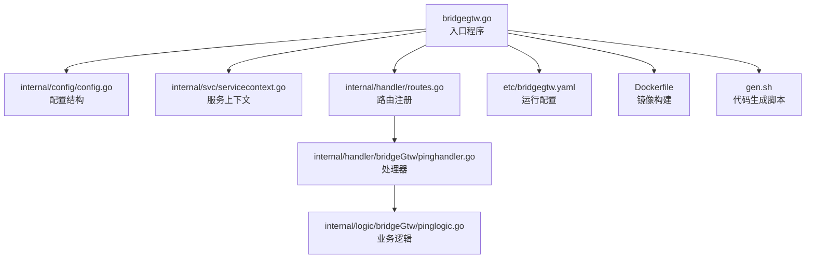
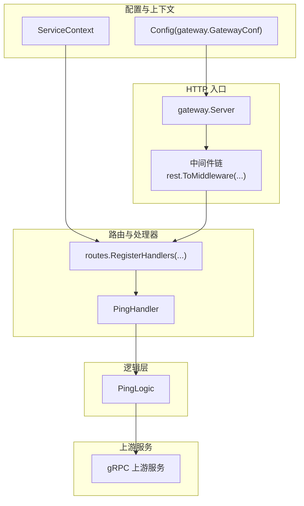
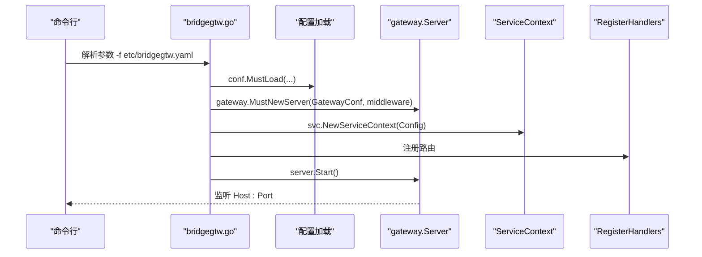
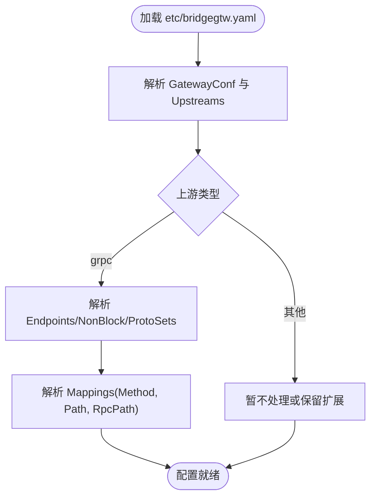
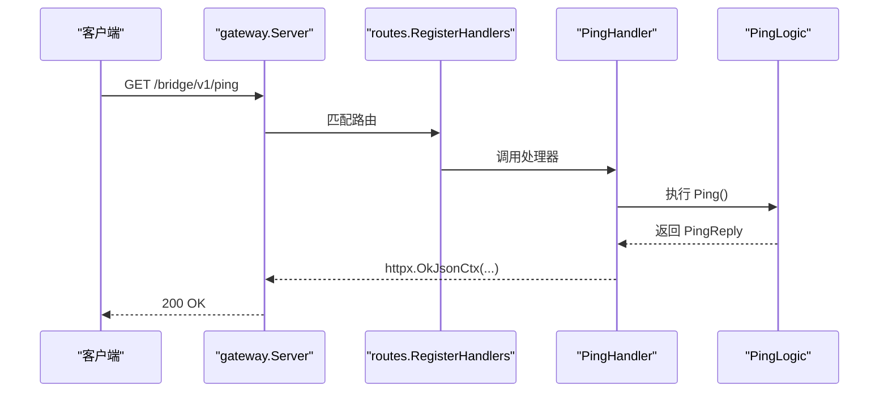
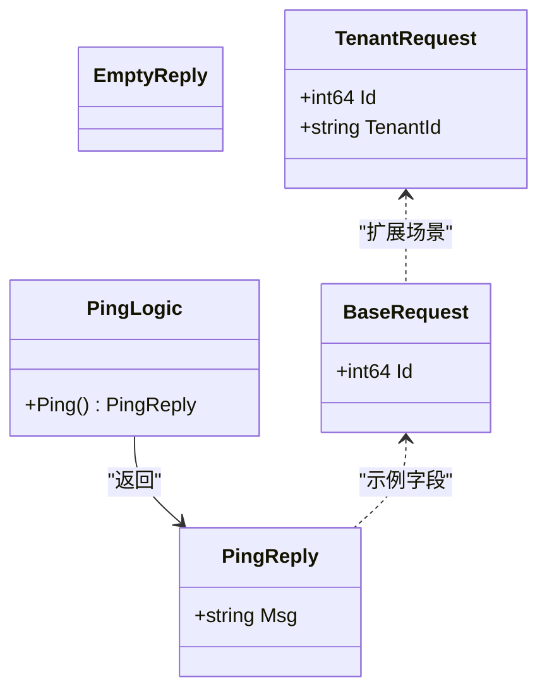
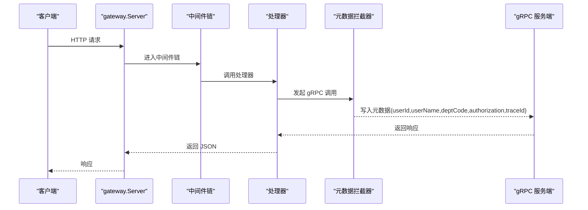
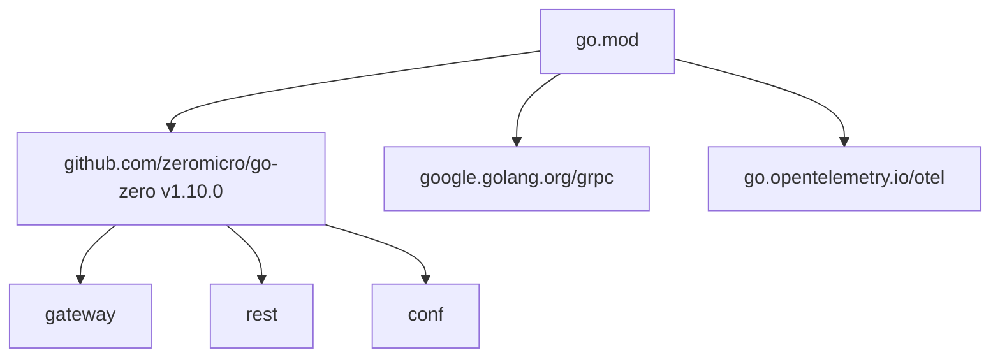

# HTTP 代理网关

<cite>
**本文引用的文件**
- [bridgegtw.go](file://app/bridgegtw/bridgegtw.go)
- [bridgegtw.yaml](file://app/bridgegtw/etc/bridgegtw.yaml)
- [config.go](file://app/bridgegtw/internal/config/config.go)
- [routes.go](file://app/bridgegtw/internal/handler/routes.go)
- [pinghandler.go](file://app/bridgegtw/internal/handler/bridgeGtw/pinghandler.go)
- [pinglogic.go](file://app/bridgegtw/internal/logic/bridgeGtw/pinglogic.go)
- [types.go](file://app/bridgegtw/internal/types/types.go)
- [servicecontext.go](file://app/bridgegtw/internal/svc/servicecontext.go)
- [Dockerfile](file://app/bridgegtw/Dockerfile)
- [gen.sh](file://app/bridgegtw/gen.sh)
- [metadataInterceptor.go](file://common/Interceptor/rpcclient/metadataInterceptor.go)
- [loggerInterceptor.go](file://common/Interceptor/rpcserver/loggerInterceptor.go)
- [go.mod](file://go.mod)
</cite>

## 目录
1. [简介](#简介)
2. [项目结构](#项目结构)
3. [核心组件](#核心组件)
4. [架构总览](#架构总览)
5. [详细组件分析](#详细组件分析)
6. [依赖分析](#依赖分析)
7. [性能考虑](#性能考虑)
8. [故障排查指南](#故障排查指南)
9. [结论](#结论)
10. [附录](#附录)

## 简介
本文件为 HTTP 代理网关模块 bridgegtw 的系统化架构文档。该模块基于 go-zero 的 gateway 能力，提供 HTTP/HTTPS 入口与 gRPC 上游服务之间的桥接能力。当前实现包含基础路由注册、gRPC 映射与简单健康探测接口，同时预留了中间件链扩展点与 TLS 终止等能力的接入空间。

## 项目结构
bridgegtw 模块采用 go-zero 标准分层：入口程序负责加载配置并启动网关；内部通过 handler 注册路由；逻辑层封装业务处理；svc 提供上下文；config 定义配置结构；etc 存放运行配置；Dockerfile 提供镜像构建脚本；gen.sh 用于 API 代码生成。

**图表来源**
- [bridgegtw.go:1-43](file://app/bridgegtw/bridgegtw.go#L1-L43)
- [config.go:1-8](file://app/bridgegtw/internal/config/config.go#L1-L8)
- [servicecontext.go:1-16](file://app/bridgegtw/internal/svc/servicecontext.go#L1-L16)
- [routes.go:1-28](file://app/bridgegtw/internal/handler/routes.go#L1-L28)
- [pinghandler.go:1-23](file://app/bridgegtw/internal/handler/bridgeGtw/pinghandler.go#L1-L23)
- [pinglogic.go:1-32](file://app/bridgegtw/internal/logic/bridgeGtw/pinglogic.go#L1-L32)
- [bridgegtw.yaml:1-40](file://app/bridgegtw/etc/bridgegtw.yaml#L1-L40)
- [Dockerfile:1-43](file://app/bridgegtw/Dockerfile#L1-L43)
- [gen.sh:1-5](file://app/bridgegtw/gen.sh#L1-L5)

**章节来源**
- [bridgegtw.go:1-43](file://app/bridgegtw/bridgegtw.go#L1-L43)
- [bridgegtw.yaml:1-40](file://app/bridgegtw/etc/bridgegtw.yaml#L1-L40)
- [config.go:1-8](file://app/bridgegtw/internal/config/config.go#L1-L8)
- [routes.go:1-28](file://app/bridgegtw/internal/handler/routes.go#L1-L28)
- [pinghandler.go:1-23](file://app/bridgegtw/internal/handler/bridgeGtw/pinghandler.go#L1-L23)
- [pinglogic.go:1-32](file://app/bridgegtw/internal/logic/bridgeGtw/pinglogic.go#L1-L32)
- [types.go:1-21](file://app/bridgegtw/internal/types/types.go#L1-L21)
- [servicecontext.go:1-16](file://app/bridgegtw/internal/svc/servicecontext.go#L1-L16)
- [Dockerfile:1-43](file://app/bridgegtw/Dockerfile#L1-L43)
- [gen.sh:1-5](file://app/bridgegtw/gen.sh#L1-L5)

## 核心组件
- 入口程序：解析命令行参数，加载配置，初始化网关服务器，注入中间件，注册处理器，启动服务。
- 配置模块：封装 gateway.GatewayConf，承载主机、端口、日志、超时、上游等配置。
- 服务上下文：向各处理器提供共享配置与运行时资源。
- 路由与处理器：在指定前缀下注册 HTTP 路由，并将请求交由对应逻辑层处理。
- 逻辑层：封装具体业务，如健康探测等。
- 类型定义：统一请求/响应模型，便于前后端契约一致。
- 中间件与拦截器：提供元数据透传、日志记录等横切能力，可扩展至鉴权、限流、熔断等。

**章节来源**
- [bridgegtw.go:19-42](file://app/bridgegtw/bridgegtw.go#L19-L42)
- [config.go:5-7](file://app/bridgegtw/internal/config/config.go#L5-L7)
- [servicecontext.go:7-15](file://app/bridgegtw/internal/svc/servicecontext.go#L7-L15)
- [routes.go:15-27](file://app/bridgegtw/internal/handler/routes.go#L15-L27)
- [pinghandler.go:12-22](file://app/bridgegtw/internal/handler/bridgeGtw/pinghandler.go#L12-L22)
- [pinglogic.go:27-31](file://app/bridgegtw/internal/logic/bridgeGtw/pinglogic.go#L27-L31)
- [types.go:6-20](file://app/bridgegtw/internal/types/types.go#L6-L20)

## 架构总览
bridgegtw 基于 go-zero gateway 启动 HTTP 服务，支持通过配置定义上游 gRPC 服务映射与路由规则。入口程序在启动时注入一个空中间件（占位），后续可扩展为认证、限流、CORS、日志等中间件链。路由注册在统一前缀下进行，处理器调用逻辑层完成业务处理，最终返回 JSON 响应。

**图表来源**
- [bridgegtw.go:28-38](file://app/bridgegtw/bridgegtw.go#L28-L38)
- [routes.go:15-27](file://app/bridgegtw/internal/handler/routes.go#L15-L27)
- [pinghandler.go:12-22](file://app/bridgegtw/internal/handler/bridgeGtw/pinghandler.go#L12-L22)
- [pinglogic.go:19-31](file://app/bridgegtw/internal/logic/bridgeGtw/pinglogic.go#L19-L31)
- [config.go:5-7](file://app/bridgegtw/internal/config/config.go#L5-L7)
- [servicecontext.go:7-15](file://app/bridgegtw/internal/svc/servicecontext.go#L7-L15)

## 详细组件分析

### 入口程序与生命周期
- 命令行参数解析：默认读取 etc/bridgegtw.yaml。
- 配置加载：使用 conf.MustLoad 加载 YAML 并填充 Config。
- 网关初始化：gateway.MustNewServer 创建服务器实例，并注入中间件。
- 上下文创建：svc.NewServiceContext 提供服务上下文。
- 路由注册：handler.RegisterHandlers 将路由挂载到 rest.Server。
- 启动服务：server.Start 开始监听。

**图表来源**
- [bridgegtw.go:17-42](file://app/bridgegtw/bridgegtw.go#L17-L42)

**章节来源**
- [bridgegtw.go:19-42](file://app/bridgegtw/bridgegtw.go#L19-L42)

### 配置与上游映射
- 运行配置包含名称、主机、端口、日志、超时、上游列表等。
- Upstreams 支持 gRPC 类型，包含 Endpoints、非阻塞选项、ProtoSets 以及 Mappings。
- Mappings 定义 HTTP 方法、路径与 gRPC 方法的映射关系。

**图表来源**
- [bridgegtw.yaml:1-40](file://app/bridgegtw/etc/bridgegtw.yaml#L1-L40)

**章节来源**
- [bridgegtw.yaml:1-40](file://app/bridgegtw/etc/bridgegtw.yaml#L1-L40)
- [config.go:5-7](file://app/bridgegtw/internal/config/config.go#L5-L7)

### 路由与处理器
- 路由注册在统一前缀下，当前包含 /ping。
- 处理器将请求交给逻辑层执行，错误通过 httpx.ErrorCtx 返回，成功通过 httpx.OkJsonCtx 返回。

**图表来源**
- [routes.go:15-27](file://app/bridgegtw/internal/handler/routes.go#L15-L27)
- [pinghandler.go:12-22](file://app/bridgegtw/internal/handler/bridgeGtw/pinghandler.go#L12-L22)
- [pinglogic.go:27-31](file://app/bridgegtw/internal/logic/bridgeGtw/pinglogic.go#L27-L31)

**章节来源**
- [routes.go:15-27](file://app/bridgegtw/internal/handler/routes.go#L15-L27)
- [pinghandler.go:12-22](file://app/bridgegtw/internal/handler/bridgeGtw/pinghandler.go#L12-L22)
- [pinglogic.go:19-31](file://app/bridgegtw/internal/logic/bridgeGtw/pinglogic.go#L19-L31)

### 逻辑层与类型模型
- PingLogic 封装业务逻辑，返回 PingReply。
- 类型模型定义基础请求、空回复、Ping 回复与租户请求等。

**图表来源**
- [pinglogic.go:12-31](file://app/bridgegtw/internal/logic/bridgeGtw/pinglogic.go#L12-L31)
- [types.go:6-20](file://app/bridgegtw/internal/types/types.go#L6-L20)

**章节来源**
- [pinglogic.go:12-31](file://app/bridgegtw/internal/logic/bridgeGtw/pinglogic.go#L12-L31)
- [types.go:6-20](file://app/bridgegtw/internal/types/types.go#L6-L20)

### 中间件链与拦截器
- 空中间件：入口程序已预留中间件注入点，当前为空实现，便于后续扩展。
- gRPC 元数据拦截器：客户端侧将用户标识、授权信息、追踪 ID 等写入 gRPC 元数据；服务端侧从元数据恢复到上下文，便于日志与审计。
- CORS 与安全：可通过中间件链添加跨域、鉴权、限流、熔断等能力。

**图表来源**
- [bridgegtw.go:28-35](file://app/bridgegtw/bridgegtw.go#L28-L35)
- [metadataInterceptor.go:11-32](file://common/Interceptor/rpcclient/metadataInterceptor.go#L11-L32)
- [loggerInterceptor.go:12-44](file://common/Interceptor/rpcserver/loggerInterceptor.go#L12-L44)

**章节来源**
- [bridgegtw.go:28-35](file://app/bridgegtw/bridgegtw.go#L28-L35)
- [metadataInterceptor.go:11-32](file://common/Interceptor/rpcclient/metadataInterceptor.go#L11-L32)
- [loggerInterceptor.go:12-44](file://common/Interceptor/rpcserver/loggerInterceptor.go#L12-L44)

## 依赖分析
- go-zero 版本：1.10.0，提供 gateway、rest、conf 等核心能力。
- 依赖范围：bridgegtw 模块直接依赖 go-zero 的 gateway 与 rest，间接依赖日志、网络、序列化等生态库。
- gRPC 生态：通过元数据拦截器与 go-zero 的 RPC 能力配合，实现跨语言/跨进程通信。

**图表来源**
- [go.mod:50-58](file://go.mod#L50-L58)

**章节来源**
- [go.mod:50-58](file://go.mod#L50-L58)

## 性能考虑
- 非阻塞上游：配置中提供 NonBlock 选项，可在上游不可用时避免阻塞请求。
- 超时控制：通过 GatewayConf.Timeout 控制整体超时，建议结合上游端超时策略统一配置。
- 中间件链顺序：将轻量、快速的中间件置于前部，重 IO 或重计算的中间件靠后。
- 日志级别与编码：合理设置日志级别与编码，避免在高并发下产生过多 I/O。
- 连接池与并发：利用 go-zero 的连接池与并发模型，避免在业务逻辑中重复创建连接。
- 缓存策略：对静态或低频变更的数据使用缓存，减少上游压力；注意缓存失效与一致性。

## 故障排查指南
- 无法启动或端口占用：检查 Host/Port 配置与系统端口占用情况。
- 路由不生效：确认路由前缀与方法、路径是否匹配，处理器函数是否正确注册。
- gRPC 调用失败：检查 Endpoints 是否可达，ProtoSets 是否存在且正确，RpcPath 是否与服务定义一致。
- 认证/鉴权问题：确认中间件链是否正确注入，元数据拦截器是否正确传递 userId、authorization、traceId 等。
- 日志定位：通过日志级别与路径定位错误，关注 httpx 错误返回与逻辑层异常。

**章节来源**
- [bridgegtw.yaml:12-40](file://app/bridgegtw/etc/bridgegtw.yaml#L12-L40)
- [routes.go:15-27](file://app/bridgegtw/internal/handler/routes.go#L15-L27)
- [metadataInterceptor.go:11-32](file://common/Interceptor/rpcclient/metadataInterceptor.go#L11-L32)
- [loggerInterceptor.go:12-44](file://common/Interceptor/rpcserver/loggerInterceptor.go#L12-L44)

## 结论
bridgegtw 当前实现了基于 go-zero gateway 的 HTTP 入口与 gRPC 上游映射能力，具备清晰的分层结构与可扩展的中间件链。建议在现有基础上完善 TLS 终止、健康检查、负载均衡与故障转移、安全策略与监控指标，以满足生产级 API 网关需求。

## 附录

### 配置示例与说明
- 基本配置项：名称、主机、端口、日志、超时。
- 上游配置：gRPC 类型，包含 Endpoints、NonBlock、ProtoSets、Mappings。
- 路由映射：Method、Path、RpcPath 对应 HTTP 到 gRPC 的映射。

**章节来源**
- [bridgegtw.yaml:1-40](file://app/bridgegtw/etc/bridgegtw.yaml#L1-L40)

### 代码生成与构建
- 使用 gen.sh 生成 API 对应的 Go 代码。
- Dockerfile 支持多阶段构建与最小镜像发布，包含时区与证书配置。

**章节来源**
- [gen.sh:1-5](file://app/bridgegtw/gen.sh#L1-L5)
- [Dockerfile:1-43](file://app/bridgegtw/Dockerfile#L1-L43)