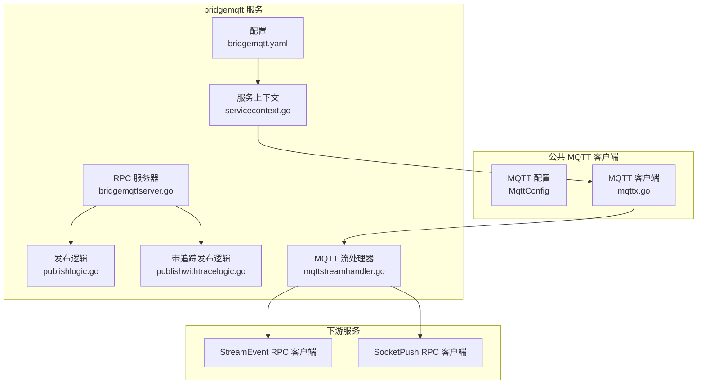
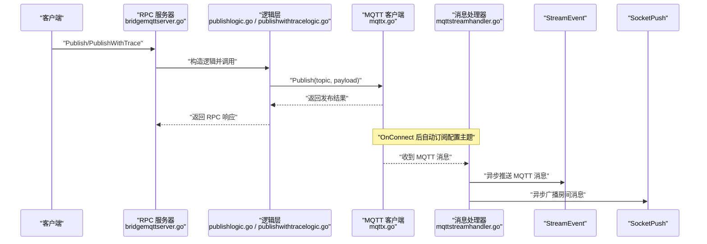
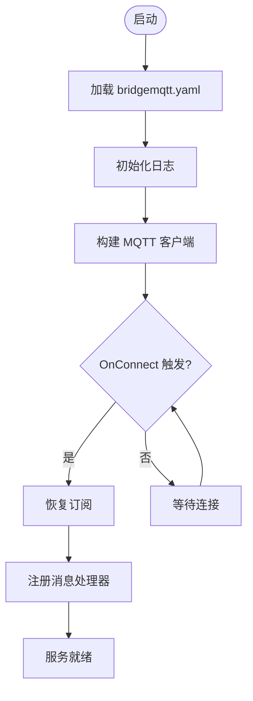
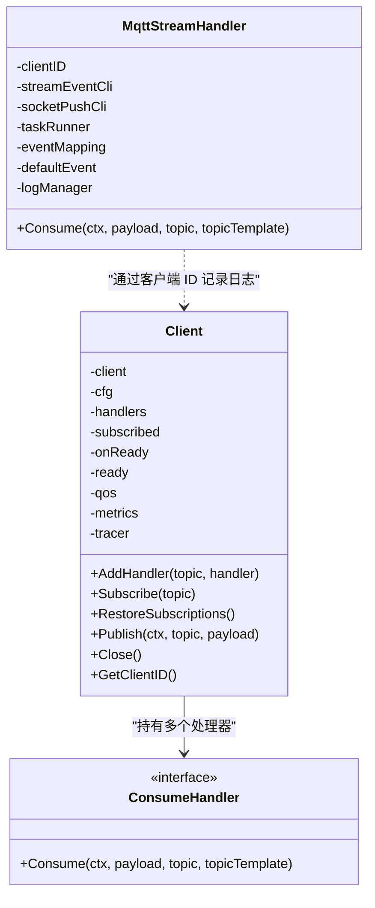
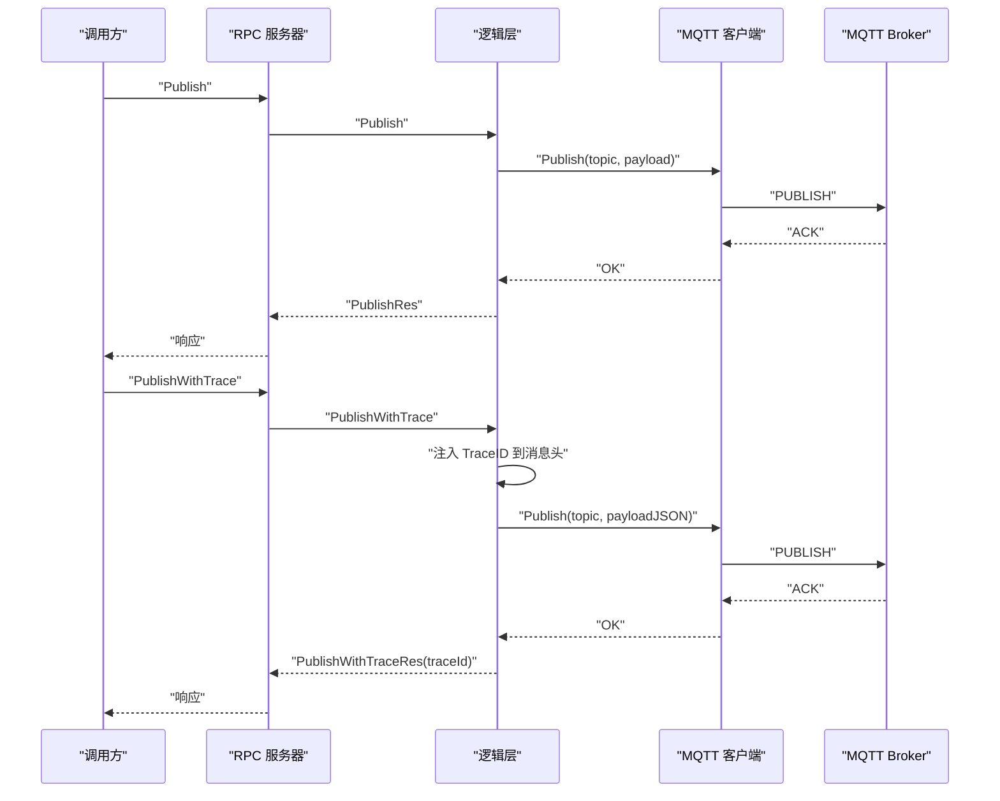
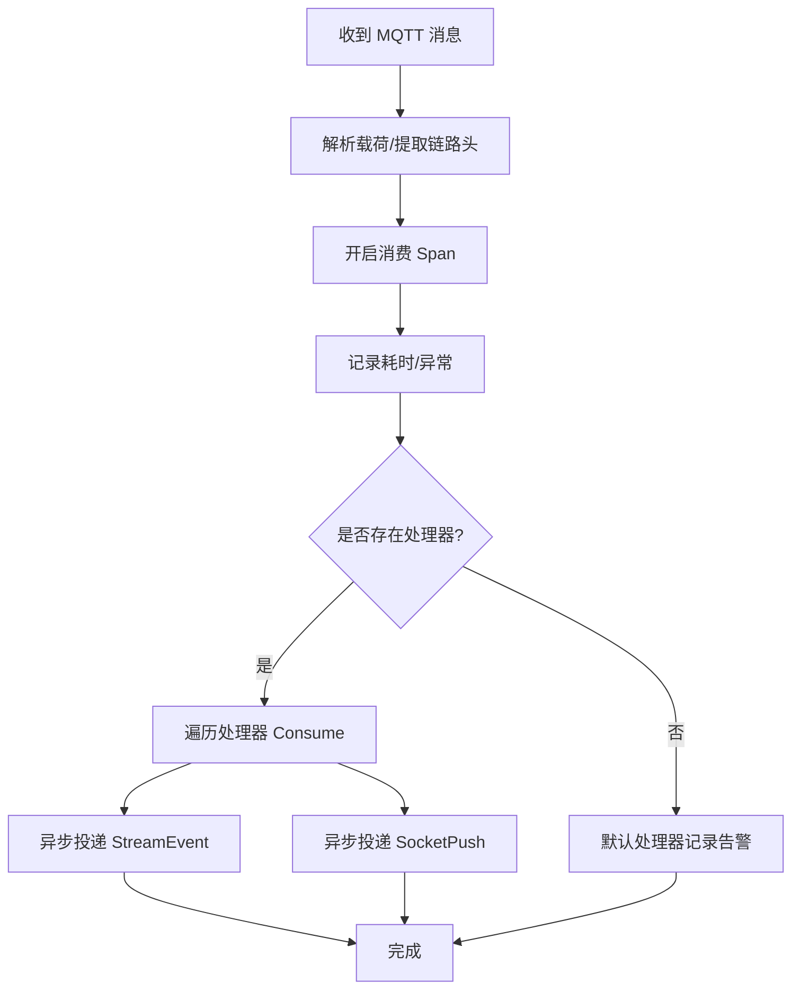
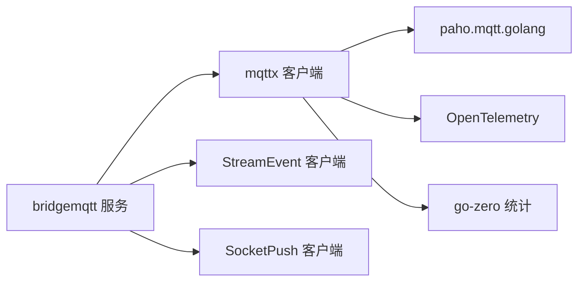

# MQTT 协议处理

<cite>
**本文引用的文件**
- [bridgemqtt.proto](file://app/bridgemqtt/bridgemqtt.proto)
- [bridgemqtt.yaml](file://app/bridgemqtt/etc/bridgemqtt.yaml)
- [config.go](file://app/bridgemqtt/internal/config/config.go)
- [servicecontext.go](file://app/bridgemqtt/internal/svc/servicecontext.go)
- [bridgemqttserver.go](file://app/bridgemqtt/internal/server/bridgemqttserver.go)
- [publishlogic.go](file://app/bridgemqtt/internal/logic/publishlogic.go)
- [publishwithtracelogic.go](file://app/bridgemqtt/internal/logic/publishwithtracelogic.go)
- [pinglogic.go](file://app/bridgemqtt/internal/logic/pinglogic.go)
- [mqttx.go](file://common/mqttx/mqttx.go)
- [message.go](file://common/mqttx/message.go)
- [trace.go](file://common/mqttx/trace.go)
- [mqttstreamhandler.go](file://app/bridgemqtt/internal/handler/mqttstreamhandler.go)
- [streamevent.proto](file://facade/streamevent/streamevent.proto)
- [receivemqttmessagelogic.go](file://facade/streamevent/internal/logic/receivemqttmessagelogic.go)
</cite>

## 目录
1. [简介](#简介)
2. [项目结构](#项目结构)
3. [核心组件](#核心组件)
4. [架构总览](#架构总览)
5. [详细组件分析](#详细组件分析)
6. [依赖分析](#依赖分析)
7. [性能考量](#性能考量)
8. [故障排查指南](#故障排查指南)
9. [结论](#结论)
10. [附录](#附录)

## 简介
本文件面向 MQTT 协议处理模块，系统性梳理 bridgemqtt 服务的设计与实现，覆盖协议版本支持、主题管理、消息路由、发布订阅流程、QoS 等级、会话与连接生命周期、心跳与断线重连、消息追踪与链路透传、性能监控与日志、以及与下游 StreamEvent 和 SocketPush 的集成。文档同时给出关键流程图与时序图，帮助读者快速理解并落地实践。

## 项目结构
bridgemqtt 服务采用 go-zero RPC 架构，结合 common/mqttx 提供的 MQTT 客户端能力，实现从 MQTT 主题接收消息并转发到内部 StreamEvent 与 SocketPush 的桥接功能；同时提供 RPC 接口用于外部主动发布消息。

图表来源
- [bridgemqtt.yaml:1-48](file://app/bridgemqtt/etc/bridgemqtt.yaml#L1-L48)
- [servicecontext.go:16-60](file://app/bridgemqtt/internal/svc/servicecontext.go#L16-L60)
- [bridgemqttserver.go:15-42](file://app/bridgemqtt/internal/server/bridgemqttserver.go#L15-L42)
- [publishlogic.go:26-33](file://app/bridgemqtt/internal/logic/publishlogic.go#L26-L33)
- [publishwithtracelogic.go:30-47](file://app/bridgemqtt/internal/logic/publishwithtracelogic.go#L30-L47)
- [mqttx.go:51-64](file://common/mqttx/mqttx.go#L51-L64)
- [mqttstreamhandler.go:99-119](file://app/bridgemqtt/internal/handler/mqttstreamhandler.go#L99-L119)

章节来源
- [bridgemqtt.yaml:1-48](file://app/bridgemqtt/etc/bridgemqtt.yaml#L1-L48)
- [config.go:9-23](file://app/bridgemqtt/internal/config/config.go#L9-L23)
- [servicecontext.go:21-60](file://app/bridgemqtt/internal/svc/servicecontext.go#L21-L60)
- [bridgemqttserver.go:20-42](file://app/bridgemqtt/internal/server/bridgemqttserver.go#L20-L42)

## 核心组件
- 配置层：集中管理 RPC 监听、日志、Nacos 注册、MQTT 连接参数、订阅主题、事件映射、以及下游 StreamEvent 与 SocketPush 的 RPC 客户端配置。
- 服务上下文：负责初始化日志、构建 MQTT 客户端、注册 OnReady 回调（在首次连接成功后自动订阅配置的主题），并将 StreamEvent 与 SocketPush 客户端注入。
- RPC 服务器：暴露 Ping/Publish/PublishWithTrace 三个接口，分别用于健康检查、发布消息、以及带链路追踪的消息发布。
- 业务逻辑：封装 RPC 请求到具体操作，调用 MQTT 客户端进行发布或通过消息处理器转发到下游。
- MQTT 客户端：基于 paho.mqtt.golang 实现，支持自动重连、心跳、QoS、订阅恢复、OpenTelemetry 追踪埋点、指标统计。
- 消息处理器：将收到的 MQTT 消息异步投递到 StreamEvent 与 SocketPush，支持事件名映射、日志去抖与负载控制。

章节来源
- [config.go:9-23](file://app/bridgemqtt/internal/config/config.go#L9-L23)
- [servicecontext.go:21-60](file://app/bridgemqtt/internal/svc/servicecontext.go#L21-L60)
- [bridgemqttserver.go:26-41](file://app/bridgemqtt/internal/server/bridgemqttserver.go#L26-L41)
- [publishlogic.go:26-33](file://app/bridgemqtt/internal/logic/publishlogic.go#L26-L33)
- [publishwithtracelogic.go:30-47](file://app/bridgemqtt/internal/logic/publishwithtracelogic.go#L30-L47)
- [mqttx.go:76-87](file://common/mqttx/mqttx.go#L76-L87)
- [mqttstreamhandler.go:99-119](file://app/bridgemqtt/internal/handler/mqttstreamhandler.go#L99-L119)

## 架构总览
bridgemqtt 的整体架构围绕“MQTT 消息接收—事件映射—异步转发—可观测性”的闭环展开。MQTT 客户端在 OnConnect 时恢复订阅，消息到达后由处理器并发调度，分别向 StreamEvent 与 SocketPush 发送消息，同时记录 OpenTelemetry 跨进程传播上下文与指标。

图表来源
- [bridgemqttserver.go:31-41](file://app/bridgemqtt/internal/server/bridgemqttserver.go#L31-L41)
- [publishlogic.go:26-33](file://app/bridgemqtt/internal/logic/publishlogic.go#L26-L33)
- [publishwithtracelogic.go:30-47](file://app/bridgemqtt/internal/logic/publishwithtracelogic.go#L30-L47)
- [mqttx.go:148-177](file://common/mqttx/mqttx.go#L148-L177)
- [mqttstreamhandler.go:130-188](file://app/bridgemqtt/internal/handler/mqttstreamhandler.go#L130-L188)

## 详细组件分析

### 配置与启动流程
- 配置项要点：监听地址、日志路径与级别、Nacos 注册开关、MQTT Broker 地址、用户名密码、QoS、初始订阅主题、事件映射、StreamEvent 与 SocketPush 的 RPC 客户端目标与超时。
- 服务上下文初始化：设置日志、构建 MQTT 客户端并在 OnReady 中注册处理器，随后为每个订阅主题绑定消息处理器。
- RPC 服务器：将 Ping/Publish/PublishWithTrace 映射到各自逻辑层。

图表来源
- [bridgemqtt.yaml:1-48](file://app/bridgemqtt/etc/bridgemqtt.yaml#L1-L48)
- [servicecontext.go:21-60](file://app/bridgemqtt/internal/svc/servicecontext.go#L21-L60)
- [mqttx.go:148-177](file://common/mqttx/mqttx.go#L148-L177)

章节来源
- [bridgemqtt.yaml:19-48](file://app/bridgemqtt/etc/bridgemqtt.yaml#L19-L48)
- [servicecontext.go:21-60](file://app/bridgemqtt/internal/svc/servicecontext.go#L21-L60)
- [bridgemqttserver.go:20-42](file://app/bridgemqtt/internal/server/bridgemqttserver.go#L20-L42)

### MQTT 客户端与消息处理
- 客户端能力：自动重连、心跳、超时控制、QoS 校验与默认值、订阅恢复、OpenTelemetry 追踪、指标统计。
- 主题管理：AddHandler/Subscribe/RestoreSubscriptions，支持 AutoSubscribe 与手动订阅。
- 消息处理：messageHandlerWrapper 将消息解包、提取链路头、开启消费 Span、并发调用处理器列表、异常与耗时统计。
- 发布流程：Publish 包装生产 Span 并等待令牌完成或错误。

图表来源
- [mqttx.go:76-87](file://common/mqttx/mqttx.go#L76-L87)
- [mqttx.go:180-333](file://common/mqttx/mqttx.go#L180-L333)
- [mqttstreamhandler.go:99-119](file://app/bridgemqtt/internal/handler/mqttstreamhandler.go#L99-L119)

章节来源
- [mqttx.go:51-64](file://common/mqttx/mqttx.go#L51-L64)
- [mqttx.go:180-333](file://common/mqttx/mqttx.go#L180-L333)
- [mqttstreamhandler.go:130-188](file://app/bridgemqtt/internal/handler/mqttstreamhandler.go#L130-L188)

### 消息发布与带追踪发布
- Publish：直接调用 MQTT 客户端发布，返回空响应。
- PublishWithTrace：将当前上下文的 TraceID 注入消息头，序列化为 JSON 后发布，下游可据此进行链路追踪。

图表来源
- [bridgemqttserver.go:31-41](file://app/bridgemqtt/internal/server/bridgemqttserver.go#L31-L41)
- [publishlogic.go:26-33](file://app/bridgemqtt/internal/logic/publishlogic.go#L26-L33)
- [publishwithtracelogic.go:30-47](file://app/bridgemqtt/internal/logic/publishwithtracelogic.go#L30-L47)
- [mqttx.go:309-333](file://common/mqttx/mqttx.go#L309-L333)
- [trace.go:16-22](file://common/mqttx/trace.go#L16-L22)

章节来源
- [publishlogic.go:26-33](file://app/bridgemqtt/internal/logic/publishlogic.go#L26-L33)
- [publishwithtracelogic.go:30-47](file://app/bridgemqtt/internal/logic/publishwithtracelogic.go#L30-L47)

### 消息接收与路由
- OnConnect 成功后恢复订阅，消息到达后进入 messageHandlerWrapper。
- 解析消息载荷，若为包装消息则提取原始 payload 并注入链路上下文。
- 开启消费 Span，记录耗时与异常，随后遍历该主题的所有处理器。
- 若无处理器，则触发默认处理器记录告警。
- 异步投递到 StreamEvent 与 SocketPush，支持事件名映射与日志去抖。

图表来源
- [mqttx.go:257-307](file://common/mqttx/mqttx.go#L257-L307)
- [mqttstreamhandler.go:130-188](file://app/bridgemqtt/internal/handler/mqttstreamhandler.go#L130-L188)

章节来源
- [mqttx.go:257-307](file://common/mqttx/mqttx.go#L257-L307)
- [mqttstreamhandler.go:121-188](file://app/bridgemqtt/internal/handler/mqttstreamhandler.go#L121-L188)

### 配置与协议定义
- bridgemqtt.proto：定义 Ping/Publish/PublishWithTrace 三个 RPC 方法，以及通用请求/响应结构。
- bridgemqtt.yaml：定义服务监听、日志、Nacos、MQTT 连接参数、订阅主题、事件映射、下游 RPC 客户端等。
- streamevent.proto：定义接收 MQTT 消息的 RPC 接口与消息结构，便于统一承载多源事件。

章节来源
- [bridgemqtt.proto:10-16](file://app/bridgemqtt/bridgemqtt.proto#L10-L16)
- [bridgemqtt.yaml:19-48](file://app/bridgemqtt/etc/bridgemqtt.yaml#L19-L48)
- [streamevent.proto:10-25](file://facade/streamevent/streamevent.proto#L10-L25)

## 依赖分析
- bridgemqtt 服务依赖 common/mqttx 提供的 MQTT 客户端能力，包括配置、连接、订阅、发布、追踪与指标。
- 服务上下文在 OnReady 中注册消息处理器，处理器依赖 StreamEvent 与 SocketPush 的 RPC 客户端。
- 业务逻辑层仅依赖 ServiceContext 与 MQTT 客户端，保持低耦合。

图表来源
- [servicecontext.go:47-55](file://app/bridgemqtt/internal/svc/servicecontext.go#L47-L55)
- [mqttx.go:13-23](file://common/mqttx/mqttx.go#L13-L23)

章节来源
- [servicecontext.go:23-55](file://app/bridgemqtt/internal/svc/servicecontext.go#L23-L55)
- [mqttx.go:13-23](file://common/mqttx/mqttx.go#L13-L23)

## 性能考量
- 并发与限流：消息处理器使用 TaskRunner 并发投递，避免阻塞 MQTT 回调线程；可通过配置调整并发度。
- 日志去抖：TopicLogManager 对高频主题进行最小日志间隔控制，降低日志风暴。
- 超时与重连：MQTT 客户端设置 ConnectTimeout、KeepAlive、AutoReconnect；OnConnectionLost 清空订阅缓存，OnConnect 后恢复订阅。
- 指标与追踪：客户端内置指标统计与 OpenTelemetry 生产/消费 Span，便于定位慢调用与错误。
- RPC 调用限制：服务上下文中对下游 RPC 客户端设置了最大消息大小，避免超大消息导致调用失败。

章节来源
- [mqttstreamhandler.go:109-119](file://app/bridgemqtt/internal/handler/mqttstreamhandler.go#L109-L119)
- [mqttstreamhandler.go:19-97](file://app/bridgemqtt/internal/handler/mqttstreamhandler.go#L19-L97)
- [mqttx.go:148-177](file://common/mqttx/mqttx.go#L148-L177)
- [mqttx.go:361-388](file://common/mqttx/mqttx.go#L361-L388)
- [servicecontext.go:29-44](file://app/bridgemqtt/internal/svc/servicecontext.go#L29-L44)

## 故障排查指南
- 连接失败/超时
  - 检查 MQTT Broker 地址、用户名密码是否正确；确认 ConnectTimeout 与 KeepAlive 配置合理。
  - 查看 OnConnect/OnConnectionLost 回调日志，确认是否触发重连与订阅恢复。
- 订阅未生效
  - 确认 AutoSubscribe 与 SubscribeTopics 配置；检查 RestoreSubscriptions 是否成功。
- 无处理器告警
  - 当消息到达但未注册处理器时，默认处理器会记录告警；请为相应主题添加处理器。
- 发布失败
  - 检查客户端是否已连接；查看 Publish 的超时与错误日志；确认 QoS 与 Broker 支持情况。
- 追踪丢失
  - 使用 PublishWithTrace 接口确保链路头注入；检查下游是否正确提取 TextMapCarrier。
- 下游调用异常
  - 检查 StreamEvent/SocketPush 的 RPC 客户端配置与网络连通性；关注最大消息大小限制。

章节来源
- [mqttx.go:148-177](file://common/mqttx/mqttx.go#L148-L177)
- [mqttx.go:235-255](file://common/mqttx/mqttx.go#L235-L255)
- [mqttx.go:293-305](file://common/mqttx/mqttx.go#L293-L305)
- [mqttx.go:309-333](file://common/mqttx/mqttx.go#L309-L333)
- [publishwithtracelogic.go:30-47](file://app/bridgemqtt/internal/logic/publishwithtracelogic.go#L30-L47)
- [servicecontext.go:29-44](file://app/bridgemqtt/internal/svc/servicecontext.go#L29-L44)

## 结论
bridgemqtt 服务通过 go-zero 与 common/mqttx 的组合，实现了高可用的 MQTT 桥接能力：自动重连与订阅恢复、灵活的主题处理器、异步投递到下游、完善的可观测性与性能保障。配合事件映射与链路追踪，能够满足工业物联网场景下的消息汇聚与实时推送需求。

## 附录

### 协议版本与特性支持
- 协议版本：基于 paho.mqtt.golang，默认使用 MQTT 3.1.1；未显式指定版本号，遵循客户端默认行为。
- QoS 支持：支持 0/1/2，客户端会对非法 QoS 进行校正与日志提示。
- 会话与持久化：未见持久化会话相关配置；默认使用非持久会话。
- 心跳与断线重连：启用 AutoReconnect，设置 KeepAlive 与 ConnectTimeout；OnConnectionLost 清空订阅缓存并在 OnConnect 后恢复。

章节来源
- [mqttx.go:132-146](file://common/mqttx/mqttx.go#L132-L146)
- [mqttx.go:148-177](file://common/mqttx/mqttx.go#L148-L177)
- [bridgemqtt.yaml:25-25](file://app/bridgemqtt/etc/bridgemqtt.yaml#L25-L25)

### 消息追踪与链路透传
- 在 PublishWithTrace 中，将当前 TraceID 注入消息头并通过 TextMapCarrier 传递。
- MQTT 消费侧在 messageHandlerWrapper 中提取链路头，确保跨进程链路连续。
- 客户端内置生产/消费 Span，便于在分布式追踪系统中定位问题。

章节来源
- [publishwithtracelogic.go:30-47](file://app/bridgemqtt/internal/logic/publishwithtracelogic.go#L30-L47)
- [trace.go:16-30](file://common/mqttx/trace.go#L16-L30)
- [mqttx.go:257-307](file://common/mqttx/mqttx.go#L257-L307)
- [mqttx.go:361-388](file://common/mqttx/mqttx.go#L361-L388)

### 安全认证与配置建议
- 认证：通过 Username/Password 配置认证；Broker 地址可使用 TLS 前缀（需在 Broker 端配置）。
- 权限：建议为不同业务主题设置独立账号与权限，避免越权访问。
- 密钥管理：建议使用环境变量或密钥管理服务注入用户名密码，避免明文写入配置文件。

章节来源
- [bridgemqtt.yaml:23-24](file://app/bridgemqtt/etc/bridgemqtt.yaml#L23-L24)
- [mqttx.go:137-146](file://common/mqttx/mqttx.go#L137-L146)

### 集群部署与扩展
- 服务实例：通过 Nacos 注册与发现（可选）；每个实例独立维护 MQTT 连接与订阅。
- 负载均衡：建议在上游做主题级路由或使用共享 Broker，避免重复消费。
- 指标与日志：利用客户端内置指标与 OpenTelemetry，集中收集与可视化。

章节来源
- [bridgemqtt.yaml:11-18](file://app/bridgemqtt/etc/bridgemqtt.yaml#L11-L18)
- [mqttx.go:124-126](file://common/mqttx/mqttx.go#L124-L126)
- [mqttx.go:361-388](file://common/mqttx/mqttx.go#L361-L388)