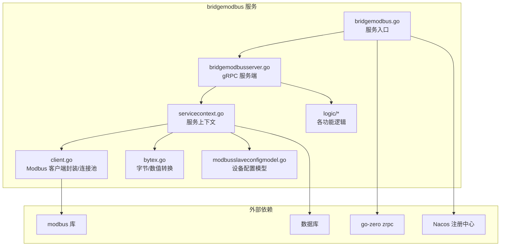
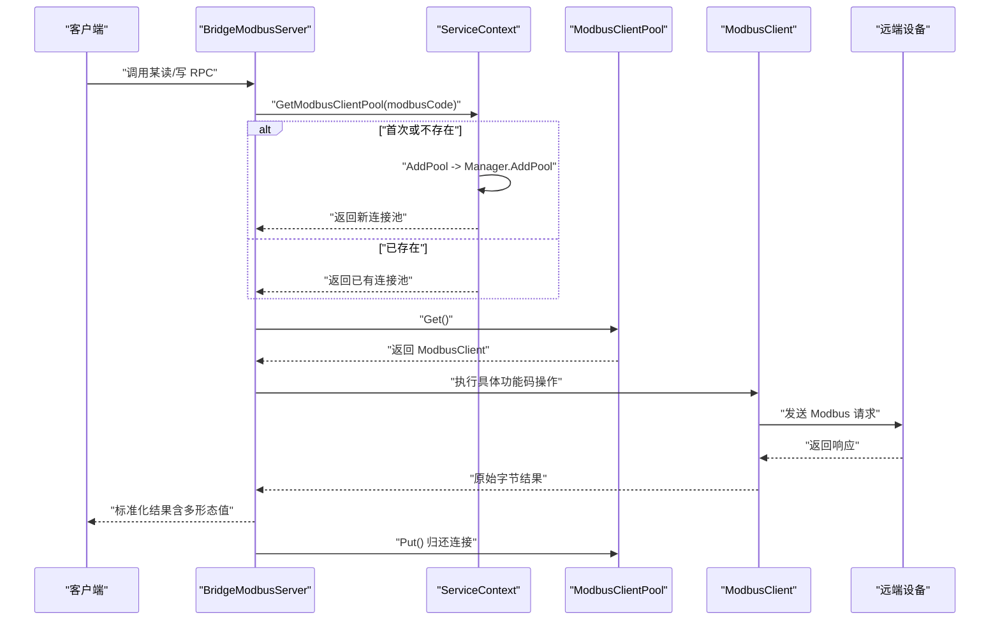
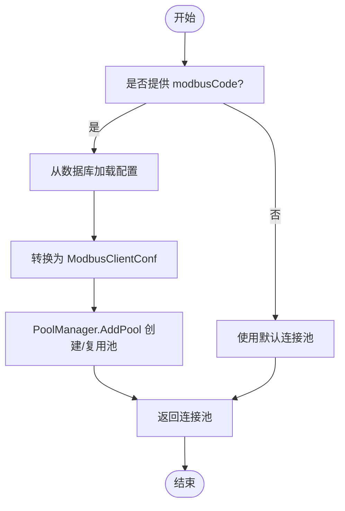
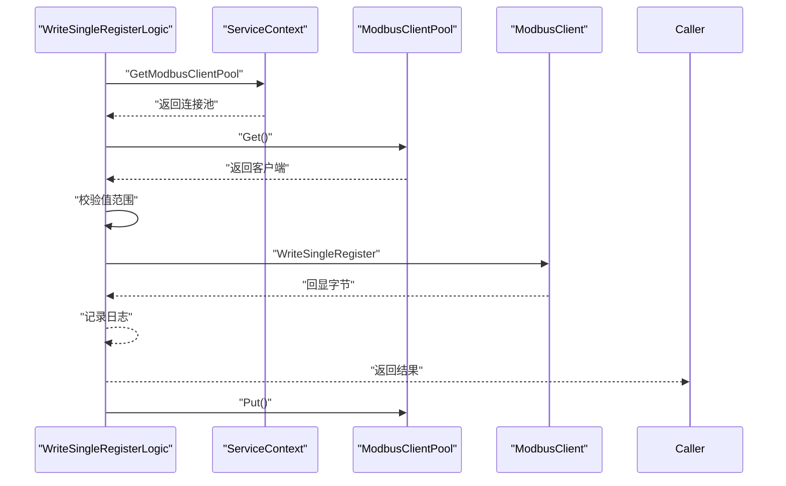
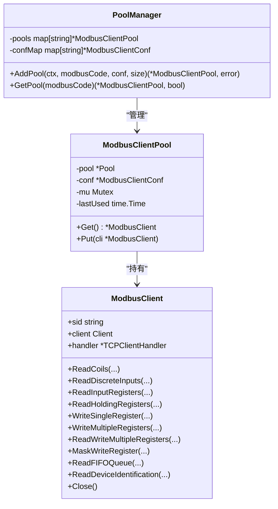
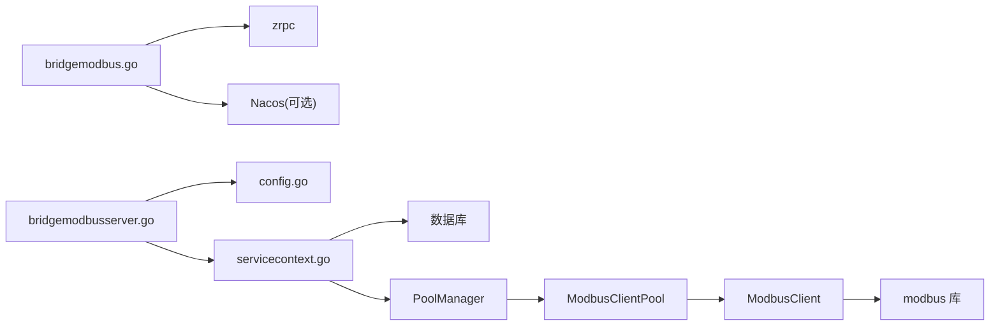

# Modbus 协议处理

<cite>
**本文引用的文件**
- [bridgemodbus.proto](file://app/bridgemodbus/bridgemodbus.proto)
- [bridgemodbus.yaml](file://app/bridgemodbus/etc/bridgemodbus.yaml)
- [config.go](file://app/bridgemodbus/internal/config/config.go)
- [client.go](file://common/modbusx/client.go)
- [config.go](file://common/modbusx/config.go)
- [bytex.go](file://common/bytex/bytex.go)
- [servicecontext.go](file://app/bridgemodbus/internal/svc/servicecontext.go)
- [bridgemodbusserver.go](file://app/bridgemodbus/internal/server/bridgemodbusserver.go)
- [readcoilslogic.go](file://app/bridgemodbus/internal/logic/readcoilslogic.go)
- [readholdingregisterslogic.go](file://app/bridgemodbus/internal/logic/readholdingregisterslogic.go)
- [writesingleregisterlogic.go](file://app/bridgemodbus/internal/logic/writesingleregisterlogic.go)
- [saveconfiglogic.go](file://app/bridgemodbus/internal/logic/saveconfiglogic.go)
- [modbusslaveconfigmodel.go](file://model/modbusslaveconfigmodel.go)
- [bridgemodbus.go](file://app/bridgemodbus/bridgemodbus.go)
</cite>

## 目录
1. [简介](#简介)
2. [项目结构](#项目结构)
3. [核心组件](#核心组件)
4. [架构总览](#架构总览)
5. [详细组件分析](#详细组件分析)
6. [依赖关系分析](#依赖关系分析)
7. [性能考量](#性能考量)
8. [故障排查指南](#故障排查指南)
9. [结论](#结论)
10. [附录](#附录)

## 简介
本技术文档围绕 bridgemodbus 服务展开，系统性阐述其基于 go-zero 的 gRPC 服务架构、Modbus RTU/TCP 协议支持现状、设备配置管理、寄存器读写与批量数据处理、错误处理与超时/重连策略、以及性能优化与安全配置建议。文档同时给出面向开发者的调用流程图与类图，帮助快速理解与落地。

## 项目结构
bridgemodbus 服务位于 app/bridgemodbus 目录，采用典型的 go-zero 微服务分层：
- 接口定义：bridgemodbus.proto
- 配置：etc/bridgemodbus.yaml
- 服务入口：bridgemodbus.go
- 服务上下文：internal/svc/servicecontext.go
- gRPC 服务端：internal/server/bridgemodbusserver.go
- 业务逻辑：internal/logic 下各功能逻辑文件
- Modbus 客户端封装与连接池：common/modbusx
- 数据类型转换工具：common/bytex
- 设备配置模型：model/modbusslaveconfigmodel.go

图表来源
- [bridgemodbus.go:27-70](file://app/bridgemodbus/bridgemodbus.go#L27-L70)
- [bridgemodbusserver.go:15-151](file://app/bridgemodbus/internal/server/bridgemodbusserver.go#L15-L151)
- [servicecontext.go:14-81](file://app/bridgemodbus/internal/svc/servicecontext.go#L14-L81)
- [client.go:107-143](file://common/modbusx/client.go#L107-L143)
- [bytex.go:1-239](file://common/bytex/bytex.go#L1-L239)
- [modbusslaveconfigmodel.go:1-32](file://model/modbusslaveconfigmodel.go#L1-L32)

章节来源
- [bridgemodbus.go:1-71](file://app/bridgemodbus/bridgemodbus.go#L1-L71)
- [bridgemodbusserver.go:1-151](file://app/bridgemodbus/internal/server/bridgemodbusserver.go#L1-L151)
- [servicecontext.go:1-81](file://app/bridgemodbus/internal/svc/servicecontext.go#L1-L81)

## 核心组件
- gRPC 服务接口：通过 bridgemodbus.proto 定义，覆盖配置管理、线圈/离散输入、保持/输入寄存器、读写多寄存器、屏蔽写、FIFO 队列、设备标识、十进制转寄存器等完整 Modbus 功能集。
- 服务上下文：负责数据库连接、Modbus 配置模型、默认连接池与动态连接池管理器的初始化。
- Modbus 客户端封装：对底层 modbus.Client 进行薄封装，暴露统一方法，并提供连接池与 TLS 支持。
- 数据类型转换：bytex 提供字节与 16 位整数、二进制/十六进制字符串之间的双向转换，支撑读写结果的多形态输出。
- 业务逻辑：每个 RPC 方法对应一个 logic 文件，负责参数校验、连接池获取、调用底层客户端并返回标准化结果。

章节来源
- [bridgemodbus.proto:10-83](file://app/bridgemodbus/bridgemodbus.proto#L10-L83)
- [servicecontext.go:14-81](file://app/bridgemodbus/internal/svc/servicecontext.go#L14-L81)
- [client.go:20-97](file://common/modbusx/client.go#L20-L97)
- [bytex.go:7-239](file://common/bytex/bytex.go#L7-L239)

## 架构总览
bridgemodbus 以 go-zero 为基础，提供 gRPC 服务，内部通过服务上下文统一管理 Modbus 连接池与设备配置。客户端通过 modbusx.ModbusClientPool 获取连接，执行具体功能码操作，再将结果经 bytex 转换为多种表达形式返回。

图表来源
- [bridgemodbusserver.go:56-150](file://app/bridgemodbus/internal/server/bridgemodbusserver.go#L56-L150)
- [servicecontext.go:34-80](file://app/bridgemodbus/internal/svc/servicecontext.go#L34-L80)
- [client.go:180-191](file://common/modbusx/client.go#L180-L191)

## 详细组件分析

### 协议支持与功能矩阵
- 支持的功能码：线圈读取/写入、离散输入读取、输入/保持寄存器读取、单/多寄存器写入、读写多寄存器、屏蔽写寄存器、FIFO 队列读取、设备标识读取（含特定对象）。
- 协议类型：基于 modbusx 封装的 TCP 客户端；RTU 支持需在 modbusx 中扩展相应 Handler。
- 数据类型：读写返回原始字节，同时提供 uint16/int16/uint32/int32/十六进制/二进制等多种表达，便于上层业务直接消费。

章节来源
- [bridgemodbus.proto:28-83](file://app/bridgemodbus/bridgemodbus.proto#L28-L83)
- [client.go:29-92](file://common/modbusx/client.go#L29-L92)

### 设备配置管理
- 配置持久化：通过 ModbusSlaveConfigModel 进行新增/更新，字段包含 modbusCode、slaveAddress、slave 等。
- 动态连接池：根据 modbusCode 从数据库加载配置，转换为 ModbusClientConf，交由 PoolManager 创建/复用连接池。
- 默认池与动态池：若调用方未传 modbusCode，则使用默认连接池；否则按 modbusCode 动态创建并缓存。

图表来源
- [servicecontext.go:34-80](file://app/bridgemodbus/internal/svc/servicecontext.go#L34-L80)
- [saveconfiglogic.go:27-61](file://app/bridgemodbus/internal/logic/saveconfiglogic.go#L27-L61)
- [modbusslaveconfigmodel.go:1-32](file://model/modbusslaveconfigmodel.go#L1-L32)

章节来源
- [servicecontext.go:34-80](file://app/bridgemodbus/internal/svc/servicecontext.go#L34-L80)
- [saveconfiglogic.go:27-61](file://app/bridgemodbus/internal/logic/saveconfiglogic.go#L27-L61)
- [modbusslaveconfigmodel.go:1-32](file://model/modbusslaveconfigmodel.go#L1-L32)

### 寄存器读写与批量处理
- 读取保持寄存器：返回原始字节及多形态值（uint32/int32、十六进制、二进制），bytex 将每两个字节组合为一个 16 位寄存器值。
- 写单个寄存器：进行 16 位上限校验，记录调试日志，调用底层写入并回显。
- 批量转换十进制到寄存器：支持有符号/无符号，输出 uint16/int16、十六进制、二进制与字节数组，便于批量写入前的预处理。

图表来源
- [writesingleregisterlogic.go:29-55](file://app/bridgemodbus/internal/logic/writesingleregisterlogic.go#L29-L55)
- [servicecontext.go:56-80](file://app/bridgemodbus/internal/svc/servicecontext.go#L56-L80)
- [client.go:59-67](file://common/modbusx/client.go#L59-L67)

章节来源
- [readholdingregisterslogic.go:27-58](file://app/bridgemodbus/internal/logic/readholdingregisterslogic.go#L27-L58)
- [writesingleregisterlogic.go:29-55](file://app/bridgemodbus/internal/logic/writesingleregisterlogic.go#L29-L55)
- [bytex.go:136-189](file://common/bytex/bytex.go#L136-L189)

### 错误处理与超时/重连策略
- 超时与空闲：通过 ModbusClientConf 的 Timeout、IdleTimeout 控制请求超时与空闲连接关闭。
- 重连与协议恢复：LinkRecoveryTimeout 与 ProtocolRecoveryTimeout 用于网络异常与协议异常时的重试间隔。
- TLS：支持启用 TLS，加载证书与 CA，确保传输安全。
- 日志：自定义 ModbusLogger 将地址、地址 MD5、会话 ID 等字段注入日志，便于问题定位。

章节来源
- [config.go:32-61](file://common/modbusx/config.go#L32-L61)
- [client.go:107-143](file://common/modbusx/client.go#L107-L143)
- [client.go:193-218](file://common/modbusx/client.go#L193-L218)

### 客户端连接管理与池化
- 连接池：ModbusClientPool 基于 syncx.Pool 实现，支持最大空闲时间回收与并发安全。
- 会话追踪：每次创建连接时生成 session ID，贯穿日志输出，便于跨请求关联。
- 动态池管理：PoolManager 按 modbusCode 维护连接池映射，避免重复创建与资源泄漏。

图表来源
- [client.go:20-97](file://common/modbusx/client.go#L20-L97)
- [client.go:145-191](file://common/modbusx/client.go#L145-L191)
- [config.go:63-124](file://common/modbusx/config.go#L63-L124)

章节来源
- [client.go:145-191](file://common/modbusx/client.go#L145-L191)
- [config.go:63-124](file://common/modbusx/config.go#L63-L124)

### 数据类型转换与设备兼容性
- 字节到寄存器：按大端序每 2 字节组成一个 16 位寄存器，支持奇数字节补齐。
- 有符号/无符号：uint16 与 int16 直接转换，便于处理负值场景。
- 多形态输出：十六进制与二进制字符串，满足不同上层系统的解析习惯。
- 兼容性建议：针对不同设备的字节序与寄存器宽度差异，建议在业务侧统一通过 bytex 转换后再消费，避免设备间差异导致的解析错误。

章节来源
- [bytex.go:25-189](file://common/bytex/bytex.go#L25-L189)
- [readholdingregisterslogic.go:49-56](file://app/bridgemodbus/internal/logic/readholdingregisterslogic.go#L49-L56)

### 配置示例与调用路径
- 服务启动：bridgemodbus.go 加载配置、注册服务、可选注册至 Nacos。
- 配置文件：bridgemodbus.yaml 定义监听地址、日志、Modbus 连接池大小、默认连接参数、数据库连接串等。
- 服务上下文：servicecontext.go 初始化数据库模型、默认连接池与动态池管理器。
- 读线圈示例：readcoilslogic.go 展示如何获取连接池、执行读取并返回布尔数组与原始字节。
- 写单寄存器示例：writesingleregisterlogic.go 展示参数校验、日志记录与回显。

章节来源
- [bridgemodbus.go:27-70](file://app/bridgemodbus/bridgemodbus.go#L27-L70)
- [bridgemodbus.yaml:1-26](file://app/bridgemodbus/etc/bridgemodbus.yaml#L1-L26)
- [servicecontext.go:22-32](file://app/bridgemodbus/internal/svc/servicecontext.go#L22-L32)
- [readcoilslogic.go:27-43](file://app/bridgemodbus/internal/logic/readcoilslogic.go#L27-L43)
- [writesingleregisterlogic.go:30-54](file://app/bridgemodbus/internal/logic/writesingleregisterlogic.go#L30-L54)

## 依赖关系分析
- 服务入口依赖 go-zero zrpc 与反射；可选依赖 Nacos。
- 服务上下文依赖数据库连接与模型、Modbus 客户端封装与连接池、配置转换器。
- 业务逻辑依赖服务上下文提供的连接池与工具库。
- Modbus 客户端依赖第三方 modbus 库与 TLS 支持。

图表来源
- [bridgemodbus.go:38-63](file://app/bridgemodbus/bridgemodbus.go#L38-L63)
- [bridgemodbusserver.go:15-24](file://app/bridgemodbus/internal/server/bridgemodbusserver.go#L15-L24)
- [servicecontext.go:22-32](file://app/bridgemodbus/internal/svc/servicecontext.go#L22-L32)
- [client.go:145-191](file://common/modbusx/client.go#L145-L191)

章节来源
- [bridgemodbus.go:38-63](file://app/bridgemodbus/bridgemodbus.go#L38-L63)
- [bridgemodbusserver.go:15-24](file://app/bridgemodbus/internal/server/bridgemodbusserver.go#L15-L24)
- [servicecontext.go:22-32](file://app/bridgemodbus/internal/svc/servicecontext.go#L22-L32)

## 性能考量
- 连接池大小：通过配置项控制，默认 32，可根据并发与设备吞吐能力调整。
- 空闲回收：连接池内置最大空闲时间回收，避免长时间占用资源。
- 超时设置：合理设置 Timeout、IdleTimeout、LinkRecoveryTimeout、ProtocolRecoveryTimeout，平衡稳定性与响应速度。
- 批量处理：利用 bytex 的批量转换与多形态输出，减少上层重复计算。
- 日志开销：生产环境建议降低日志级别，避免高频日志影响性能。

## 故障排查指南
- 连接失败：检查 Address、Slave、TLS 配置与网络连通性；关注 ModbusLogger 输出的地址与会话 ID。
- 超时/重连：适当增大 Timeout 与 LinkRecoveryTimeout；确认设备侧是否支持长连接与空闲处理。
- 参数越界：写寄存器前校验值范围（如 16 位上限），避免底层协议错误。
- 动态池异常：确认 modbusCode 对应的配置存在且启用；检查 PoolManager 的 AddPool 与 GetPool 流程。

章节来源
- [client.go:107-143](file://common/modbusx/client.go#L107-L143)
- [writesingleregisterlogic.go:38-40](file://app/bridgemodbus/internal/logic/writesingleregisterlogic.go#L38-L40)
- [servicecontext.go:34-54](file://app/bridgemodbus/internal/svc/servicecontext.go#L34-L54)

## 结论
bridgemodbus 服务以清晰的分层与完善的连接池机制，提供了对 Modbus 功能码的全面覆盖与多形态数据输出。通过动态连接池与 TLS 支持，能够灵活适配不同设备与部署环境。建议在生产环境中结合监控指标与日志策略，持续优化超时与池大小参数，确保稳定与高性能。

## 附录
- 配置文件字段说明（摘自 bridgemodbus.yaml）：服务名、监听地址、超时、日志、Modbus 连接池大小、Nacos 注册开关与凭据、数据库连接串、默认 Modbus 客户端参数。
- 接口定义要点（摘自 bridgemodbus.proto）：配置管理、线圈/离散输入、寄存器读写、读写多寄存器、屏蔽写、FIFO 队列、设备标识、十进制转寄存器等。

章节来源
- [bridgemodbus.yaml:1-26](file://app/bridgemodbus/etc/bridgemodbus.yaml#L1-L26)
- [bridgemodbus.proto:10-83](file://app/bridgemodbus/bridgemodbus.proto#L10-L83)