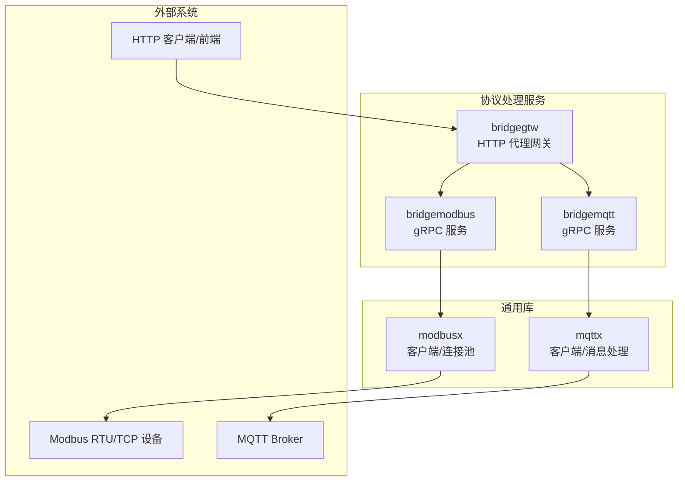
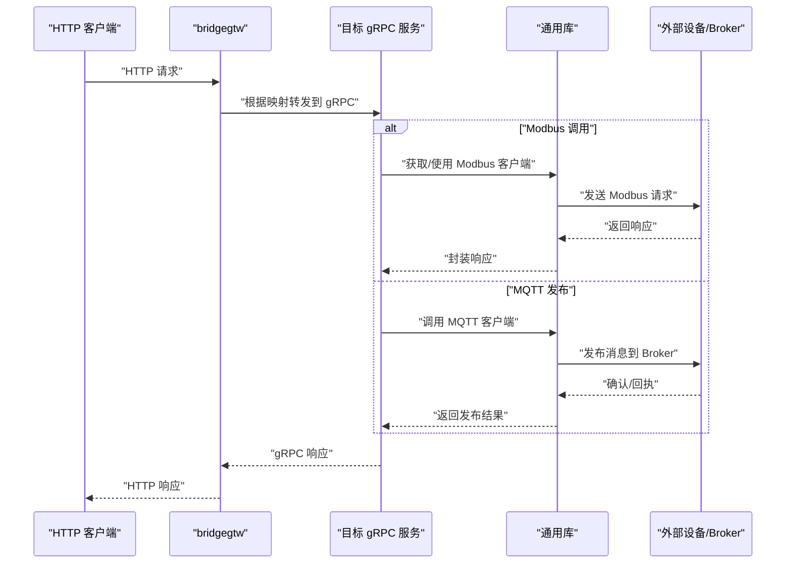
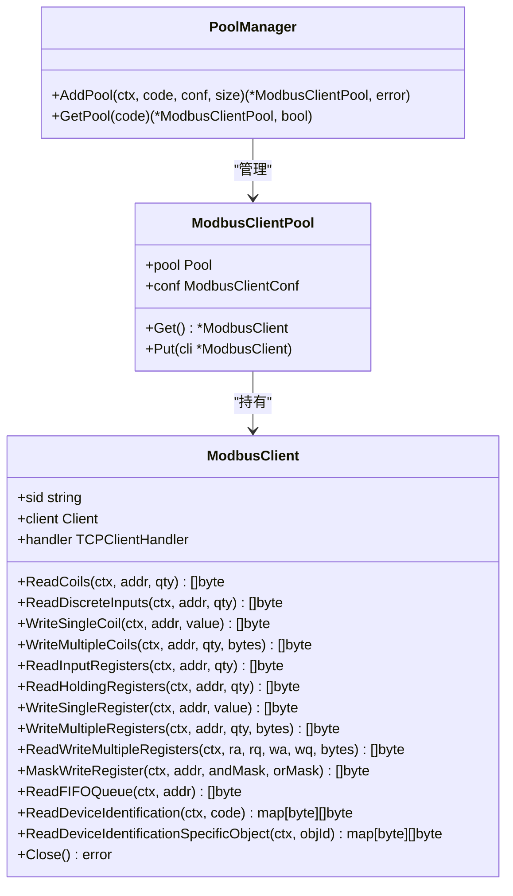
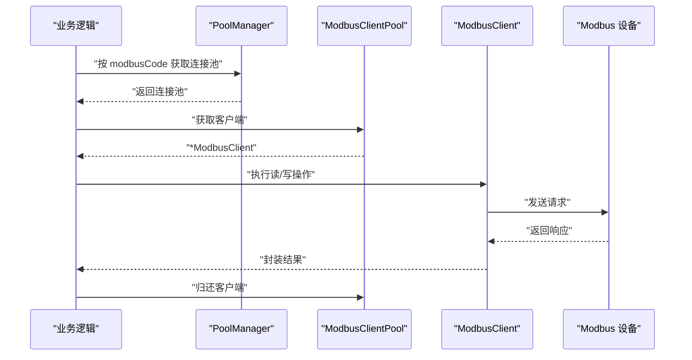
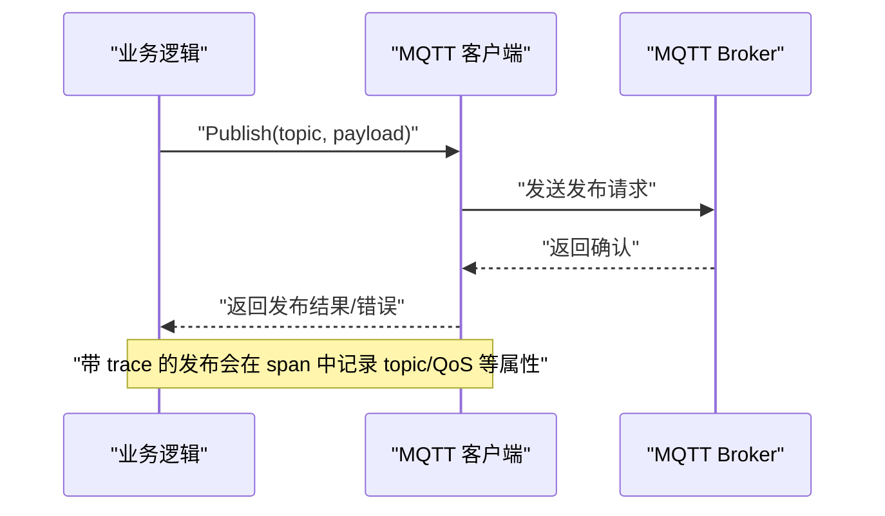
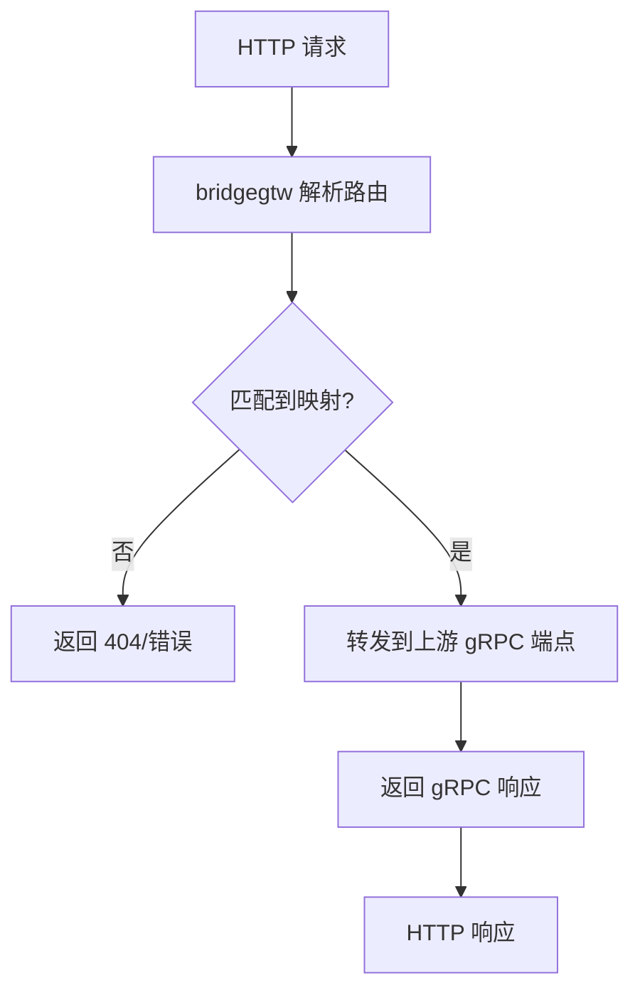
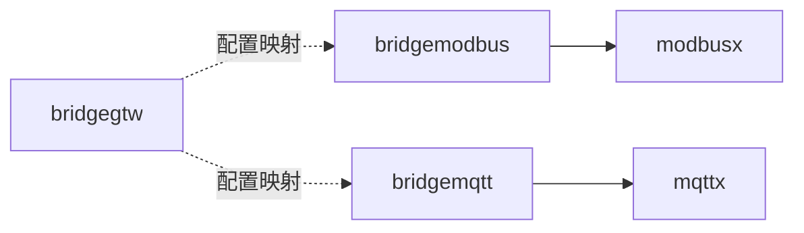

# 协议处理服务

<cite>
**本文引用的文件**
- [app/bridgemodbus/bridgemodbus.proto](file://app/bridgemodbus/bridgemodbus.proto)
- [common/modbusx/client.go](file://common/modbusx/client.go)
- [common/modbusx/config.go](file://common/modbusx/config.go)
- [app/bridgemodbus/etc/bridgemodbus.yaml](file://app/bridgemodbus/etc/bridgemodbus.yaml)
- [app/bridgemodbus/internal/logic/readcoilslogic.go](file://app/bridgemodbus/internal/logic/readcoilslogic.go)
- [app/bridgemodbus/internal/logic/writesingleregisterlogic.go](file://app/bridgemodbus/internal/logic/writesingleregisterlogic.go)
- [app/bridgemodbus/internal/logic/saveconfiglogic.go](file://app/bridgemodbus/internal/logic/saveconfiglogic.go)
- [app/bridgemodbus/internal/logic/batchconvertdecimaltoregisterlogic.go](file://app/bridgemodbus/internal/logic/batchconvertdecimaltoregisterlogic.go)
- [app/bridgemqtt/bridgemqtt.proto](file://app/bridgemqtt/bridgemqtt.proto)
- [common/mqttx/mqttx.go](file://common/mqttx/mqttx.go)
- [common/mqttx/message.go](file://common/mqttx/message.go)
- [app/bridgemqtt/etc/bridgemqtt.yaml](file://app/bridgemqtt/etc/bridgemqtt.yaml)
- [app/bridgemqtt/internal/logic/publishlogic.go](file://app/bridgemqtt/internal/logic/publishlogic.go)
- [app/bridgegtw/bridgegtw.api](file://app/bridgegtw/bridgegtw.api)
- [app/bridgegtw/etc/bridgegtw.yaml](file://app/bridgegtw/etc/bridgegtw.yaml)
</cite>

## 目录
1. [简介](#简介)
2. [项目结构](#项目结构)
3. [核心组件](#核心组件)
4. [架构总览](#架构总览)
5. [详细组件分析](#详细组件分析)
6. [依赖分析](#依赖分析)
7. [性能考虑](#性能考虑)
8. [故障排查指南](#故障排查指南)
9. [结论](#结论)
10. [附录](#附录)

## 简介
本文件面向“协议处理服务”的三类核心能力：Modbus 协议桥接（bridgemodbus）、MQTT 协议桥接（bridgemqtt）与 HTTP 代理网关（bridgegtw）。文档系统性阐述三者的协议特点、应用场景、实现机制、协议转换与数据映射、错误处理策略，并提供设备接入、参数配置与通信优化的实用指南。同时，通过图示与代码片段路径帮助读者快速定位实现细节。

## 项目结构
围绕协议处理服务，仓库采用“多应用 + 通用库 + 配置 + 代理网关”的组织方式：
- 通用库：common/modbusx 提供 Modbus 客户端封装与连接池；common/mqttx 提供 MQTT 客户端封装与消息处理。
- 业务应用：
  - bridgemodbus：基于 gRPC 的 Modbus 协议桥接服务，覆盖配置管理与多种功能码操作。
  - bridgemqtt：基于 gRPC 的 MQTT 发布桥接服务，支持普通发布与带链路追踪的发布。
  - bridgegtw：基于 API Gateway 的 HTTP 代理，将 HTTP 请求映射到 gRPC 服务。
- 配置文件：各应用的 YAML 配置集中于 etc 目录，分别描述监听端口、日志、连接池、上游 gRPC 端点等。

图表来源
- [app/bridgemodbus/etc/bridgemodbus.yaml:1-26](file://app/bridgemodbus/etc/bridgemodbus.yaml#L1-L26)
- [app/bridgemqtt/etc/bridgemqtt.yaml:1-48](file://app/bridgemqtt/etc/bridgemqtt.yaml#L1-L48)
- [app/bridgegtw/etc/bridgegtw.yaml:12-40](file://app/bridgegtw/etc/bridgegtw.yaml#L12-L40)

章节来源
- [app/bridgemodbus/etc/bridgemodbus.yaml:1-26](file://app/bridgemodbus/etc/bridgemodbus.yaml#L1-L26)
- [app/bridgemqtt/etc/bridgemqtt.yaml:1-48](file://app/bridgemqtt/etc/bridgemqtt.yaml#L1-L48)
- [app/bridgegtw/etc/bridgegtw.yaml:12-40](file://app/bridgegtw/etc/bridgegtw.yaml#L12-L40)

## 核心组件
- Modbus 协议桥接（bridgemodbus）
  - gRPC 接口：配置管理（新增/删除/分页/按编码查询）、线圈/离散输入读写、寄存器读写、读写多个寄存器、屏蔽写寄存器、FIFO 队列读取、设备标识读取、十进制批量转寄存器。
  - 实现要点：通过 modbusx 的客户端封装与连接池，统一超时、空闲、重连与 TLS 支持；对读写结果进行多格式输出（字节、无符号/有符号整数、十六进制、二进制）。
- MQTT 协议桥接（bridgemqtt）
  - gRPC 接口：健康检查、发布消息、带 traceId 的发布（内部链路追踪）。
  - 实现要点：基于 mqttx 客户端，支持自动重连、订阅恢复、QoS 控制、OpenTelemetry 链路追踪、默认处理器兜底。
- HTTP 代理网关（bridgegtw）
  - API 描述：定义 HTTP 前缀与路由，将 HTTP 请求映射到 gRPC 方法。
  - 实现要点：配置上游 gRPC 端点与方法映射，支持非阻塞转发与超时控制。

章节来源
- [app/bridgemodbus/bridgemodbus.proto:10-83](file://app/bridgemodbus/bridgemodbus.proto#L10-L83)
- [common/modbusx/client.go:20-143](file://common/modbusx/client.go#L20-L143)
- [app/bridgemqtt/bridgemqtt.proto:10-16](file://app/bridgemqtt/bridgemqtt.proto#L10-L16)
- [common/mqttx/mqttx.go:76-178](file://common/mqttx/mqttx.go#L76-L178)
- [app/bridgegtw/bridgegtw.api:13-21](file://app/bridgegtw/bridgegtw.api#L13-L21)

## 架构总览
下图展示了三类协议处理服务的整体交互：HTTP 客户端经由 bridgegtw 将请求转发至 bridgemodbus 或 bridgemqtt；bridgemodbus 通过 modbusx 连接 Modbus 设备；bridgemqtt 通过 mqttx 连接 MQTT Broker。

图表来源
- [app/bridgegtw/etc/bridgegtw.yaml:25-40](file://app/bridgegtw/etc/bridgegtw.yaml#L25-L40)
- [common/modbusx/client.go:106-143](file://common/modbusx/client.go#L106-L143)
- [common/mqttx/mqttx.go:309-333](file://common/mqttx/mqttx.go#L309-L333)

## 详细组件分析

### Modbus 协议桥接（bridgemodbus）
- 协议特点与应用场景
  - 支持线圈/离散输入读取、单/多线圈写入、输入/保持寄存器读取、单/多寄存器写入、读写多个寄存器、屏蔽写寄存器、FIFO 队列读取、设备标识读取等。
  - 适用于工业自动化场景，如 PLC、RTU、智能电表等设备的数据采集与控制。
- 数据模型与映射
  - 请求/响应消息体覆盖地址、数量、值集合、多格式输出（字节、无符号/有符号整数、十六进制、二进制），便于上层业务解析与展示。
- 实现机制
  - 客户端封装：ModbusClient 在底层 modbus.Client 上增加 TLS、超时、空闲、重连、会话日志等能力。
  - 连接池：ModbusClientPool 基于 syncx.Pool 实现连接复用与生命周期管理。
  - 配置管理：通过数据库模型持久化 modbusCode 与从站地址、从站 ID、超时等参数；PoolManager 维护按 modbusCode 的连接池映射。
- 错误处理
  - 参数校验：写寄存器前对值域进行校验，超出 16 位寄存器范围则返回业务错误码。
  - 连接异常：连接池与客户端均具备自动重连与超时控制，日志包含会话标识便于定位问题。
- 代码示例路径
  - 建立连接与获取客户端：[common/modbusx/client.go:106-143](file://common/modbusx/client.go#L106-L143)
  - 获取连接池并执行读线圈：[app/bridgemodbus/internal/logic/readcoilslogic.go:27-43](file://app/bridgemodbus/internal/logic/readcoilslogic.go#L27-L43)
  - 写单个寄存器并校验范围：[app/bridgemodbus/internal/logic/writesingleregisterlogic.go:30-54](file://app/bridgemodbus/internal/logic/writesingleregisterlogic.go#L30-L54)
  - 保存配置（新增/更新）：[app/bridgemodbus/internal/logic/saveconfiglogic.go:27-61](file://app/bridgemodbus/internal/logic/saveconfiglogic.go#L27-L61)
  - 十进制批量转寄存器：[app/bridgemodbus/internal/logic/batchconvertdecimaltoregisterlogic.go:30-67](file://app/bridgemodbus/internal/logic/batchconvertdecimaltoregisterlogic.go#L30-L67)

图表来源
- [common/modbusx/client.go:20-143](file://common/modbusx/client.go#L20-L143)
- [common/modbusx/config.go:63-124](file://common/modbusx/config.go#L63-L124)

图表来源
- [common/modbusx/client.go:180-191](file://common/modbusx/client.go#L180-L191)
- [common/modbusx/config.go:109-124](file://common/modbusx/config.go#L109-L124)

章节来源
- [app/bridgemodbus/bridgemodbus.proto:10-83](file://app/bridgemodbus/bridgemodbus.proto#L10-L83)
- [common/modbusx/client.go:20-143](file://common/modbusx/client.go#L20-L143)
- [common/modbusx/config.go:32-61](file://common/modbusx/config.go#L32-L61)
- [app/bridgemodbus/etc/bridgemodbus.yaml:11-26](file://app/bridgemodbus/etc/bridgemodbus.yaml#L11-L26)
- [app/bridgemodbus/internal/logic/readcoilslogic.go:27-43](file://app/bridgemodbus/internal/logic/readcoilslogic.go#L27-L43)
- [app/bridgemodbus/internal/logic/writesingleregisterlogic.go:30-54](file://app/bridgemodbus/internal/logic/writesingleregisterlogic.go#L30-L54)
- [app/bridgemodbus/internal/logic/saveconfiglogic.go:27-61](file://app/bridgemodbus/internal/logic/saveconfiglogic.go#L27-L61)
- [app/bridgemodbus/internal/logic/batchconvertdecimaltoregisterlogic.go:30-67](file://app/bridgemodbus/internal/logic/batchconvertdecimaltoregisterlogic.go#L30-L67)

### MQTT 协议桥接（bridgemqtt）
- 协议特点与应用场景
  - 提供发布消息能力，支持普通发布与带 traceId 的发布，便于内部链路追踪与可观测性。
  - 适用于物联网消息转发、事件上报、跨系统消息桥接等场景。
- 数据模型与映射
  - 请求包含 topic 与 payload；带 trace 的发布返回 traceId，便于端到端追踪。
- 实现机制
  - 客户端封装：Client 封装 paho.mqtt.golang，支持自动重连、订阅恢复、QoS 控制、连接/断开事件回调、OpenTelemetry 链路追踪。
  - 消息处理：消息到达后进行解包（若为包装消息则提取 payload），注入链路上下文，调用注册的处理器并统计耗时。
  - 默认处理器：当无处理器时触发默认处理器，记录告警日志。
- 错误处理
  - 连接/订阅/发布超时与失败均返回错误；订阅恢复失败会记录错误但不影响整体运行。
- 代码示例路径
  - 发布消息（含超时与错误处理）：[common/mqttx/mqttx.go:309-333](file://common/mqttx/mqttx.go#L309-L333)
  - 注册消息处理器与订阅恢复：[common/mqttx/mqttx.go:180-255](file://common/mqttx/mqttx.go#L180-L255)
  - 健康检查与发布 RPC：[app/bridgemqtt/bridgemqtt.proto:10-16](file://app/bridgemqtt/bridgemqtt.proto#L10-L16)
  - 业务逻辑发布调用：[app/bridgemqtt/internal/logic/publishlogic.go:26-33](file://app/bridgemqtt/internal/logic/publishlogic.go#L26-L33)

图表来源
- [common/mqttx/mqttx.go:309-333](file://common/mqttx/mqttx.go#L309-L333)
- [common/mqttx/mqttx.go:377-388](file://common/mqttx/mqttx.go#L377-L388)

章节来源
- [app/bridgemqtt/bridgemqtt.proto:10-16](file://app/bridgemqtt/bridgemqtt.proto#L10-L16)
- [common/mqttx/mqttx.go:76-178](file://common/mqttx/mqttx.go#L76-L178)
- [common/mqttx/mqttx.go:309-333](file://common/mqttx/mqttx.go#L309-L333)
- [app/bridgemqtt/etc/bridgemqtt.yaml:19-48](file://app/bridgemqtt/etc/bridgemqtt.yaml#L19-L48)
- [app/bridgemqtt/internal/logic/publishlogic.go:26-33](file://app/bridgemqtt/internal/logic/publishlogic.go#L26-L33)

### HTTP 代理网关（bridgegtw）
- 协议特点与应用场景
  - 将 HTTP 请求映射到 gRPC 服务，支持多条映射规则与非阻塞转发。
  - 适用于对外暴露统一入口、隐藏后端 gRPC 细节、进行协议转换与路由编排。
- 数据模型与映射
  - API 描述文件定义前缀与路由；配置文件定义上游 gRPC 端点、非阻塞与超时、ProtoSets 以及具体映射关系。
- 实现机制
  - 基于 API 描述与配置，将 HTTP 方法/路径映射到 gRPC 服务方法，完成请求转发。
- 代码示例路径
  - API 描述（前缀与路由）：[app/bridgegtw/bridgegtw.api:13-21](file://app/bridgegtw/bridgegtw.api#L13-L21)
  - 上游 gRPC 端点与映射配置：[app/bridgegtw/etc/bridgegtw.yaml:25-40](file://app/bridgegtw/etc/bridgegtw.yaml#L25-L40)

图表来源
- [app/bridgegtw/bridgegtw.api:13-21](file://app/bridgegtw/bridgegtw.api#L13-L21)
- [app/bridgegtw/etc/bridgegtw.yaml:25-40](file://app/bridgegtw/etc/bridgegtw.yaml#L25-L40)

章节来源
- [app/bridgegtw/bridgegtw.api:13-21](file://app/bridgegtw/bridgegtw.api#L13-L21)
- [app/bridgegtw/etc/bridgegtw.yaml:12-40](file://app/bridgegtw/etc/bridgegtw.yaml#L12-L40)

## 依赖分析
- 组件耦合
  - bridgemodbus 与 common/modbusx：强依赖，前者通过后者提供的客户端与连接池访问 Modbus 设备。
  - bridgemqtt 与 common/mqttx：强依赖，前者通过后者提供的客户端发布消息并进行链路追踪。
  - bridgegtw 与下游 gRPC 服务：弱耦合，通过配置文件声明式绑定，便于替换与扩展。
- 外部依赖
  - Modbus：github.com/grid-x/modbus
  - MQTT：github.com/eclipse/paho.mqtt.golang
  - OpenTelemetry：用于链路追踪与指标采集
- 潜在循环依赖
  - 未发现循环依赖迹象，模块边界清晰。

图表来源
- [common/modbusx/client.go:14-17](file://common/modbusx/client.go#L14-L17)
- [common/mqttx/mqttx.go:13-22](file://common/mqttx/mqttx.go#L13-L22)

章节来源
- [common/modbusx/client.go:14-17](file://common/modbusx/client.go#L14-L17)
- [common/mqttx/mqttx.go:13-22](file://common/mqttx/mqttx.go#L13-L22)

## 性能考虑
- 连接复用与池化
  - Modbus：通过连接池减少频繁建连成本，合理设置池大小与最大空闲时间，避免资源泄露。
  - MQTT：利用自动重连与订阅恢复，降低网络抖动影响。
- 超时与重试
  - Modbus：合理设置超时、空闲、重连与协议恢复时间，避免长时间阻塞。
  - MQTT：发布/订阅超时与 QoS 配置需结合业务可靠性需求权衡。
- 日志与追踪
  - Modbus：会话标识与地址摘要日志有助于快速定位问题。
  - MQTT：OpenTelemetry span 记录 topic、QoS、消息 ID 等维度，便于性能分析。
- 非阻塞与并发
  - bridgegtw 支持非阻塞转发，提升吞吐；建议配合限流与熔断策略。

## 故障排查指南
- Modbus 常见问题
  - 连接失败：检查 Address、Slave、TLS 配置与网络连通性；查看连接池日志中的会话标识。
  - 超时/读写异常：调整 Timeout、IdleTimeout、LinkRecoveryTimeout；确认设备侧响应时间。
  - 值域错误：写寄存器前确保值在 16 位寄存器范围内，避免业务错误。
- MQTT 常见问题
  - 连接失败：核对 Broker 地址、认证信息与 QoS；关注 OnConnectionLost 回调。
  - 订阅恢复失败：检查已注册主题与初始订阅列表；确认客户端状态。
  - 无处理器：默认处理器会记录告警，需为相关主题注册处理器。
- HTTP 代理
  - 映射不生效：检查 API 描述与配置文件中的 Method/Path/RpcPath 是否一致。
  - 上游不可达：确认上游 gRPC 端点可达与服务名正确。

章节来源
- [common/modbusx/client.go:106-143](file://common/modbusx/client.go#L106-L143)
- [common/modbusx/client.go:193-218](file://common/modbusx/client.go#L193-L218)
- [common/mqttx/mqttx.go:148-178](file://common/mqttx/mqttx.go#L148-L178)
- [common/mqttx/mqttx.go:235-255](file://common/mqttx/mqttx.go#L235-L255)
- [common/mqttx/mqttx.go:353-359](file://common/mqttx/mqttx.go#L353-L359)
- [app/bridgegtw/etc/bridgegtw.yaml:25-40](file://app/bridgegtw/etc/bridgegtw.yaml#L25-L40)

## 结论
本协议处理服务以“通用库 + 应用服务 + 代理网关”的方式实现了 Modbus、MQTT 与 HTTP 的桥接与转换。通过连接池、自动重连、超时控制、链路追踪与可观测性，满足工业与物联网场景下的稳定性与可维护性要求。建议在生产环境中结合业务特性调优超时与池大小，并完善监控与告警体系。

## 附录
- 设备接入与参数配置
  - Modbus：通过配置文件设置 Address、Slave、Timeout、IdleTimeout、LinkRecoveryTimeout、ProtocolRecoveryTimeout、ConnectDelay、TLS 等；在业务层调用保存配置接口完成持久化。
  - MQTT：在配置文件中设置 Broker、ClientID、Username、Password、Qos、KeepAlive、SubscribeTopics 等；通过 AddHandler 注册主题处理器。
  - bridgegtw：在配置文件中定义 Upstreams 与 Mappings，确保 Method/Path/RpcPath 与 API 描述一致。
- 通信优化建议
  - 合理设置连接池大小与空闲回收时间，避免频繁创建/销毁连接。
  - 对高频请求采用批量读写（如批量读寄存器）减少往返次数。
  - 使用 OpenTelemetry 进行端到端观测，结合日志与指标进行容量规划与问题定位。