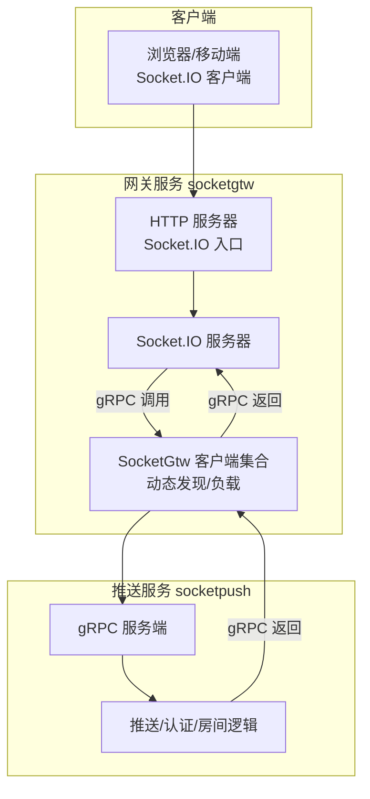
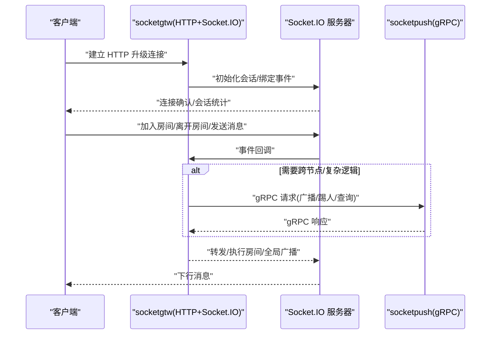
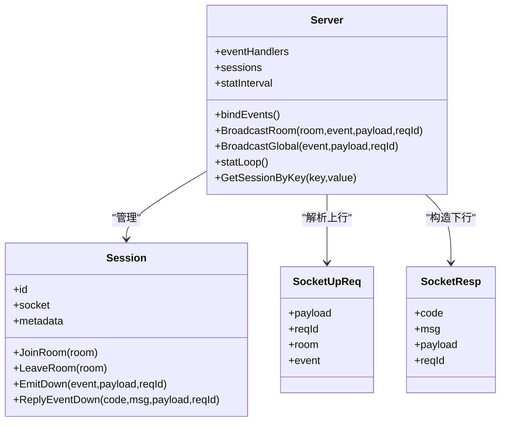
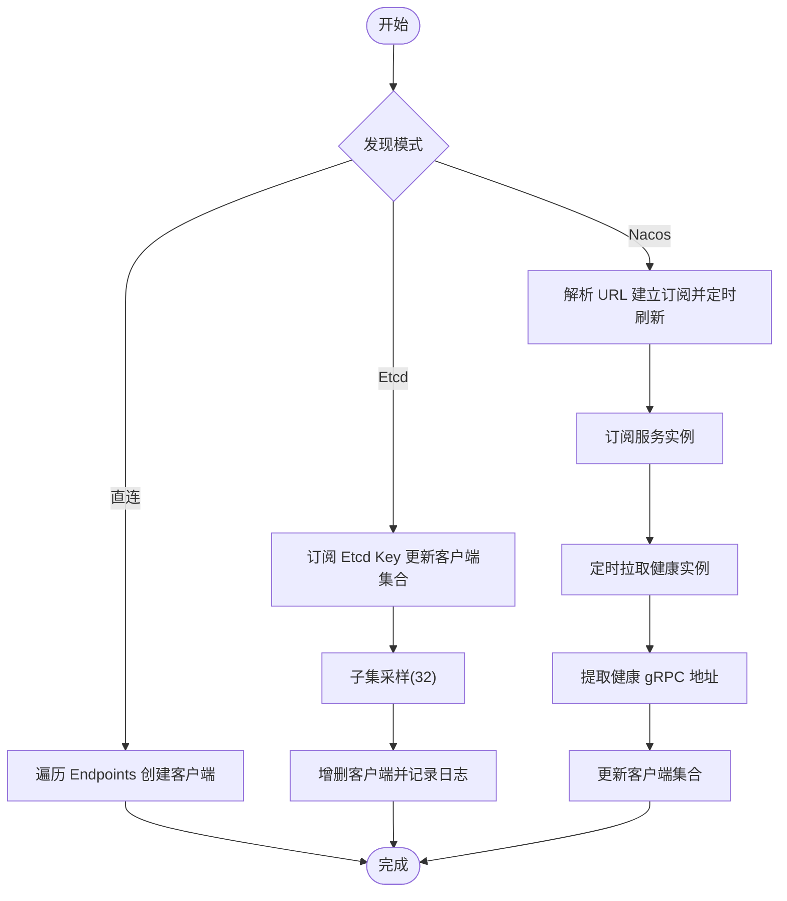
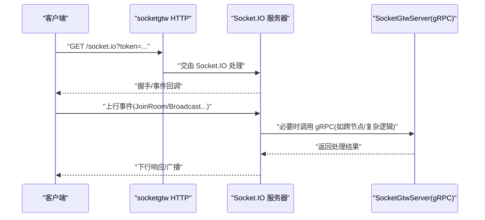
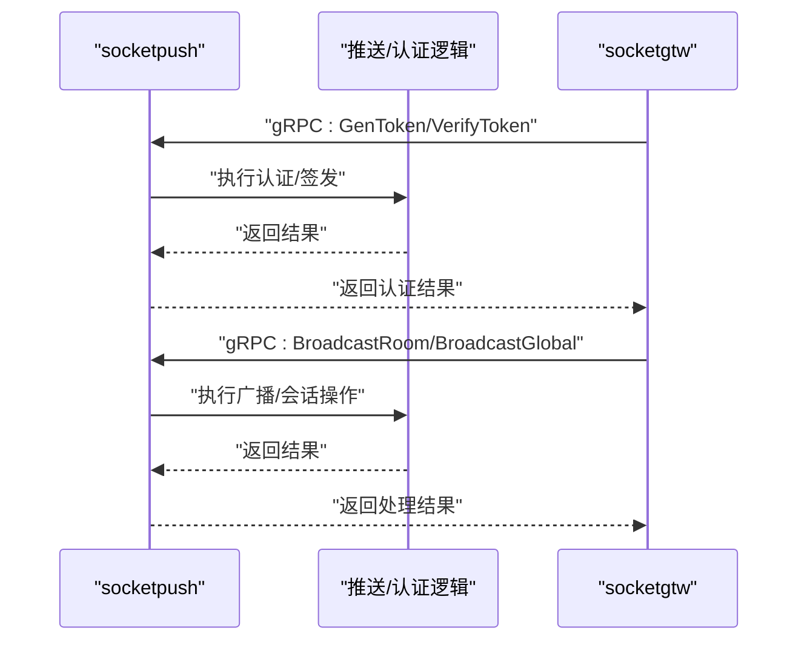
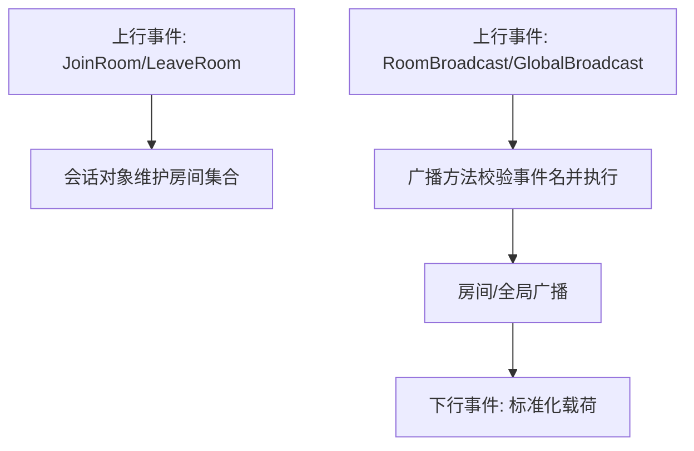
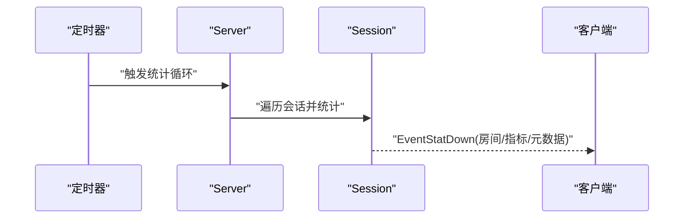
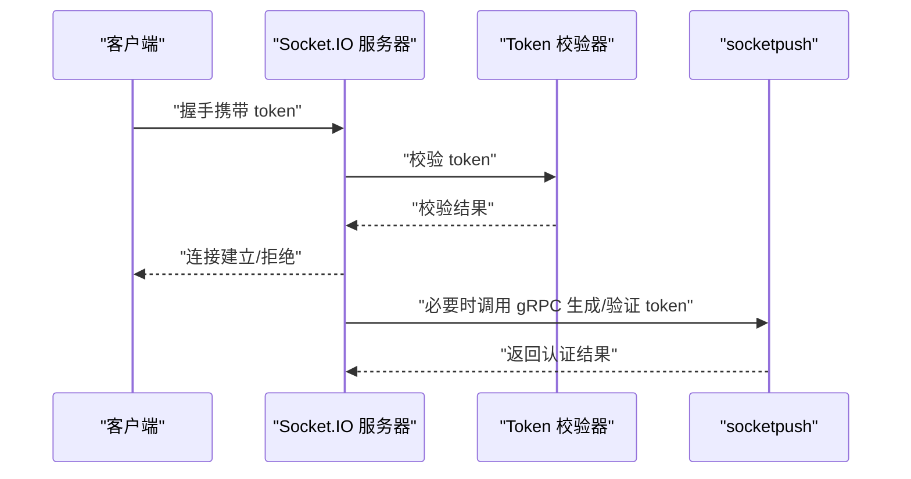
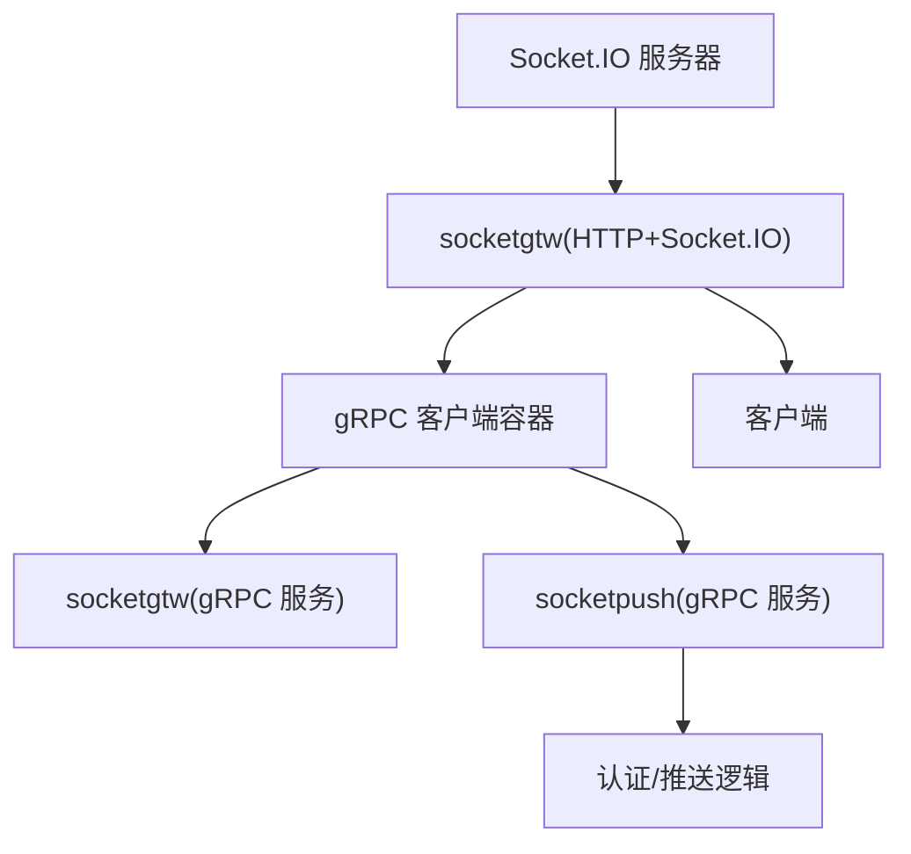

# 实时通信服务

<cite>
**本文引用的文件**
- [common/socketiox/container.go](file://common/socketiox/container.go)
- [common/socketiox/server.go](file://common/socketiox/server.go)
- [common/socketiox/handler.go](file://common/socketiox/handler.go)
- [socketapp/socketgtw/socketgtw.go](file://socketapp/socketgtw/socketgtw.go)
- [socketapp/socketpush/socketpush.go](file://socketapp/socketpush/socketpush.go)
- [socketapp/socketgtw/internal/config/config.go](file://socketapp/socketgtw/internal/config/config.go)
- [socketapp/socketpush/internal/config/config.go](file://socketapp/socketpush/internal/config/config.go)
- [socketapp/socketgtw/etc/socketgtw.yaml](file://socketapp/socketgtw/etc/socketgtw.yaml)
- [socketapp/socketpush/etc/socketpush.yaml](file://socketapp/socketpush/etc/socketpush.yaml)
- [socketapp/socketgtw/internal/server/socketgtwserver.go](file://socketapp/socketgtw/internal/server/socketgtwserver.go)
- [socketapp/socketpush/internal/server/socketpushserver.go](file://socketapp/socketpush/internal/server/socketpushserver.go)
</cite>

## 目录
1. [简介](#简介)
2. [项目结构](#项目结构)
3. [核心组件](#核心组件)
4. [架构总览](#架构总览)
5. [详细组件分析](#详细组件分析)
6. [依赖分析](#依赖分析)
7. [性能考虑](#性能考虑)
8. [故障排查指南](#故障排查指南)
9. [结论](#结论)
10. [附录](#附录)

## 简介
本技术文档围绕实时通信服务展开，系统性介绍基于 Socket.IO 的架构设计与连接管理机制，阐明 socketgtw 网关与 socketpush 服务的功能分工与协作关系，深入解析房间管理、消息广播与会话跟踪的实现原理，并提供实时消息推送、在线状态管理与用户认证的实践范式。同时，文档覆盖连接稳定性、消息可靠性与性能优化的最佳实践，帮助读者在生产环境中构建高可用、可扩展的实时通信能力。

## 项目结构
实时通信服务由三层组成：
- 通用 Socket.IO 核心层：封装 Socket.IO 服务器、事件模型、会话管理与广播能力。
- 网关服务（socketgtw）：对外暴露 HTTP 入口，承载 Socket.IO 连接，提供房间管理与广播等能力；内部通过 gRPC 调用 socketpush 完成跨进程/跨节点的消息分发。
- 推送服务（socketpush）：作为消息推送与认证中心，提供 token 生成/校验、房间管理、会话操作与全局广播等能力；通过 gRPC 被 socketgtw 调用。

图表来源
- [socketapp/socketgtw/socketgtw.go:30-90](file://socketapp/socketgtw/socketgtw.go#L30-L90)
- [socketapp/socketpush/socketpush.go:27-70](file://socketapp/socketpush/socketpush.go#L27-L70)
- [common/socketiox/server.go:314-335](file://common/socketiox/server.go#L314-L335)
- [common/socketiox/container.go:35-61](file://common/socketiox/container.go#L35-L61)

章节来源
- [socketapp/socketgtw/socketgtw.go:30-90](file://socketapp/socketgtw/socketgtw.go#L30-L90)
- [socketapp/socketpush/socketpush.go:27-70](file://socketapp/socketpush/socketpush.go#L27-L70)
- [common/socketiox/server.go:314-335](file://common/socketiox/server.go#L314-L335)
- [common/socketiox/container.go:35-61](file://common/socketiox/container.go#L35-L61)

## 核心组件
- Socket.IO 服务器与会话管理
  - 提供连接认证、事件绑定、房间加入/离开、全局/房间广播、会话统计与清理等能力。
  - 会话元数据支持多键值注入，便于按用户/设备维度进行定位与管理。
- Socket.IO 客户端容器
  - 支持直连、Etcd 订阅与 Nacos 动态发现三种方式建立到 socketgtw 的 gRPC 客户端连接，自动维护连接集合与负载均衡。
- 网关服务（socketgtw）
  - 对外提供 HTTP 服务与 Socket.IO 入口，内部注册 gRPC 服务，处理房间管理、广播、会话操作等请求。
- 推送服务（socketpush）
  - 提供 token 生成/校验、房间管理、会话操作与广播等能力，作为跨节点消息分发的核心。

章节来源
- [common/socketiox/server.go:119-203](file://common/socketiox/server.go#L119-L203)
- [common/socketiox/server.go:299-312](file://common/socketiox/server.go#L299-L312)
- [common/socketiox/container.go:30-33](file://common/socketiox/container.go#L30-L33)
- [socketapp/socketgtw/socketgtw.go:40-46](file://socketapp/socketgtw/socketgtw.go#L40-L46)
- [socketapp/socketpush/socketpush.go:37-43](file://socketapp/socketpush/socketpush.go#L37-L43)

## 架构总览
Socket.IO 采用“网关 + 推送”的双服务模式：
- 客户端通过 socketgtw 的 HTTP/Socket.IO 入口接入，建立长连接。
- socketgtw 作为会话与房间管理的入口，负责事件路由与会话生命周期管理。
- 当需要跨节点或执行复杂业务（如 token 校验、批量会话操作）时，socketgtw 通过 gRPC 调用 socketpush 完成。
- socketpush 统一维护房间与会话状态，执行广播与会话操作，并将结果返回给调用方。

图表来源
- [socketapp/socketgtw/socketgtw.go:48-61](file://socketapp/socketgtw/socketgtw.go#L48-L61)
- [common/socketiox/server.go:337-676](file://common/socketiox/server.go#L337-L676)
- [socketapp/socketgtw/internal/server/socketgtwserver.go:26-90](file://socketapp/socketgtw/internal/server/socketgtwserver.go#L26-L90)
- [socketapp/socketpush/internal/server/socketpushserver.go:26-102](file://socketapp/socketpush/internal/server/socketpushserver.go#L26-L102)

## 详细组件分析

### Socket.IO 服务器与事件模型
- 事件定义
  - 连接/断开：用于建立与释放会话。
  - 上行事件：统一的上行消息入口，携带 reqId、event、payload、room 等字段。
  - 房间/全局广播：分别向房间内或全体在线客户端广播消息。
  - 统计下行：周期性下发会话统计信息，包含房间列表、网络指标与元数据。
- 会话管理
  - 会话对象保存 socket 句柄、元数据与房间集合，支持并发安全的读写。
  - 支持按元数据键值（如用户ID、设备ID）检索会话，便于定向推送。
- 广播实现
  - 房间广播与全局广播均对事件名进行合法性校验，避免非法事件名污染通道。
  - 下行消息统一包装为标准响应结构，便于客户端解析与 ACK 回传。

图表来源
- [common/socketiox/server.go:299-312](file://common/socketiox/server.go#L299-L312)
- [common/socketiox/server.go:119-125](file://common/socketiox/server.go#L119-L125)
- [common/socketiox/server.go:41-58](file://common/socketiox/server.go#L41-L58)

章节来源
- [common/socketiox/server.go:20-35](file://common/socketiox/server.go#L20-L35)
- [common/socketiox/server.go:119-203](file://common/socketiox/server.go#L119-L203)
- [common/socketiox/server.go:678-700](file://common/socketiox/server.go#L678-L700)
- [common/socketiox/server.go:769-782](file://common/socketiox/server.go#L769-L782)

### Socket.IO 客户端容器与动态发现
- 容器职责
  - 维护 socketgtw gRPC 客户端集合，支持直连、Etcd 与 Nacos 三种发现方式。
  - 自动监听服务实例变化，按阈值进行子集采样，动态增删客户端连接。
- Nacos 发现流程
  - 解析目标 URL，建立订阅，周期性拉取健康实例列表，过滤 gRPC 端口与启用状态，更新客户端映射。
- Etcd 发现流程
  - 基于订阅值进行子集采样，按需创建/删除客户端连接，保持连接数量可控。

图表来源
- [common/socketiox/container.go:83-130](file://common/socketiox/container.go#L83-L130)
- [common/socketiox/container.go:156-242](file://common/socketiox/container.go#L156-L242)
- [common/socketiox/container.go:267-316](file://common/socketiox/container.go#L267-L316)
- [common/socketiox/container.go:348-356](file://common/socketiox/container.go#L348-L356)

章节来源
- [common/socketiox/container.go:35-61](file://common/socketiox/container.go#L35-L61)
- [common/socketiox/container.go:83-130](file://common/socketiox/container.go#L83-L130)
- [common/socketiox/container.go:156-242](file://common/socketiox/container.go#L156-L242)
- [common/socketiox/container.go:267-316](file://common/socketiox/container.go#L267-L316)
- [common/socketiox/container.go:318-346](file://common/socketiox/container.go#L318-L346)

### 网关服务（socketgtw）与 HTTP/Socket.IO 入口
- HTTP 中间件
  - 针对 /socket.io 的升级请求修正 Connection 头，确保 WebSocket 协议正常建立。
- gRPC 服务注册
  - 注册 SocketGtwServer，提供房间管理、广播、会话操作与统计等接口。
- 配置要点
  - 支持 Nacos 注册与服务元数据（含 gRPC 端口），便于被其他服务发现与调用。

图表来源
- [socketapp/socketgtw/socketgtw.go:48-61](file://socketapp/socketgtw/socketgtw.go#L48-L61)
- [socketapp/socketgtw/socketgtw.go:40-46](file://socketapp/socketgtw/socketgtw.go#L40-L46)
- [socketapp/socketgtw/internal/server/socketgtwserver.go:26-90](file://socketapp/socketgtw/internal/server/socketgtwserver.go#L26-L90)

章节来源
- [socketapp/socketgtw/socketgtw.go:30-90](file://socketapp/socketgtw/socketgtw.go#L30-L90)
- [socketapp/socketgtw/etc/socketgtw.yaml:13-37](file://socketapp/socketgtw/etc/socketgtw.yaml#L13-L37)
- [socketapp/socketgtw/internal/config/config.go:8-27](file://socketapp/socketgtw/internal/config/config.go#L8-L27)

### 推送服务（socketpush）与认证
- gRPC 服务注册
  - 注册 SocketPushServer，提供与 socketgtw 类似的房间管理、广播、会话操作与统计接口。
- 认证能力
  - 提供生成与验证 token 的接口，结合 socketgtw 的认证钩子，实现端到端的安全接入。
- 配置要点
  - 支持 Nacos 注册与服务元数据，便于被 socketgtw 动态发现与调用。

图表来源
- [socketapp/socketpush/socketpush.go:37-43](file://socketapp/socketpush/socketpush.go#L37-L43)
- [socketapp/socketpush/internal/server/socketpushserver.go:26-102](file://socketapp/socketpush/internal/server/socketpushserver.go#L26-L102)
- [socketapp/socketpush/etc/socketpush.yaml:10-27](file://socketapp/socketpush/etc/socketpush.yaml#L10-L27)
- [socketapp/socketpush/internal/config/config.go:5-22](file://socketapp/socketpush/internal/config/config.go#L5-L22)

章节来源
- [socketapp/socketpush/socketpush.go:27-70](file://socketapp/socketpush/socketpush.go#L27-L70)
- [socketapp/socketpush/etc/socketpush.yaml:10-27](file://socketapp/socketpush/etc/socketpush.yaml#L10-L27)
- [socketapp/socketpush/internal/config/config.go:5-22](file://socketapp/socketpush/internal/config/config.go#L5-L22)

### 房间管理与消息广播
- 房间管理
  - 客户端通过上行事件加入/离开房间；服务端在会话对象中维护房间集合，支持并发安全访问。
  - 网关侧提供 JoinRoom/LeaveRoom 接口，推送侧提供相同能力，便于跨节点调用。
- 广播机制
  - 房间广播：仅向指定房间内的会话广播消息。
  - 全局广播：向所有在线会话广播消息。
  - 事件名与下行载荷均进行标准化封装，保证客户端解析一致性。

图表来源
- [common/socketiox/server.go:392-468](file://common/socketiox/server.go#L392-L468)
- [common/socketiox/server.go:532-619](file://common/socketiox/server.go#L532-L619)
- [common/socketiox/server.go:678-700](file://common/socketiox/server.go#L678-L700)

章节来源
- [common/socketiox/server.go:392-468](file://common/socketiox/server.go#L392-L468)
- [common/socketiox/server.go:532-619](file://common/socketiox/server.go#L532-L619)
- [common/socketiox/server.go:678-700](file://common/socketiox/server.go#L678-L700)

### 会话跟踪与统计
- 统计周期
  - 以分钟级周期向每个会话下发统计事件，包含会话ID、房间列表、网络指标与元数据。
- 会话检索
  - 支持按元数据键值（如用户ID、设备ID）检索会话集合，便于定向推送与运维监控。

图表来源
- [common/socketiox/server.go:702-740](file://common/socketiox/server.go#L702-L740)
- [common/socketiox/server.go:769-782](file://common/socketiox/server.go#L769-L782)

章节来源
- [common/socketiox/server.go:702-740](file://common/socketiox/server.go#L702-L740)
- [common/socketiox/server.go:769-782](file://common/socketiox/server.go#L769-L782)

### 用户认证与令牌校验
- 认证钩子
  - 在连接阶段，可通过 TokenValidator 或 TokenValidatorWithClaims 对 token 进行校验，并将声明中的键注入会话元数据。
- 服务侧认证
  - socketpush 提供生成与验证 token 的接口，socketgtw 可调用以实现统一认证策略。

图表来源
- [common/socketiox/server.go:337-349](file://common/socketiox/server.go#L337-L349)
- [socketapp/socketpush/internal/server/socketpushserver.go:26-36](file://socketapp/socketpush/internal/server/socketpushserver.go#L26-L36)

章节来源
- [common/socketiox/server.go:337-349](file://common/socketiox/server.go#L337-L349)
- [socketapp/socketpush/internal/server/socketpushserver.go:26-36](file://socketapp/socketpush/internal/server/socketpushserver.go#L26-L36)

## 依赖分析
- 组件耦合
  - socketgtw 与 socketpush 通过 gRPC 解耦，前者专注会话与事件处理，后者专注认证与推送。
  - Socket.IO 服务器与会话管理内聚，事件处理与会话生命周期紧密耦合。
- 外部依赖
  - Nacos/Etcd 用于服务发现与实例变更通知；gRPC 用于跨服务调用。
  - HTTP 中间件确保 WebSocket 协议正确升级。

图表来源
- [common/socketiox/container.go:35-61](file://common/socketiox/container.go#L35-L61)
- [socketapp/socketgtw/socketgtw.go:48-61](file://socketapp/socketgtw/socketgtw.go#L48-L61)
- [socketapp/socketpush/socketpush.go:37-43](file://socketapp/socketpush/socketpush.go#L37-L43)

章节来源
- [common/socketiox/container.go:35-61](file://common/socketiox/container.go#L35-L61)
- [socketapp/socketgtw/socketgtw.go:48-61](file://socketapp/socketgtw/socketgtw.go#L48-L61)
- [socketapp/socketpush/socketpush.go:37-43](file://socketapp/socketpush/socketpush.go#L37-L43)

## 性能考虑
- 连接管理
  - 使用子集采样（默认 32）控制 gRPC 客户端数量，降低内存与连接压力。
  - Nacos/Etcd 订阅与定时刷新相结合，确保实例变更及时生效且避免频繁全量拉取。
- 广播与序列化
  - 广播前对事件名进行合法性校验，避免无效事件造成资源浪费。
  - 下行消息统一序列化为标准结构，减少客户端解析成本。
- 资源隔离
  - 将认证与推送逻辑下沉至 socketpush，socketgtw 专注于会话与事件编排，提升可维护性与扩展性。
- 日志与可观测性
  - 会话统计事件周期下发，便于监控在线规模与房间分布。
  - 关键路径增加日志与上下文字段，便于问题定位。

[本节为通用指导，不直接分析具体文件]

## 故障排查指南
- 连接无法建立
  - 检查 HTTP 中间件是否正确设置 Connection 头，确保 WebSocket 升级成功。
  - 核对 socketgtw 配置中的 HTTP 端口与 Nacos 注册信息。
- 事件处理异常
  - 查看上行事件解析日志，确认 reqId、event、payload、room 字段完整性。
  - 检查自定义事件处理器是否注册，避免“未配置处理器”错误。
- 广播失败
  - 校验事件名是否合法，避免使用保留事件名。
  - 检查房间是否存在以及会话是否已加入房间。
- 会话统计缺失
  - 确认统计循环间隔配置与会话数量，检查下行事件是否被客户端接收。
- 认证失败
  - 校验 token 格式与有效期，必要时调用 socketpush 的认证接口重新签发。

章节来源
- [socketapp/socketgtw/socketgtw.go:48-61](file://socketapp/socketgtw/socketgtw.go#L48-L61)
- [socketapp/socketgtw/etc/socketgtw.yaml:13-37](file://socketapp/socketgtw/etc/socketgtw.yaml#L13-L37)
- [common/socketiox/server.go:488-530](file://common/socketiox/server.go#L488-L530)
- [common/socketiox/server.go:678-700](file://common/socketiox/server.go#L678-L700)
- [common/socketiox/server.go:702-740](file://common/socketiox/server.go#L702-L740)

## 结论
该实时通信服务通过“网关 + 推送”的双服务架构，实现了高可用、可扩展的 Socket.IO 实时能力。Socket.IO 服务器负责会话与事件编排，socketgtw 作为入口与编排中心，socketpush 负责认证与推送，二者通过 gRPC 解耦协作。借助 Nacos/Etcd 的动态发现与子集采样策略，系统在连接稳定性、消息可靠性和性能方面均具备良好表现。建议在生产环境中结合日志与统计事件持续优化实例规模与事件处理策略。

[本节为总结性内容，不直接分析具体文件]

## 附录
- 配置参考
  - socketgtw 配置要点：HTTP 端口、Nacos 注册、SocketMetaData、StreamEventConf。
  - socketpush 配置要点：JWT 密钥与过期时间、Nacos 注册、SocketGtwConf。
- 常用接口
  - 房间管理：JoinRoom、LeaveRoom。
  - 广播：BroadcastRoom、BroadcastGlobal。
  - 会话操作：SendToSession、SendToSessions、SendToMetaSession、SendToMetaSessions、KickSession、KickMetaSession。
  - 认证：GenToken、VerifyToken。
  - 统计：SocketGtwStat。

章节来源
- [socketapp/socketgtw/etc/socketgtw.yaml:13-37](file://socketapp/socketgtw/etc/socketgtw.yaml#L13-L37)
- [socketapp/socketpush/etc/socketpush.yaml:10-27](file://socketapp/socketpush/etc/socketpush.yaml#L10-L27)
- [socketapp/socketgtw/internal/server/socketgtwserver.go:26-90](file://socketapp/socketgtw/internal/server/socketgtwserver.go#L26-L90)
- [socketapp/socketpush/internal/server/socketpushserver.go:26-102](file://socketapp/socketpush/internal/server/socketpushserver.go#L26-L102)