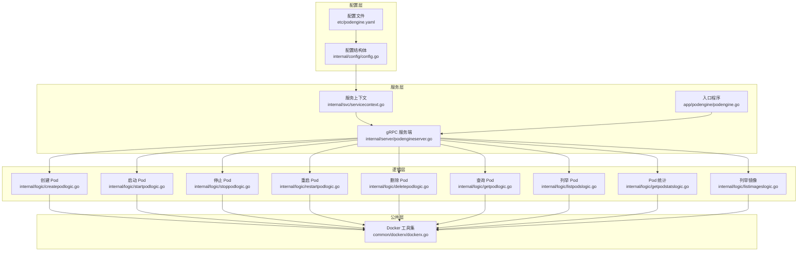
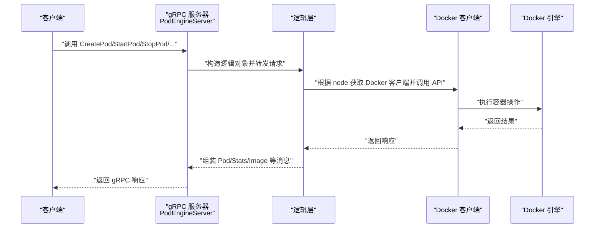
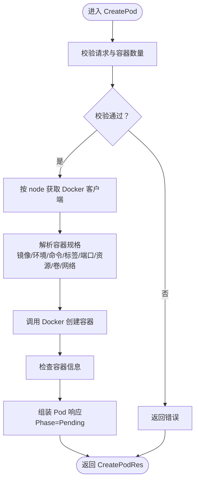
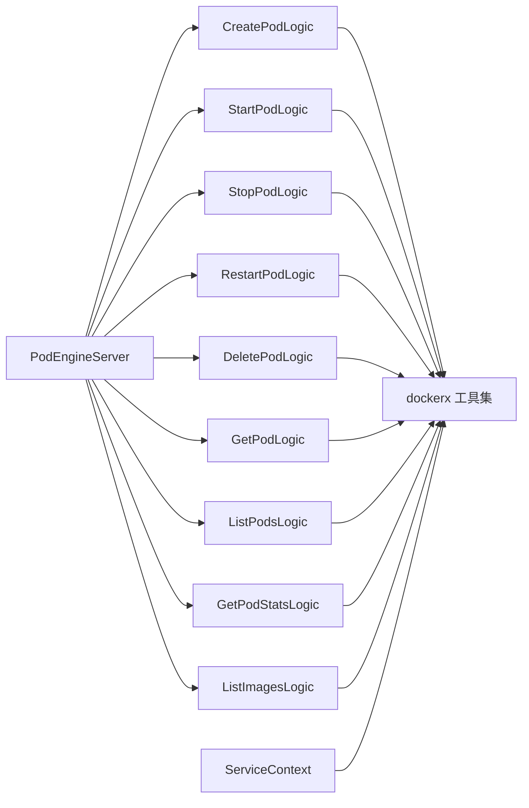

# 容器管理服务

<cite>
**本文引用的文件**
- [app/podengine/podengine.proto](file://app/podengine/podengine.proto)
- [app/podengine/etc/podengine.yaml](file://app/podengine/etc/podengine.yaml)
- [app/podengine/internal/config/config.go](file://app/podengine/internal/config/config.go)
- [app/podengine/internal/server/podengineserver.go](file://app/podengine/internal/server/podengineserver.go)
- [app/podengine/internal/svc/servicecontext.go](file://app/podengine/internal/svc/servicecontext.go)
- [app/podengine/internal/logic/createpodlogic.go](file://app/podengine/internal/logic/createpodlogic.go)
- [app/podengine/internal/logic/startpodlogic.go](file://app/podengine/internal/logic/startpodlogic.go)
- [app/podengine/internal/logic/stoppodlogic.go](file://app/podengine/internal/logic/stoppodlogic.go)
- [app/podengine/internal/logic/deletepodlogic.go](file://app/podengine/internal/logic/deletepodlogic.go)
- [app/podengine/internal/logic/listpodslogic.go](file://app/podengine/internal/logic/listpodslogic.go)
- [app/podengine/internal/logic/getpodlogic.go](file://app/podengine/internal/logic/getpodlogic.go)
- [app/podengine/internal/logic/restartpodlogic.go](file://app/podengine/internal/logic/restartpodlogic.go)
- [app/podengine/internal/logic/getpodstatslogic.go](file://app/podengine/internal/logic/getpodstatslogic.go)
- [app/podengine/internal/logic/listimageslogic.go](file://app/podengine/internal/logic/listimageslogic.go)
- [common/dockerx/dockerx.go](file://common/dockerx/dockerx.go)
- [app/podengine/podengine.go](file://app/podengine/podengine.go)
</cite>

## 目录
1. [简介](#简介)
2. [项目结构](#项目结构)
3. [核心组件](#核心组件)
4. [架构总览](#架构总览)
5. [详细组件分析](#详细组件分析)
6. [依赖关系分析](#依赖关系分析)
7. [性能与资源限制](#性能与资源限制)
8. [故障排查指南](#故障排查指南)
9. [结论](#结论)
10. [附录](#附录)

## 简介
本技术文档围绕容器管理服务中的 PodEngine 服务展开，系统性阐述其基于 gRPC 的容器生命周期管理能力，覆盖 Docker 容器的创建、启动、停止、重启、删除、查询与统计等核心流程；同时说明服务如何抽象出 Pod/Container 模型以适配 Docker/Kubernetes 等不同运行时，并给出监控、日志与性能分析的实现建议。文档面向具备一定技术背景的读者，既提供高层架构说明，也包含代码级参考路径，便于快速落地。

## 项目结构
PodEngine 服务位于 app/podengine 目录，采用 goctl 生成的 zrpc 服务骨架，结合 common/dockerx 提供的 Docker 客户端封装，形成清晰的分层结构：
- 配置层：读取 YAML 配置并初始化服务上下文
- 服务层：gRPC 服务端实现，路由到各业务逻辑
- 逻辑层：按 RPC 方法拆分的业务逻辑，负责与 Docker API 交互
- 公共层：Docker 客户端工具集，统一环境变量、端口、卷挂载、资源解析等

图表来源
- [app/podengine/etc/podengine.yaml:1-20](file://app/podengine/etc/podengine.yaml#L1-L20)
- [app/podengine/internal/config/config.go:1-18](file://app/podengine/internal/config/config.go#L1-L18)
- [app/podengine/internal/svc/servicecontext.go:1-51](file://app/podengine/internal/svc/servicecontext.go#L1-L51)
- [app/podengine/internal/server/podengineserver.go:1-70](file://app/podengine/internal/server/podengineserver.go#L1-L70)
- [app/podengine/internal/logic/createpodlogic.go:1-288](file://app/podengine/internal/logic/createpodlogic.go#L1-L288)
- [app/podengine/internal/logic/startpodlogic.go:1-88](file://app/podengine/internal/logic/startpodlogic.go#L1-L88)
- [app/podengine/internal/logic/stoppodlogic.go:1-49](file://app/podengine/internal/logic/stoppodlogic.go#L1-L49)
- [app/podengine/internal/logic/deletepodlogic.go:1-50](file://app/podengine/internal/logic/deletepodlogic.go#L1-L50)
- [app/podengine/internal/logic/listpodslogic.go:1-140](file://app/podengine/internal/logic/listpodslogic.go#L1-L140)
- [app/podengine/internal/logic/getpodlogic.go:1-117](file://app/podengine/internal/logic/getpodlogic.go#L1-L117)
- [app/podengine/internal/logic/restartpodlogic.go:1-84](file://app/podengine/internal/logic/restartpodlogic.go#L1-L84)
- [app/podengine/internal/logic/getpodstatslogic.go:1-134](file://app/podengine/internal/logic/getpodstatslogic.go#L1-L134)
- [app/podengine/internal/logic/listimageslogic.go:1-111](file://app/podengine/internal/logic/listimageslogic.go#L1-L111)
- [common/dockerx/dockerx.go:1-95](file://common/dockerx/dockerx.go#L1-L95)
- [app/podengine/podengine.go:1-69](file://app/podengine/podengine.go#L1-L69)

章节来源
- [app/podengine/etc/podengine.yaml:1-20](file://app/podengine/etc/podengine.yaml#L1-L20)
- [app/podengine/internal/config/config.go:1-18](file://app/podengine/internal/config/config.go#L1-L18)
- [app/podengine/internal/svc/servicecontext.go:1-51](file://app/podengine/internal/svc/servicecontext.go#L1-L51)
- [app/podengine/internal/server/podengineserver.go:1-70](file://app/podengine/internal/server/podengineserver.go#L1-L70)
- [app/podengine/podengine.go:1-69](file://app/podengine/podengine.go#L1-L69)

## 核心组件
- gRPC 服务接口定义：在 proto 中定义 PodEngine 服务及消息类型，覆盖生命周期管理、状态查询、镜像管理等能力。
- 服务端实现：将 gRPC 方法映射到对应逻辑层，统一注入服务上下文。
- 服务上下文：集中管理 Docker 客户端集合，支持本地与远端 Docker 节点。
- 逻辑层：每个 RPC 对应独立逻辑模块，负责参数校验、Docker API 调用、结果组装与错误处理。
- Docker 工具集：提供环境变量、端口、卷挂载、资源解析等通用转换函数。

章节来源
- [app/podengine/podengine.proto:14-338](file://app/podengine/podengine.proto#L14-L338)
- [app/podengine/internal/server/podengineserver.go:26-69](file://app/podengine/internal/server/podengineserver.go#L26-L69)
- [app/podengine/internal/svc/servicecontext.go:11-50](file://app/podengine/internal/svc/servicecontext.go#L11-L50)
- [common/dockerx/dockerx.go:20-94](file://common/dockerx/dockerx.go#L20-L94)

## 架构总览
PodEngine 服务通过 gRPC 提供容器生命周期管理能力，内部以“服务上下文 + 逻辑层”的方式组织，所有与 Docker 的交互均通过 common/dockerx 封装的客户端完成。配置文件支持本地与多个远端 Docker 节点注册，服务启动时根据配置构建客户端集合，并在请求时按 node 参数选择对应客户端。

图表来源
- [app/podengine/internal/server/podengineserver.go:26-69](file://app/podengine/internal/server/podengineserver.go#L26-L69)
- [app/podengine/internal/logic/createpodlogic.go:34-152](file://app/podengine/internal/logic/createpodlogic.go#L34-L152)
- [app/podengine/internal/logic/startpodlogic.go:29-87](file://app/podengine/internal/logic/startpodlogic.go#L29-L87)
- [app/podengine/internal/logic/stoppodlogic.go:28-48](file://app/podengine/internal/logic/stoppodlogic.go#L28-L48)
- [app/podengine/internal/logic/deletepodlogic.go:28-49](file://app/podengine/internal/logic/deletepodlogic.go#L28-L49)
- [app/podengine/internal/logic/getpodstatslogic.go:32-133](file://app/podengine/internal/logic/getpodstatslogic.go#L32-L133)
- [app/podengine/internal/logic/listimageslogic.go:30-110](file://app/podengine/internal/logic/listimageslogic.go#L30-L110)

## 详细组件分析

### PodEngine 接口与数据模型
- 服务接口：包含创建、启动、停止、重启、查询、列举、删除、统计、镜像列举等方法。
- 数据模型：抽象 Pod/Container 状态、条件、规格、镜像等，兼容 Docker/Kubernetes 语义。
- 节点参数：所有 RPC 请求包含 node 字段，默认 local，用于选择 Docker 客户端。

章节来源
- [app/podengine/podengine.proto:16-26](file://app/podengine/podengine.proto#L16-L26)
- [app/podengine/podengine.proto:33-178](file://app/podengine/podengine.proto#L33-L178)
- [app/podengine/podengine.proto:185-338](file://app/podengine/podengine.proto#L185-L338)

### 服务端路由与拦截
- 服务端实现：将每个 RPC 方法委托给对应逻辑层，保持职责单一。
- 启动流程：加载配置、构建服务上下文、注册服务、开启反射（开发/测试模式）、注册日志拦截器。
- 注册中心：可选 Nacos 注册服务元数据。

章节来源
- [app/podengine/internal/server/podengineserver.go:15-70](file://app/podengine/internal/server/podengineserver.go#L15-L70)
- [app/podengine/podengine.go:37-67](file://app/podengine/podengine.go#L37-L67)

### 服务上下文与 Docker 客户端
- 多节点支持：支持本地与多个远端 Docker 节点，键名为节点名，值为对应的 Docker 客户端。
- 安全并发：使用读写锁保护客户端集合访问。
- 默认节点：node 为空或 local 时回退到本地节点。

章节来源
- [app/podengine/internal/svc/servicecontext.go:11-50](file://app/podengine/internal/svc/servicecontext.go#L11-L50)
- [app/podengine/etc/podengine.yaml:19-20](file://app/podengine/etc/podengine.yaml#L19-L20)

### Docker 工具集
- 环境变量：从键值对映射转为 Docker 环境变量列表，以及反向解析。
- 端口映射：从 Docker 网络设置提取端口绑定信息。
- 卷挂载：从 Docker 挂载点提取 host:container[:ro] 形式。
- 资源解析：从 Docker 资源结构解析 CPU/Memory 的 limit/request。

章节来源
- [common/dockerx/dockerx.go:20-94](file://common/dockerx/dockerx.go#L20-L94)

### 创建 Pod（CreatePod）
- 输入校验：验证请求体与容器数量。
- 客户端选择：按 node 获取 Docker 客户端。
- 规格解析：镜像、环境变量、命令、标签、端口、资源、卷挂载、网络模式、优雅停止时间。
- Docker 调用：创建容器并检查信息，组装 Pod 响应（初始状态为 Pending）。

图表来源
- [app/podengine/internal/logic/createpodlogic.go:34-152](file://app/podengine/internal/logic/createpodlogic.go#L34-L152)
- [common/dockerx/dockerx.go:88-94](file://common/dockerx/dockerx.go#L88-L94)

章节来源
- [app/podengine/internal/logic/createpodlogic.go:34-152](file://app/podengine/internal/logic/createpodlogic.go#L34-L152)

### 启动 Pod（StartPod）
- 输入校验：校验 node 与 id。
- 客户端选择：按 node 获取 Docker 客户端。
- Docker 调用：启动容器并检查信息。
- 响应组装：更新 Phase 为 Running，填充容器状态、端口、资源、卷等。

章节来源
- [app/podengine/internal/logic/startpodlogic.go:29-87](file://app/podengine/internal/logic/startpodlogic.go#L29-L87)

### 停止 Pod（StopPod）
- 输入校验：校验 node 与 id。
- Docker 调用：停止容器。
- 响应：返回空结果。

章节来源
- [app/podengine/internal/logic/stoppodlogic.go:28-48](file://app/podengine/internal/logic/stoppodlogic.go#L28-L48)

### 重启 Pod（RestartPod）
- 输入校验：校验 node 与 id。
- Docker 调用：重启容器并检查信息。
- 响应组装：更新 Phase 为 Running，填充容器状态与信息。

章节来源
- [app/podengine/internal/logic/restartpodlogic.go:30-83](file://app/podengine/internal/logic/restartpodlogic.go#L30-L83)

### 删除 Pod（DeletePod）
- 输入校验：校验 node 与 id。
- Docker 调用：删除容器（支持强制与移除卷）。
- 响应：返回空结果。

章节来源
- [app/podengine/internal/logic/deletepodlogic.go:28-49](file://app/podengine/internal/logic/deletepodlogic.go#L28-L49)

### 查询 Pod（GetPod）
- 输入校验：校验 node 与 id。
- Docker 调用：检查容器信息。
- 响应组装：计算 Phase 与容器状态，填充标签、网络模式、时间戳等。

章节来源
- [app/podengine/internal/logic/getpodlogic.go:31-77](file://app/podengine/internal/logic/getpodlogic.go#L31-L77)

### 列举 Pod（ListPods）
- 输入校验：校验 node、limit、offset、过滤条件。
- 过滤构建：支持 id/name/label 过滤。
- Docker 调用：列出容器并分页截取。
- 响应组装：转换状态为 Phase，拼接端口、卷挂载等。

章节来源
- [app/podengine/internal/logic/listpodslogic.go:31-124](file://app/podengine/internal/logic/listpodslogic.go#L31-L124)

### Pod 统计（GetPodStats）
- 输入校验：校验 node 与 id。
- Docker 调用：检查容器并获取一次性的统计信息。
- 统计计算：CPU 使用率、内存使用率、网络收发字节、存储读写字节。
- 响应组装：格式化显示字段与时间戳。

章节来源
- [app/podengine/internal/logic/getpodstatslogic.go:32-133](file://app/podengine/internal/logic/getpodstatslogic.go#L32-L133)

### 列举镜像（ListImages）
- 输入校验：校验 node、limit、offset、references 过滤。
- Docker 调用：列出镜像并可选获取摘要。
- 响应组装：填充标签、大小、创建时间等。

章节来源
- [app/podengine/internal/logic/listimageslogic.go:30-110](file://app/podengine/internal/logic/listimageslogic.go#L30-L110)

## 依赖关系分析
- 低耦合高内聚：每个 RPC 方法对应独立逻辑模块，仅依赖服务上下文与 Docker 工具集。
- 配置驱动：通过配置文件动态注册 Docker 节点，支持扩展。
- 并发安全：服务上下文对客户端集合加读写锁，避免并发问题。
- 可观测性：统一的日志拦截器与可选的 Nacos 注册，便于运维与治理。

图表来源
- [app/podengine/internal/server/podengineserver.go:26-69](file://app/podengine/internal/server/podengineserver.go#L26-L69)
- [app/podengine/internal/logic/createpodlogic.go:1-288](file://app/podengine/internal/logic/createpodlogic.go#L1-L288)
- [app/podengine/internal/logic/startpodlogic.go:1-88](file://app/podengine/internal/logic/startpodlogic.go#L1-L88)
- [app/podengine/internal/logic/stoppodlogic.go:1-49](file://app/podengine/internal/logic/stoppodlogic.go#L1-L49)
- [app/podengine/internal/logic/deletepodlogic.go:1-50](file://app/podengine/internal/logic/deletepodlogic.go#L1-L50)
- [app/podengine/internal/logic/getpodlogic.go:1-117](file://app/podengine/internal/logic/getpodlogic.go#L1-L117)
- [app/podengine/internal/logic/listpodslogic.go:1-140](file://app/podengine/internal/logic/listpodslogic.go#L1-L140)
- [app/podengine/internal/logic/restartpodlogic.go:1-84](file://app/podengine/internal/logic/restartpodlogic.go#L1-L84)
- [app/podengine/internal/logic/getpodstatslogic.go:1-134](file://app/podengine/internal/logic/getpodstatslogic.go#L1-L134)
- [app/podengine/internal/logic/listimageslogic.go:1-111](file://app/podengine/internal/logic/listimageslogic.go#L1-L111)
- [common/dockerx/dockerx.go:1-95](file://common/dockerx/dockerx.go#L1-L95)

章节来源
- [app/podengine/internal/server/podengineserver.go:26-69](file://app/podengine/internal/server/podengineserver.go#L26-L69)
- [app/podengine/internal/svc/servicecontext.go:11-50](file://app/podengine/internal/svc/servicecontext.go#L11-L50)

## 性能与资源限制
- 资源解析与限制
  - CPU 限制：通过 CPUQuota 与 CPUPeriod 设置，周期固定为 100ms。
  - 内存限制：直接设置 Memory。
  - CPU 请求：通过 CPUShares 设置相对权重。
  - 内存请求：通过 MemoryReservation 设置预留。
- 端口映射
  - 支持 hostPort:containerPort/tcp 格式解析，自动忽略 host 模式与 none 模式下的端口绑定。
- 卷挂载
  - 支持 hostPath:containerPath[:ro] 格式解析，区分只读挂载。
- 统计指标
  - CPU 使用率：基于两次采样差值计算，若无差值则使用绝对值近似。
  - 内存使用率：基于 Usage/Limit 计算。
  - 网络与存储：聚合各网卡与块设备 IO 统计。

章节来源
- [app/podengine/internal/logic/createpodlogic.go:189-287](file://app/podengine/internal/logic/createpodlogic.go#L189-L287)
- [app/podengine/internal/logic/getpodstatslogic.go:61-128](file://app/podengine/internal/logic/getpodstatslogic.go#L61-L128)
- [common/dockerx/dockerx.go:58-86](file://common/dockerx/dockerx.go#L58-L86)

## 故障排查指南
- 常见错误来源
  - 请求参数校验失败：检查请求体字段与长度约束。
  - 节点不存在：确认配置文件中 DockerConfig 是否包含对应节点。
  - 容器不存在：确认 id 正确且容器存在。
  - Docker API 调用失败：查看日志拦截器输出与 Docker 引擎状态。
- 建议排查步骤
  - 启用开发模式并开启 gRPC 反射，使用 grpcurl 或 reflection 工具验证接口。
  - 查看服务日志路径与级别配置，定位具体错误。
  - 使用 GetPod/GetPodStats 验证容器状态与统计信息。
  - 使用 ListPods/ListImages 辅助定位资源与镜像问题。

章节来源
- [app/podengine/etc/podengine.yaml:5-11](file://app/podengine/etc/podengine.yaml#L5-L11)
- [app/podengine/podengine.go:40-42](file://app/podengine/podengine.go#L40-L42)

## 结论
PodEngine 服务以清晰的分层与配置驱动的方式实现了容器生命周期管理的核心能力，通过抽象 Pod/Container 模型，兼顾了 Docker 与 Kubernetes 的适配空间。借助统一的 Docker 工具集与严格的参数校验，服务在易用性与可靠性之间取得平衡。建议在生产环境中结合 Nacos 注册、日志与链路追踪进一步增强可观测性，并针对资源限制与网络模式进行更细粒度的策略化配置。

## 附录

### gRPC 接口使用示例（路径参考）
- 创建 Pod
  - [app/podengine/internal/logic/createpodlogic.go:34-152](file://app/podengine/internal/logic/createpodlogic.go#L34-L152)
- 启动 Pod
  - [app/podengine/internal/logic/startpodlogic.go:29-87](file://app/podengine/internal/logic/startpodlogic.go#L29-L87)
- 停止 Pod
  - [app/podengine/internal/logic/stoppodlogic.go:28-48](file://app/podengine/internal/logic/stoppodlogic.go#L28-L48)
- 重启 Pod
  - [app/podengine/internal/logic/restartpodlogic.go:30-83](file://app/podengine/internal/logic/restartpodlogic.go#L30-L83)
- 删除 Pod
  - [app/podengine/internal/logic/deletepodlogic.go:28-49](file://app/podengine/internal/logic/deletepodlogic.go#L28-L49)
- 查询 Pod
  - [app/podengine/internal/logic/getpodlogic.go:31-77](file://app/podengine/internal/logic/getpodlogic.go#L31-L77)
- 列举 Pod
  - [app/podengine/internal/logic/listpodslogic.go:31-124](file://app/podengine/internal/logic/listpodslogic.go#L31-L124)
- 获取 Pod 统计
  - [app/podengine/internal/logic/getpodstatslogic.go:32-133](file://app/podengine/internal/logic/getpodstatslogic.go#L32-L133)
- 列举镜像
  - [app/podengine/internal/logic/listimageslogic.go:30-110](file://app/podengine/internal/logic/listimageslogic.go#L30-L110)

### 配置与部署要点
- 服务监听与日志
  - [app/podengine/etc/podengine.yaml:1-11](file://app/podengine/etc/podengine.yaml#L1-L11)
- Docker 节点配置
  - [app/podengine/etc/podengine.yaml:19-20](file://app/podengine/etc/podengine.yaml#L19-L20)
- 服务上下文初始化
  - [app/podengine/internal/svc/servicecontext.go:18-40](file://app/podengine/internal/svc/servicecontext.go#L18-L40)
- 入口程序与注册
  - [app/podengine/podengine.go:37-67](file://app/podengine/podengine.go#L37-L67)