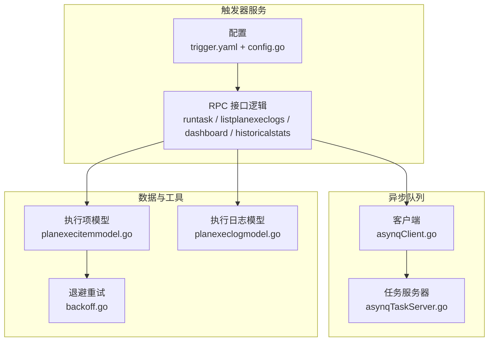
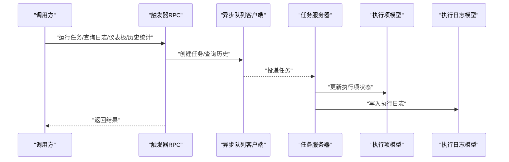
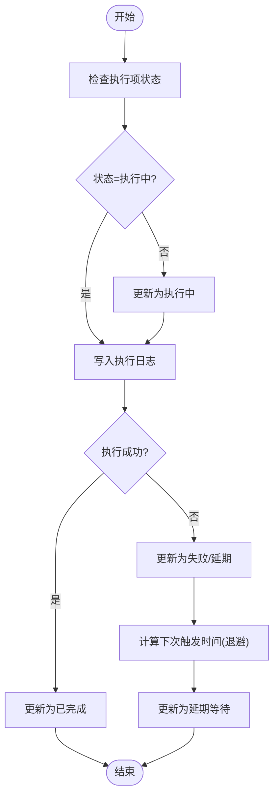
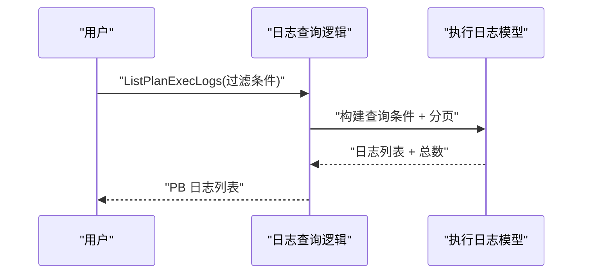
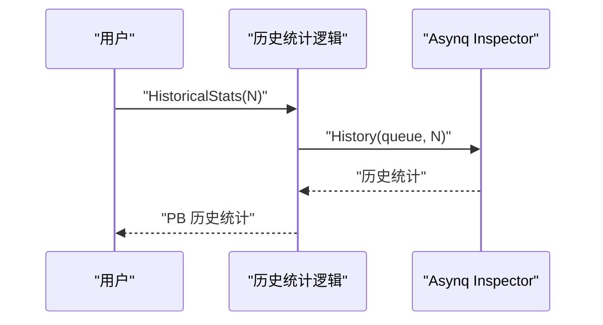
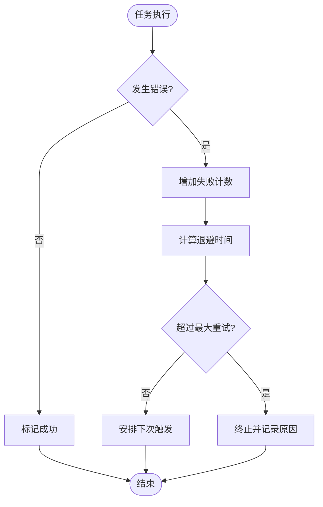
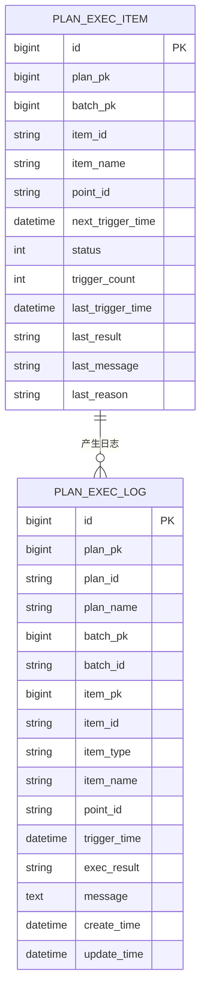
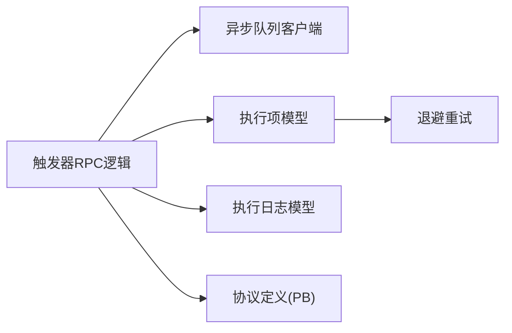

# 任务执行监控

<cite>
**本文引用的文件**
- [trigger.yaml](file://app/trigger/etc/trigger.yaml)
- [config.go](file://app/trigger/internal/config/config.go)
- [runtasklogic.go](file://app/trigger/internal/logic/runtasklogic.go)
- [listplanexeclogslogic.go](file://app/trigger/internal/logic/listplanexeclogslogic.go)
- [getexecitemdashboardlogic.go](file://app/trigger/internal/logic/getexecitemdashboardlogic.go)
- [historicalstatslogic.go](file://app/trigger/internal/logic/historicalstatslogic.go)
- [planexecitemmodel.go](file://model/planexecitemmodel.go)
- [planexeclogmodel.go](file://model/planexeclogmodel.go)
- [asynqClient.go](file://common/asynqx/asynqClient.go)
- [asynqTaskServer.go](file://common/asynqx/asynqTaskServer.go)
- [backoff.go](file://common/tool/backoff.go)
- [trigger.pb.go](file://app/trigger/trigger/trigger.pb.go)
- [trigger.pb.validate.go](file://app/trigger/trigger/trigger.pb.validate.go)
</cite>

## 目录
1. [简介](#简介)
2. [项目结构](#项目结构)
3. [核心组件](#核心组件)
4. [架构总览](#架构总览)
5. [详细组件分析](#详细组件分析)
6. [依赖分析](#依赖分析)
7. [性能考量](#性能考量)
8. [故障排查指南](#故障排查指南)
9. [结论](#结论)
10. [附录](#附录)

## 简介
本技术文档聚焦于“任务执行监控”模块，系统性阐述任务执行状态的监控机制与实现，包括：
- 任务进度跟踪：通过执行项状态机与日志记录实现全链路追踪
- 执行日志记录：按计划/批次/执行项维度持久化执行日志
- 性能指标采集：基于异步队列的历史统计与仪表板聚合
- 数据存储与查询：数据库模型与分页查询接口
- 异常检测与处理：超时检测、失败重试策略、告警推送
- 配置与定制：监控指标定义、阈值与告警规则配置
- 可视化与分析：仪表板统计、历史趋势、容量规划建议

## 项目结构
围绕任务执行监控的关键目录与文件如下：
- 触发器服务（trigger）：RPC 接口、业务逻辑、配置与模型
- 异步队列客户端与服务器（asynqx）：生产者/消费者、中间件与追踪
- 工具函数（tool）：退避重试计算
- 数据模型（model）：执行项与执行日志的数据库访问层
- 协议定义（trigger.proto 生成的 go 文件）：监控相关消息类型

图表来源
- [trigger.yaml:1-37](file://app/trigger/etc/trigger.yaml#L1-L37)
- [config.go:1-28](file://app/trigger/internal/config/config.go#L1-L28)
- [runtasklogic.go:1-37](file://app/trigger/internal/logic/runtasklogic.go#L1-L37)
- [listplanexeclogslogic.go:1-102](file://app/trigger/internal/logic/listplanexeclogslogic.go#L1-L102)
- [getexecitemdashboardlogic.go:1-143](file://app/trigger/internal/logic/getexecitemdashboardlogic.go#L1-L143)
- [historicalstatslogic.go:1-43](file://app/trigger/internal/logic/historicalstatslogic.go#L1-L43)
- [planexecitemmodel.go:1-435](file://model/planexecitemmodel.go#L1-L435)
- [planexeclogmodel.go:1-31](file://model/planexeclogmodel.go#L1-L31)
- [asynqClient.go:1-31](file://common/asynqx/asynqClient.go#L1-L31)
- [asynqTaskServer.go:1-87](file://common/asynqx/asynqTaskServer.go#L1-L87)
- [backoff.go:1-40](file://common/tool/backoff.go#L1-L40)

章节来源
- [trigger.yaml:1-37](file://app/trigger/etc/trigger.yaml#L1-L37)
- [config.go:1-28](file://app/trigger/internal/config/config.go#L1-L28)

## 核心组件
- 配置与注册中心集成：支持 Nacos 注册与 Redis 队列配置
- RPC 接口与逻辑：运行任务、分页查询执行日志、仪表板统计、历史统计
- 异步队列客户端与服务器：生产者/消费者、中间件日志与追踪
- 数据模型：执行项状态机与执行日志持久化
- 退避重试：指数退避与上限控制
- 协议与校验：PB 定义的任务信息、仪表板与历史统计消息类型

章节来源
- [runtasklogic.go:26-36](file://app/trigger/internal/logic/runtasklogic.go#L26-L36)
- [listplanexeclogslogic.go:27-101](file://app/trigger/internal/logic/listplanexeclogslogic.go#L27-L101)
- [getexecitemdashboardlogic.go:26-142](file://app/trigger/internal/logic/getexecitemdashboardlogic.go#L26-L142)
- [historicalstatslogic.go:27-42](file://app/trigger/internal/logic/historicalstatslogic.go#L27-L42)
- [asynqClient.go:17-23](file://common/asynqx/asynqClient.go#L17-L23)
- [asynqTaskServer.go:39-64](file://common/asynqx/asynqTaskServer.go#L39-L64)
- [planexecitemmodel.go:74-144](file://model/planexecitemmodel.go#L74-L144)
- [planexecitemmodel.go:202-271](file://model/planexecitemmodel.go#L202-L271)
- [backoff.go:9-35](file://common/tool/backoff.go#L9-L35)
- [trigger.pb.go:210-278](file://app/trigger/trigger/trigger.pb.go#L210-L278)

## 架构总览
下图展示了从 RPC 请求到异步队列执行、再到数据库持久化的整体流程。

图表来源
- [runtasklogic.go:27-35](file://app/trigger/internal/logic/runtasklogic.go#L27-L35)
- [asynqClient.go:17-23](file://common/asynqx/asynqClient.go#L17-L23)
- [asynqTaskServer.go:28-37](file://common/asynqx/asynqTaskServer.go#L28-L37)
- [planexecitemmodel.go:165-200](file://model/planexecitemmodel.go#L165-L200)
- [planexeclogmodel.go:20-31](file://model/planexeclogmodel.go#L20-L31)

## 详细组件分析

### 组件一：任务执行状态监控与进度跟踪
- 执行项状态机：支持“待执行/延期等待/执行中/已完成/已终止”等状态转换，并在失败时根据退避策略计算下次触发时间
- 日志记录：执行完成后写入执行日志表，包含计划/批次/执行项标识、触发时间、执行结果与消息
- 超时与失败处理：结合 Asynq Inspector 的历史统计与自定义退避策略，实现超时检测与失败重试

图表来源
- [planexecitemmodel.go:146-200](file://model/planexecitemmodel.go#L146-L200)
- [planexecitemmodel.go:202-271](file://model/planexecitemmodel.go#L202-L271)
- [backoff.go:9-35](file://common/tool/backoff.go#L9-L35)

章节来源
- [planexecitemmodel.go:74-144](file://model/planexecitemmodel.go#L74-L144)
- [planexecitemmodel.go:146-200](file://model/planexecitemmodel.go#L146-L200)
- [planexecitemmodel.go:202-271](file://model/planexecitemmodel.go#L202-L271)
- [backoff.go:9-35](file://common/tool/backoff.go#L9-L35)

### 组件二：执行日志记录与查询
- 分页查询：支持按计划/批次/执行项/触发时间范围/执行结果等多维过滤
- 字段映射：将数据库记录转换为 PB 结构体，便于 RPC 返回
- 时间格式：统一使用碳时区库进行时间字符串转换

图表来源
- [listplanexeclogslogic.go:27-101](file://app/trigger/internal/logic/listplanexeclogslogic.go#L27-L101)
- [planexeclogmodel.go:20-31](file://model/planexeclogmodel.go#L20-L31)

章节来源
- [listplanexeclogslogic.go:27-101](file://app/trigger/internal/logic/listplanexeclogslogic.go#L27-L101)

### 组件三：性能指标与历史统计
- 历史统计：通过 Asynq Inspector 获取队列历史统计数据，映射为 PB 结构返回
- 仪表板：按计划类型聚合统计，输出总数、已完成、待完成、延期等指标

图表来源
- [historicalstatslogic.go:27-42](file://app/trigger/internal/logic/historicalstatslogic.go#L27-L42)
- [asynqClient.go:21-23](file://common/asynqx/asynqClient.go#L21-L23)

章节来源
- [getexecitemdashboardlogic.go:26-142](file://app/trigger/internal/logic/getexecitemdashboardlogic.go#L26-L142)
- [historicalstatslogic.go:27-42](file://app/trigger/internal/logic/historicalstatslogic.go#L27-L42)

### 组件四：异常检测与处理流程
- 超时检测：Asynq 任务处理器内置错误判定，结合日志中间件记录耗时与错误
- 失败重试：根据失败次数采用指数退避策略，超过上限自动终止
- 告警推送：可扩展至告警服务（当前仓库包含告警与触发器的独立模块）

图表来源
- [asynqTaskServer.go:51-54](file://common/asynqx/asynqTaskServer.go#L51-L54)
- [asynqTaskServer.go:73-86](file://common/asynqx/asynqTaskServer.go#L73-L86)
- [planexecitemmodel.go:230-255](file://model/planexecitemmodel.go#L230-L255)
- [backoff.go:9-35](file://common/tool/backoff.go#L9-L35)

章节来源
- [asynqTaskServer.go:39-64](file://common/asynqx/asynqTaskServer.go#L39-L64)
- [planexecitemmodel.go:202-271](file://model/planexecitemmodel.go#L202-L271)
- [backoff.go:9-35](file://common/tool/backoff.go#L9-L35)

### 组件五：监控数据存储与查询机制
- 存储：执行项与执行日志分别由对应模型持久化
- 查询：提供分页查询接口与仪表板聚合查询
- 归档与统计：历史统计接口返回队列层面的执行趋势；可结合业务需求对历史数据进行归档与离线分析

图表来源
- [planexecitemmodel.go:1-435](file://model/planexecitemmodel.go#L1-L435)
- [planexeclogmodel.go:1-31](file://model/planexeclogmodel.go#L1-L31)

章节来源
- [planexecitemmodel.go:1-435](file://model/planexecitemmodel.go#L1-L435)
- [planexeclogmodel.go:1-31](file://model/planexeclogmodel.go#L1-L31)

### 组件六：配置与定制化方案
- 服务配置：RPC 地址、日志级别、Nacos 注册、Redis 队列、数据库连接、优雅停机周期
- 队列与并发：异步服务器配置了队列优先级、并发度与日志中间件
- 监控指标定义：可通过扩展 RPC 接口与模型方法新增自定义指标（如延迟、吞吐、错误率）
- 阈值与告警规则：可在上层告警服务中配置（当前仓库包含独立告警模块），结合历史统计与仪表板数据进行阈值判断

章节来源
- [trigger.yaml:1-37](file://app/trigger/etc/trigger.yaml#L1-L37)
- [config.go:9-27](file://app/trigger/internal/config/config.go#L9-L27)
- [asynqTaskServer.go:50-63](file://common/asynqx/asynqTaskServer.go#L50-L63)

## 依赖分析
- 触发器服务依赖异步队列客户端与服务器，以及数据库模型
- 执行项模型依赖退避工具以实现失败重试
- 协议文件提供监控相关消息类型的字段定义与校验

图表来源
- [runtasklogic.go:1-37](file://app/trigger/internal/logic/runtasklogic.go#L1-L37)
- [asynqClient.go:1-31](file://common/asynqx/asynqClient.go#L1-L31)
- [planexecitemmodel.go:1-435](file://model/planexecitemmodel.go#L1-L435)
- [backoff.go:1-40](file://common/tool/backoff.go#L1-L40)
- [trigger.pb.go:210-278](file://app/trigger/trigger/trigger.pb.go#L210-L278)

章节来源
- [trigger.pb.validate.go:1986-2010](file://app/trigger/trigger/trigger.pb.validate.go#L1986-L2010)
- [trigger.pb.validate.go:2079-2120](file://app/trigger/trigger/trigger.pb.validate.go#L2079-L2120)

## 性能考量
- 队列并发与队列优先级：合理设置并发度与队列权重，避免热点队列阻塞
- 日志中间件：记录处理耗时与错误，便于定位慢任务与异常
- 退避策略：防止雪崩效应，控制重试频率与上限
- 数据库查询：分页查询与条件过滤，避免全表扫描；聚合统计尽量在数据库侧完成

## 故障排查指南
- 任务长时间未执行：检查执行项状态与下次触发时间，确认计划/批次状态是否启用
- 任务频繁失败：查看执行日志与最近错误，结合历史统计观察失败趋势
- 超时与中断：检查 Asynq 服务器日志与中间件耗时统计，必要时调整并发与队列配置
- 告警缺失：确认告警服务配置与规则，结合历史统计与仪表板验证阈值有效性

章节来源
- [asynqTaskServer.go:73-86](file://common/asynqx/asynqTaskServer.go#L73-L86)
- [listplanexeclogslogic.go:27-101](file://app/trigger/internal/logic/listplanexeclogslogic.go#L27-L101)
- [historicalstatslogic.go:27-42](file://app/trigger/internal/logic/historicalstatslogic.go#L27-L42)

## 结论
本模块通过“状态机 + 日志 + 历史统计 + 退避重试”的组合，实现了对任务执行的全生命周期监控。配合异步队列与数据库模型，能够满足高并发场景下的可观测性与可运维性需求。建议在实际部署中结合业务场景完善告警规则与容量规划，并持续优化队列与数据库性能。

## 附录

### 监控数据可视化与报表生成
- 仪表板：按计划类型聚合统计，输出总数、已完成、待完成、延期等关键指标
- 历史趋势：基于队列历史统计，生成每日/每周执行趋势图
- 报表：结合分页查询结果导出执行明细报表

章节来源
- [getexecitemdashboardlogic.go:26-142](file://app/trigger/internal/logic/getexecitemdashboardlogic.go#L26-L142)
- [historicalstatslogic.go:27-42](file://app/trigger/internal/logic/historicalstatslogic.go#L27-L42)

### 性能瓶颈分析与容量规划建议
- 瓶颈识别：关注日志中间件耗时分布、队列积压与失败率
- 容量规划：根据历史统计峰值与增长趋势，评估队列并发与数据库连接池规模
- 优化方向：引入限流、熔断与异步批处理，减少热点任务对系统的影响

### 具体代码示例路径（不直接展示代码内容）
- 添加自定义监控指标
  - 在 RPC 逻辑中扩展返回字段，参考：[runtasklogic.go:27-35](file://app/trigger/internal/logic/runtasklogic.go#L27-L35)
  - 在模型中新增聚合查询方法，参考：[planexecitemmodel.go:401-430](file://model/planexecitemmodel.go#L401-L430)
- 配置告警规则
  - 参考告警服务模块（独立应用），结合历史统计与仪表板数据进行阈值配置
- 查询执行历史
  - 使用分页查询接口，参考：[listplanexeclogslogic.go:27-101](file://app/trigger/internal/logic/listplanexeclogslogic.go#L27-L101)