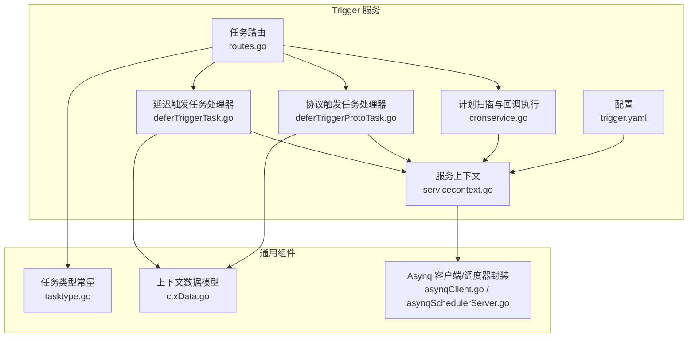
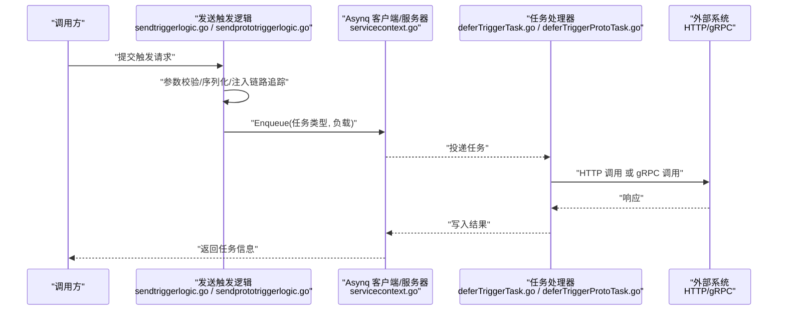
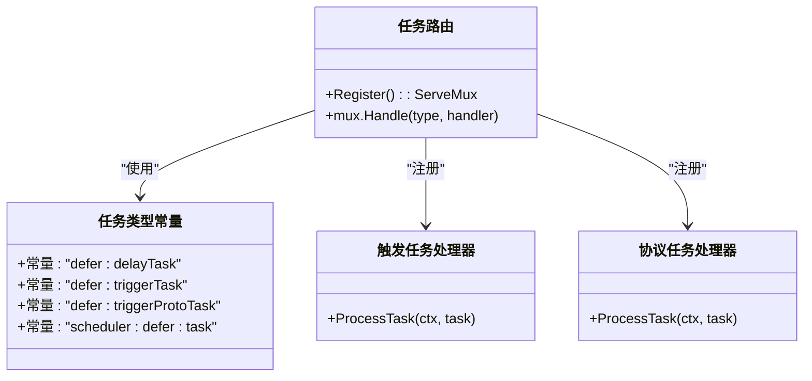
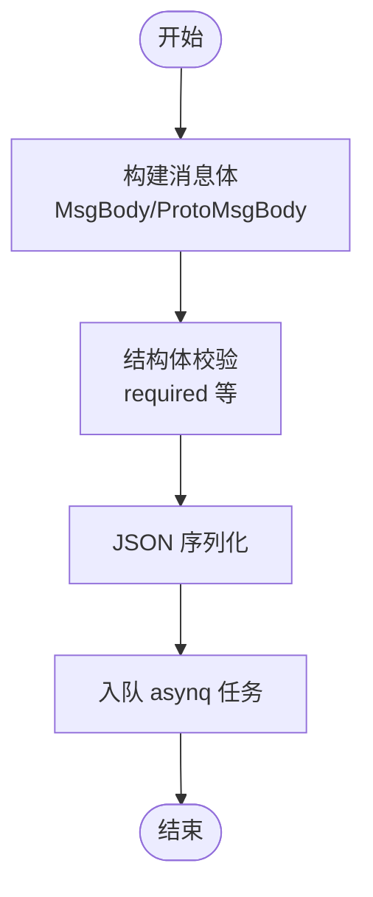
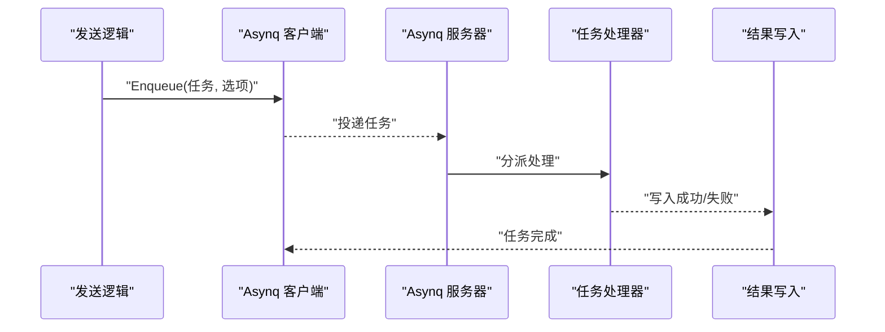
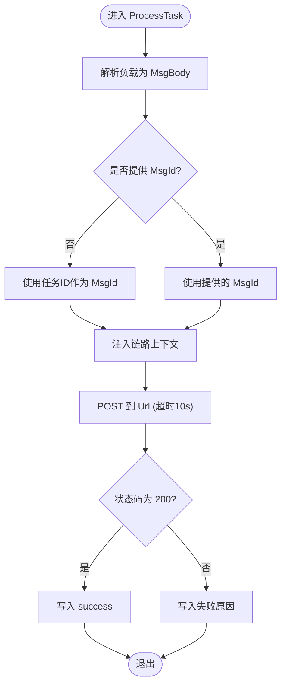
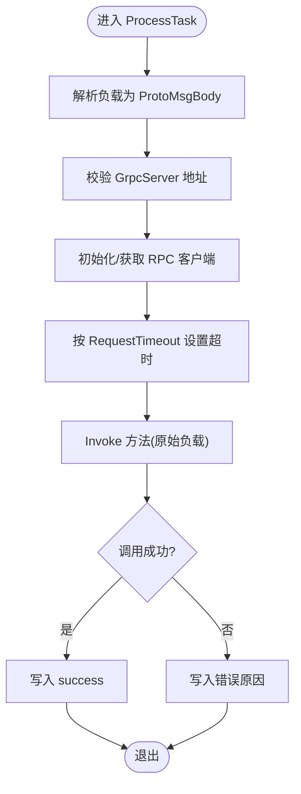
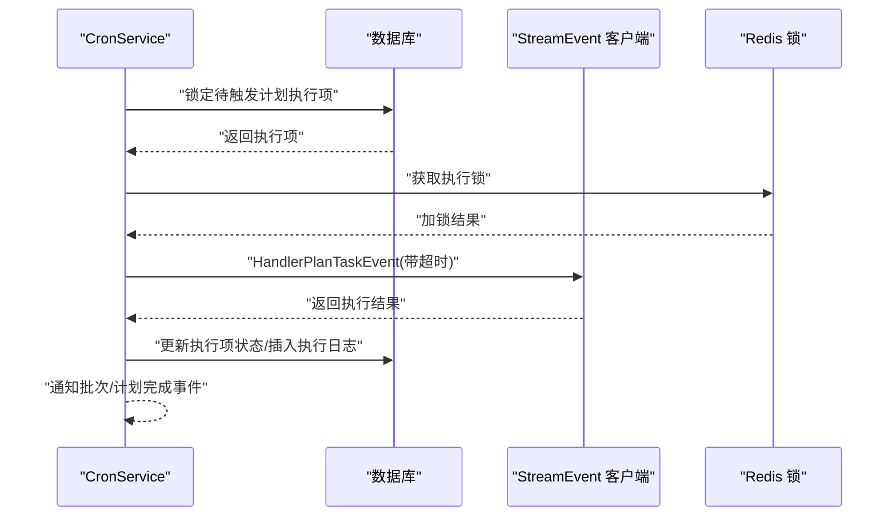
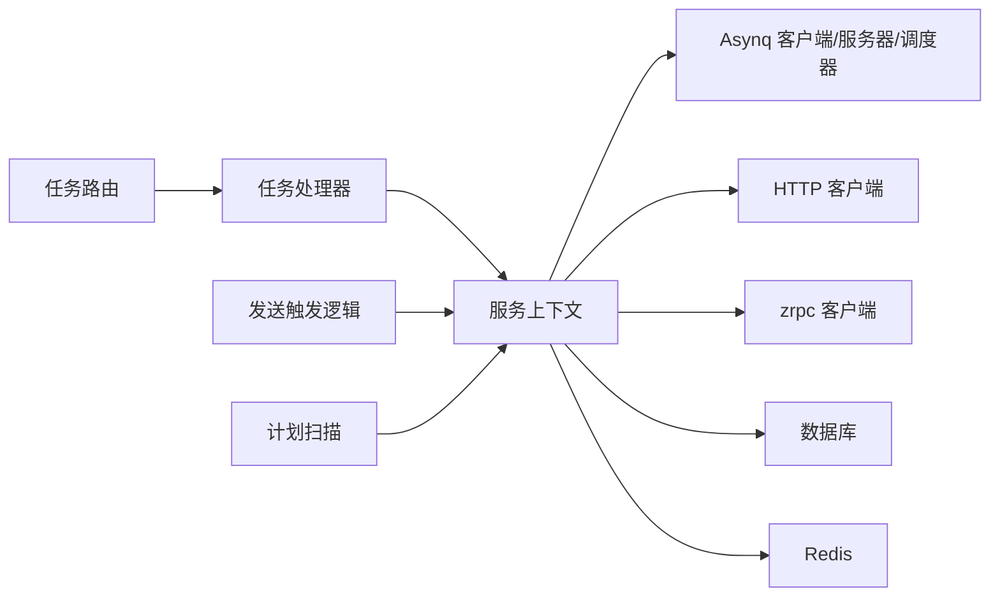

# 任务类型与管理

<cite>
**本文引用的文件**
- [app/trigger/internal/task/routes.go](file://app/trigger/internal/task/routes.go)
- [app/trigger/internal/task/deferTriggerTask.go](file://app/trigger/internal/task/deferTriggerTask.go)
- [app/trigger/internal/task/deferTriggerProtoTask.go](file://app/trigger/internal/task/deferTriggerProtoTask.go)
- [common/asynqx/tasktype.go](file://common/asynqx/tasktype.go)
- [app/trigger/internal/logic/sendtriggerlogic.go](file://app/trigger/internal/logic/sendtriggerlogic.go)
- [app/trigger/internal/logic/sendprototriggerlogic.go](file://app/trigger/internal/logic/sendprototriggerlogic.go)
- [app/trigger/cron/cronservice.go](file://app/trigger/cron/cronservice.go)
- [app/trigger/etc/trigger.yaml](file://app/trigger/etc/trigger.yaml)
- [app/trigger/internal/svc/servicecontext.go](file://app/trigger/internal/svc/servicecontext.go)
- [common/ctxdata/ctxData.go](file://common/ctxdata/ctxData.go)
- [common/asynqx/asynqClient.go](file://common/asynqx/asynqClient.go)
- [common/asynqx/asynqSchedulerServer.go](file://common/asynqx/asynqSchedulerServer.go)
- [app/trigger/internal/task/scheduler/schedulerdefertask.go](file://app/trigger/internal/task/scheduler/schedulerdefertask.go)
</cite>

## 目录
1. [引言](#引言)
2. [项目结构](#项目结构)
3. [核心组件](#核心组件)
4. [架构总览](#架构总览)
5. [详细组件分析](#详细组件分析)
6. [依赖分析](#依赖分析)
7. [性能考虑](#性能考虑)
8. [故障排查指南](#故障排查指南)
9. [结论](#结论)
10. [附录：扩展最佳实践与示例路径](#附录扩展最佳实践与示例路径)

## 引言
本技术文档聚焦于 Trigger 服务的任务类型与管理模块，系统性阐述延迟任务、触发任务与协议任务的类型体系、注册机制、参数校验与序列化处理、生命周期管理（从创建、排队到执行完成），以及任务类型的扩展实践（自定义任务类型开发与集成）。文档同时覆盖任务优先级、超时控制与资源限制策略，并通过图示与示例路径帮助读者快速落地。

## 项目结构
Trigger 服务围绕 asynq 队列与调度器构建，核心由以下层次组成：
- 任务路由与处理器：定义任务类型常量、注册任务处理器、处理队列任务
- 业务逻辑层：对外暴露发送触发任务的接口，负责参数校验、序列化与入队
- 服务上下文：统一注入 asynq 客户端/服务器/调度器、HTTP 客户端、数据库与 RPC 客户端等
- 配置：Redis 连接、数据库、StreamEvent gRPC 目标、日志级别等
- 调度与计划：基于 asynq 的定时调度与计划执行回调

图表来源
- [app/trigger/internal/task/routes.go:21-34](file://app/trigger/internal/task/routes.go#L21-L34)
- [app/trigger/internal/task/deferTriggerTask.go:32-72](file://app/trigger/internal/task/deferTriggerTask.go#L32-L72)
- [app/trigger/internal/task/deferTriggerProtoTask.go:38-94](file://app/trigger/internal/task/deferTriggerProtoTask.go#L38-L94)
- [app/trigger/cron/cronservice.go:203-468](file://app/trigger/cron/cronservice.go#L203-L468)
- [app/trigger/internal/svc/servicecontext.go:29-91](file://app/trigger/internal/svc/servicecontext.go#L29-L91)
- [common/asynqx/tasktype.go:3-9](file://common/asynqx/tasktype.go#L3-L9)
- [common/ctxdata/ctxData.go:26-40](file://common/ctxdata/ctxData.go#L26-L40)
- [common/asynqx/asynqClient.go:17-29](file://common/asynqx/asynqClient.go#L17-L29)
- [common/asynqx/asynqSchedulerServer.go:32-51](file://common/asynqx/asynqSchedulerServer.go#L32-L51)

章节来源
- [app/trigger/internal/task/routes.go:1-35](file://app/trigger/internal/task/routes.go#L1-L35)
- [app/trigger/internal/svc/servicecontext.go:29-91](file://app/trigger/internal/svc/servicecontext.go#L29-L91)
- [app/trigger/etc/trigger.yaml:1-37](file://app/trigger/etc/trigger.yaml#L1-L37)

## 核心组件
- 任务类型常量：集中定义延迟任务、触发任务、协议任务与调度器任务类型
- 任务处理器：分别处理 HTTP 触发与 gRPC 协议触发，含超时、重试、结果回写
- 业务逻辑：发送触发任务，支持立即执行或延时执行，支持定时触发
- 服务上下文：统一装配 asynq 客户端/服务器/调度器、HTTP 客户端、RPC 客户端、数据库与 Redis
- 调度与计划：基于 asynq 的定时任务与计划项扫描执行

章节来源
- [common/asynqx/tasktype.go:3-9](file://common/asynqx/tasktype.go#L3-L9)
- [app/trigger/internal/task/deferTriggerTask.go:20-72](file://app/trigger/internal/task/deferTriggerTask.go#L20-L72)
- [app/trigger/internal/task/deferTriggerProtoTask.go:26-94](file://app/trigger/internal/task/deferTriggerProtoTask.go#L26-L94)
- [app/trigger/internal/logic/sendtriggerlogic.go:37-104](file://app/trigger/internal/logic/sendtriggerlogic.go#L37-L104)
- [app/trigger/internal/logic/sendprototriggerlogic.go:40-100](file://app/trigger/internal/logic/sendprototriggerlogic.go#L40-L100)
- [app/trigger/internal/svc/servicecontext.go:29-91](file://app/trigger/internal/svc/servicecontext.go#L29-L91)
- [app/trigger/cron/cronservice.go:203-468](file://app/trigger/cron/cronservice.go#L203-L468)

## 架构总览
Trigger 服务采用“生产者-消费者”模式，结合 asynq 的客户端、服务器与调度器，形成完整的任务生命周期闭环。生产者通过业务逻辑层将任务序列化后入队；消费者侧按任务类型分派至对应处理器；计划扫描模块在满足条件时触发回调执行。

图表来源
- [app/trigger/internal/logic/sendtriggerlogic.go:37-104](file://app/trigger/internal/logic/sendtriggerlogic.go#L37-L104)
- [app/trigger/internal/logic/sendprototriggerlogic.go:40-100](file://app/trigger/internal/logic/sendprototriggerlogic.go#L40-L100)
- [app/trigger/internal/svc/servicecontext.go:65-68](file://app/trigger/internal/svc/servicecontext.go#L65-L68)
- [app/trigger/internal/task/deferTriggerTask.go:32-72](file://app/trigger/internal/task/deferTriggerTask.go#L32-L72)
- [app/trigger/internal/task/deferTriggerProtoTask.go:38-94](file://app/trigger/internal/task/deferTriggerProtoTask.go#L38-L94)

## 详细组件分析

### 任务类型系统与注册机制
- 类型常量：集中定义延迟任务、触发任务、协议任务与调度器任务类型，便于全局引用与一致性维护
- 注册机制：在任务路由中使用 asynq ServeMux 将任务类型映射到对应的处理器，并启用日志中间件
- 调度器任务：支持以定时表达式注册周期性任务，用于计划扫描与批量触发

图表来源
- [common/asynqx/tasktype.go:3-9](file://common/asynqx/tasktype.go#L3-L9)
- [app/trigger/internal/task/routes.go:21-34](file://app/trigger/internal/task/routes.go#L21-L34)
- [app/trigger/internal/task/deferTriggerTask.go:32-72](file://app/trigger/internal/task/deferTriggerTask.go#L32-L72)
- [app/trigger/internal/task/deferTriggerProtoTask.go:38-94](file://app/trigger/internal/task/deferTriggerProtoTask.go#L38-L94)

章节来源
- [common/asynqx/tasktype.go:3-9](file://common/asynqx/tasktype.go#L3-L9)
- [app/trigger/internal/task/routes.go:21-34](file://app/trigger/internal/task/routes.go#L21-L34)

### 参数验证与序列化处理
- 触发任务参数：包含消息 ID、链路追踪载体、消息体与目标 URL；通过结构体标签进行必填校验
- 协议任务参数：包含消息 ID、链路追踪载体、gRPC 服务地址、方法名、负载与请求超时；支持正则校验服务地址格式
- 序列化：使用 JSON 对消息体进行序列化后作为任务负载；在处理器中反序列化并提取链路上下文

图表来源
- [common/ctxdata/ctxData.go:26-40](file://common/ctxdata/ctxData.go#L26-L40)
- [app/trigger/internal/logic/sendtriggerlogic.go:59-62](file://app/trigger/internal/logic/sendtriggerlogic.go#L59-L62)
- [app/trigger/internal/logic/sendprototriggerlogic.go:68-71](file://app/trigger/internal/logic/sendprototriggerlogic.go#L68-L71)

章节来源
- [common/ctxdata/ctxData.go:26-40](file://common/ctxdata/ctxData.go#L26-L40)
- [app/trigger/internal/logic/sendtriggerlogic.go:59-62](file://app/trigger/internal/logic/sendtriggerlogic.go#L59-L62)
- [app/trigger/internal/logic/sendprototriggerlogic.go:68-71](file://app/trigger/internal/logic/sendprototriggerlogic.go#L68-L71)

### 任务生命周期管理
- 创建：业务逻辑层根据是否指定触发时间或延迟秒数，构造 asynq 任务选项（如 MaxRetry、Queue、Retention、ProcessIn）
- 入队：通过 Asynq 客户端 Enqueue 将任务放入指定队列
- 执行：Asynq 服务器根据任务类型分派到对应处理器；处理器执行 HTTP 或 gRPC 调用，写入结果
- 完成：任务完成后可被保留一定时间以便查询状态

图表来源
- [app/trigger/internal/logic/sendtriggerlogic.go:94-103](file://app/trigger/internal/logic/sendtriggerlogic.go#L94-L103)
- [app/trigger/internal/logic/sendprototriggerlogic.go:91-99](file://app/trigger/internal/logic/sendprototriggerlogic.go#L91-L99)
- [app/trigger/internal/task/deferTriggerTask.go:32-72](file://app/trigger/internal/task/deferTriggerTask.go#L32-L72)
- [app/trigger/internal/task/deferTriggerProtoTask.go:38-94](file://app/trigger/internal/task/deferTriggerProtoTask.go#L38-L94)

章节来源
- [app/trigger/internal/logic/sendtriggerlogic.go:63-103](file://app/trigger/internal/logic/sendtriggerlogic.go#L63-L103)
- [app/trigger/internal/logic/sendprototriggerlogic.go:72-99](file://app/trigger/internal/logic/sendprototriggerlogic.go#L72-L99)
- [app/trigger/internal/task/deferTriggerTask.go:32-72](file://app/trigger/internal/task/deferTriggerTask.go#L32-L72)
- [app/trigger/internal/task/deferTriggerProtoTask.go:38-94](file://app/trigger/internal/task/deferTriggerProtoTask.go#L38-L94)

### 触发任务（HTTP）处理流程
- 提取链路上下文，开启消费端 Span
- 若未提供消息 ID，则使用任务 ID 作为消息 ID
- 使用 HTTP 客户端向目标 URL 发起 POST 请求，超时默认 10 秒
- 根据响应状态码写入成功或失败结果

图表来源
- [app/trigger/internal/task/deferTriggerTask.go:32-72](file://app/trigger/internal/task/deferTriggerTask.go#L32-L72)

章节来源
- [app/trigger/internal/task/deferTriggerTask.go:32-72](file://app/trigger/internal/task/deferTriggerTask.go#L32-L72)

### 协议任务（gRPC）处理流程
- 提取链路上下文，开启消费端 Span
- 校验 gRPC 服务地址格式
- 初始化或复用 gRPC 客户端连接，设置超时与拦截器
- 按方法名与原始负载发起 Invoke 调用，记录耗时与目标
- 写入结果并返回

图表来源
- [app/trigger/internal/task/deferTriggerProtoTask.go:38-94](file://app/trigger/internal/task/deferTriggerProtoTask.go#L38-L94)
- [common/ctxdata/ctxData.go:33-40](file://common/ctxdata/ctxData.go#L33-L40)

章节来源
- [app/trigger/internal/task/deferTriggerProtoTask.go:38-94](file://app/trigger/internal/task/deferTriggerProtoTask.go#L38-L94)
- [common/ctxdata/ctxData.go:33-40](file://common/ctxdata/ctxData.go#L33-L40)

### 计划扫描与回调执行
- 扫描计划执行项：加锁获取待触发项，更新扫描标记
- 执行回调：根据配置设置超时，调用 StreamEvent 服务处理计划事件
- 结果处理：根据返回结果更新执行项状态（完成/失败/延迟/进行中/终止），记录执行日志并通知批次/计划完成事件

图表来源
- [app/trigger/cron/cronservice.go:81-184](file://app/trigger/cron/cronservice.go#L81-L184)
- [app/trigger/cron/cronservice.go:203-468](file://app/trigger/cron/cronservice.go#L203-L468)

章节来源
- [app/trigger/cron/cronservice.go:81-184](file://app/trigger/cron/cronservice.go#L81-L184)
- [app/trigger/cron/cronservice.go:203-468](file://app/trigger/cron/cronservice.go#L203-L468)

## 依赖分析
- 组件耦合：任务处理器依赖服务上下文中的 HTTP 客户端与 RPC 客户端；业务逻辑依赖 asynq 客户端与验证器；计划扫描依赖数据库与 Redis
- 外部依赖：Redis 作为队列存储；MySQL/PG 作为持久化；StreamEvent 作为回调执行目标
- 可能的循环依赖：当前结构清晰，未见循环导入

图表来源
- [app/trigger/internal/task/routes.go:21-34](file://app/trigger/internal/task/routes.go#L21-L34)
- [app/trigger/internal/svc/servicecontext.go:65-89](file://app/trigger/internal/svc/servicecontext.go#L65-L89)

章节来源
- [app/trigger/internal/svc/servicecontext.go:65-89](file://app/trigger/internal/svc/servicecontext.go#L65-L89)

## 性能考虑
- 队列与重试：通过 Queue 与 Retention 控制任务优先级与保留时间；MaxRetry 控制失败重试次数
- 超时控制：HTTP 触发默认 10 秒；gRPC 触发默认使用客户端超时，可按需传入 RequestTimeout
- 并发与资源：Asynq 服务器并发处理任务；计划扫描使用 TaskRunner 并发执行回调；gRPC 最大消息大小已配置为极大值
- 日志与可观测性：统一注入链路追踪，消费端 Span 记录任务类型与耗时

章节来源
- [app/trigger/internal/logic/sendtriggerlogic.go:63-66](file://app/trigger/internal/logic/sendtriggerlogic.go#L63-L66)
- [app/trigger/internal/logic/sendprototriggerlogic.go:72-75](file://app/trigger/internal/logic/sendprototriggerlogic.go#L72-L75)
- [app/trigger/internal/task/deferTriggerTask.go:55-57](file://app/trigger/internal/task/deferTriggerTask.go#L55-L57)
- [app/trigger/internal/task/deferTriggerProtoTask.go:74-81](file://app/trigger/internal/task/deferTriggerProtoTask.go#L74-L81)
- [app/trigger/internal/svc/servicecontext.go:79-87](file://app/trigger/internal/svc/servicecontext.go#L79-L87)

## 故障排查指南
- 任务未执行：检查任务类型是否正确注册、队列名称是否匹配、是否达到 ProcessIn 时间
- HTTP 触发失败：确认 URL 可达、响应码为 200、超时设置合理；查看结果写入内容
- gRPC 触发失败：确认服务地址格式合法、目标可达、方法名正确、负载格式符合约定
- 计划扫描异常：检查数据库锁与扫描标记更新、Redis 锁获取、StreamEvent 调用超时
- 验证失败：检查必填字段是否缺失，如 URL、gRPC 服务地址、方法名等

章节来源
- [app/trigger/internal/task/deferTriggerTask.go:59-68](file://app/trigger/internal/task/deferTriggerTask.go#L59-L68)
- [app/trigger/internal/task/deferTriggerProtoTask.go:88-91](file://app/trigger/internal/task/deferTriggerProtoTask.go#L88-L91)
- [app/trigger/internal/logic/sendprototriggerlogic.go:46-49](file://app/trigger/internal/logic/sendprototriggerlogic.go#L46-L49)
- [app/trigger/cron/cronservice.go:129-139](file://app/trigger/cron/cronservice.go#L129-L139)

## 结论
Trigger 服务通过明确的任务类型体系、严格的参数校验与序列化、完善的生命周期管理与可观测性，提供了稳定可靠的异步任务能力。结合 asynq 的客户端/服务器/调度器与计划扫描机制，能够满足延迟任务、触发任务与协议任务的多样化场景需求。建议在扩展新任务类型时遵循现有模式，确保类型常量、处理器、注册与参数校验的一致性。

## 附录：扩展最佳实践与示例路径
- 自定义任务类型开发
  - 定义任务类型常量：参考 [common/asynqx/tasktype.go:3-9](file://common/asynqx/tasktype.go#L3-L9)
  - 实现任务处理器：参考 [app/trigger/internal/task/deferTriggerTask.go:32-72](file://app/trigger/internal/task/deferTriggerTask.go#L32-L72) 与 [app/trigger/internal/task/deferTriggerProtoTask.go:38-94](file://app/trigger/internal/task/deferTriggerProtoTask.go#L38-L94)
  - 注册任务处理器：参考 [app/trigger/internal/task/routes.go:21-34](file://app/trigger/internal/task/routes.go#L21-L34)
  - 在业务逻辑中发送任务：参考 [app/trigger/internal/logic/sendtriggerlogic.go:37-104](file://app/trigger/internal/logic/sendtriggerlogic.go#L37-L104) 与 [app/trigger/internal/logic/sendprototriggerlogic.go:40-100](file://app/trigger/internal/logic/sendprototriggerlogic.go#L40-L100)
- 配置任务参数
  - 必填字段与校验：参考 [common/ctxdata/ctxData.go:26-40](file://common/ctxdata/ctxData.go#L26-L40)
  - 超时与重试：参考 [app/trigger/internal/logic/sendtriggerlogic.go:63-66](file://app/trigger/internal/logic/sendtriggerlogic.go#L63-L66)、[app/trigger/internal/logic/sendprototriggerlogic.go:72-75](file://app/trigger/internal/logic/sendprototriggerlogic.go#L72-L75)
- 处理任务结果
  - HTTP 结果写入：参考 [app/trigger/internal/task/deferTriggerTask.go:63-68](file://app/trigger/internal/task/deferTriggerTask.go#L63-L68)
  - gRPC 结果写入：参考 [app/trigger/internal/task/deferTriggerProtoTask.go:88-91](file://app/trigger/internal/task/deferTriggerProtoTask.go#L88-L91)
- 资源限制策略
  - Asynq 客户端/服务器/调度器封装：参考 [common/asynqx/asynqClient.go:17-29](file://common/asynqx/asynqClient.go#L17-L29)、[common/asynqx/asynqSchedulerServer.go:32-51](file://common/asynqx/asynqSchedulerServer.go#L32-L51)
  - gRPC 最大消息大小：参考 [app/trigger/internal/svc/servicecontext.go:82-86](file://app/trigger/internal/svc/servicecontext.go#L82-L86)
- 定时与计划
  - 调度器任务注册：参考 [app/trigger/internal/task/scheduler/schedulerdefertask.go:20-24](file://app/trigger/internal/task/scheduler/schedulerdefertask.go#L20-L24)
  - 计划扫描与回调：参考 [app/trigger/cron/cronservice.go:203-468](file://app/trigger/cron/cronservice.go#L203-L468)