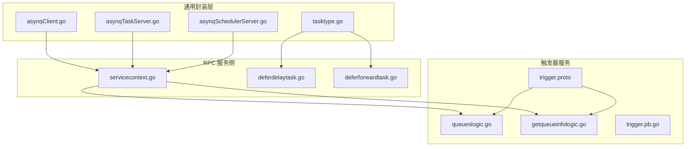
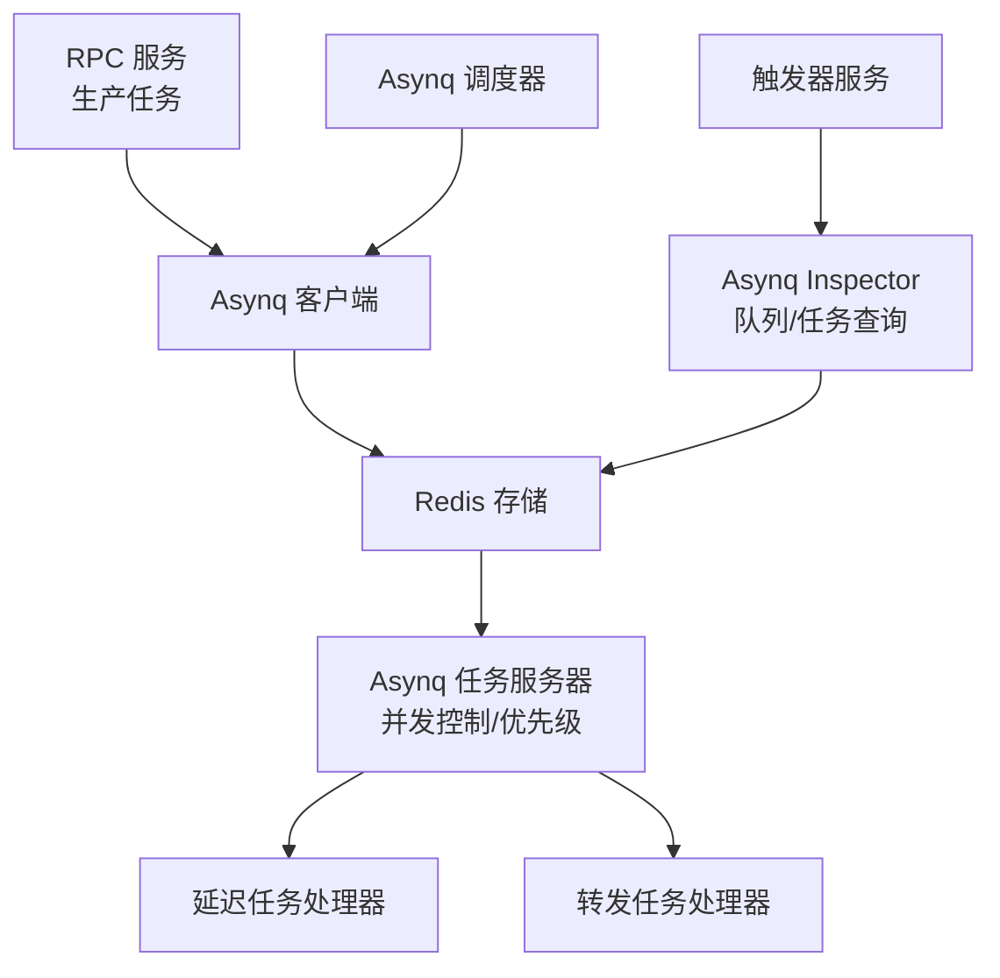
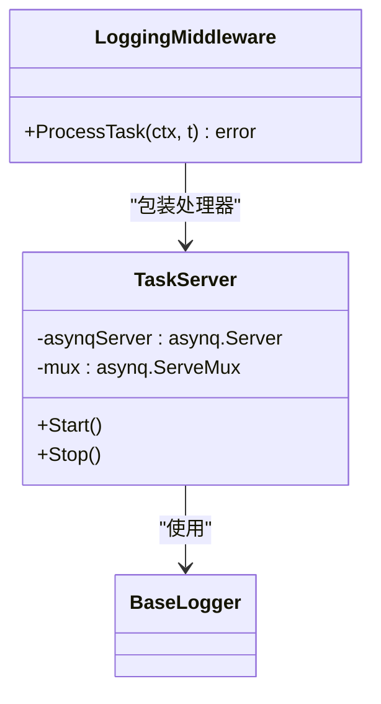
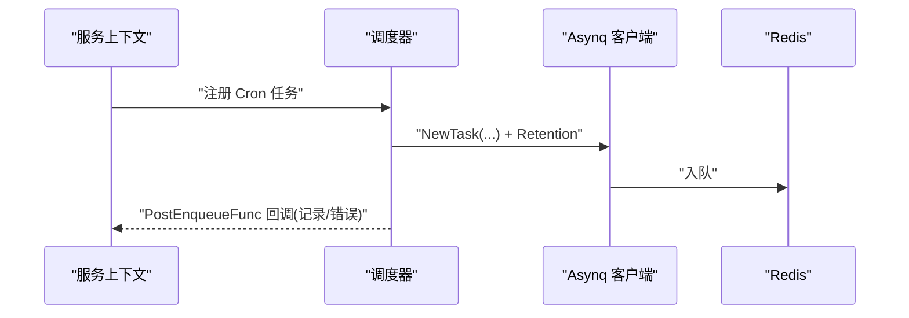
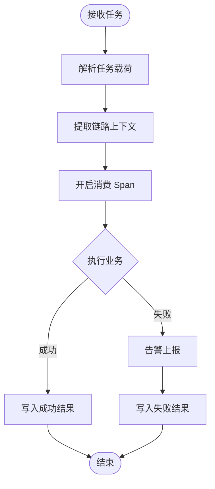
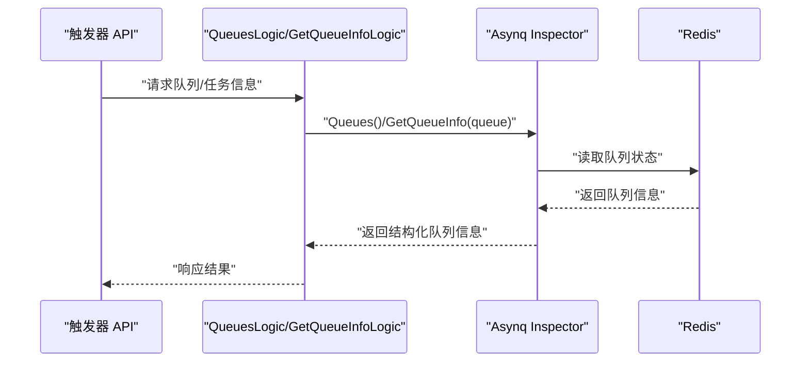
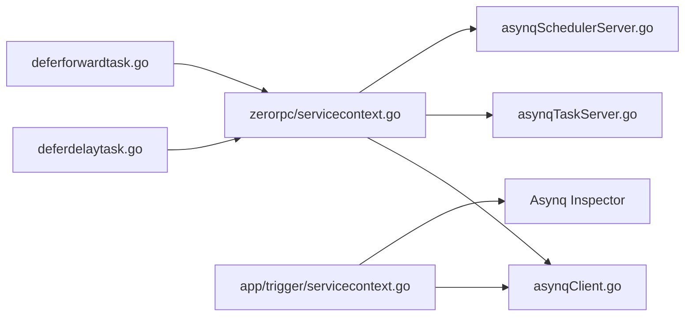

# 任务队列管理

<cite>
**本文引用的文件**
- [common/asynqx/asynqClient.go](file://common/asynqx/asynqClient.go)
- [common/asynqx/asynqTaskServer.go](file://common/asynqx/asynqTaskServer.go)
- [common/asynqx/asynqSchedulerServer.go](file://common/asynqx/asynqSchedulerServer.go)
- [common/asynqx/tasktype.go](file://common/asynqx/tasktype.go)
- [zerorpc/internal/svc/asynqClient.go](file://zerorpc/internal/svc/asynqClient.go)
- [zerorpc/internal/svc/asynqTaskServer.go](file://zerorpc/internal/svc/asynqTaskServer.go)
- [zerorpc/internal/svc/asynqSchedulerServer.go](file://zerorpc/internal/svc/asynqSchedulerServer.go)
- [zerorpc/internal/svc/servicecontext.go](file://zerorpc/internal/svc/servicecontext.go)
- [zerorpc/internal/task/deferdelaytask.go](file://zerorpc/internal/task/deferdelaytask.go)
- [zerorpc/internal/task/deferforwardtask.go](file://zerorpc/internal/task/deferforwardtask.go)
- [app/trigger/internal/logic/queueslogic.go](file://app/trigger/internal/logic/queueslogic.go)
- [app/trigger/internal/logic/getqueueinfologic.go](file://app/trigger/internal/logic/getqueueinfologic.go)
- [app/trigger/internal/svc/servicecontext.go](file://app/trigger/internal/svc/servicecontext.go)
- [app/trigger/trigger/trigger.pb.go](file://app/trigger/trigger/trigger.pb.go)
- [app/trigger/trigger.proto](file://app/trigger/trigger.proto)
- [common/tool/backoff.go](file://common/tool/backoff.go)
</cite>

## 目录
1. [引言](#引言)
2. [项目结构](#项目结构)
3. [核心组件](#核心组件)
4. [架构总览](#架构总览)
5. [详细组件分析](#详细组件分析)
6. [依赖分析](#依赖分析)
7. [性能考虑](#性能考虑)
8. [故障排查指南](#故障排查指南)
9. [结论](#结论)
10. [附录](#附录)

## 引言
本技术文档围绕基于 Asynq 的任务队列管理模块进行系统化梳理与说明，覆盖队列分区（优先级）、负载均衡与故障转移、配置与管理、任务执行器工作机制（并发控制、分发与结果聚合）、性能优化（队列长度控制、内存与网络优化）、监控与异常处理，以及扩容缩容、数据持久化与备份恢复策略。文档以仓库中实际代码为依据，提供可操作的配置与使用路径，并辅以图示帮助理解。

## 项目结构
该仓库采用多模块组织方式，任务队列能力在以下位置集中体现：
- 通用封装层：common/asynqx 提供 Asynq 客户端、任务服务器、调度器的统一封装与工具函数
- RPC 服务侧：zerorpc 内部通过 servicecontext 组合 Asynq 客户端、服务器与调度器
- 触发器服务：app/trigger 提供队列状态查询、任务列表等管理接口
- 具体任务处理器：zerorpc/internal/task 下定义不同类型的异步任务处理器

**图表来源**
- [common/asynqx/asynqClient.go:1-31](file://common/asynqx/asynqClient.go#L1-L31)
- [common/asynqx/asynqTaskServer.go:1-87](file://common/asynqx/asynqTaskServer.go#L1-L87)
- [common/asynqx/asynqSchedulerServer.go:1-62](file://common/asynqx/asynqSchedulerServer.go#L1-L62)
- [common/asynqx/tasktype.go:1-10](file://common/asynqx/tasktype.go#L1-L10)
- [zerorpc/internal/svc/servicecontext.go:1-102](file://zerorpc/internal/svc/servicecontext.go#L1-L102)
- [zerorpc/internal/task/deferdelaytask.go:1-37](file://zerorpc/internal/task/deferdelaytask.go#L1-L37)
- [zerorpc/internal/task/deferforwardtask.go:1-97](file://zerorpc/internal/task/deferforwardtask.go#L1-L97)
- [app/trigger/internal/logic/queueslogic.go:1-35](file://app/trigger/internal/logic/queueslogic.go#L1-L35)
- [app/trigger/internal/logic/getqueueinfologic.go:1-44](file://app/trigger/internal/logic/getqueueinfologic.go#L1-L44)
- [app/trigger/trigger/trigger.pb.go:970-1020](file://app/trigger/trigger/trigger.pb.go#L970-L1020)
- [app/trigger/trigger.proto:279-469](file://app/trigger/trigger.proto#L279-L469)

**章节来源**
- [common/asynqx/asynqClient.go:1-31](file://common/asynqx/asynqClient.go#L1-L31)
- [common/asynqx/asynqTaskServer.go:1-87](file://common/asynqx/asynqTaskServer.go#L1-L87)
- [common/asynqx/asynqSchedulerServer.go:1-62](file://common/asynqx/asynqSchedulerServer.go#L1-L62)
- [zerorpc/internal/svc/servicecontext.go:1-102](file://zerorpc/internal/svc/servicecontext.go#L1-L102)
- [app/trigger/internal/logic/queueslogic.go:1-35](file://app/trigger/internal/logic/queueslogic.go#L1-L35)
- [app/trigger/internal/logic/getqueueinfologic.go:1-44](file://app/trigger/internal/logic/getqueueinfologic.go#L1-L44)
- [app/trigger/trigger/trigger.pb.go:970-1020](file://app/trigger/trigger/trigger.pb.go#L970-L1020)
- [app/trigger/trigger.proto:279-469](file://app/trigger/trigger.proto#L279-L469)

## 核心组件
- Asynq 客户端与 Inspector：用于生产任务与查询队列状态
- 任务服务器（Server）：消费任务、并发控制、队列优先级
- 调度器（Scheduler）：周期性任务注册与入队
- 任务类型常量：统一管理任务类型标识
- 任务处理器：具体业务逻辑实现（延迟任务、转发任务）
- 触发器服务逻辑：提供队列列表、队列详情、历史统计等管理接口

**章节来源**
- [common/asynqx/asynqClient.go:17-30](file://common/asynqx/asynqClient.go#L17-L30)
- [common/asynqx/asynqTaskServer.go:39-87](file://common/asynqx/asynqTaskServer.go#L39-L87)
- [common/asynqx/asynqSchedulerServer.go:32-62](file://common/asynqx/asynqSchedulerServer.go#L32-L62)
- [common/asynqx/tasktype.go:1-10](file://common/asynqx/tasktype.go#L1-L10)
- [zerorpc/internal/task/deferdelaytask.go:13-37](file://zerorpc/internal/task/deferdelaytask.go#L13-L37)
- [zerorpc/internal/task/deferforwardtask.go:21-97](file://zerorpc/internal/task/deferforwardtask.go#L21-L97)
- [app/trigger/internal/logic/queueslogic.go:25-34](file://app/trigger/internal/logic/queueslogic.go#L25-L34)
- [app/trigger/internal/logic/getqueueinfologic.go:28-43](file://app/trigger/internal/logic/getqueueinfologic.go#L28-L43)

## 架构总览
下图展示了从 RPC 服务侧到触发器服务侧的队列管理全链路：生产者（RPC 服务）入队任务，消费者（任务服务器）按优先级并发拉取执行，调度器周期性注册任务，触发器服务提供队列状态查询与管理。

**图表来源**
- [zerorpc/internal/svc/asynqClient.go:18-27](file://zerorpc/internal/svc/asynqClient.go#L18-L27)
- [common/asynqx/asynqTaskServer.go:39-87](file://common/asynqx/asynqTaskServer.go#L39-L87)
- [common/asynqx/asynqSchedulerServer.go:32-62](file://common/asynqx/asynqSchedulerServer.go#L32-L62)
- [app/trigger/internal/logic/queueslogic.go:25-34](file://app/trigger/internal/logic/queueslogic.go#L25-L34)
- [app/trigger/internal/logic/getqueueinfologic.go:28-43](file://app/trigger/internal/logic/getqueueinfologic.go#L28-L43)

## 详细组件分析

### 组件 A：任务服务器（并发、优先级与日志中间件）
- 并发控制：通过配置项限制最大并发数
- 队列优先级：通过 Queues 映射为不同优先级权重，实现队列分区与负载均衡
- 日志中间件：统一记录任务类型、任务 ID、耗时与错误
- 消费端链路追踪：消费 Span 标注任务类型

**图表来源**
- [common/asynqx/asynqTaskServer.go:16-87](file://common/asynqx/asynqTaskServer.go#L16-L87)

**章节来源**
- [common/asynqx/asynqTaskServer.go:39-87](file://common/asynqx/asynqTaskServer.go#L39-L87)

### 组件 B：调度器（周期任务注册与入队）
- 使用 Scheduler 注册 Cron 表达式任务
- PostEnqueueFunc 记录入队结果
- 本地化时间区域配置

**图表来源**
- [common/asynqx/asynqSchedulerServer.go:32-62](file://common/asynqx/asynqSchedulerServer.go#L32-L62)

**章节来源**
- [common/asynqx/asynqSchedulerServer.go:32-62](file://common/asynqx/asynqSchedulerServer.go#L32-L62)

### 组件 C：任务类型与处理器
- 任务类型常量：统一管理任务类型标识
- 延迟任务处理器：解包透传上下文，执行业务逻辑
- 转发任务处理器：对外网关转发，失败告警与结果写回

**图表来源**
- [zerorpc/internal/task/deferforwardtask.go:31-97](file://zerorpc/internal/task/deferforwardtask.go#L31-L97)

**章节来源**
- [common/asynqx/tasktype.go:1-10](file://common/asynqx/tasktype.go#L1-L10)
- [zerorpc/internal/task/deferdelaytask.go:23-36](file://zerorpc/internal/task/deferdelaytask.go#L23-L36)
- [zerorpc/internal/task/deferforwardtask.go:31-97](file://zerorpc/internal/task/deferforwardtask.go#L31-L97)

### 组件 D：队列监控与管理（触发器服务）
- 获取队列列表：通过 Inspector 查询
- 获取队列信息：按队列名查询队列详情
- 队列 API 定义：队列查询、任务列表、归档/删除等接口

**图表来源**
- [app/trigger/internal/logic/queueslogic.go:25-34](file://app/trigger/internal/logic/queueslogic.go#L25-L34)
- [app/trigger/internal/logic/getqueueinfologic.go:28-43](file://app/trigger/internal/logic/getqueueinfologic.go#L28-L43)
- [app/trigger/trigger/trigger.pb.go:970-1020](file://app/trigger/trigger/trigger.pb.go#L970-L1020)

**章节来源**
- [app/trigger/internal/logic/queueslogic.go:25-34](file://app/trigger/internal/logic/queueslogic.go#L25-L34)
- [app/trigger/internal/logic/getqueueinfologic.go:28-43](file://app/trigger/internal/logic/getqueueinfologic.go#L28-L43)
- [app/trigger/trigger/trigger.pb.go:970-1020](file://app/trigger/trigger/trigger.pb.go#L970-L1020)
- [app/trigger/trigger.proto:279-469](file://app/trigger/trigger.proto#L279-L469)

## 依赖分析
- 服务上下文组合：RPC 与触发器服务均通过各自的 servicecontext 组合 Asynq 客户端、服务器与调度器
- 任务处理器依赖：处理器通过服务上下文访问外部依赖（如告警、HTTP 客户端等）
- Inspector 依赖：触发器服务直接依赖 Inspector 进行队列状态查询

**图表来源**
- [zerorpc/internal/svc/servicecontext.go:87-101](file://zerorpc/internal/svc/servicecontext.go#L87-L101)
- [app/trigger/internal/svc/servicecontext.go:62-90](file://app/trigger/internal/svc/servicecontext.go#L62-L90)
- [common/asynqx/asynqClient.go:17-30](file://common/asynqx/asynqClient.go#L17-L30)
- [common/asynqx/asynqTaskServer.go:39-87](file://common/asynqx/asynqTaskServer.go#L39-L87)
- [common/asynqx/asynqSchedulerServer.go:32-62](file://common/asynqx/asynqSchedulerServer.go#L32-L62)
- [zerorpc/internal/task/deferdelaytask.go:13-37](file://zerorpc/internal/task/deferdelaytask.go#L13-L37)
- [zerorpc/internal/task/deferforwardtask.go:21-97](file://zerorpc/internal/task/deferforwardtask.go#L21-L97)

**章节来源**
- [zerorpc/internal/svc/servicecontext.go:87-101](file://zerorpc/internal/svc/servicecontext.go#L87-L101)
- [app/trigger/internal/svc/servicecontext.go:62-90](file://app/trigger/internal/svc/servicecontext.go#L62-L90)

## 性能考虑
- 队列分区与优先级
  - 通过 Queues 映射实现不同队列权重，达到优先级与负载均衡效果
  - 建议根据业务紧急程度划分队列（如 critical/default/low），并结合并发数合理分配
- 并发控制
  - Concurrency 控制最大并发任务数，避免资源争抢
  - 建议根据 CPU/IO 特性与 Redis 压力动态调整
- 资源池与超时
  - Redis 连接池大小与读写超时需与实例规格匹配
  - 建议对下游依赖（如 HTTP 转发）设置合理超时与重试
- 内存与网络优化
  - 控制任务载荷大小，避免大对象频繁序列化
  - 合理设置 Retention，避免过期任务堆积
- 批量处理
  - 对于高频小任务，建议合并或批量化处理，减少队列压力
- 监控与告警
  - 利用 Inspector 监控队列长度、重试任务数与历史统计
  - 结合 PostEnqueueFunc 与日志中间件定位异常

**章节来源**
- [common/asynqx/asynqTaskServer.go:55-63](file://common/asynqx/asynqTaskServer.go#L55-L63)
- [common/asynqx/asynqSchedulerServer.go:43-51](file://common/asynqx/asynqSchedulerServer.go#L43-L51)
- [zerorpc/internal/task/deferforwardtask.go:49-70](file://zerorpc/internal/task/deferforwardtask.go#L49-L70)
- [app/trigger/internal/logic/getqueueinfologic.go:28-43](file://app/trigger/internal/logic/getqueueinfologic.go#L28-L43)

## 故障排查指南
- 常见问题
  - 任务长时间未执行：检查队列优先级与并发是否合理；确认 Redis 连通性与连接池大小
  - 任务重复执行或堆积：检查 IsFailure 策略与 Retention 设置；查看重试任务列表
  - 转发任务失败：检查下游地址、超时与状态码；关注告警上报
- 排查步骤
  - 使用触发器服务的队列列表与队列详情接口快速定位异常队列
  - 查看日志中间件输出的任务类型、任务 ID 与耗时
  - 关注调度器入队回调中的错误日志
- 建议
  - 对高失败率任务启用指数退避与上限保护
  - 对长尾任务设置最大保留时间，避免无限堆积

**章节来源**
- [app/trigger/internal/logic/queueslogic.go:25-34](file://app/trigger/internal/logic/queueslogic.go#L25-L34)
- [app/trigger/internal/logic/getqueueinfologic.go:28-43](file://app/trigger/internal/logic/getqueueinfologic.go#L28-L43)
- [common/tool/backoff.go:9-35](file://common/tool/backoff.go#L9-L35)

## 结论
本项目以 Asynq 为核心构建了完整的任务队列体系：生产者侧通过客户端入队，消费者侧通过服务器按优先级并发拉取执行，调度器负责周期性任务注册与入队，触发器服务提供队列状态与任务管理接口。通过合理的队列分区、并发控制与监控告警，能够有效保障任务系统的稳定性与可观测性。建议在生产环境中持续优化队列权重、并发与资源池参数，并结合退避策略与上限保护提升整体韧性。

## 附录

### A. 配置与使用要点
- 生产任务
  - 使用 Asynq 客户端创建任务并入队
  - 在 RPC 服务侧通过 servicecontext 获取 Asynq 客户端
- 消费任务
  - 启动 Asynq 任务服务器，注册处理器与中间件
  - 通过 Queues 映射配置队列优先级
- 调度任务
  - 使用调度器注册 Cron 表达式任务，设置 Retention
- 监控与管理
  - 通过 Inspector 查询队列列表与队列详情
  - 触发器服务提供队列与任务管理接口

**章节来源**
- [zerorpc/internal/svc/asynqClient.go:18-27](file://zerorpc/internal/svc/asynqClient.go#L18-L27)
- [zerorpc/internal/svc/asynqTaskServer.go:35-51](file://zerorpc/internal/svc/asynqTaskServer.go#L35-L51)
- [common/asynqx/asynqSchedulerServer.go:32-62](file://common/asynqx/asynqSchedulerServer.go#L32-L62)
- [app/trigger/internal/logic/queueslogic.go:25-34](file://app/trigger/internal/logic/queueslogic.go#L25-L34)
- [app/trigger/internal/logic/getqueueinfologic.go:28-43](file://app/trigger/internal/logic/getqueueinfologic.go#L28-L43)

### B. 代码示例路径（不展示具体代码内容）
- 创建 Asynq 客户端与 Inspector
  - [common/asynqx/asynqClient.go:17-30](file://common/asynqx/asynqClient.go#L17-L30)
  - [zerorpc/internal/svc/asynqClient.go:18-27](file://zerorpc/internal/svc/asynqClient.go#L18-L27)
- 启动任务服务器与注册处理器
  - [common/asynqx/asynqTaskServer.go:28-87](file://common/asynqx/asynqTaskServer.go#L28-L87)
  - [zerorpc/internal/svc/asynqTaskServer.go:24-75](file://zerorpc/internal/svc/asynqTaskServer.go#L24-L75)
- 注册调度任务
  - [common/asynqx/asynqSchedulerServer.go:32-62](file://common/asynqx/asynqSchedulerServer.go#L32-L62)
  - [zerorpc/internal/svc/asynqSchedulerServer.go:34-63](file://zerorpc/internal/svc/asynqSchedulerServer.go#L34-L63)
- 任务处理器实现
  - [zerorpc/internal/task/deferdelaytask.go:23-36](file://zerorpc/internal/task/deferdelaytask.go#L23-L36)
  - [zerorpc/internal/task/deferforwardtask.go:31-97](file://zerorpc/internal/task/deferforwardtask.go#L31-L97)
- 队列监控与管理
  - [app/trigger/internal/logic/queueslogic.go:25-34](file://app/trigger/internal/logic/queueslogic.go#L25-L34)
  - [app/trigger/internal/logic/getqueueinfologic.go:28-43](file://app/trigger/internal/logic/getqueueinfologic.go#L28-L43)
  - [app/trigger/trigger/trigger.pb.go:970-1020](file://app/trigger/trigger/trigger.pb.go#L970-L1020)
  - [app/trigger/trigger.proto:279-469](file://app/trigger/trigger.proto#L279-L469)