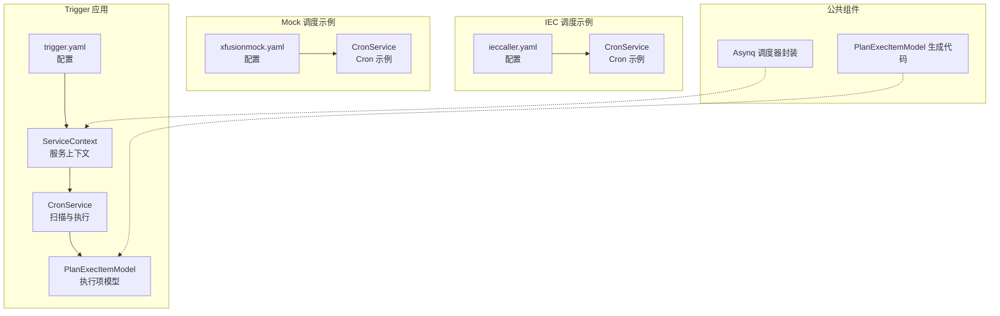
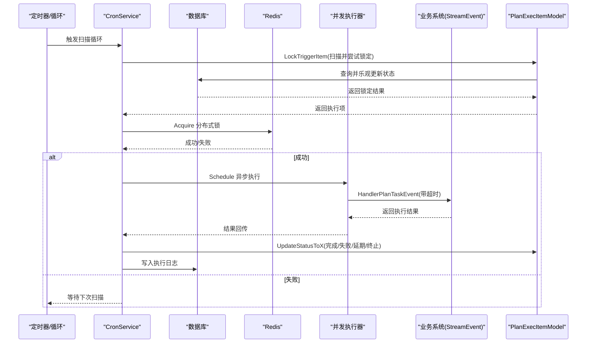
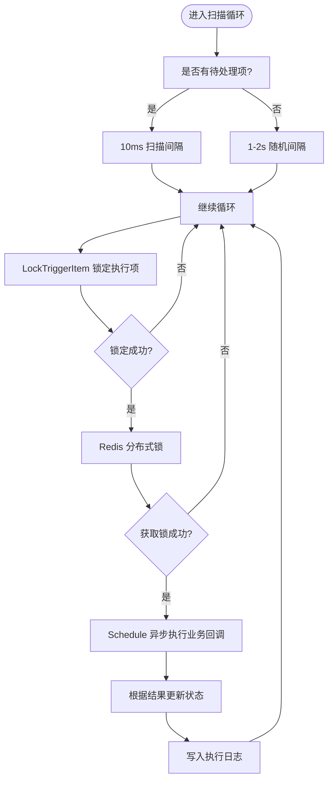
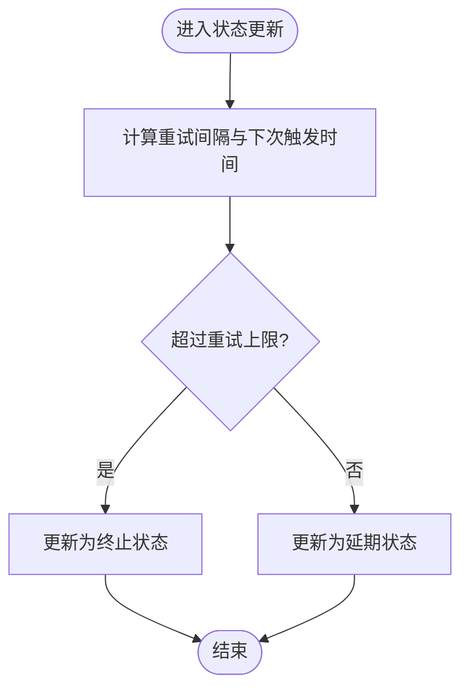
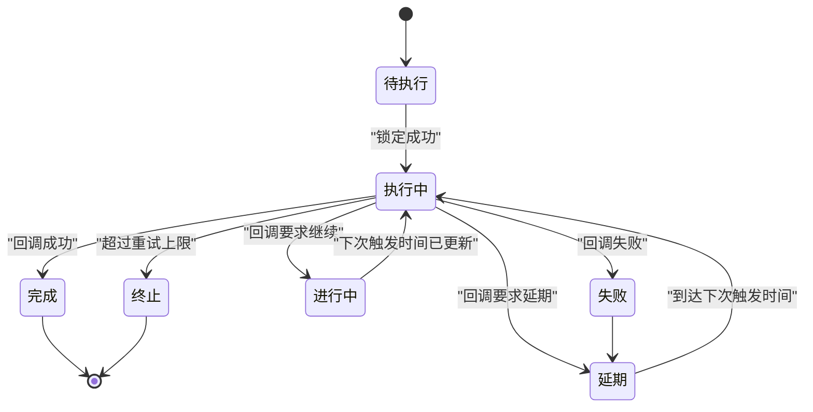
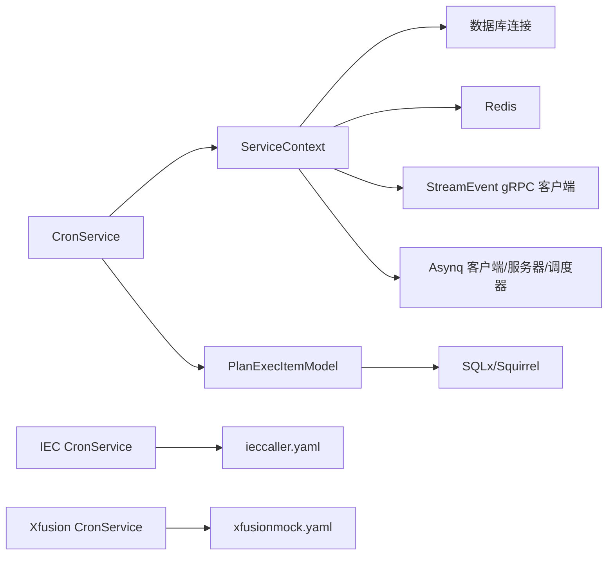

# 定时调度系统

<cite>
**本文引用的文件**
- [app/trigger/cron/cronservice.go](file://app/trigger/cron/cronservice.go)
- [app/trigger/etc/trigger.yaml](file://app/trigger/etc/trigger.yaml)
- [app/trigger/internal/config/config.go](file://app/trigger/internal/config/config.go)
- [app/trigger/internal/svc/servicecontext.go](file://app/trigger/internal/svc/servicecontext.go)
- [model/planexecitemmodel.go](file://model/planexecitemmodel.go)
- [model/planexecitemmodel_gen.go](file://model/planexecitemmodel_gen.go)
- [docs/trigger.md](file://docs/trigger.md)
- [common/asynqx/asynqSchedulerServer.go](file://common/asynqx/asynqSchedulerServer.go)
- [app/ieccaller/cron/cronservice.go](file://app/ieccaller/cron/cronservice.go)
- [app/ieccaller/etc/ieccaller.yaml](file://app/ieccaller/etc/ieccaller.yaml)
- [app/ieccaller/internal/config/config.go](file://app/ieccaller/internal/config/config.go)
- [app/xfusionmock/cron/cronservice.go](file://app/xfusionmock/cron/cronservice.go)
- [app/xfusionmock/etc/xfusionmock.yaml](file://app/xfusionmock/etc/xfusionmock.yaml)
</cite>

## 目录
1. [简介](#简介)
2. [项目结构](#项目结构)
3. [核心组件](#核心组件)
4. [架构总览](#架构总览)
5. [详细组件分析](#详细组件分析)
6. [依赖分析](#依赖分析)
7. [性能考虑](#性能考虑)
8. [故障排查指南](#故障排查指南)
9. [结论](#结论)
10. [附录](#附录)

## 简介
本技术文档面向“定时调度系统”，聚焦于计划任务的生命周期与调度执行机制，覆盖以下主题：
- Cron 表达式与任务调度算法：基于数据库扫描与乐观锁的触发策略，结合 Redis 分布式锁与并发执行器，确保高可靠与高吞吐。
- 配置选项：并发控制、重试策略、超时与优雅退出、日志与监控集成。
- 生命周期管理：从计划创建、批次生成、扫描触发、执行回调到状态聚合与日志归档的全流程。
- 性能优化：批处理、内存与CPU优化、异步化与限流。
- 监控与告警：链路追踪、日志级别、指标采集与告警策略。

## 项目结构
定时调度系统由多个子应用组成，其中 trigger 应用负责计划任务的扫描与执行；ieccaller 与 xfusionmock 提供基于 Cron 的周期性任务示例；common/asynqx 提供基于 Asynq 的调度器封装；model 层提供计划、批次、执行项与日志的数据模型与持久化能力。

图表来源
- [app/trigger/etc/trigger.yaml:1-37](file://app/trigger/etc/trigger.yaml#L1-L37)
- [app/trigger/internal/svc/servicecontext.go:50-91](file://app/trigger/internal/svc/servicecontext.go#L50-L91)
- [app/trigger/cron/cronservice.go:31-56](file://app/trigger/cron/cronservice.go#L31-L56)
- [model/planexecitemmodel_gen.go:96-107](file://model/planexecitemmodel_gen.go#L96-L107)
- [common/asynqx/asynqSchedulerServer.go:32-52](file://common/asynqx/asynqSchedulerServer.go#L32-L52)
- [app/ieccaller/etc/ieccaller.yaml:1-79](file://app/ieccaller/etc/ieccaller.yaml#L1-L79)
- [app/xfusionmock/etc/xfusionmock.yaml:31-32](file://app/xfusionmock/etc/xfusionmock.yaml#L31-L32)

章节来源
- [app/trigger/etc/trigger.yaml:1-37](file://app/trigger/etc/trigger.yaml#L1-L37)
- [app/trigger/internal/config/config.go:9-28](file://app/trigger/internal/config/config.go#L9-L28)
- [app/trigger/internal/svc/servicecontext.go:50-91](file://app/trigger/internal/svc/servicecontext.go#L50-L91)
- [app/ieccaller/etc/ieccaller.yaml:1-79](file://app/ieccaller/etc/ieccaller.yaml#L1-L79)
- [app/xfusionmock/etc/xfusionmock.yaml:1-39](file://app/xfusionmock/etc/xfusionmock.yaml#L1-L39)

## 核心组件
- CronService（Trigger 应用）：负责定时扫描数据库中满足触发条件的执行项，加分布式锁后异步执行业务回调，并根据返回结果更新状态与日志。
- ServiceContext（Trigger 应用）：集中管理 Redis、数据库、gRPC 客户端、Asynq 客户端/服务器/调度器等资源。
- PlanExecItemModel：提供执行项的扫描、状态更新、统计与查询能力，内置乐观锁与不稳定过期时间计算。
- Asynq 调度器封装：提供基于 Redis 的调度器启动、停止与注册任务的能力。
- IEC 与 Xfusion 示例：展示基于 Cron 的周期性任务配置与执行方式。

章节来源
- [app/trigger/cron/cronservice.go:25-36](file://app/trigger/cron/cronservice.go#L25-L36)
- [app/trigger/internal/svc/servicecontext.go:29-48](file://app/trigger/internal/svc/servicecontext.go#L29-L48)
- [model/planexecitemmodel.go:74-144](file://model/planexecitemmodel.go#L74-L144)
- [common/asynqx/asynqSchedulerServer.go:11-31](file://common/asynqx/asynqSchedulerServer.go#L11-L31)
- [app/ieccaller/cron/cronservice.go:11-21](file://app/ieccaller/cron/cronservice.go#L11-L21)
- [app/xfusionmock/cron/cronservice.go:12-22](file://app/xfusionmock/cron/cronservice.go#L12-L22)

## 架构总览
定时调度系统采用“扫描-锁-执行-回调-状态更新”的闭环架构。Trigger 应用通过 CronService 周期扫描数据库中的待触发执行项，使用 Redis 分布式锁避免重复执行，借助并发执行器异步调用业务系统，最终根据回调结果更新执行项状态并写入日志。

图表来源
- [app/trigger/cron/cronservice.go:58-79](file://app/trigger/cron/cronservice.go#L58-L79)
- [app/trigger/cron/cronservice.go:129-184](file://app/trigger/cron/cronservice.go#L129-L184)
- [app/trigger/cron/cronservice.go:203-468](file://app/trigger/cron/cronservice.go#L203-L468)
- [model/planexecitemmodel.go:74-144](file://model/planexecitemmodel.go#L74-L144)

## 详细组件分析

### CronService 扫描与执行流程
- 扫描循环：在取消通道未关闭的情况下持续运行，根据是否有待处理项动态调整扫描间隔（有任务时10ms，无任务时1-2s随机抖动），降低空闲负载。
- 锁定执行项：通过 PlanExecItemModel.LockTriggerItem 执行“查询+乐观更新”原子操作，确保同一执行项在同一时刻仅被一个节点处理。
- 分布式锁：使用 Redis 分布式锁进一步保证幂等，避免多副本并发执行。
- 异步执行：通过并发执行器调度实际业务调用，避免阻塞扫描循环。
- 结果处理：根据业务回调结果更新执行项状态（完成/失败/延期/进行中/终止），并写入执行日志；同时尝试通知批次与计划完成事件。

图表来源
- [app/trigger/cron/cronservice.go:58-79](file://app/trigger/cron/cronservice.go#L58-L79)
- [app/trigger/cron/cronservice.go:129-184](file://app/trigger/cron/cronservice.go#L129-L184)
- [app/trigger/cron/cronservice.go:203-468](file://app/trigger/cron/cronservice.go#L203-L468)

章节来源
- [app/trigger/cron/cronservice.go:38-79](file://app/trigger/cron/cronservice.go#L38-L79)
- [app/trigger/cron/cronservice.go:129-184](file://app/trigger/cron/cronservice.go#L129-L184)
- [app/trigger/cron/cronservice.go:203-468](file://app/trigger/cron/cronservice.go#L203-L468)

### PlanExecItemModel 状态管理与重试策略
- 锁定与乐观更新：先查询再以版本号为条件的更新，确保并发安全；若更新影响行数为0则视为竞争失败，放弃本次触发。
- 状态更新接口：提供 Running/Completed/Fail/Delayed/Terminated/Ongoing 等状态更新方法，并对字段长度进行截断保护。
- 重试策略：失败时根据触发次数与不稳定的重试间隔计算下一次触发时间，超过上限后自动终止；支持业务方返回“延迟”或“进行中”并指定下次触发时间。

图表来源
- [model/planexecitemmodel.go:202-271](file://model/planexecitemmodel.go#L202-L271)
- [model/planexecitemmodel.go:230-232](file://model/planexecitemmodel.go#L230-L232)

章节来源
- [model/planexecitemmodel.go:74-144](file://model/planexecitemmodel.go#L74-L144)
- [model/planexecitemmodel.go:202-271](file://model/planexecitemmodel.go#L202-L271)
- [model/planexecitemmodel.go:273-313](file://model/planexecitemmodel.go#L273-L313)
- [model/planexecitemmodel.go:315-351](file://model/planexecitemmodel.go#L315-L351)
- [model/planexecitemmodel.go:353-399](file://model/planexecitemmodel.go#L353-L399)

### 配置与并发控制
- Trigger 应用配置要点：
  - Redis、数据库、StreamEvent gRPC 客户端、日志路径与级别、GracePeriod 等。
  - 通过 ServiceContext 统一初始化各组件，支持 Asynq 客户端/服务器/调度器注入。
- 并发控制：
  - CronService 内部使用并发执行器，构造时指定并发池大小，用于异步执行业务回调。
  - IEC 示例使用 robfig/cron，支持秒级表达式，分别配置总召唤与累计量召唤的 Cron 表达式。
  - Xfusion 示例同样使用 robfig/cron，按秒级调度推送测试、点位、告警、事件与终端绑定数据。

章节来源
- [app/trigger/etc/trigger.yaml:19-37](file://app/trigger/etc/trigger.yaml#L19-L37)
- [app/trigger/internal/config/config.go:9-28](file://app/trigger/internal/config/config.go#L9-L28)
- [app/trigger/internal/svc/servicecontext.go:50-91](file://app/trigger/internal/svc/servicecontext.go#L50-L91)
- [app/trigger/cron/cronservice.go:31-36](file://app/trigger/cron/cronservice.go#L31-L36)
- [app/ieccaller/cron/cronservice.go:16-21](file://app/ieccaller/cron/cronservice.go#L16-L21)
- [app/ieccaller/etc/ieccaller.yaml:73-75](file://app/ieccaller/etc/ieccaller.yaml#L73-L75)
- [app/xfusionmock/cron/cronservice.go:17-22](file://app/xfusionmock/cron/cronservice.go#L17-L22)
- [app/xfusionmock/etc/xfusionmock.yaml:31-32](file://app/xfusionmock/etc/xfusionmock.yaml#L31-L32)

### 生命周期管理（从创建到执行）
- 计划创建：系统根据执行规则计算触发时间，生成批次与执行项。
- 扫描触发：CronService 扫描并锁定执行项，更新状态为执行中。
- 业务回调：调用 StreamEvent 接口执行具体任务，业务系统处理完成后上报结果。
- 状态更新与日志：根据回调结果更新执行项状态，写入执行日志；必要时通知批次/计划完成事件。
- 文档说明：官方文档对执行流程、扫表频率与限制进行了明确说明。

图表来源
- [docs/trigger.md:95-106](file://docs/trigger.md#L95-L106)
- [model/planexecitemmodel.go:165-200](file://model/planexecitemmodel.go#L165-L200)
- [model/planexecitemmodel.go:202-271](file://model/planexecitemmodel.go#L202-L271)
- [model/planexecitemmodel.go:273-313](file://model/planexecitemmodel.go#L273-L313)
- [model/planexecitemmodel.go:353-399](file://model/planexecitemmodel.go#L353-L399)
- [model/planexecitemmodel.go:315-351](file://model/planexecitemmodel.go#L315-L351)

章节来源
- [docs/trigger.md:88-106](file://docs/trigger.md#L88-L106)
- [model/planexecitemmodel.go:165-200](file://model/planexecitemmodel.go#L165-L200)
- [model/planexecitemmodel.go:202-271](file://model/planexecitemmodel.go#L202-L271)
- [model/planexecitemmodel.go:273-313](file://model/planexecitemmodel.go#L273-L313)
- [model/planexecitemmodel.go:315-351](file://model/planexecitemmodel.go#L315-L351)
- [model/planexecitemmodel.go:353-399](file://model/planexecitemmodel.go#L353-L399)

### Asynq 调度器集成
- Asynq 调度器封装提供了统一的启动、停止与注册能力，支持设置 Redis 连接参数、位置与时区、任务保留期与日志器。
- 在 Trigger 应用中，ServiceContext 注入了 Asynq 客户端、服务器与调度器，便于统一管理。

章节来源
- [common/asynqx/asynqSchedulerServer.go:11-31](file://common/asynqx/asynqSchedulerServer.go#L11-L31)
- [common/asynqx/asynqSchedulerServer.go:32-52](file://common/asynqx/asynqSchedulerServer.go#L32-L52)
- [app/trigger/internal/svc/servicecontext.go:65-68](file://app/trigger/internal/svc/servicecontext.go#L65-L68)

## 依赖分析
- CronService 依赖 ServiceContext 提供的数据库、Redis、gRPC 客户端与模型层。
- PlanExecItemModel 依赖 SQLx 与 Squirrel 构建查询与更新，支持 MySQL 与 PostgreSQL。
- Asynq 封装依赖 Redis 作为队列存储，提供调度器运行与任务注册。
- IEC 与 Xfusion 示例依赖各自的 Cron 实现与配置文件。

图表来源
- [app/trigger/cron/cronservice.go:25-36](file://app/trigger/cron/cronservice.go#L25-L36)
- [app/trigger/internal/svc/servicecontext.go:29-48](file://app/trigger/internal/svc/servicecontext.go#L29-L48)
- [model/planexecitemmodel_gen.go:96-107](file://model/planexecitemmodel_gen.go#L96-L107)
- [common/asynqx/asynqSchedulerServer.go:32-52](file://common/asynqx/asynqSchedulerServer.go#L32-L52)
- [app/ieccaller/cron/cronservice.go:16-21](file://app/ieccaller/cron/cronservice.go#L16-L21)
- [app/xfusionmock/cron/cronservice.go:17-22](file://app/xfusionmock/cron/cronservice.go#L17-L22)

章节来源
- [app/trigger/internal/svc/servicecontext.go:50-91](file://app/trigger/internal/svc/servicecontext.go#L50-L91)
- [model/planexecitemmodel_gen.go:96-107](file://model/planexecitemmodel_gen.go#L96-L107)
- [common/asynqx/asynqSchedulerServer.go:32-52](file://common/asynqx/asynqSchedulerServer.go#L32-L52)
- [app/ieccaller/etc/ieccaller.yaml:1-79](file://app/ieccaller/etc/ieccaller.yaml#L1-L79)
- [app/xfusionmock/etc/xfusionmock.yaml:1-39](file://app/xfusionmock/etc/xfusionmock.yaml#L1-L39)

## 性能考虑
- 扫描频率自适应：有任务时10ms，无任务时1-2s随机抖动，降低空闲期 CPU 与数据库压力。
- 并发执行：通过并发执行器隔离业务回调，避免阻塞扫描循环。
- 乐观锁与分布式锁：双重保障避免重复执行，减少无效工作。
- 数据库选择排序：MySQL 使用 RAND()，PostgreSQL 使用 RANDOM()，提升并发下的公平性。
- 日志与链路追踪：开启 OpenTelemetry 链路追踪，结合日志级别与路径，便于定位热点与瓶颈。
- Asynq 队列：利用 Redis 高性能队列承载异步任务，配合合适的连接池与超时配置。

章节来源
- [app/trigger/cron/cronservice.go:58-79](file://app/trigger/cron/cronservice.go#L58-L79)
- [app/trigger/cron/cronservice.go:31-36](file://app/trigger/cron/cronservice.go#L31-L36)
- [model/planexecitemmodel.go:97-101](file://model/planexecitemmodel.go#L97-L101)
- [app/trigger/etc/trigger.yaml:5-11](file://app/trigger/etc/trigger.yaml#L5-L11)
- [common/asynqx/asynqSchedulerServer.go:32-52](file://common/asynqx/asynqSchedulerServer.go#L32-L52)

## 故障排查指南
- 扫描无任务：确认 CronService 扫描间隔与数据库中是否存在满足条件的执行项；检查计划/批次状态是否启用且未删除。
- 锁定失败：检查数据库乐观锁版本号是否被其他实例更新；确认 Redis 分布式锁是否正确释放。
- 业务回调失败：查看 gRPC 调用超时与错误日志；核对 StreamEvent 服务可用性与网络连通性。
- 状态异常：根据 PlanExecItemModel 的状态更新接口检查更新条件与字段长度限制；关注“超过重试上限，调度平台自动终止”场景。
- 日志与监控：调整日志级别与路径，结合链路追踪 ID 快速定位问题；对高频错误建立告警阈值。

章节来源
- [app/trigger/cron/cronservice.go:129-184](file://app/trigger/cron/cronservice.go#L129-L184)
- [app/trigger/cron/cronservice.go:203-468](file://app/trigger/cron/cronservice.go#L203-L468)
- [model/planexecitemmodel.go:202-271](file://model/planexecitemmodel.go#L202-L271)
- [app/trigger/etc/trigger.yaml:5-11](file://app/trigger/etc/trigger.yaml#L5-L11)

## 结论
该定时调度系统通过“数据库扫描+乐观锁+分布式锁+并发执行器”的组合，实现了高可靠、高吞吐的任务调度。结合 Asynq 调度器与链路追踪，系统具备良好的可观测性与扩展性。建议在生产环境中合理配置扫描间隔、并发池大小与重试策略，并完善监控与告警体系，以获得更优的稳定性与性能表现。

## 附录
- 配置参考路径
  - Trigger 应用：[app/trigger/etc/trigger.yaml:1-37](file://app/trigger/etc/trigger.yaml#L1-L37)
  - IEC 示例：[app/ieccaller/etc/ieccaller.yaml:1-79](file://app/ieccaller/etc/ieccaller.yaml#L1-L79)
  - Xfusion 示例：[app/xfusionmock/etc/xfusionmock.yaml:1-39](file://app/xfusionmock/etc/xfusionmock.yaml#L1-L39)
- 数据模型参考
  - 执行项模型：[model/planexecitemmodel_gen.go:55-93](file://model/planexecitemmodel_gen.go#L55-L93)
  - 执行项模型实现：[model/planexecitemmodel.go:74-144](file://model/planexecitemmodel.go#L74-L144)