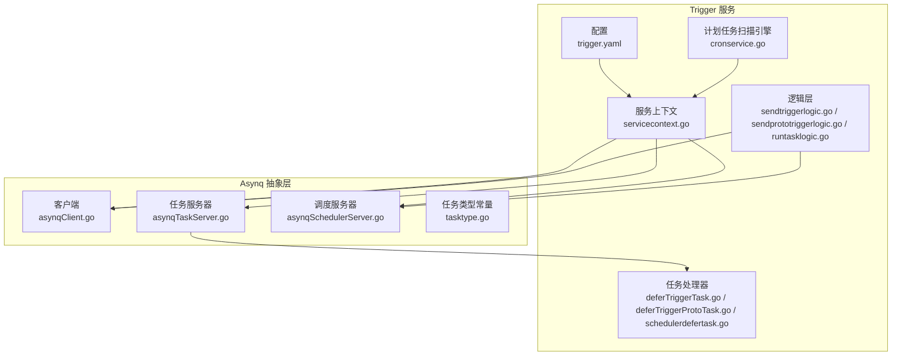
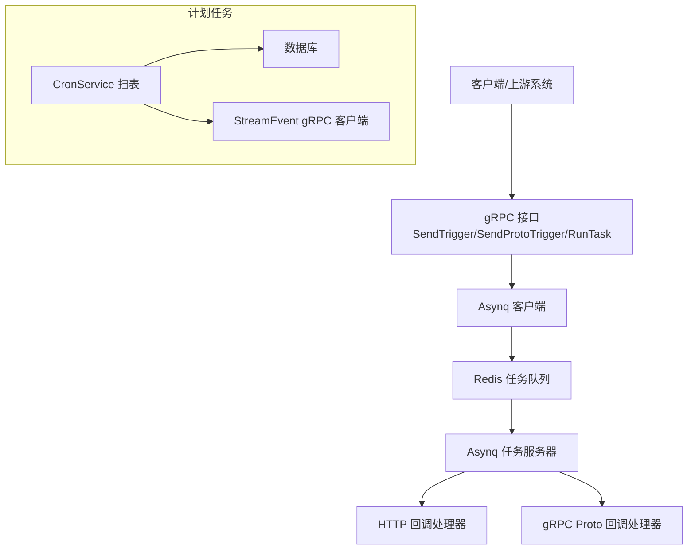
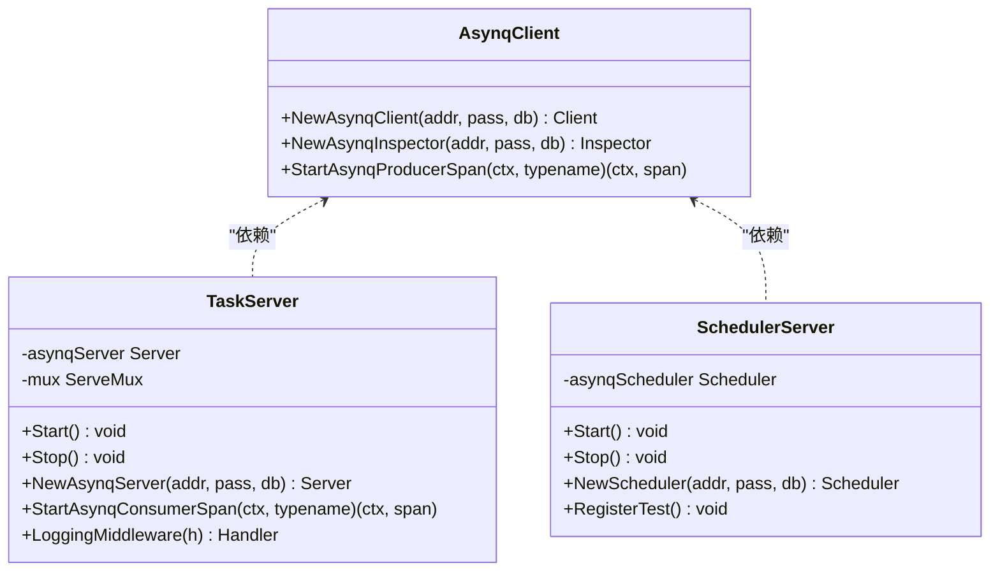
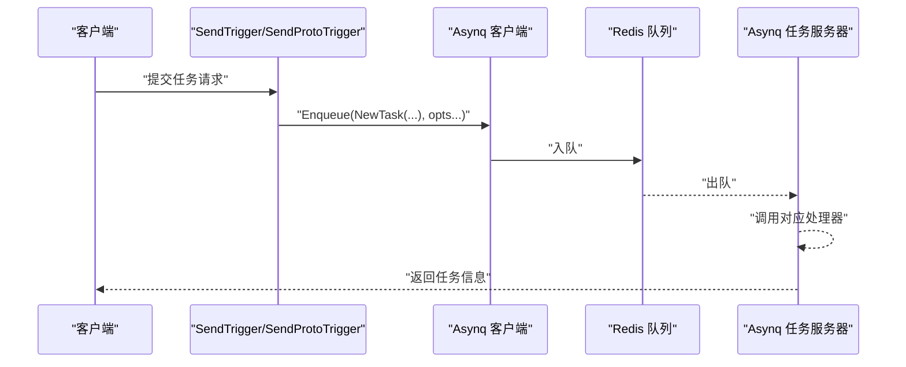
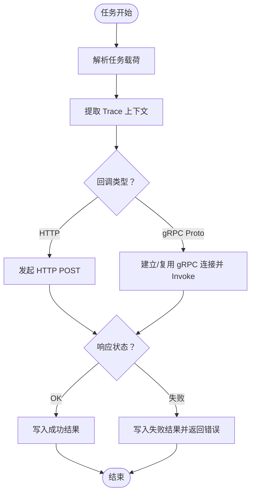
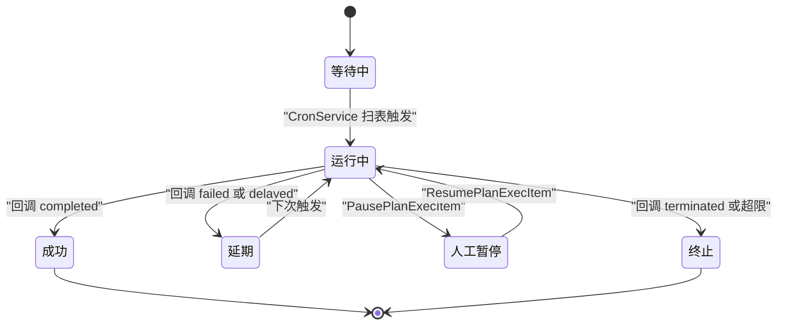
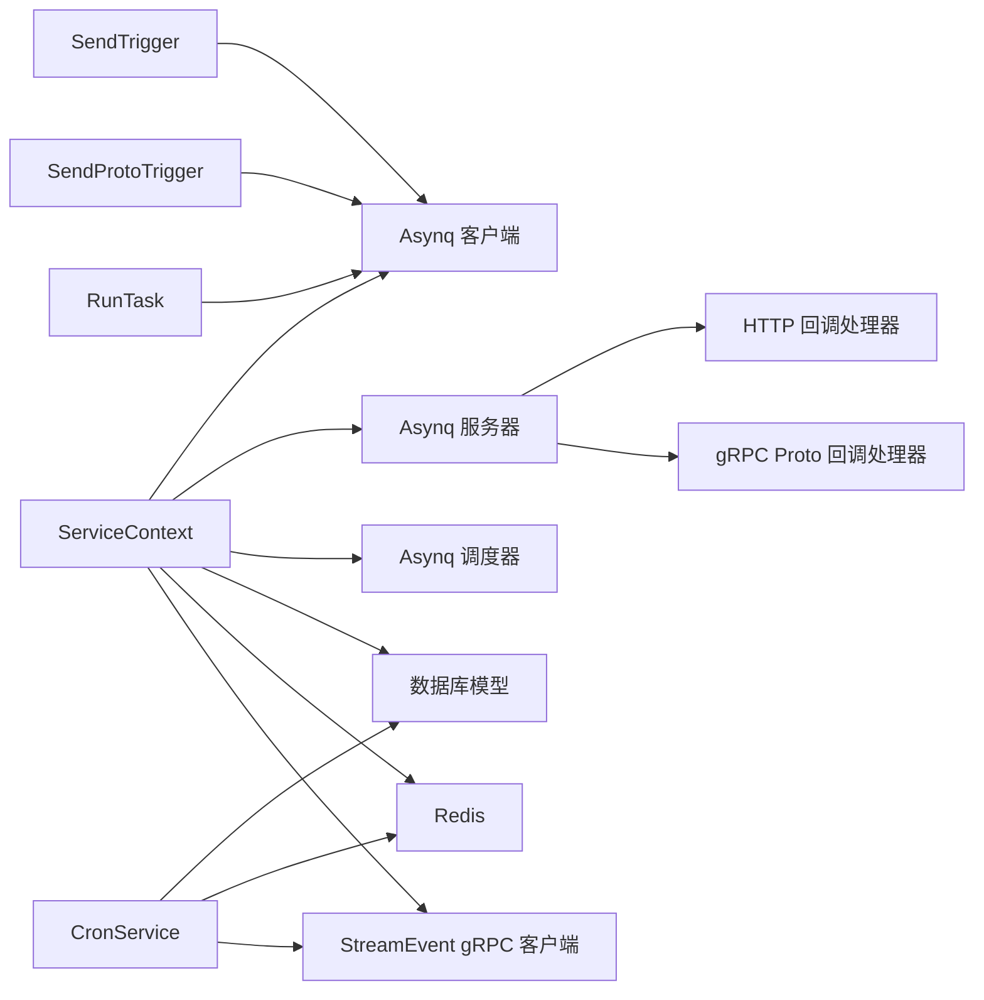

# 异步任务调度服务

<cite>
**本文引用的文件**
- [common/asynqx/asynqClient.go](file://common/asynqx/asynqClient.go)
- [common/asynqx/asynqTaskServer.go](file://common/asynqx/asynqTaskServer.go)
- [common/asynqx/asynqSchedulerServer.go](file://common/asynqx/asynqSchedulerServer.go)
- [common/asynqx/tasktype.go](file://common/asynqx/tasktype.go)
- [app/trigger/etc/trigger.yaml](file://app/trigger/etc/trigger.yaml)
- [app/trigger/internal/svc/servicecontext.go](file://app/trigger/internal/svc/servicecontext.go)
- [app/trigger/internal/logic/sendtriggerlogic.go](file://app/trigger/internal/logic/sendtriggerlogic.go)
- [app/trigger/internal/logic/sendprototriggerlogic.go](file://app/trigger/internal/logic/sendprototriggerlogic.go)
- [app/trigger/internal/logic/runtasklogic.go](file://app/trigger/internal/logic/runtasklogic.go)
- [app/trigger/internal/task/deferTriggerTask.go](file://app/trigger/internal/task/deferTriggerTask.go)
- [app/trigger/internal/task/deferTriggerProtoTask.go](file://app/trigger/internal/task/deferTriggerProtoTask.go)
- [app/trigger/internal/task/scheduler/schedulerdefertask.go](file://app/trigger/internal/task/scheduler/schedulerdefertask.go)
- [app/trigger/cron/cronservice.go](file://app/trigger/cron/cronservice.go)
- [docs/trigger.md](file://docs/trigger.md)
</cite>

## 目录
1. [简介](#简介)
2. [项目结构](#项目结构)
3. [核心组件](#核心组件)
4. [架构总览](#架构总览)
5. [详细组件分析](#详细组件分析)
6. [依赖分析](#依赖分析)
7. [性能考虑](#性能考虑)
8. [故障排查指南](#故障排查指南)
9. [结论](#结论)
10. [附录](#附录)

## 简介
本技术文档围绕异步任务调度服务展开，重点覆盖 Trigger 服务的架构设计与任务调度机制，包括定时任务、延迟任务与周期性任务的处理流程；深入解析 Asynq 任务队列的工作原理（任务类型、执行器配置与监控）；阐述计划任务的全生命周期管理（从创建到执行再到结果处理）；并提供任务编排的最佳实践（任务依赖、重试策略与错误处理）。文档同时给出性能调优、资源管理与故障恢复策略，以及可直接定位到源码的示例路径。

## 项目结构
Trigger 服务位于 app/trigger 目录，结合 common/asynqx 提供的 Asynq 客户端、服务器与调度器封装，配合 app/trigger/cron 中的自研计划任务扫描引擎，形成“异步回调任务 + 计划任务”的双通道体系。配置由 app/trigger/etc/trigger.yaml 提供，服务上下文在 app/trigger/internal/svc/servicecontext.go 中统一装配 Redis、数据库、Asynq 客户端/服务器/调度器与 StreamEvent gRPC 客户端。

图表来源
- [app/trigger/etc/trigger.yaml:1-37](file://app/trigger/etc/trigger.yaml#L1-L37)
- [app/trigger/internal/svc/servicecontext.go:50-90](file://app/trigger/internal/svc/servicecontext.go#L50-L90)
- [common/asynqx/asynqClient.go:17-23](file://common/asynqx/asynqClient.go#L17-L23)
- [common/asynqx/asynqTaskServer.go:39-64](file://common/asynqx/asynqTaskServer.go#L39-L64)
- [common/asynqx/asynqSchedulerServer.go:32-52](file://common/asynqx/asynqSchedulerServer.go#L32-L52)
- [common/asynqx/tasktype.go:3-9](file://common/asynqx/tasktype.go#L3-L9)
- [app/trigger/internal/logic/sendtriggerlogic.go:37-104](file://app/trigger/internal/logic/sendtriggerlogic.go#L37-L104)
- [app/trigger/internal/logic/sendprototriggerlogic.go:40-100](file://app/trigger/internal/logic/sendprototriggerlogic.go#L40-L100)
- [app/trigger/internal/logic/runtasklogic.go:27-36](file://app/trigger/internal/logic/runtasklogic.go#L27-L36)
- [app/trigger/internal/task/deferTriggerTask.go:32-72](file://app/trigger/internal/task/deferTriggerTask.go#L32-L72)
- [app/trigger/internal/task/deferTriggerProtoTask.go:38-94](file://app/trigger/internal/task/deferTriggerProtoTask.go#L38-L94)
- [app/trigger/internal/task/scheduler/schedulerdefertask.go:20-24](file://app/trigger/internal/task/scheduler/schedulerdefertask.go#L20-L24)
- [app/trigger/cron/cronservice.go:58-184](file://app/trigger/cron/cronservice.go#L58-L184)

章节来源
- [app/trigger/etc/trigger.yaml:1-37](file://app/trigger/etc/trigger.yaml#L1-L37)
- [app/trigger/internal/svc/servicecontext.go:50-90](file://app/trigger/internal/svc/servicecontext.go#L50-L90)
- [docs/trigger.md:1-284](file://docs/trigger.md#L1-L284)

## 核心组件
- Asynq 客户端/服务器/调度器封装：提供 Redis 连接、并发与队列权重配置、日志与中间件、OpenTelemetry 跨进程传播等能力。
- 任务类型常量：定义延迟任务与定时任务的内部类型标识。
- 逻辑层：对外暴露 gRPC 接口，负责任务入队、立即运行、查询与管理。
- 任务处理器：实现具体任务的消费逻辑，分别处理 HTTP 回调与 gRPC Proto 回调。
- 计划任务扫描引擎：基于数据库扫描与分布式锁，驱动周期性任务的执行与状态流转。

章节来源
- [common/asynqx/asynqClient.go:17-31](file://common/asynqx/asynqClient.go#L17-L31)
- [common/asynqx/asynqTaskServer.go:39-87](file://common/asynqx/asynqTaskServer.go#L39-L87)
- [common/asynqx/asynqSchedulerServer.go:32-62](file://common/asynqx/asynqSchedulerServer.go#L32-L62)
- [common/asynqx/tasktype.go:3-9](file://common/asynqx/tasktype.go#L3-L9)
- [app/trigger/internal/logic/sendtriggerlogic.go:37-104](file://app/trigger/internal/logic/sendtriggerlogic.go#L37-L104)
- [app/trigger/internal/logic/sendprototriggerlogic.go:40-100](file://app/trigger/internal/logic/sendprototriggerlogic.go#L40-L100)
- [app/trigger/internal/logic/runtasklogic.go:27-36](file://app/trigger/internal/logic/runtasklogic.go#L27-L36)
- [app/trigger/internal/task/deferTriggerTask.go:32-72](file://app/trigger/internal/task/deferTriggerTask.go#L32-L72)
- [app/trigger/internal/task/deferTriggerProtoTask.go:38-94](file://app/trigger/internal/task/deferTriggerProtoTask.go#L38-L94)
- [app/trigger/internal/task/scheduler/schedulerdefertask.go:20-24](file://app/trigger/internal/task/scheduler/schedulerdefertask.go#L20-L24)
- [app/trigger/cron/cronservice.go:58-184](file://app/trigger/cron/cronservice.go#L58-L184)

## 架构总览
Trigger 服务采用“异步回调任务 + 计划任务”的双通道架构：
- 异步回调任务：通过 gRPC 接口提交，任务被入队到 Redis；Worker 消费后发起 HTTP 或 gRPC 回调，支持立即运行与查询管理。
- 计划任务：基于数据库扫描引擎，周期性扫描满足触发条件的执行项，通过 StreamEvent gRPC 回调业务系统，支持暂停/恢复/终止与仪表板统计。

图表来源
- [app/trigger/internal/logic/sendtriggerlogic.go:37-104](file://app/trigger/internal/logic/sendtriggerlogic.go#L37-L104)
- [app/trigger/internal/logic/sendprototriggerlogic.go:40-100](file://app/trigger/internal/logic/sendprototriggerlogic.go#L40-L100)
- [app/trigger/internal/logic/runtasklogic.go:27-36](file://app/trigger/internal/logic/runtasklogic.go#L27-L36)
- [common/asynqx/asynqClient.go:17-23](file://common/asynqx/asynqClient.go#L17-L23)
- [common/asynqx/asynqTaskServer.go:28-37](file://common/asynqx/asynqTaskServer.go#L28-L37)
- [app/trigger/internal/task/deferTriggerTask.go:32-72](file://app/trigger/internal/task/deferTriggerTask.go#L32-L72)
- [app/trigger/internal/task/deferTriggerProtoTask.go:38-94](file://app/trigger/internal/task/deferTriggerProtoTask.go#L38-L94)
- [app/trigger/cron/cronservice.go:58-184](file://app/trigger/cron/cronservice.go#L58-L184)

## 详细组件分析

### Asynq 客户端与服务器
- 客户端：提供 Redis 连接参数与工具函数，用于创建 Asynq 客户端与 Inspector。
- 任务服务器：封装 Asynq.Server 的启动/停止，配置并发、队列权重、日志与失败判定。
- 调度服务器：封装 Asynq.Scheduler 的启动/停止，配置时区、入队后回调与日志。

图表来源
- [common/asynqx/asynqClient.go:17-31](file://common/asynqx/asynqClient.go#L17-L31)
- [common/asynqx/asynqTaskServer.go:21-87](file://common/asynqx/asynqTaskServer.go#L21-L87)
- [common/asynqx/asynqSchedulerServer.go:15-62](file://common/asynqx/asynqSchedulerServer.go#L15-L62)

章节来源
- [common/asynqx/asynqClient.go:17-31](file://common/asynqx/asynqClient.go#L17-L31)
- [common/asynqx/asynqTaskServer.go:39-87](file://common/asynqx/asynqTaskServer.go#L39-L87)
- [common/asynqx/asynqSchedulerServer.go:32-62](file://common/asynqx/asynqSchedulerServer.go#L32-L62)

### 任务类型与提交流程
- 任务类型：延迟 HTTP 回调、延迟 gRPC Proto 回调、定时调度任务。
- 提交流程：客户端调用 SendTrigger/SendProtoTrigger，设置任务 ID、重试次数、队列与延迟时间，最终入队到 Redis；也可通过 RunTask 立即运行某个任务。

图表来源
- [app/trigger/internal/logic/sendtriggerlogic.go:37-104](file://app/trigger/internal/logic/sendtriggerlogic.go#L37-L104)
- [app/trigger/internal/logic/sendprototriggerlogic.go:40-100](file://app/trigger/internal/logic/sendprototriggerlogic.go#L40-L100)
- [common/asynqx/asynqClient.go:17-23](file://common/asynqx/asynqClient.go#L17-L23)
- [common/asynqx/asynqTaskServer.go:28-37](file://common/asynqx/asynqTaskServer.go#L28-L37)

章节来源
- [common/asynqx/tasktype.go:3-9](file://common/asynqx/tasktype.go#L3-L9)
- [app/trigger/internal/logic/sendtriggerlogic.go:37-104](file://app/trigger/internal/logic/sendtriggerlogic.go#L37-L104)
- [app/trigger/internal/logic/sendprototriggerlogic.go:40-100](file://app/trigger/internal/logic/sendprototriggerlogic.go#L40-L100)
- [app/trigger/internal/logic/runtasklogic.go:27-36](file://app/trigger/internal/logic/runtasklogic.go#L27-L36)

### 回调处理器实现
- HTTP 回调处理器：从任务载荷提取 URL 与数据，发起 HTTP POST，记录响应状态与耗时。
- gRPC Proto 回调处理器：解析 gRPC 目标、方法与字节码，建立/复用连接，调用 Invoke，支持超时控制与日志抑制。

图表来源
- [app/trigger/internal/task/deferTriggerTask.go:32-72](file://app/trigger/internal/task/deferTriggerTask.go#L32-L72)
- [app/trigger/internal/task/deferTriggerProtoTask.go:38-94](file://app/trigger/internal/task/deferTriggerProtoTask.go#L38-L94)

章节来源
- [app/trigger/internal/task/deferTriggerTask.go:32-72](file://app/trigger/internal/task/deferTriggerTask.go#L32-L72)
- [app/trigger/internal/task/deferTriggerProtoTask.go:38-94](file://app/trigger/internal/task/deferTriggerProtoTask.go#L38-L94)

### 计划任务生命周期与状态机
- 生命周期：创建计划 → 解析 rrule 生成批次与执行项 → CronService 扫表触发 → 分布式锁保护回调 → 状态更新与日志记录 → 批次/计划完成度聚合。
- 状态机：WAITING → RUNNING → COMPLETED/DELAYED/PAUSED/TERMINATED，支持暂停/恢复/立即运行与终止。

图表来源
- [docs/trigger.md:108-140](file://docs/trigger.md#L108-L140)
- [app/trigger/cron/cronservice.go:58-184](file://app/trigger/cron/cronservice.go#L58-L184)

章节来源
- [docs/trigger.md:70-176](file://docs/trigger.md#L70-L176)
- [app/trigger/cron/cronservice.go:58-184](file://app/trigger/cron/cronservice.go#L58-L184)

### 定时任务与周期性任务
- 定时任务：通过 Asynq.Scheduler 注册 cron 表达式，周期性将任务入队。
- 周期性任务：由 CronService 周期扫描数据库，满足触发条件的执行项进入回调流程。

章节来源
- [common/asynqx/asynqSchedulerServer.go:32-62](file://common/asynqx/asynqSchedulerServer.go#L32-L62)
- [app/trigger/internal/task/scheduler/schedulerdefertask.go:20-24](file://app/trigger/internal/task/scheduler/schedulerdefertask.go#L20-L24)
- [app/trigger/cron/cronservice.go:58-184](file://app/trigger/cron/cronservice.go#L58-L184)

## 依赖分析
- 服务上下文统一装配 Redis、数据库、Asynq 客户端/服务器/调度器与 StreamEvent gRPC 客户端，确保跨模块共享。
- 逻辑层通过 Asynq 客户端与调度器进行任务入队与管理；任务处理器通过 Asynq 服务器消费任务并执行回调。
- 计划任务扫描引擎依赖数据库模型与 Redis 分布式锁，保障并发安全与幂等。

图表来源
- [app/trigger/internal/svc/servicecontext.go:50-90](file://app/trigger/internal/svc/servicecontext.go#L50-L90)
- [app/trigger/internal/logic/sendtriggerlogic.go:37-104](file://app/trigger/internal/logic/sendtriggerlogic.go#L37-L104)
- [app/trigger/internal/logic/sendprototriggerlogic.go:40-100](file://app/trigger/internal/logic/sendprototriggerlogic.go#L40-L100)
- [app/trigger/internal/logic/runtasklogic.go:27-36](file://app/trigger/internal/logic/runtasklogic.go#L27-L36)
- [app/trigger/internal/task/deferTriggerTask.go:32-72](file://app/trigger/internal/task/deferTriggerTask.go#L32-L72)
- [app/trigger/internal/task/deferTriggerProtoTask.go:38-94](file://app/trigger/internal/task/deferTriggerProtoTask.go#L38-L94)
- [app/trigger/cron/cronservice.go:58-184](file://app/trigger/cron/cronservice.go#L58-L184)

章节来源
- [app/trigger/internal/svc/servicecontext.go:50-90](file://app/trigger/internal/svc/servicecontext.go#L50-L90)
- [app/trigger/internal/logic/sendtriggerlogic.go:37-104](file://app/trigger/internal/logic/sendtriggerlogic.go#L37-L104)
- [app/trigger/internal/logic/sendprototriggerlogic.go:40-100](file://app/trigger/internal/logic/sendprototriggerlogic.go#L40-L100)
- [app/trigger/internal/logic/runtasklogic.go:27-36](file://app/trigger/internal/logic/runtasklogic.go#L27-L36)
- [app/trigger/internal/task/deferTriggerTask.go:32-72](file://app/trigger/internal/task/deferTriggerTask.go#L32-L72)
- [app/trigger/internal/task/deferTriggerProtoTask.go:38-94](file://app/trigger/internal/task/deferTriggerProtoTask.go#L38-L94)
- [app/trigger/cron/cronservice.go:58-184](file://app/trigger/cron/cronservice.go#L58-L184)

## 性能考虑
- 并发与队列：Asynq 服务器默认并发 20，队列权重 critical:6、default:3、low:1，建议根据业务峰值调整并发与队列权重。
- 超时与重试：回调处理器内置超时控制；计划任务首次失败后 10 秒重试，指数退避最高 30 分钟，默认最多 25 次重试。
- 连接池与网络：gRPC Proto 回调通过连接映射复用连接，减少握手开销；HTTP 回调使用短超时避免阻塞。
- 监控与追踪：集成 OpenTelemetry，每个任务携带 TraceID，便于端到端追踪；任务处理器记录耗时与结果。

章节来源
- [common/asynqx/asynqTaskServer.go:50-63](file://common/asynqx/asynqTaskServer.go#L50-L63)
- [app/trigger/internal/task/deferTriggerTask.go:55-58](file://app/trigger/internal/task/deferTriggerTask.go#L55-L58)
- [app/trigger/internal/task/deferTriggerProtoTask.go:74-81](file://app/trigger/internal/task/deferTriggerProtoTask.go#L74-L81)
- [docs/trigger.md:153-158](file://docs/trigger.md#L153-L158)

## 故障排查指南
- 任务无法入队：检查 Asynq 客户端 Redis 连接参数与权限；确认队列与保留时间配置。
- 任务未被消费：检查 Asynq 服务器是否正常启动、并发与队列权重是否合理；查看日志中间件输出。
- 回调失败：HTTP 回调检查目标 URL 与超时；gRPC Proto 回调检查目标地址、方法名与字节码编码；关注连接初始化失败与 Invoke 错误。
- 计划任务卡住：检查 CronService 扫表循环与睡眠策略；确认数据库乐观锁与 Redis 分布式锁是否正确释放；核对回调结果与状态迁移。
- 监控与日志：利用 Asynq Inspector 查询任务状态；查看计划任务执行日志表定位异常。

章节来源
- [common/asynqx/asynqClient.go:17-23](file://common/asynqx/asynqClient.go#L17-L23)
- [common/asynqx/asynqTaskServer.go:28-37](file://common/asynqx/asynqTaskServer.go#L28-L37)
- [app/trigger/internal/task/deferTriggerTask.go:57-68](file://app/trigger/internal/task/deferTriggerTask.go#L57-L68)
- [app/trigger/internal/task/deferTriggerProtoTask.go:84-91](file://app/trigger/internal/task/deferTriggerProtoTask.go#L84-L91)
- [app/trigger/cron/cronservice.go:208-316](file://app/trigger/cron/cronservice.go#L208-L316)
- [docs/trigger.md:274-278](file://docs/trigger.md#L274-L278)

## 结论
该异步任务调度服务以 Asynq 为核心，结合自研计划任务扫描引擎，实现了从“延迟/定时回调”到“周期性任务”的全栈能力。通过统一的服务上下文、清晰的任务类型与处理器、完善的监控与追踪，以及可调的并发与重试策略，能够满足生产环境的稳定性与可观测性要求。建议在部署时结合业务峰值调整并发与队列权重，并持续优化回调链路与日志策略。

## 附录
- 配置参考：见 [trigger.yaml:1-37](file://app/trigger/etc/trigger.yaml#L1-L37)
- 任务类型常量：见 [tasktype.go:3-9](file://common/asynqx/tasktype.go#L3-L9)
- 逻辑层示例路径：
  - [SendTrigger:37-104](file://app/trigger/internal/logic/sendtriggerlogic.go#L37-L104)
  - [SendProtoTrigger:40-100](file://app/trigger/internal/logic/sendprototriggerlogic.go#L40-L100)
  - [RunTask:27-36](file://app/trigger/internal/logic/runtasklogic.go#L27-L36)
- 处理器示例路径：
  - [HTTP 回调处理器:32-72](file://app/trigger/internal/task/deferTriggerTask.go#L32-L72)
  - [gRPC Proto 回调处理器:38-94](file://app/trigger/internal/task/deferTriggerProtoTask.go#L38-L94)
  - [定时调度处理器:20-24](file://app/trigger/internal/task/scheduler/schedulerdefertask.go#L20-L24)
- 计划任务扫描引擎：见 [cronservice.go:58-184](file://app/trigger/cron/cronservice.go#L58-L184)