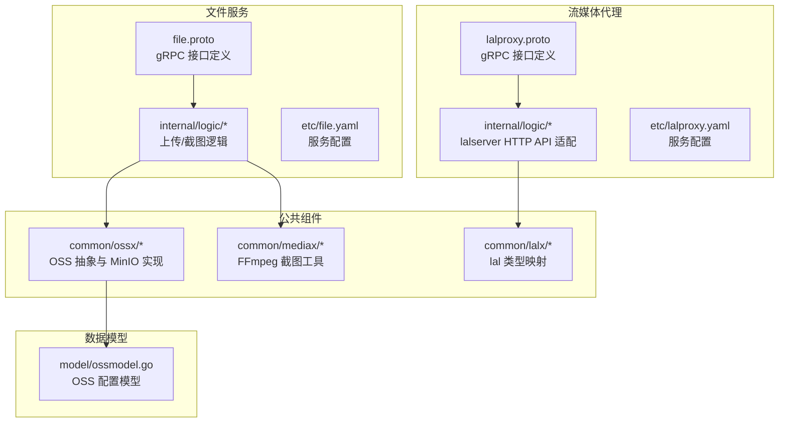
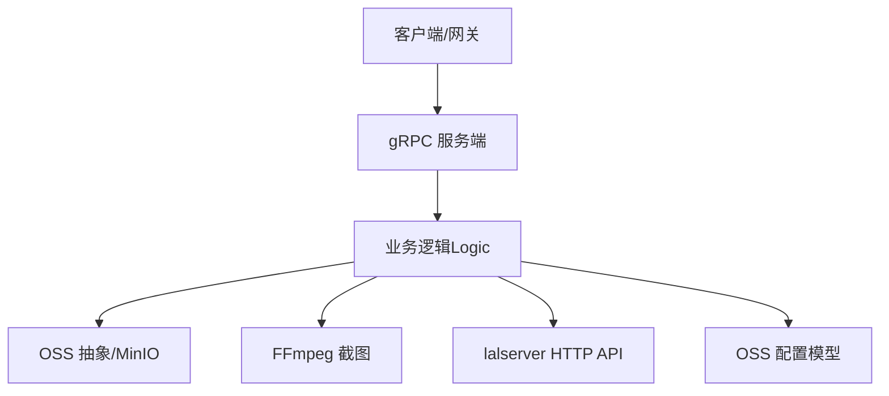
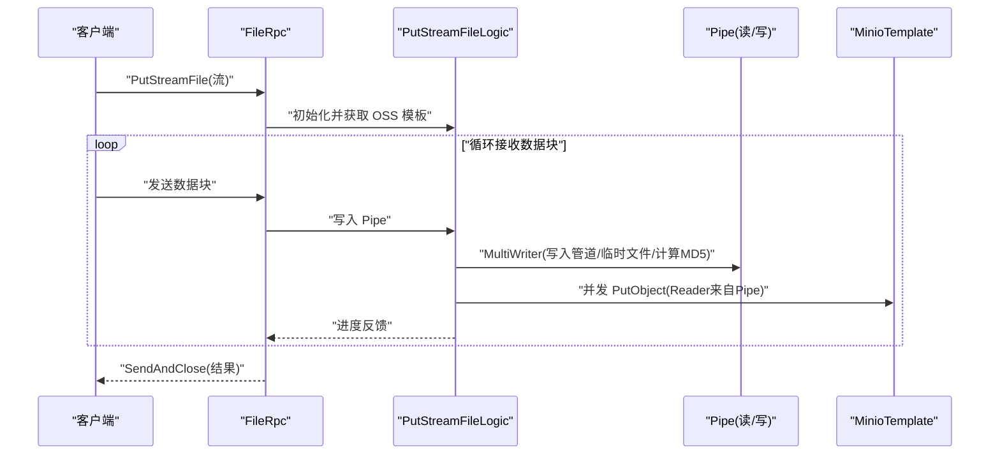
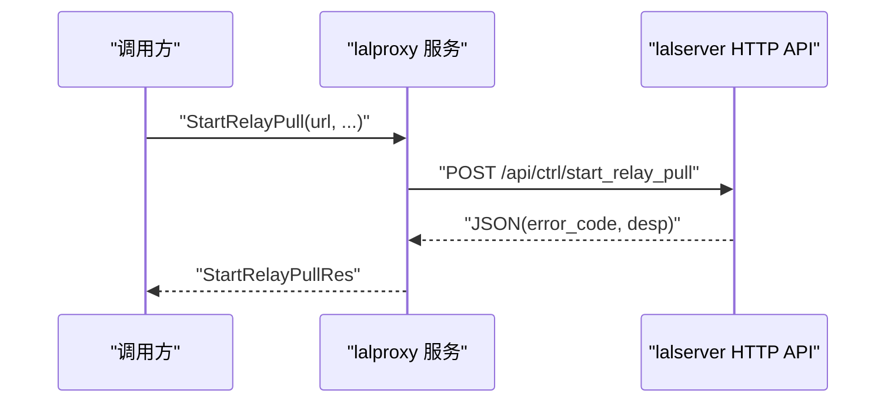
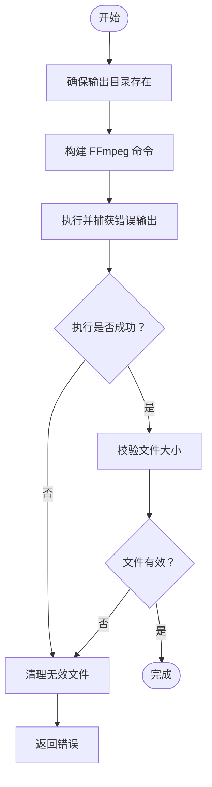
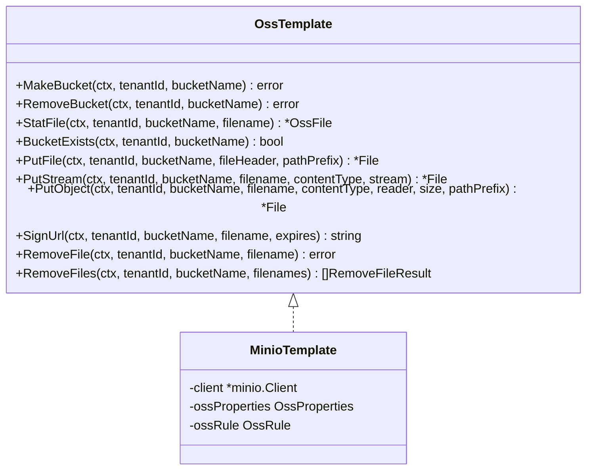
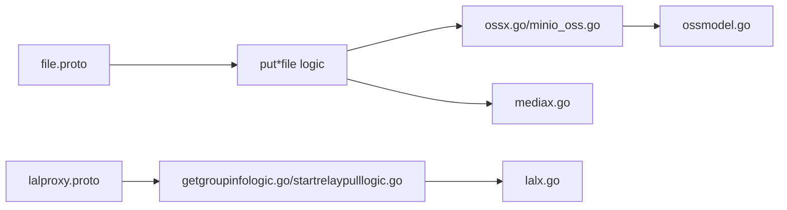

# 文件与流媒体服务

<cite>
**本文引用的文件**
- [app/file/file.proto](file://app/file/file.proto)
- [app/file/etc/file.yaml](file://app/file/etc/file.yaml)
- [app/file/internal/logic/putchunkfilelogic.go](file://app/file/internal/logic/putchunkfilelogic.go)
- [app/file/internal/logic/putstreamfilelogic.go](file://app/file/internal/logic/putstreamfilelogic.go)
- [app/file/internal/logic/capturevideostreamlogic.go](file://app/file/internal/logic/capturevideostreamlogic.go)
- [common/ossx/ossx.go](file://common/ossx/ossx.go)
- [common/ossx/minio_oss.go](file://common/ossx/minio_oss.go)
- [common/mediax/mediax.go](file://common/mediax/mediax.go)
- [model/ossmodel.go](file://model/ossmodel.go)
- [app/lalproxy/lalproxy.proto](file://app/lalproxy/lalproxy.proto)
- [app/lalproxy/etc/lalproxy.yaml](file://app/lalproxy/etc/lalproxy.yaml)
- [app/lalproxy/internal/logic/getgroupinfologic.go](file://app/lalproxy/internal/logic/getgroupinfologic.go)
- [app/lalproxy/internal/logic/startrelaypulllogic.go](file://app/lalproxy/internal/logic/startrelaypulllogic.go)
- [common/lalx/laltype.go](file://common/lalx/laltype.go)
</cite>

## 目录
1. [简介](#简介)
2. [项目结构](#项目结构)
3. [核心组件](#核心组件)
4. [架构总览](#架构总览)
5. [详细组件分析](#详细组件分析)
6. [依赖分析](#依赖分析)
7. [性能考虑](#性能考虑)
8. [故障排查指南](#故障排查指南)
9. [结论](#结论)
10. [附录](#附录)

## 简介
本技术文档聚焦于“文件与流媒体服务”，围绕以下目标展开：
- 文件服务（file）：分片上传、断点续传、对象存储（OSS）集成、视频流处理（截图与上传）。
- 流媒体服务（lalhook/lalproxy）：直播推拉流处理机制，包括 HLS 转码、录制管理与 CDN 集成的建议方案。
- 媒体处理：编解码流程、质量控制与性能优化策略。
- 实施示例：文件上传下载、视频播放与直播推流的典型用法。
- 技术细节：存储策略、带宽优化与缓存机制。

## 项目结构
本仓库采用多模块微服务架构，文件与流媒体相关的关键模块如下：
- 文件服务：app/file（gRPC 接口、业务逻辑、配置）
- 流媒体代理：app/lalproxy（gRPC 封装 lalserver 的 HTTP API）
- 公共组件：common/ossx（OSS 抽象与 MinIO 实现）、common/mediax（FFmpeg 截图）、common/lalx（lal 类型映射）
- 数据模型：model（OSS 配置模型）

**图表来源**
- [app/file/file.proto:1-287](file://app/file/file.proto#L1-L287)
- [app/file/etc/file.yaml:1-23](file://app/file/etc/file.yaml#L1-L23)
- [app/lalproxy/lalproxy.proto:1-308](file://app/lalproxy/lalproxy.proto#L1-L308)
- [app/lalproxy/etc/lalproxy.yaml:1-19](file://app/lalproxy/etc/lalproxy.yaml#L1-L19)
- [common/ossx/ossx.go:1-152](file://common/ossx/ossx.go#L1-L152)
- [common/ossx/minio_oss.go:1-243](file://common/ossx/minio_oss.go#L1-L243)
- [common/mediax/mediax.go:1-194](file://common/mediax/mediax.go#L1-L194)
- [common/lalx/laltype.go:1-126](file://common/lalx/laltype.go#L1-L126)
- [model/ossmodel.go:1-32](file://model/ossmodel.go#L1-L32)

**章节来源**
- [app/file/file.proto:1-287](file://app/file/file.proto#L1-L287)
- [app/file/etc/file.yaml:1-23](file://app/file/etc/file.yaml#L1-L23)
- [app/lalproxy/lalproxy.proto:1-308](file://app/lalproxy/lalproxy.proto#L1-L308)
- [app/lalproxy/etc/lalproxy.yaml:1-19](file://app/lalproxy/etc/lalproxy.yaml#L1-L19)
- [common/ossx/ossx.go:1-152](file://common/ossx/ossx.go#L1-L152)
- [common/ossx/minio_oss.go:1-243](file://common/ossx/minio_oss.go#L1-L243)
- [common/mediax/mediax.go:1-194](file://common/mediax/mediax.go#L1-L194)
- [common/lalx/laltype.go:1-126](file://common/lalx/laltype.go#L1-L126)
- [model/ossmodel.go:1-32](file://model/ossmodel.go#L1-L32)

## 核心组件
- 文件服务（file）
  - gRPC 接口：Ping、OssDetail/List/Create/Update/Delete、MakeBucket/RemoveBucket、StatFile/SignUrl、PutFile/PutChunkFile/PutStreamFile、GetFile/RemoveFile/RemoveFiles、CaptureVideoStream。
  - 上传能力：支持分片流式上传（双向流）、流式直传（单向流），并行写入 OSS。
  - 媒体处理：基于 FFmpeg 的视频截图与缩略图生成，EXIF 元数据提取。
  - 存储集成：OSS 抽象模板，当前实现 MinIO，支持桶管理、对象上传/删除、签名 URL。
- 流媒体代理（lalproxy）
  - gRPC 封装：GetGroupInfo、GetAllGroups、GetLalInfo、StartRelayPull、StopRelayPull、KickSession、StartRtpPub、StopRtpPub、AddIpBlacklist。
  - 适配 lalserver HTTP API，统一错误码与数据结构。
- 公共组件
  - OSS 抽象：OssTemplate 接口、租户模式、桶命名规则、连接池复用。
  - MinIO 实现：桶操作、对象上传/删除、批量删除、签名 URL。
  - 媒体处理：FFmpeg 截图工具，支持按时间点/帧索引截图，本地临时文件与校验。
  - lal 类型映射：将 lalserver JSON 字段映射为 Go 结构体，便于 gRPC 序列化。

**章节来源**
- [app/file/file.proto:270-287](file://app/file/file.proto#L270-L287)
- [app/lalproxy/lalproxy.proto:288-308](file://app/lalproxy/lalproxy.proto#L288-L308)
- [common/ossx/ossx.go:28-39](file://common/ossx/ossx.go#L28-L39)
- [common/ossx/minio_oss.go:20-243](file://common/ossx/minio_oss.go#L20-L243)
- [common/mediax/mediax.go:17-194](file://common/mediax/mediax.go#L17-L194)
- [common/lalx/laltype.go:3-126](file://common/lalx/laltype.go#L3-L126)

## 架构总览
文件与流媒体服务由“接口层（gRPC）—业务逻辑层（Logic）—公共组件（OSS/媒体/lal）—数据模型”构成，形成清晰的分层与职责分离。

**图表来源**
- [app/file/file.proto:270-287](file://app/file/file.proto#L270-L287)
- [app/lalproxy/lalproxy.proto:288-308](file://app/lalproxy/lalproxy.proto#L288-L308)
- [common/ossx/ossx.go:109-151](file://common/ossx/ossx.go#L109-L151)
- [common/mediax/mediax.go:22-87](file://common/mediax/mediax.go#L22-L87)
- [common/lalx/laltype.go:1-126](file://common/lalx/laltype.go#L1-L126)
- [model/ossmodel.go:10-31](file://model/ossmodel.go#L10-L31)

## 详细组件分析

### 文件服务（file）架构与流程
- 分片上传（PutChunkFile）
  - 使用 io.Pipe 构造读写两端，一边从 gRPC 流读取数据写入管道，另一边并发写入 OSS。
  - 在初始化阶段动态获取 OSS 模板，探测内容类型，必要时缓存 EXIF 以提取图片元信息。
  - 支持缩略图异步生成与上传，完成后填充缩略图链接与名称。
  - 进度通过流式响应反馈，支持断点续传语义（客户端可基于已上传大小继续）。
- 流式直传（PutStreamFile）
  - 与分片上传类似，但使用 SendAndClose 返回最终结果，适合一次性大文件直传。
  - 增加进度日志阈值控制，避免频繁日志输出。
- 视频流截图（CaptureVideoStream）
  - 基于 FFmpeg 截取实时流当前帧，生成本地临时文件，随后上传至 OSS 并计算 MD5。
  - 截图路径按日期组织，确保并发安全与磁盘空间可控。

**图表来源**
- [app/file/internal/logic/putstreamfilelogic.go:43-287](file://app/file/internal/logic/putstreamfilelogic.go#L43-L287)
- [common/ossx/minio_oss.go:124-148](file://common/ossx/minio_oss.go#L124-L148)

**章节来源**
- [app/file/internal/logic/putchunkfilelogic.go:38-270](file://app/file/internal/logic/putchunkfilelogic.go#L38-L270)
- [app/file/internal/logic/putstreamfilelogic.go:43-287](file://app/file/internal/logic/putstreamfilelogic.go#L43-L287)
- [app/file/internal/logic/capturevideostreamlogic.go:35-93](file://app/file/internal/logic/capturevideostreamlogic.go#L35-L93)
- [common/mediax/mediax.go:32-87](file://common/mediax/mediax.go#L32-L87)

### 流媒体代理（lalproxy）直播推拉流处理
- 查询类接口
  - GetGroupInfo：查询指定流的分组信息（编码、分辨率、会话列表、帧率统计）。
  - GetAllGroups：获取所有活跃分组列表。
  - GetLalInfo：获取 lalserver 基础信息（版本、启动时间等）。
- 控制类接口
  - StartRelayPull：从远端拉流（支持 RTMP/RTSP），可配置超时、重试、无输出自动停止等。
  - StopRelayPull：停止指定流的中继拉流。
  - KickSession：踢出指定会话（支持 PUB/SUB/PULL）。
  - StartRtpPub/StopRtpPub：打开/关闭 GB28181 RTP 接收端口。
  - AddIpBlacklist：将指定 IP 加入 HLS 协议黑名单（时长可配置）。

**图表来源**
- [app/lalproxy/internal/logic/startrelaypulllogic.go:31-94](file://app/lalproxy/internal/logic/startrelaypulllogic.go#L31-L94)
- [app/lalproxy/lalproxy.proto:180-204](file://app/lalproxy/lalproxy.proto#L180-L204)

**章节来源**
- [app/lalproxy/internal/logic/getgroupinfologic.go:34-87](file://app/lalproxy/internal/logic/getgroupinfologic.go#L34-L87)
- [app/lalproxy/internal/logic/startrelaypulllogic.go:31-94](file://app/lalproxy/internal/logic/startrelaypulllogic.go#L31-L94)
- [app/lalproxy/lalproxy.proto:138-178](file://app/lalproxy/lalproxy.proto#L138-L178)

### 媒体处理与质量控制
- 截图与缩略图
  - 截图工具支持按时间点与帧索引两种方式，输出 JPEG 格式，质量参数可调。
  - 本地临时文件按日期目录组织，避免冲突；完成后进行有效性校验与清理。
  - 缩略图异步生成与上传，避免阻塞主流程。
- 编解码流程
  - 基于 FFmpeg 的输入/过滤/输出链路，支持错误输出捕获与日志记录。
- 质量控制
  - 截图质量参数（q:v）与输出格式（mjpeg）平衡画质与体积。
  - 通过 EXIF 提取经纬度、拍摄时间、相机型号等元信息，用于图片归档与检索。

**图表来源**
- [common/mediax/mediax.go:32-87](file://common/mediax/mediax.go#L32-L87)

**章节来源**
- [common/mediax/mediax.go:89-143](file://common/mediax/mediax.go#L89-L143)
- [common/mediax/mediax.go:145-154](file://common/mediax/mediax.go#L145-L154)

### 存储策略与对象存储集成
- OSS 抽象
  - OssTemplate 接口统一桶管理、对象上传/删除、批量删除、签名 URL、文件信息查询。
  - OssRule 支持租户模式与桶命名规则，确保多租户隔离。
  - 连接池复用：按租户维度缓存模板与配置，减少重复初始化成本。
- MinIO 实现
  - MakeBucket/RemoveBucket/BucketExists：桶生命周期管理。
  - PutFile/PutStream/PutObject：多种上传入口，支持自定义路径前缀。
  - SignUrl：生成带过期时间的预签名 URL。
  - RemoveFiles：批量删除，按输入顺序返回结果与错误映射。

**图表来源**
- [common/ossx/ossx.go:28-39](file://common/ossx/ossx.go#L28-L39)
- [common/ossx/minio_oss.go:20-243](file://common/ossx/minio_oss.go#L20-L243)

**章节来源**
- [common/ossx/ossx.go:109-151](file://common/ossx/ossx.go#L109-L151)
- [common/ossx/minio_oss.go:26-204](file://common/ossx/minio_oss.go#L26-L204)

## 依赖分析
- 文件服务依赖
  - gRPC 接口定义（file.proto）驱动业务逻辑（putchunkfilelogic.go、putstreamfilelogic.go、capturevideostreamlogic.go）。
  - OSS 抽象与 MinIO 实现提供对象存储能力。
  - 媒体处理组件（mediax）提供 FFmpeg 截图能力。
  - 数据模型（ossmodel.go）支撑 OSS 配置查询。
- 流媒体代理依赖
  - lalproxy.proto 定义接口，logic 层封装 lalserver HTTP API。
  - common/lalx 提供类型映射，保证数据一致性。

**图表来源**
- [app/file/file.proto:1-287](file://app/file/file.proto#L1-L287)
- [app/file/internal/logic/putchunkfilelogic.go:1-270](file://app/file/internal/logic/putchunkfilelogic.go#L1-L270)
- [app/file/internal/logic/putstreamfilelogic.go:1-287](file://app/file/internal/logic/putstreamfilelogic.go#L1-L287)
- [app/file/internal/logic/capturevideostreamlogic.go:1-93](file://app/file/internal/logic/capturevideostreamlogic.go#L1-L93)
- [common/ossx/ossx.go:1-152](file://common/ossx/ossx.go#L1-L152)
- [common/ossx/minio_oss.go:1-243](file://common/ossx/minio_oss.go#L1-L243)
- [common/mediax/mediax.go:1-194](file://common/mediax/mediax.go#L1-L194)
- [model/ossmodel.go:1-32](file://model/ossmodel.go#L1-L32)
- [app/lalproxy/lalproxy.proto:1-308](file://app/lalproxy/lalproxy.proto#L1-L308)
- [app/lalproxy/internal/logic/getgroupinfologic.go:1-87](file://app/lalproxy/internal/logic/getgroupinfologic.go#L1-L87)
- [app/lalproxy/internal/logic/startrelaypulllogic.go:1-94](file://app/lalproxy/internal/logic/startrelaypulllogic.go#L1-L94)
- [common/lalx/laltype.go:1-126](file://common/lalx/laltype.go#L1-L126)

**章节来源**
- [app/file/file.proto:1-287](file://app/file/file.proto#L1-L287)
- [app/lalproxy/lalproxy.proto:1-308](file://app/lalproxy/lalproxy.proto#L1-L308)

## 性能考虑
- 上传性能
  - 流式直传：通过 io.Pipe 并发写入 OSS，降低内存占用，提升吞吐。
  - 进度日志阈值：超过阈值才记录，减少高频日志带来的 I/O 开销。
  - 缩略图异步：避免阻塞主上传流程，提高整体响应速度。
- 媒体处理
  - 截图质量参数与输出格式权衡画质与体积；按需裁剪 EXIF 缓冲区大小。
  - 本地临时文件按日期组织，便于清理与监控。
- 存储与网络
  - OSS 连接池按租户复用，减少重复初始化。
  - 签名 URL 支持过期时间控制，结合 CDN 可实现就近加速与缓存。
- 流媒体
  - lalserver 控制接口支持超时、重试与无输出自动停止，降低资源占用。
  - 帧率与码率统计可用于动态调度与告警。

[本节为通用指导，无需列出具体文件来源]

## 故障排查指南
- 文件上传
  - 分片/流式上传：检查管道写入与 OSS 写入是否成功，关注进度反馈与错误通道。
  - 截图失败：查看 FFmpeg 错误输出与本地文件校验结果，确认输入源可用性。
  - 缩略图生成：确认异步任务调度与 OSS 上传结果，排查临时文件清理时机。
- 存储
  - MinIO 操作：核对 Endpoint、AccessKey/SecretKey、Bucket 名称与租户模式配置。
  - 批量删除：依据返回结果映射定位失败对象。
- 流媒体
  - lalserver 接口：检查 URL 构造、参数校验与状态码，解析返回 JSON 结构。
  - 会话管理：确认流名称与会话 ID 正确，避免“会话不存在”错误。

**章节来源**
- [app/file/internal/logic/putchunkfilelogic.go:130-146](file://app/file/internal/logic/putchunkfilelogic.go#L130-L146)
- [app/file/internal/logic/putstreamfilelogic.go:139-155](file://app/file/internal/logic/putstreamfilelogic.go#L139-L155)
- [common/mediax/mediax.go:64-86](file://common/mediax/mediax.go#L64-L86)
- [common/ossx/minio_oss.go:174-204](file://common/ossx/minio_oss.go#L174-L204)
- [app/lalproxy/internal/logic/getgroupinfologic.go:52-62](file://app/lalproxy/internal/logic/getgroupinfologic.go#L52-L62)
- [app/lalproxy/internal/logic/startrelaypulllogic.go:58-76](file://app/lalproxy/internal/logic/startrelaypulllogic.go#L58-L76)

## 结论
本项目通过清晰的分层设计与模块化组件，实现了高可用的文件与流媒体服务能力：
- 文件服务提供稳定高效的分片/流式上传、媒体处理与对象存储集成。
- 流媒体代理以 gRPC 封装 lalserver 能力，便于在微服务体系中统一接入。
- 建议在生产环境中结合 CDN 与缓存策略进一步优化带宽与延迟，并完善监控与告警体系。

[本节为总结性内容，无需列出具体文件来源]

## 附录
- 配置要点
  - 文件服务：监听端口、日志路径、Nacos 注册、租户模式开关、数据库连接。
  - 流媒体代理：监听端口、日志级别、Nacos 注册、数据库连接。
- 常见用法示例（路径指引）
  - 分片上传：[putchunkfilelogic.go:38-270](file://app/file/internal/logic/putchunkfilelogic.go#L38-L270)
  - 流式直传：[putstreamfilelogic.go:43-287](file://app/file/internal/logic/putstreamfilelogic.go#L43-L287)
  - 视频截图：[capturevideostreamlogic.go:35-93](file://app/file/internal/logic/capturevideostreamlogic.go#L35-L93)
  - 查询分组信息：[getgroupinfologic.go:34-87](file://app/lalproxy/internal/logic/getgroupinfologic.go#L34-L87)
  - 启动中继拉流：[startrelaypulllogic.go:31-94](file://app/lalproxy/internal/logic/startrelaypulllogic.go#L31-L94)

**章节来源**
- [app/file/etc/file.yaml:1-23](file://app/file/etc/file.yaml#L1-L23)
- [app/lalproxy/etc/lalproxy.yaml:1-19](file://app/lalproxy/etc/lalproxy.yaml#L1-L19)