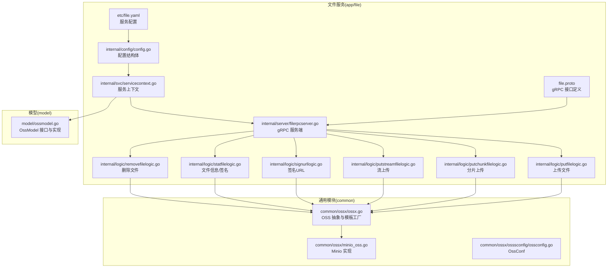
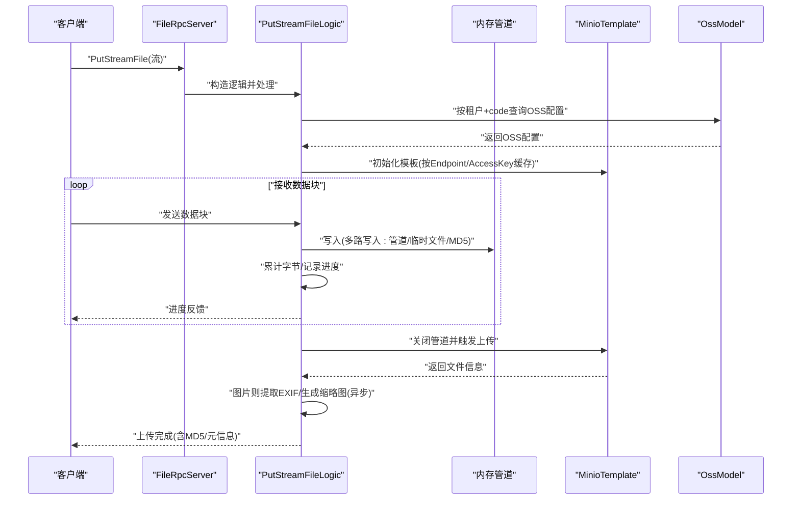
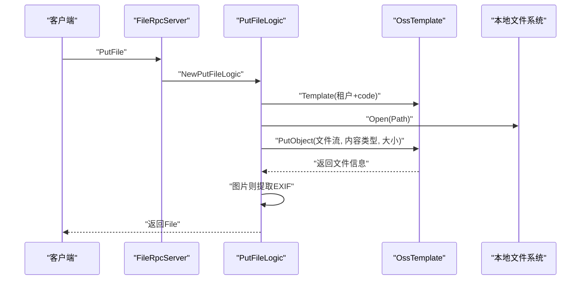
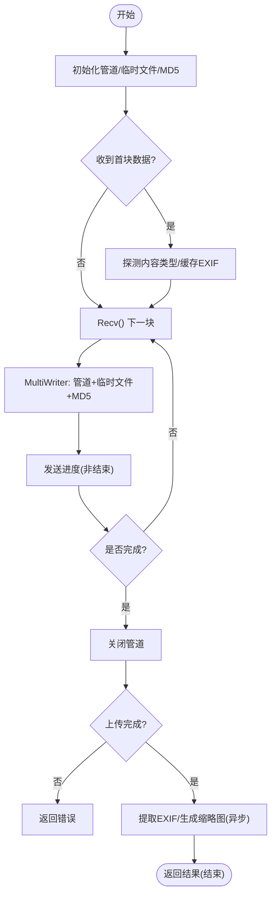
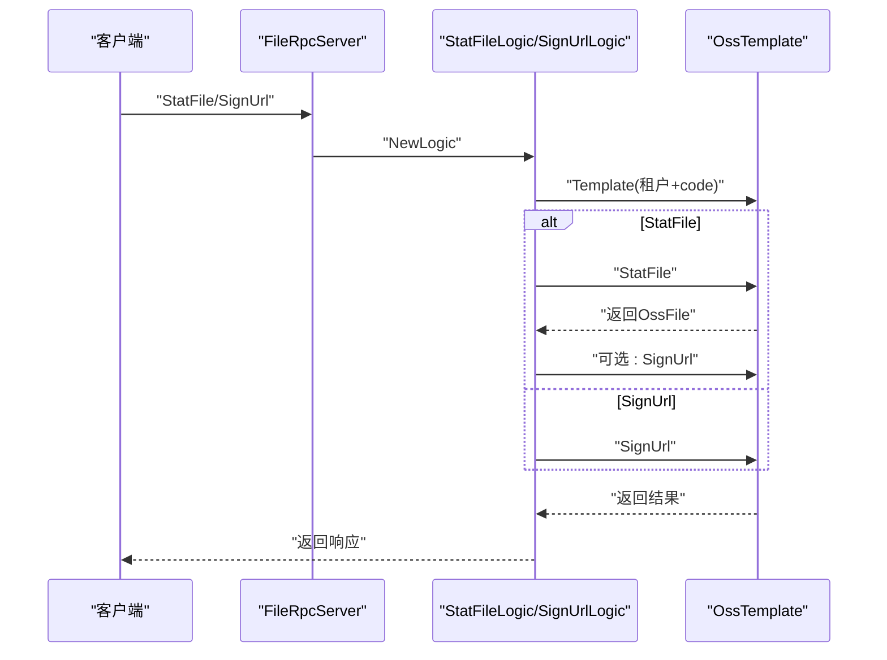
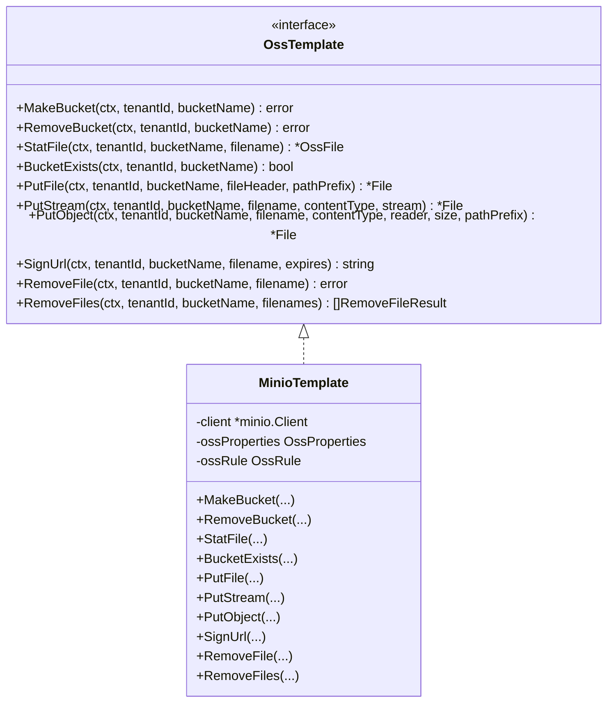
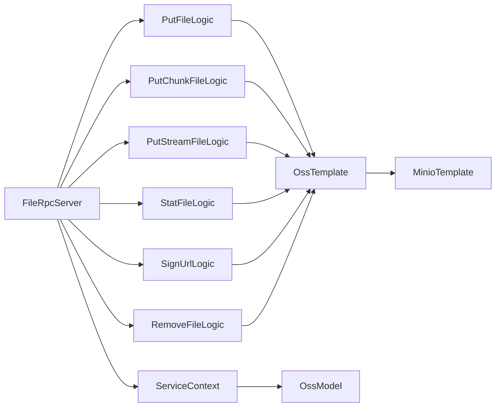

# 文件服务

<cite>
**本文引用的文件**
- [file.proto](file://app/file/file.proto)
- [file.yaml](file://app/file/etc/file.yaml)
- [config.go](file://app/file/internal/config/config.go)
- [servicecontext.go](file://app/file/internal/svc/servicecontext.go)
- [filerpcserver.go](file://app/file/internal/server/filerpcserver.go)
- [putfilelogic.go](file://app/file/internal/logic/putfilelogic.go)
- [putchunkfilelogic.go](file://app/file/internal/logic/putchunkfilelogic.go)
- [putstreamfilelogic.go](file://app/file/internal/logic/putstreamfilelogic.go)
- [signurllogic.go](file://app/file/internal/logic/signurllogic.go)
- [statfilelogic.go](file://app/file/internal/logic/statfilelogic.go)
- [removefilelogic.go](file://app/file/internal/logic/removefilelogic.go)
- [ossx.go](file://common/ossx/ossx.go)
- [minio_oss.go](file://common/ossx/minio_oss.go)
- [ossconfig.go](file://common/ossx/osssconfig/ossconfig.go)
- [ossmodel.go](file://model/ossmodel.go)
</cite>

## 目录
1. [简介](#简介)
2. [项目结构](#项目结构)
3. [核心组件](#核心组件)
4. [架构总览](#架构总览)
5. [详细组件分析](#详细组件分析)
6. [依赖关系分析](#依赖关系分析)
7. [性能考虑](#性能考虑)
8. [故障排查指南](#故障排查指南)
9. [结论](#结论)
10. [附录](#附录)

## 简介
本文件服务基于 gRPC 提供统一的对象存储能力，围绕文件上传、下载、删除、列表与签名 URL 生成等能力构建。其核心特性包括：
- 分片上传与流式上传：支持双向流与单向流两种上传模式，具备断点续传与进度反馈能力
- 对象存储适配：当前以 MinIO 为核心后端，通过模板工厂按租户与资源编号动态选择存储配置
- 元数据与缩略图：自动识别图片 EXIF 并可异步生成缩略图
- 并发控制：缩略图生成使用独立任务运行器，避免阻塞主上传流程
- 配置与上下文：集中配置、Nacos 注册、数据库连接与缓存配置

## 项目结构
文件服务位于 app/file，采用标准 goctl 生成的服务骨架，包含 proto 定义、配置、服务上下文、gRPC 服务端与各业务逻辑层。

图表来源
- [file.proto:1-287](file://app/file/file.proto#L1-L287)
- [file.yaml:1-23](file://app/file/etc/file.yaml#L1-L23)
- [config.go:1-31](file://app/file/internal/config/config.go#L1-L31)
- [servicecontext.go:1-27](file://app/file/internal/svc/servicecontext.go#L1-L27)
- [filerpcserver.go:1-105](file://app/file/internal/server/filerpcserver.go#L1-L105)
- [ossx.go:1-152](file://common/ossx/ossx.go#L1-L152)
- [minio_oss.go:1-243](file://common/ossx/minio_oss.go#L1-L243)
- [ossconfig.go:1-8](file://common/ossx/osssconfig/ossconfig.go#L1-L8)
- [ossmodel.go:1-32](file://model/ossmodel.go#L1-L32)

章节来源
- [file.proto:1-287](file://app/file/file.proto#L1-L287)
- [file.yaml:1-23](file://app/file/etc/file.yaml#L1-L23)
- [config.go:1-31](file://app/file/internal/config/config.go#L1-L31)
- [servicecontext.go:1-27](file://app/file/internal/svc/servicecontext.go#L1-L27)
- [filerpcserver.go:1-105](file://app/file/internal/server/filerpcserver.go#L1-L105)

## 核心组件
- 配置中心与上下文
  - 配置项：监听地址、超时、日志、Nacos 注册、租户模式、缩略图并发数、数据库连接串
  - 上下文：注入验证器、OssModel、缩略图任务运行器
- gRPC 服务端
  - 将每个 RPC 方法委托给对应逻辑层，保持服务端只做编排
- 逻辑层
  - 上传：本地文件上传、分片上传、流式上传
  - 查询：文件状态、签名 URL
  - 删除：单文件与批量删除
- 对象存储抽象
  - 模板工厂：根据租户与资源编号选择存储配置，按 Endpoint/AccessKey 缓存模板
  - MinIO 实现：桶操作、对象上传/下载/删除、签名 URL、文件统计

章节来源
- [config.go:10-30](file://app/file/internal/config/config.go#L10-L30)
- [servicecontext.go:12-26](file://app/file/internal/svc/servicecontext.go#L12-L26)
- [filerpcserver.go:15-105](file://app/file/internal/server/filerpcserver.go#L15-L105)
- [ossx.go:109-151](file://common/ossx/ossx.go#L109-L151)
- [minio_oss.go:20-243](file://common/ossx/minio_oss.go#L20-L243)

## 架构总览
文件服务采用“gRPC 服务端 -> 业务逻辑 -> 对象存储模板”的分层架构。模板工厂负责按租户与资源编号解析存储配置，并缓存模板实例，避免重复初始化。逻辑层在接收请求后，先解析元数据（租户、桶、文件名、内容类型、总大小等），再通过管道将数据写入 OSS，同时计算 MD5、提取图片 EXIF、异步生成缩略图。

图表来源
- [filerpcserver.go:86-89](file://app/file/internal/server/filerpcserver.go#L86-L89)
- [putstreamfilelogic.go:43-287](file://app/file/internal/logic/putstreamfilelogic.go#L43-L287)
- [ossx.go:109-151](file://common/ossx/ossx.go#L109-L151)
- [minio_oss.go:124-148](file://common/ossx/minio_oss.go#L124-L148)
- [ossmodel.go:1-32](file://model/ossmodel.go#L1-L32)

## 详细组件分析

### gRPC 接口与消息模型
- 接口概览
  - 基础：Ping
  - 存储配置：OssDetail、OssList、CreateOss、UpdateOss、DeleteOss、MakeBucket、RemoveBucket
  - 文件操作：StatFile、SignUrl、PutFile、PutChunkFile(双向流)、PutStreamFile(单向流)、RemoveFile、RemoveFiles、CaptureVideoStream
- 关键消息
  - Oss/OssFile/File/ImageMeta：存储配置、OSS 文件信息、通用文件信息、图片元信息
  - PutFileReq/PutChunkFileReq/PutStreamFileReq：上传请求，包含租户、资源编号、桶名、文件名、内容类型、路径前缀、是否缩略图、总大小等
  - StatFileReq/SignUrlReq：查询与签名请求，支持过期时间

章节来源
- [file.proto:9-287](file://app/file/file.proto#L9-L287)

### 配置管理
- 配置项说明
  - Name/ListenOn/Timeout/Mode/Log：服务基本信息与日志
  - NacosConfig：注册中心配置
  - Oss.TenantMode：是否启用租户模式
  - ThumbTaskConcurrency：缩略图并发数
  - DB.DataSource：数据库连接串
- 结构体映射
  - config.Config：继承 zrpc.RpcServerConf，嵌套 NacosConfig、DB、Cache、Oss、ThumbTaskConcurrency

章节来源
- [file.yaml:1-23](file://app/file/etc/file.yaml#L1-L23)
- [config.go:10-30](file://app/file/internal/config/config.go#L10-L30)

### 服务上下文与中间件集成
- 上下文
  - ServiceContext 注入：配置、验证器、OssModel、缩略图任务运行器
- 中间件
  - 服务端拦截器：日志拦截器
  - 客户端拦截器：元数据拦截器
- 数据库与缓存
  - OssModel 通过 sqlx.NewMysql 初始化
  - Cache 由配置注入

章节来源
- [servicecontext.go:12-26](file://app/file/internal/svc/servicecontext.go#L12-L26)

### 上传实现（分片/流式/本地）

#### 本地文件上传（PutFile）
- 流程要点
  - 通过模板工厂解析租户与资源编号对应的存储配置
  - 读取本地文件，探测内容类型，调用模板 PutObject 上传
  - 若为图片，提取 EXIF 并填充元信息
- 并发与性能
  - 本地文件直接上传，无需并发控制

图表来源
- [putfilelogic.go:33-78](file://app/file/internal/logic/putfilelogic.go#L33-L78)
- [ossx.go:109-151](file://common/ossx/ossx.go#L109-L151)

章节来源
- [putfilelogic.go:1-78](file://app/file/internal/logic/putfilelogic.go#L1-L78)

#### 分片上传（PutChunkFile，双向流）
- 流式处理
  - 使用 io.Pipe 构建内存管道，将数据同时写入管道、临时文件与 MD5
  - 在收到首块数据时探测内容类型，缓存前若干字节用于 EXIF
- 断点续传
  - 通过累计写入字节与总大小判断是否完成；未完成时持续接收
- 缩略图与元信息
  - 图片类型提取 EXIF；若标记缩略图，则复制临时文件到副本，异步生成并上传缩略图
- 并发控制
  - 缩略图通过 TaskRunner 并发执行，避免阻塞主上传

图表来源
- [putchunkfilelogic.go:38-270](file://app/file/internal/logic/putchunkfilelogic.go#L38-L270)

章节来源
- [putchunkfilelogic.go:1-270](file://app/file/internal/logic/putchunkfilelogic.go#L1-L270)

#### 流式上传（PutStreamFile，单向流）
- 与分片上传类似，但使用 SendAndClose 返回最终结果
- 增加进度日志阈值控制，超过阈值或完成时输出进度
- 上传完成后计算 MD5 并回填

章节来源
- [putstreamfilelogic.go:1-287](file://app/file/internal/logic/putstreamfilelogic.go#L1-L287)

### 下载、删除、列表与签名 URL

#### 文件状态与签名（StatFile/SignUrl）
- StatFile
  - 查询文件信息，可选生成签名 URL，默认有效期 1 小时，支持自定义分钟数
- SignUrl
  - 校验必填字段，生成签名 URL，默认 1 小时

图表来源
- [statfilelogic.go:29-58](file://app/file/internal/logic/statfilelogic.go#L29-L58)
- [signurllogic.go:29-60](file://app/file/internal/logic/signurllogic.go#L29-L60)
- [ossx.go:109-151](file://common/ossx/ossx.go#L109-L151)

章节来源
- [statfilelogic.go:1-59](file://app/file/internal/logic/statfilelogic.go#L1-L59)
- [signurllogic.go:1-61](file://app/file/internal/logic/signurllogic.go#L1-L61)

#### 删除文件（RemoveFile/RemoveFiles）
- 单文件删除：按租户、桶、文件名删除
- 批量删除：返回每文件删除结果

章节来源
- [removefilelogic.go:1-39](file://app/file/internal/logic/removefilelogic.go#L1-L39)
- [minio_oss.go:164-204](file://common/ossx/minio_oss.go#L164-L204)

### 对象存储集成（OSS）方案

#### 模板工厂与租户模式
- 模板缓存
  - 以租户 ID 为键缓存模板与配置，当 Endpoint 或 AccessKey 变更时重建
- 租户模式
  - 当启用租户模式时，桶名前缀为 “tenantId-bucketName”
- 类型支持
  - 当前仅支持 MinIO；其他类型可通过扩展实现 OssTemplate 接口接入

图表来源
- [ossx.go:28-39](file://common/ossx/ossx.go#L28-L39)
- [minio_oss.go:20-243](file://common/ossx/minio_oss.go#L20-L243)

章节来源
- [ossx.go:1-152](file://common/ossx/ossx.go#L1-L152)
- [minio_oss.go:1-243](file://common/ossx/minio_oss.go#L1-L243)
- [ossconfig.go:1-8](file://common/ossx/osssconfig/ossconfig.go#L1-L8)

### 元数据管理与权限控制
- 元数据
  - 文件大小、格式化大小、原始文件名、MD5、图片 EXIF（经纬度、拍摄时间、尺寸、海拔、相机型号）
- 权限控制
  - 通过租户 ID 与资源编号关联存储配置，实现租户隔离
  - 签名 URL 由后端生成，避免暴露密钥

章节来源
- [putstreamfilelogic.go:272-279](file://app/file/internal/logic/putstreamfilelogic.go#L272-L279)
- [ossx.go:109-151](file://common/ossx/ossx.go#L109-L151)

## 依赖关系分析
- 服务端到逻辑层：每个 RPC 映射到一个逻辑实现
- 逻辑层到 OSS 抽象：统一通过 Template 获取模板
- OSS 抽象到具体实现：当前为 MinioTemplate
- 上下文到数据层：OssModel 提供按租户与资源编号查询存储配置

图表来源
- [filerpcserver.go:15-105](file://app/file/internal/server/filerpcserver.go#L15-L105)
- [ossx.go:109-151](file://common/ossx/ossx.go#L109-L151)
- [minio_oss.go:20-243](file://common/ossx/minio_oss.go#L20-L243)
- [ossmodel.go:1-32](file://model/ossmodel.go#L1-L32)

章节来源
- [filerpcserver.go:1-105](file://app/file/internal/server/filerpcserver.go#L1-L105)
- [ossx.go:1-152](file://common/ossx/ossx.go#L1-L152)
- [minio_oss.go:1-243](file://common/ossx/minio_oss.go#L1-L243)
- [ossmodel.go:1-32](file://model/ossmodel.go#L1-L32)

## 性能考虑
- 上传路径
  - 使用 io.Pipe 将数据写入 OSS 的同时计算 MD5，避免额外磁盘 IO
  - 图片缩略图异步生成，不阻塞主上传流程
- 并发控制
  - 缩略图并发数由配置项控制，避免过度占用 CPU
- 进度与日志
  - 流上传设置进度阈值日志，便于大文件监控
- 存储后端
  - MinIO 作为默认后端，具备高吞吐与低延迟特性；后续可扩展其他云厂商 SDK

## 故障排查指南
- 上传失败
  - 检查租户与资源编号是否正确，确认模板缓存是否命中
  - 查看 OSS 客户端初始化与桶存在性
- 签名 URL 无效
  - 校验过期时间参数；确认桶与文件名存在
- 删除异常
  - 批量删除返回每文件结果，逐条排查错误
- 缩略图未生成
  - 确认图片类型与 EXIF 缓冲区足够；检查 TaskRunner 并发与日志

章节来源
- [putstreamfilelogic.go:199-207](file://app/file/internal/logic/putstreamfilelogic.go#L199-L207)
- [signurllogic.go:44-56](file://app/file/internal/logic/signurllogic.go#L44-L56)
- [minio_oss.go:174-204](file://common/ossx/minio_oss.go#L174-L204)
- [servicecontext.go:24-24](file://app/file/internal/svc/servicecontext.go#L24-L24)

## 结论
文件服务通过清晰的分层与抽象，实现了稳定高效的文件上传、查询、删除与签名能力。当前以 MinIO 为核心后端，具备良好的扩展性；通过租户模式与并发控制，满足多租户场景下的性能与安全需求。建议后续完善更多存储后端适配与鉴权策略，进一步增强生态兼容性与安全性。

## 附录
- 配置示例路径
  - [file.yaml:1-23](file://app/file/etc/file.yaml#L1-L23)
- 接口定义路径
  - [file.proto:1-287](file://app/file/file.proto#L1-L287)
- 代码参考路径
  - [putfilelogic.go:1-78](file://app/file/internal/logic/putfilelogic.go#L1-L78)
  - [putchunkfilelogic.go:1-270](file://app/file/internal/logic/putchunkfilelogic.go#L1-L270)
  - [putstreamfilelogic.go:1-287](file://app/file/internal/logic/putstreamfilelogic.go#L1-L287)
  - [statfilelogic.go:1-59](file://app/file/internal/logic/statfilelogic.go#L1-L59)
  - [signurllogic.go:1-61](file://app/file/internal/logic/signurllogic.go#L1-L61)
  - [removefilelogic.go:1-39](file://app/file/internal/logic/removefilelogic.go#L1-L39)
  - [ossx.go:1-152](file://common/ossx/ossx.go#L1-L152)
  - [minio_oss.go:1-243](file://common/ossx/minio_oss.go#L1-L243)
  - [ossmodel.go:1-32](file://model/ossmodel.go#L1-L32)