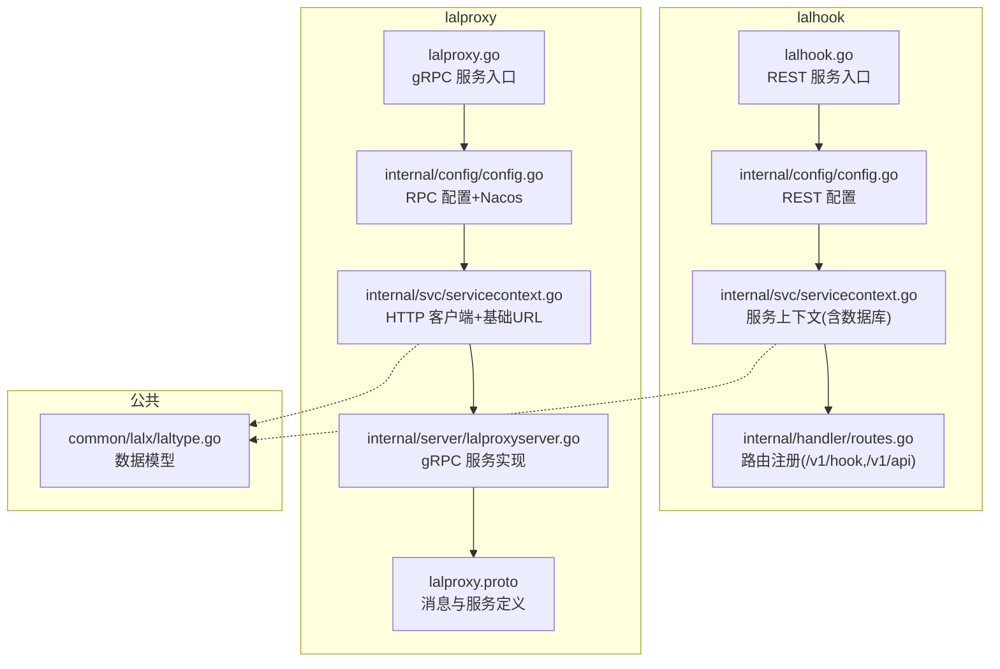
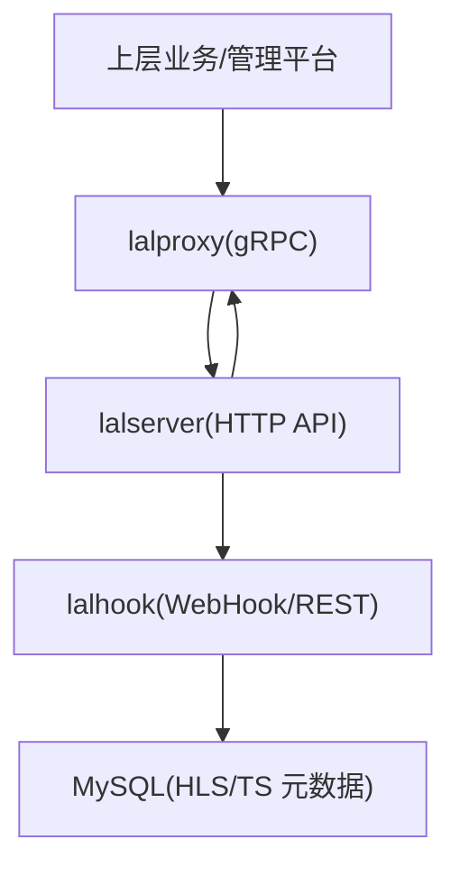
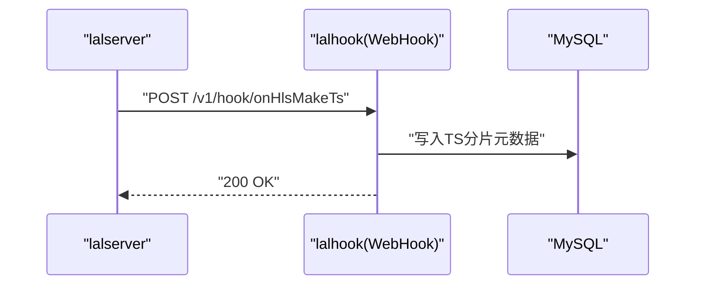
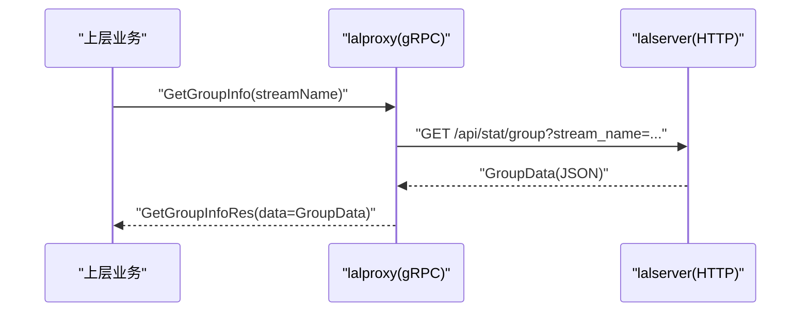
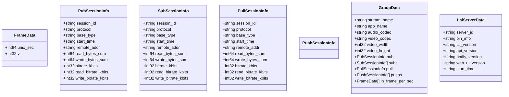
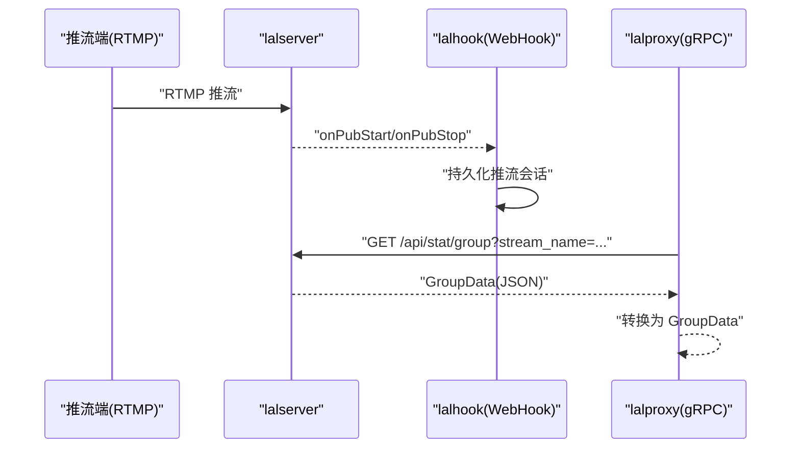
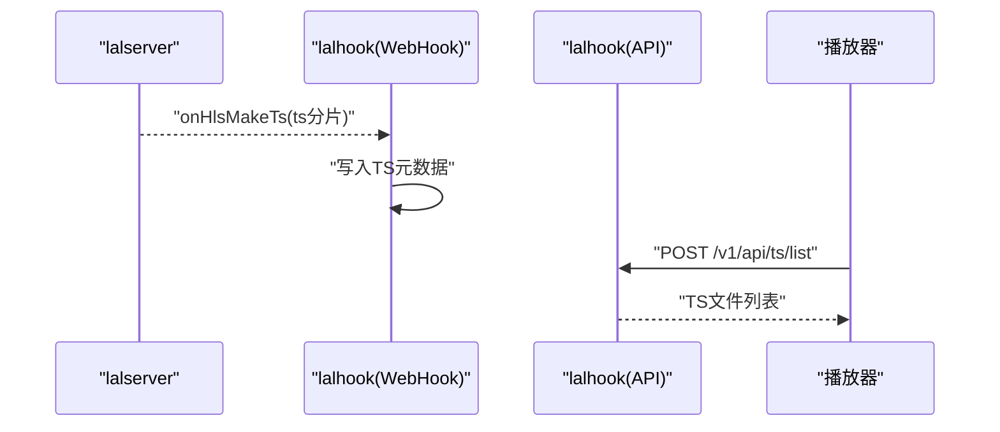
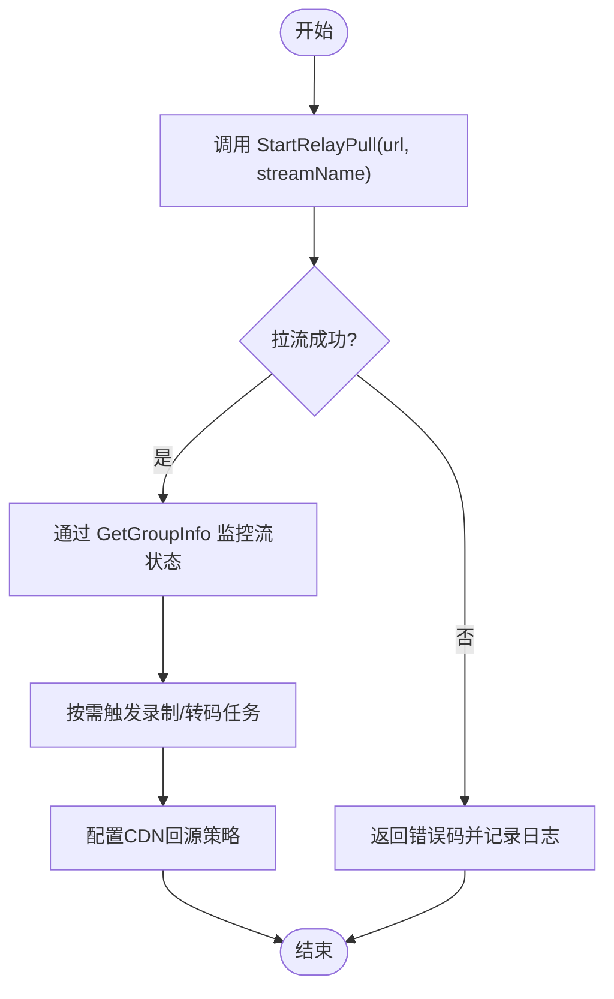
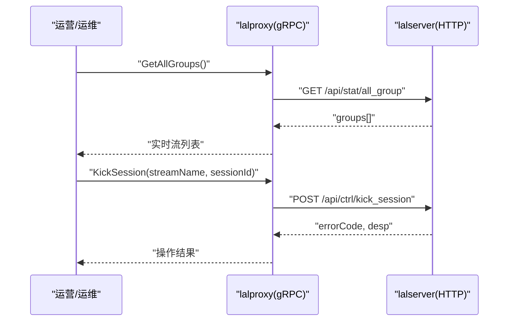
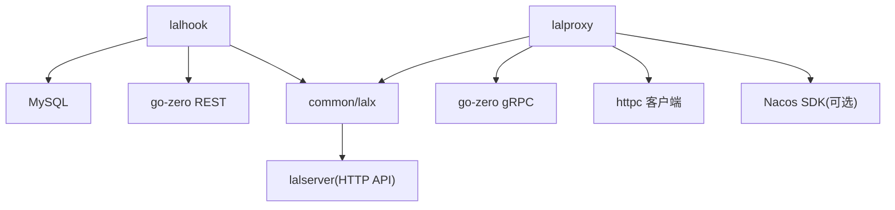

# 流媒体服务

<cite>
**本文引用的文件**
- [app/lalhook/lalhook.go](file://app/lalhook/lalhook.go)
- [app/lalhook/etc/lalhook.yaml](file://app/lalhook/etc/lalhook.yaml)
- [app/lalhook/internal/config/config.go](file://app/lalhook/internal/config/config.go)
- [app/lalhook/internal/svc/servicecontext.go](file://app/lalhook/internal/svc/servicecontext.go)
- [app/lalhook/internal/handler/routes.go](file://app/lalhook/internal/handler/routes.go)
- [common/lalx/laltype.go](file://common/lalx/laltype.go)
- [app/lalproxy/lalproxy.go](file://app/lalproxy/lalproxy.go)
- [app/lalproxy/etc/lalproxy.yaml](file://app/lalproxy/etc/lalproxy.yaml)
- [app/lalproxy/internal/config/config.go](file://app/lalproxy/internal/config/config.go)
- [app/lalproxy/internal/svc/servicecontext.go](file://app/lalproxy/internal/svc/servicecontext.go)
- [app/lalproxy/internal/server/lalproxyserver.go](file://app/lalproxy/internal/server/lalproxyserver.go)
- [app/lalproxy/lalproxy.proto](file://app/lalproxy/lalproxy.proto)
</cite>

## 目录
1. [简介](#简介)
2. [项目结构](#项目结构)
3. [核心组件](#核心组件)
4. [架构总览](#架构总览)
5. [详细组件分析](#详细组件分析)
6. [依赖分析](#依赖分析)
7. [性能考虑](#性能考虑)
8. [故障排查指南](#故障排查指南)
9. [结论](#结论)
10. [附录](#附录)

## 简介
本技术文档围绕流媒体服务中的两个核心子系统：lalhook 与 lalproxy，系统性阐述其设计理念、协作机制与关键流程。lalhook 作为 WebHook 接收与处理模块，负责对接 lalserver 的事件回调，完成 HLS 分片记录、推流/拉流生命周期事件、定时更新等；lalproxy 作为 RPC 代理模块，封装 lalserver 的 HTTP API，提供查询与控制两类能力，统一对外暴露 gRPC 接口，便于上层业务进行流状态监控、转码调度、录制管理与 CDN 集成。

## 项目结构
- lalhook：基于 go-zero 的 REST 服务，监听 /v1/hook 与 /v1/api 前缀下的 WebHook 与 API 路由，连接 MySQL 存储 TS/HLS 文件元数据。
- lalproxy：基于 go-zero 的 gRPC 服务，封装 lalserver 的 /api/stat 与 /api/ctrl 接口，提供查询与控制能力，并可注册至 Nacos。
- 公共模型：common/lalx/laltype.go 提供与 lalserver 返回结构一致的数据模型，确保前后端数据契约一致。

图表来源
- [app/lalhook/lalhook.go:1-49](file://app/lalhook/lalhook.go#L1-L49)
- [app/lalhook/internal/config/config.go:1-11](file://app/lalhook/internal/config/config.go#L1-L11)
- [app/lalhook/internal/svc/servicecontext.go:1-21](file://app/lalhook/internal/svc/servicecontext.go#L1-L21)
- [app/lalhook/internal/handler/routes.go:1-98](file://app/lalhook/internal/handler/routes.go#L1-L98)
- [app/lalproxy/lalproxy.go:1-71](file://app/lalproxy/lalproxy.go#L1-L71)
- [app/lalproxy/internal/config/config.go:1-26](file://app/lalproxy/internal/config/config.go#L1-L26)
- [app/lalproxy/internal/svc/servicecontext.go:1-36](file://app/lalproxy/internal/svc/servicecontext.go#L1-L36)
- [app/lalproxy/internal/server/lalproxyserver.go:1-79](file://app/lalproxy/internal/server/lalproxyserver.go#L1-L79)
- [app/lalproxy/lalproxy.proto:1-308](file://app/lalproxy/lalproxy.proto#L1-L308)
- [common/lalx/laltype.go:1-126](file://common/lalx/laltype.go#L1-L126)

章节来源
- [app/lalhook/lalhook.go:1-49](file://app/lalhook/lalhook.go#L1-L49)
- [app/lalhook/etc/lalhook.yaml:1-10](file://app/lalhook/etc/lalhook.yaml#L1-L10)
- [app/lalhook/internal/config/config.go:1-11](file://app/lalhook/internal/config/config.go#L1-L11)
- [app/lalhook/internal/svc/servicecontext.go:1-21](file://app/lalhook/internal/svc/servicecontext.go#L1-L21)
- [app/lalhook/internal/handler/routes.go:1-98](file://app/lalhook/internal/handler/routes.go#L1-L98)
- [common/lalx/laltype.go:1-126](file://common/lalx/laltype.go#L1-L126)
- [app/lalproxy/lalproxy.go:1-71](file://app/lalproxy/lalproxy.go#L1-L71)
- [app/lalproxy/etc/lalproxy.yaml:1-19](file://app/lalproxy/etc/lalproxy.yaml#L1-L19)
- [app/lalproxy/internal/config/config.go:1-26](file://app/lalproxy/internal/config/config.go#L1-L26)
- [app/lalproxy/internal/svc/servicecontext.go:1-36](file://app/lalproxy/internal/svc/servicecontext.go#L1-L36)
- [app/lalproxy/internal/server/lalproxyserver.go:1-79](file://app/lalproxy/internal/server/lalproxyserver.go#L1-L79)
- [app/lalproxy/lalproxy.proto:1-308](file://app/lalproxy/lalproxy.proto#L1-L308)

## 核心组件
- lalhook（REST）
  - 职责：接收 lalserver 的 WebHook 事件，持久化 TS/HLS 元数据，提供查询接口。
  - 关键点：CORS 配置、超时设置、MySQL 数据源。
- lalproxy（gRPC）
  - 职责：封装 lalserver 的 HTTP API，提供查询与控制两类 RPC，支持 Nacos 注册。
  - 关键点：HTTP 客户端、超时控制、基础 URL 构造。
- 公共模型（common/lalx/laltype.go）
  - 职责：定义与 lalserver 返回一致的数据结构，保证契约一致性。

章节来源
- [app/lalhook/internal/config/config.go:1-11](file://app/lalhook/internal/config/config.go#L1-L11)
- [app/lalhook/etc/lalhook.yaml:1-10](file://app/lalhook/etc/lalhook.yaml#L1-L10)
- [app/lalhook/internal/svc/servicecontext.go:1-21](file://app/lalhook/internal/svc/servicecontext.go#L1-L21)
- [app/lalhook/internal/handler/routes.go:1-98](file://app/lalhook/internal/handler/routes.go#L1-L98)
- [app/lalproxy/internal/config/config.go:1-26](file://app/lalproxy/internal/config/config.go#L1-L26)
- [app/lalproxy/etc/lalproxy.yaml:1-19](file://app/lalproxy/etc/lalproxy.yaml#L1-L19)
- [app/lalproxy/internal/svc/servicecontext.go:1-36](file://app/lalproxy/internal/svc/servicecontext.go#L1-L36)
- [common/lalx/laltype.go:1-126](file://common/lalx/laltype.go#L1-L126)

## 架构总览
lalhook 与 lalproxy 通过 lalserver 进行交互：
- lalhook 通过 WebHook 接收事件并写入数据库，同时提供查询接口。
- lalproxy 通过 HTTP 客户端调用 lalserver 的 /api/stat 与 /api/ctrl 接口，统一以 gRPC 暴露给上层。

图表来源
- [app/lalhook/lalhook.go:1-49](file://app/lalhook/lalhook.go#L1-L49)
- [app/lalhook/internal/handler/routes.go:1-98](file://app/lalhook/internal/handler/routes.go#L1-L98)
- [app/lalproxy/lalproxy.go:1-71](file://app/lalproxy/lalproxy.go#L1-L71)
- [app/lalproxy/internal/svc/servicecontext.go:1-36](file://app/lalproxy/internal/svc/servicecontext.go#L1-L36)
- [app/lalproxy/lalproxy.proto:1-308](file://app/lalproxy/lalproxy.proto#L1-L308)

## 详细组件分析

### lalhook 组件分析
- 入口与配置
  - main 函数加载配置、打印 Go 版本、初始化 REST 服务器并注册 CORS。
  - 配置文件包含服务地址、端口、日志、超时与数据库连接串。
- 服务上下文
  - 初始化 SQL 模型，用于 HLS/TS 文件元数据的持久化。
- 路由与 WebHook
  - /v1/hook 下挂载多个 WebHook 事件处理器（如 onHlsMakeTs、onPubStart、onRelayPullStart 等）。
  - /v1/api 下提供 TS 文件列表查询等 API。
- 处理流程（以 onHlsMakeTs 为例）
  - lalserver 在生成 TS 分片时触发 WebHook。
  - lalhook 写入 TS 文件元数据，便于后续播放与统计。

图表来源
- [app/lalhook/internal/handler/routes.go:34-38](file://app/lalhook/internal/handler/routes.go#L34-L38)
- [app/lalhook/internal/svc/servicecontext.go:10-20](file://app/lalhook/internal/svc/servicecontext.go#L10-L20)

章节来源
- [app/lalhook/lalhook.go:1-49](file://app/lalhook/lalhook.go#L1-L49)
- [app/lalhook/etc/lalhook.yaml:1-10](file://app/lalhook/etc/lalhook.yaml#L1-L10)
- [app/lalhook/internal/config/config.go:1-11](file://app/lalhook/internal/config/config.go#L1-L11)
- [app/lalhook/internal/svc/servicecontext.go:1-21](file://app/lalhook/internal/svc/servicecontext.go#L1-L21)
- [app/lalhook/internal/handler/routes.go:1-98](file://app/lalhook/internal/handler/routes.go#L1-L98)

### lalproxy 组件分析
- 入口与配置
  - main 函数加载配置、打印 Go 版本、构建 gRPC 服务并注册反射（开发/测试模式）。
  - 可选注册至 Nacos，导出 gRPC 端口与元数据。
- 服务上下文
  - 构造 HTTP 客户端，设置超时；拼装 lalserver 基础 URL。
- gRPC 服务实现
  - 将 lalserver 的 /api/stat 与 /api/ctrl 接口映射为 gRPC 方法，统一返回结构与错误码。
- 关键 RPC
  - 查询类：GetGroupInfo、GetAllGroups、GetLalInfo。
  - 控制类：StartRelayPull、StopRelayPull、KickSession、StartRtpPub、StopRtpPub、AddIpBlacklist。

图表来源
- [app/lalproxy/lalproxy.proto:138-152](file://app/lalproxy/lalproxy.proto#L138-L152)
- [app/lalproxy/internal/server/lalproxyserver.go:26-30](file://app/lalproxy/internal/server/lalproxyserver.go#L26-L30)
- [app/lalproxy/internal/svc/servicecontext.go:18-35](file://app/lalproxy/internal/svc/servicecontext.go#L18-L35)

章节来源
- [app/lalproxy/lalproxy.go:1-71](file://app/lalproxy/lalproxy.go#L1-L71)
- [app/lalproxy/etc/lalproxy.yaml:1-19](file://app/lalproxy/etc/lalproxy.yaml#L1-L19)
- [app/lalproxy/internal/config/config.go:1-26](file://app/lalproxy/internal/config/config.go#L1-L26)
- [app/lalproxy/internal/svc/servicecontext.go:1-36](file://app/lalproxy/internal/svc/servicecontext.go#L1-L36)
- [app/lalproxy/internal/server/lalproxyserver.go:1-79](file://app/lalproxy/internal/server/lalproxyserver.go#L1-L79)
- [app/lalproxy/lalproxy.proto:1-308](file://app/lalproxy/lalproxy.proto#L1-L308)

### 数据模型与契约
- 公共模型覆盖：
  - 帧率数据 FrameData
  - 发布者会话 PubSessionInfo
  - 订阅者会话 SubSessionInfo
  - 中继拉流会话 PullSessionInfo
  - 中继推流会话 PushSessionInfo
  - 分组数据 GroupData
  - 服务器信息 LalServerData
- 作用：确保 lalhook 与 lalproxy 对接 lalserver 的数据结构一致，避免解析差异导致的异常。

图表来源
- [common/lalx/laltype.go:3-126](file://common/lalx/laltype.go#L3-L126)

章节来源
- [common/lalx/laltype.go:1-126](file://common/lalx/laltype.go#L1-L126)

### 直播推流处理流程（RTMP）
- 推流接入
  - 推流端通过 RTMP 协议向 lalserver 推流，lalserver 产生 onPubStart/onPubStop 等事件。
- WebHook 处理
  - lalhook 接收 onPubStart/onPubStop，记录推流会话信息与起止时间。
- 状态查询
  - 上层通过 lalproxy 的 GetGroupInfo 获取当前流的发布者、订阅者、帧率等信息。

图表来源
- [app/lalhook/internal/handler/routes.go:40-49](file://app/lalhook/internal/handler/routes.go#L40-L49)
- [app/lalproxy/lalproxy.proto:138-152](file://app/lalproxy/lalproxy.proto#L138-L152)
- [app/lalproxy/internal/server/lalproxyserver.go:26-30](file://app/lalproxy/internal/server/lalproxyserver.go#L26-L30)

章节来源
- [app/lalhook/internal/handler/routes.go:1-98](file://app/lalhook/internal/handler/routes.go#L1-L98)
- [app/lalproxy/lalproxy.proto:1-308](file://app/lalproxy/lalproxy.proto#L1-L308)

### HLS 拉流与分片管理
- 分片生成
  - lalserver 在生成 TS 分片时触发 onHlsMakeTs，lalhook 写入 TS 文件元数据。
- 播放与查询
  - lalhook 提供 TS 文件列表查询接口，便于前端按时间区间拉取播放列表。

图表来源
- [app/lalhook/internal/handler/routes.go:20-29](file://app/lalhook/internal/handler/routes.go#L20-L29)
- [app/lalhook/internal/handler/routes.go:34-38](file://app/lalhook/internal/handler/routes.go#L34-L38)

章节来源
- [app/lalhook/internal/handler/routes.go:1-98](file://app/lalhook/internal/handler/routes.go#L1-L98)

### WebRTC 传输与多协议适配
- 当前代码库未发现 WebRTC 相关实现或配置。
- 若需扩展，建议在 lalserver 层面启用相应协议，并在 lalhook/lalproxy 中增加对应的 WebHook 与 RPC 映射，遵循现有模式。

[本节为概念性说明，不直接分析具体文件，故无章节来源]

### 流媒体转码、录制管理与 CDN 集成
- 转码与录制
  - lalserver 提供转码与录制能力，lalhook/lalproxy 通过其 HTTP API 进行控制与查询。
- CDN 集成
  - 通过 StartRelayPull/StopRelayPull 控制回源拉流，结合上层业务实现边缘节点与 CDN 的联动。

图表来源
- [app/lalproxy/lalproxy.proto:180-204](file://app/lalproxy/lalproxy.proto#L180-L204)
- [app/lalproxy/lalproxy.proto:206-218](file://app/lalproxy/lalproxy.proto#L206-L218)
- [app/lalproxy/lalproxy.proto:138-152](file://app/lalproxy/lalproxy.proto#L138-L152)

章节来源
- [app/lalproxy/lalproxy.proto:1-308](file://app/lalproxy/lalproxy.proto#L1-L308)

### 直播房间管理、流状态监控与性能统计
- 房间管理
  - 通过 KickSession 踢出指定会话，实现房间内的用户管理与风控。
- 流状态监控
  - GetGroupInfo/GetAllGroups 获取实时流信息与会话列表，结合 FrameData 进行帧率统计。
- 性能统计
  - Pub/Sub/Pull 会话中的码率、字节数等指标可用于性能评估与告警。

图表来源
- [app/lalproxy/lalproxy.proto:154-165](file://app/lalproxy/lalproxy.proto#L154-L165)
- [app/lalproxy/lalproxy.proto:220-234](file://app/lalproxy/lalproxy.proto#L220-L234)
- [app/lalproxy/internal/server/lalproxyserver.go:32-36](file://app/lalproxy/internal/server/lalproxyserver.go#L32-L36)
- [app/lalproxy/internal/server/lalproxyserver.go:56-60](file://app/lalproxy/internal/server/lalproxyserver.go#L56-L60)

章节来源
- [app/lalproxy/lalproxy.proto:1-308](file://app/lalproxy/lalproxy.proto#L1-L308)
- [app/lalproxy/internal/server/lalproxyserver.go:1-79](file://app/lalproxy/internal/server/lalproxyserver.go#L1-L79)

## 依赖分析
- lalhook
  - 依赖 go-zero REST、MySQL 数据源、common/lalx 模型。
- lalproxy
  - 依赖 go-zero gRPC、httpc 客户端、Nacos SDK（可选）、common/lalx 模型。
- 两者共同依赖 lalserver 的 HTTP API，通过统一的数据模型保证兼容性。

图表来源
- [app/lalhook/lalhook.go:1-49](file://app/lalhook/lalhook.go#L1-L49)
- [app/lalhook/internal/svc/servicecontext.go:1-21](file://app/lalhook/internal/svc/servicecontext.go#L1-L21)
- [app/lalproxy/lalproxy.go:1-71](file://app/lalproxy/lalproxy.go#L1-L71)
- [app/lalproxy/internal/svc/servicecontext.go:1-36](file://app/lalproxy/internal/svc/servicecontext.go#L1-L36)
- [common/lalx/laltype.go:1-126](file://common/lalx/laltype.go#L1-L126)

章节来源
- [app/lalhook/lalhook.go:1-49](file://app/lalhook/lalhook.go#L1-L49)
- [app/lalproxy/lalproxy.go:1-71](file://app/lalproxy/lalproxy.go#L1-L71)
- [common/lalx/laltype.go:1-126](file://common/lalx/laltype.go#L1-L126)

## 性能考虑
- 网络与超时
  - lalhook：REST 服务配置了较长超时，适合大文件上传与长时间任务。
  - lalproxy：HTTP 客户端设置了超时，避免阻塞 gRPC 请求。
- 数据库
  - lalhook 使用 MySQL 存储 TS/HLS 元数据，建议对时间字段与流名称建立索引以提升查询性能。
- 缓冲与并发
  - 建议在 lalserver 层面合理配置缓冲区与并发参数，减少丢帧与延迟。
- 监控与告警
  - 结合 FrameData 与会话指标，建立性能阈值告警，及时发现异常。

[本节提供通用指导，不直接分析具体文件，故无章节来源]

## 故障排查指南
- WebHook 未触发
  - 检查 lalserver 的 WebHook 地址与 lalhook 的路由是否一致。
  - 查看 lalhook 日志与 CORS 配置，确认跨域与请求头正确。
- 查询不到流信息
  - 确认 lalproxy 的 lalserver 基础 URL 与端口配置正确。
  - 检查 lalserver 是否正常运行及 /api/stat/* 接口可达。
- 拉流失败
  - 使用 StartRelayPull 的错误码定位问题（如 in stream already exist），检查 URL 与流名称。
- 踢人无效
  - 确认 sessionId 正确且会话存在，使用 KickSession 进行验证。

章节来源
- [app/lalhook/internal/handler/routes.go:1-98](file://app/lalhook/internal/handler/routes.go#L1-L98)
- [app/lalproxy/internal/svc/servicecontext.go:18-35](file://app/lalproxy/internal/svc/servicecontext.go#L18-L35)
- [app/lalproxy/lalproxy.proto:180-204](file://app/lalproxy/lalproxy.proto#L180-L204)
- [app/lalproxy/lalproxy.proto:220-234](file://app/lalproxy/lalproxy.proto#L220-L234)

## 结论
lalhook 与 lalproxy 通过清晰的职责划分与统一的数据模型，实现了对 lalserver 的事件接收与 API 封装。lalhook 负责 WebHook 事件与 TS/HLS 元数据管理，lalproxy 负责查询与控制能力的集中化暴露。在此基础上，可进一步扩展 WebRTC 支持、完善转码与录制流程，并结合 CDN 实现高效分发与高可用。

[本节为总结性内容，不直接分析具体文件，故无章节来源]

## 附录
- 配置要点
  - lalhook：Host/Port、日志编码、超时、数据库连接串。
  - lalproxy：ListenOn、日志路径与级别、Nacos 注册开关与参数、lalserver IP/端口与超时。
- 常用 RPC
  - GetGroupInfo、GetAllGroups、GetLalInfo、StartRelayPull、StopRelayPull、KickSession、StartRtpPub、AddIpBlacklist。

章节来源
- [app/lalhook/etc/lalhook.yaml:1-10](file://app/lalhook/etc/lalhook.yaml#L1-L10)
- [app/lalproxy/etc/lalproxy.yaml:1-19](file://app/lalproxy/etc/lalproxy.yaml#L1-L19)
- [app/lalproxy/lalproxy.proto:1-308](file://app/lalproxy/lalproxy.proto#L1-L308)