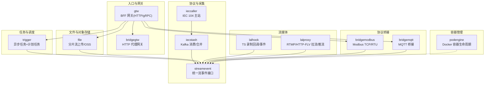
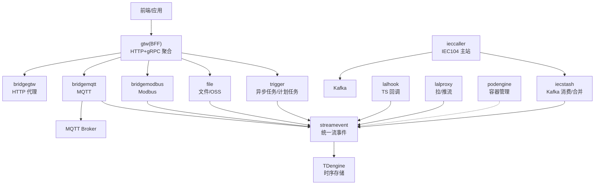
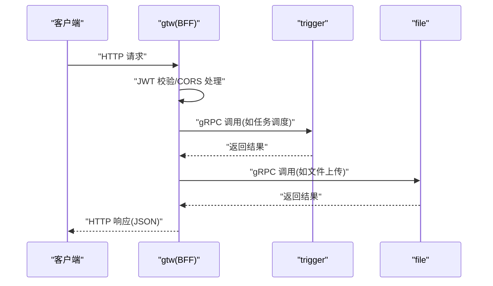
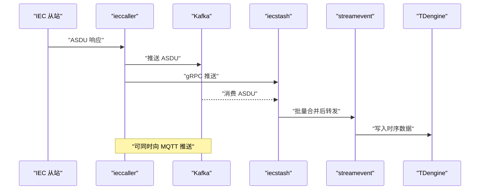
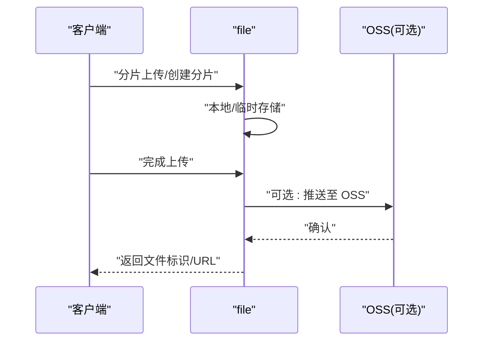
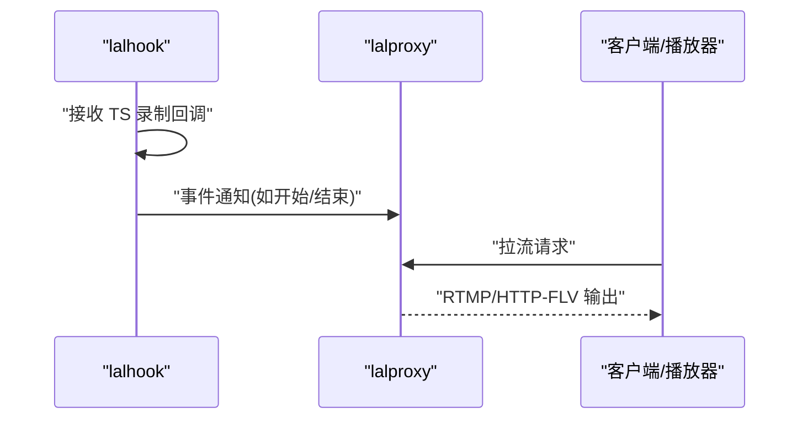
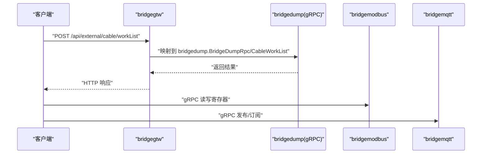
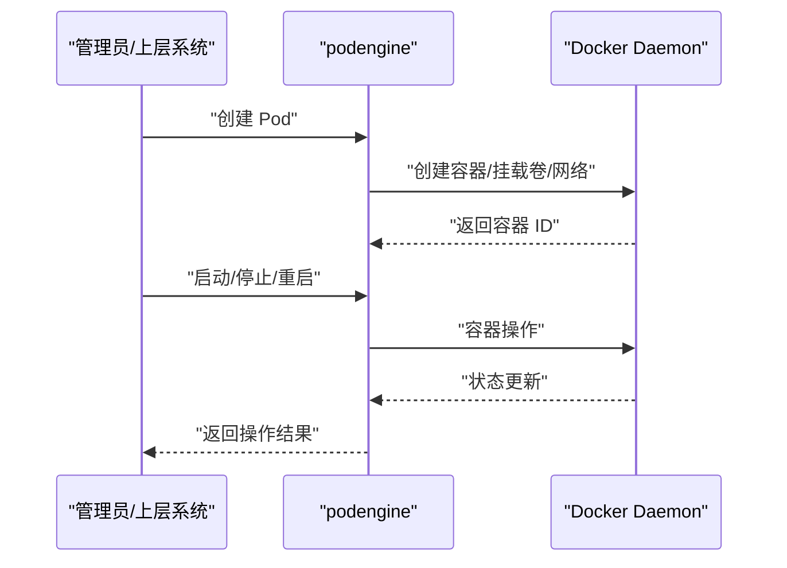
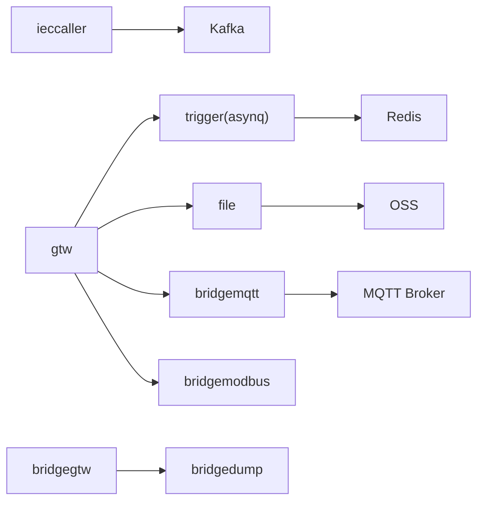

# 核心功能模块

<cite>
**本文引用的文件**
- [README.md](file://README.md)
- [gtw.go](file://gtw/gtw.go)
- [ieccaller.go](file://app/ieccaller/ieccaller.go)
- [trigger.go](file://app/trigger/trigger.go)
- [file.go](file://app/file/file.go)
- [lalhook.go](file://app/lalhook/lalhook.go)
- [lalproxy.go](file://app/lalproxy/lalproxy.go)
- [bridgemodbus.go](file://app/bridgemodbus/bridgemodbus.go)
- [bridgemqtt.go](file://app/bridgemqtt/bridgemqtt.go)
- [bridgegtw.go](file://app/bridgegtw/bridgegtw.go)
- [podengine.go](file://app/podengine/podengine.go)
- [ieccaller.yaml](file://app/ieccaller/etc/ieccaller.yaml)
- [trigger.yaml](file://app/trigger/etc/trigger.yaml)
- [file.yaml](file://app/file/etc/file.yaml)
- [podengine.yaml](file://app/podengine/etc/podengine.yaml)
- [bridgemodbus.yaml](file://app/bridgemodbus/etc/bridgemodbus.yaml)
- [bridgemqtt.yaml](file://app/bridgemqtt/etc/bridgemqtt.yaml)
- [bridgegtw.yaml](file://app/bridgegtw/etc/bridgegtw.yaml)
- [lalhook.yaml](file://app/lalhook/etc/lalhook.yaml)
- [lalproxy.yaml](file://app/lalproxy/etc/lalproxy.yaml)
</cite>

## 目录
1. [简介](#简介)
2. [项目结构](#项目结构)
3. [核心组件](#核心组件)
4. [架构总览](#架构总览)
5. [详细组件分析](#详细组件分析)
6. [依赖分析](#依赖分析)
7. [性能考虑](#性能考虑)
8. [故障排查指南](#故障排查指南)
9. [结论](#结论)
10. [附录](#附录)

## 简介
本文件面向 zero-service 项目的核心功能模块，系统性介绍 BFF 网关（gtw）、IEC 104 数采平台、异步任务调度服务（trigger）、文件服务（file）、流媒体服务（lalhook/lalproxy）、协议处理服务（bridgemodbus/bridgemqtt/bridgegtw）、容器管理服务（podengine）等。文档从架构、模块职责、技术特性、数据流与接口规范等方面进行说明，并给出模块间协作关系与常见问题排查建议，帮助开发者快速理解整体能力与落地实践。

## 项目结构
项目采用 go-zero 微服务脚手架，围绕“统一入口 + 多协议接入 + 任务调度 + 实时通信 + 容器管理”的目标组织模块。核心服务集中在 app/ 目录，公共组件在 common/，对外接口层在 facade/，BFF 网关在 gtw/，部署编排在 deploy/，文档与示例在 docs/ 与 swagger/。



图表来源
- [README.md:15-51](file://README.md#L15-L51)
- [gtw.go:25-95](file://gtw/gtw.go#L25-L95)
- [bridgegtw.go:19-42](file://app/bridgegtw/bridgegtw.go#L19-L42)
- [ieccaller.go:41-122](file://app/ieccaller/ieccaller.go#L41-L122)
- [trigger.go:34-88](file://app/trigger/trigger.go#L34-L88)
- [file.go:28-71](file://app/file/file.go#L28-L71)
- [lalhook.go:19-48](file://app/lalhook/lalhook.go#L19-L48)
- [lalproxy.go:27-70](file://app/lalproxy/lalproxy.go#L27-L70)
- [bridgemodbus.go:27-70](file://app/bridgemodbus/bridgemodbus.go#L27-L70)
- [bridgemqtt.go:28-71](file://app/bridgemqtt/bridgemqtt.go#L28-L71)
- [podengine.go:27-68](file://app/podengine/podengine.go#L27-L68)

章节来源
- [README.md:59-108](file://README.md#L59-L108)

## 核心组件
本节对各核心模块进行职责与能力概述，便于快速定位与选型。

- BFF 网关（gtw）
  - 统一 API 入口，支持 HTTP 与 gRPC，内置 grpc-gateway，提供 JWT 认证、CORS、文件上传/下载、微信支付回调、短信验证码等能力。
  - 典型监听端口：HTTP 15001（示例），gRPC 由 grpc-gateway 聚合后端服务。
  - 配置要点：RestConf、GatewayConf、SwaggerPath、CORS 头设置。

- IEC 104 数采平台
  - ieccaller：IEC 104 主站，多从站并发、Kafka/MQTT/gRPC 三通道推送、SQLite 配置、弱校验模式。
  - iecstash：Kafka 消费、ASDU 压缩合并、批量处理、下游 RPC 转发。
  - streamevent：统一跨语言流事件协议，接收 MQTT/WebSocket/Kafka/IEC104 等消息，推送至 TDengine。
  - 数据流：IEC 从站 → ieccaller → Kafka → iecstash → streamevent → TDengine；MQTT/gRPC 可并行直推。

- 异步任务调度（trigger）
  - 基于 asynq 的分布式任务队列（Redis），支持定时/延时任务、HTTP/gRPC 回调、自动重试、归档与生命周期管理。
  - 计划任务管理：Plan/Batch/ExecItem 三层模型，状态机 WAITING/RUNNING/COMPLETED/FAILED/DELAYED/ONGOING/TERMINATED，分布式锁防重、执行日志追踪、自动聚合。

- 文件服务（file）
  - gRPC 分片流上传、OSS 集成（MinIO/阿里/腾讯）、视频流捕获、签名 URL、桶与对象管理、统计查询。

- 流媒体服务（lalhook/lalproxy）
  - lalhook：HTTP Webhook 接收 TS 录制回调、推流/拉流事件、分片播放。
  - lalproxy：RTMP/HTTP-FLV 拉流/推流代理，提供组播/会话管理、黑名单、统计接口。

- 协议处理服务（bridgemodbus/bridgemqtt/bridgegtw）
  - bridgemodbus：Modbus TCP/RTU 读写、设备配置管理、gRPC 集成。
  - bridgemqtt：MQTT 发布/订阅、带追踪的推送、gRPC 集成、可桥接 SocketIO。
  - bridgegtw：HTTP 代理网关，将 HTTP 请求映射到 gRPC 方法，支持多后端与 Proto 集成。

- 容器管理服务（podengine）
  - Docker 容器生命周期管理，提供 Kubernetes-like 的 Pod 抽象接口，支持资源统计、镜像管理、启停/重启/删除等操作。

章节来源
- [README.md:110-188](file://README.md#L110-L188)

## 架构总览
下图展示系统总体架构与模块交互关系，突出 BFF 网关作为统一入口，以及数采平台、任务调度、文件与流媒体、协议桥接、容器管理之间的协作。



图表来源
- [README.md:15-51](file://README.md#L15-L51)
- [ieccaller.go:89-117](file://app/ieccaller/ieccaller.go#L89-L117)
- [trigger.go:77-84](file://app/trigger/trigger.go#L77-L84)

## 详细组件分析

### BFF 网关（gtw）
- 核心功能
  - HTTP REST 与 gRPC 聚合，动态 CORS 配置，Swagger 静态文件暴露。
  - 用户认证（JWT）、微信支付回调、短信验证码、文件上传/下载。
- 技术特点
  - 使用 go-zero rest 与 grpc-gateway，支持自定义中间件与拦截器。
  - 可选 Nacos 注册与发现（当前示例未启用）。
- 典型场景
  - APP/小程序后端统一入口，聚合内部微服务，屏蔽协议差异。
- 接口规范
  - HTTP API 定义于 gtw.api，Swagger 文档位于 swagger/ 目录。
  - gRPC 接口由各后端服务提供，gtw 通过 grpc-gateway 转换为 HTTP。



图表来源
- [gtw.go:51-91](file://gtw/gtw.go#L51-L91)

章节来源
- [gtw.go:25-95](file://gtw/gtw.go#L25-L95)

### IEC 104 数采平台
- 核心功能
  - ieccaller：多从站并发通信、周期性总召唤/累计量召唤、Kafka/MQTT/gRPC 三通道推送、弱校验模式。
  - iecstash：Kafka 消费、ASDU 压缩合并、批量处理、下游 RPC 转发。
  - streamevent：统一跨语言流事件协议，接收多源消息并落库 TDengine。
- 技术特点
  - 支持 12 种 ASDU 信息体类型，包含遥信/遥测/累计量等。
  - Kafka 广播队列与 MQTT 订阅并行，提升吞吐与灵活性。
- 典型场景
  - 电力/工业自动化场景的数据采集与实时监控。



图表来源
- [README.md:112-131](file://README.md#L112-L131)
- [ieccaller.go:89-117](file://app/ieccaller/ieccaller.go#L89-L117)

章节来源
- [README.md:112-131](file://README.md#L112-L131)
- [ieccaller.go:41-122](file://app/ieccaller/ieccaller.go#L41-L122)
- [ieccaller.yaml:22-79](file://app/ieccaller/etc/ieccaller.yaml#L22-L79)

### 异步任务调度（trigger）
- 核心功能
  - asynq 分布式任务队列（Redis），支持定时/延时任务、HTTP/gRPC 回调、自动重试、归档与生命周期管理。
  - 计划任务管理：Plan/Batch/ExecItem 三层模型，状态机与分布式锁防重，执行日志追踪与自动聚合。
- 技术特点
  - 任务历史统计与仪表板，支持 Cron 与数据库扫描调度。
- 典型场景
  - 数据落库、报表生成、外部系统回调、周期性巡检。

```mermaid
flowchart TD
Start(["触发任务"]) --> ChooseType{"任务类型"}
ChooseType --> |异步任务(asynq)| Enqueue["入队(Redis)"]
ChooseType --> |计划任务| PlanScan["数据库扫描/创建计划"]
Enqueue --> Worker["Worker 消费任务"]
Worker --> Callback{"是否需要回调?"}
Callback --> |HTTP| HTTPPost["HTTP POST JSON"]
Callback --> |gRPC| GRPC["gRPC 回调"]
Callback --> |无| Done["完成"]
PlanScan --> CreateBatch["创建批次(Batch)"]
CreateBatch --> CreateItems["创建执行项(ExecItem)"]
CreateItems --> RunItem["执行并记录日志"]
RunItem --> Status["状态聚合/防重"]
Status --> Next{"是否完成?"}
Next --> |是| Archive["归档/清理"]
Next --> |否| Retry["重试/延迟"]
Retry --> RunItem
Archive --> End(["结束"])
Done --> End
```

图表来源
- [README.md:133-154](file://README.md#L133-L154)
- [trigger.go:77-84](file://app/trigger/trigger.go#L77-L84)

章节来源
- [README.md:133-154](file://README.md#L133-L154)
- [trigger.go:34-88](file://app/trigger/trigger.go#L34-L88)
- [trigger.yaml:19-37](file://app/trigger/etc/trigger.yaml#L19-L37)

### 文件服务（file）
- 核心功能
  - gRPC 分片流上传、OSS 集成（MinIO/阿里/腾讯）、视频流捕获、签名 URL、桶与对象管理、统计查询。
- 技术特点
  - 支持租户模式、并发控制、断点续传、流式处理。
- 典型场景
  - 视频/图片/大文件上传与分发，结合 CDN/OSS。



图表来源
- [README.md:176-178](file://README.md#L176-L178)
- [file.go:28-71](file://app/file/file.go#L28-L71)

章节来源
- [README.md:176-178](file://README.md#L176-L178)
- [file.go:28-71](file://app/file/file.go#L28-L71)
- [file.yaml:17-23](file://app/file/etc/file.yaml#L17-L23)

### 流媒体服务（lalhook/lalproxy）
- 核心功能
  - lalhook：HTTP Webhook 接收 TS 录制回调、推流/拉流事件、分片播放。
  - lalproxy：RTMP/HTTP-FLV 拉流/推流代理，提供组播/会话管理、黑名单、统计接口。
- 技术特点
  - 支持多种协议与事件回调，适配直播/录播场景。
- 典型场景
  - 直播推流、录播回放、事件驱动的媒体处理。



图表来源
- [README.md:186-187](file://README.md#L186-L187)
- [lalhook.go:19-48](file://app/lalhook/lalhook.go#L19-L48)
- [lalproxy.go:27-70](file://app/lalproxy/lalproxy.go#L27-L70)

章节来源
- [README.md:186-187](file://README.md#L186-L187)
- [lalhook.go:19-48](file://app/lalhook/lalhook.go#L19-L48)
- [lalproxy.go:27-70](file://app/lalproxy/lalproxy.go#L27-L70)
- [lalhook.yaml:1-10](file://app/lalhook/etc/lalhook.yaml#L1-L10)
- [lalproxy.yaml:1-19](file://app/lalproxy/etc/lalproxy.yaml#L1-L19)

### 协议处理服务（bridgemodbus/bridgemqtt/bridgegtw）
- bridgemodbus
  - Modbus TCP/RTU 读写、设备配置管理、gRPC 集成，支持连接池与并发控制。
- bridgemqtt
  - MQTT 发布/订阅、带追踪的推送、gRPC 集成、可桥接 SocketIO。
- bridgegtw
  - HTTP 代理网关，将 HTTP 请求映射到 gRPC 方法，支持多后端与 Proto 集成。



图表来源
- [README.md:182-185](file://README.md#L182-L185)
- [bridgegtw.go:19-42](file://app/bridgegtw/bridgegtw.go#L19-L42)
- [bridgemodbus.go:27-70](file://app/bridgemodbus/bridgemodbus.go#L27-L70)
- [bridgemqtt.go:28-71](file://app/bridgemqtt/bridgemqtt.go#L28-L71)

章节来源
- [README.md:182-185](file://README.md#L182-L185)
- [bridgegtw.go:19-42](file://app/bridgegtw/bridgegtw.go#L19-L42)
- [bridgemodbus.go:27-70](file://app/bridgemodbus/bridgemodbus.go#L27-L70)
- [bridgemqtt.go:28-71](file://app/bridgemqtt/bridgemqtt.go#L28-L71)
- [bridgegtw.yaml:25-40](file://app/bridgegtw/etc/bridgegtw.yaml#L25-L40)
- [bridgemodbus.yaml:23-26](file://app/bridgemodbus/etc/bridgemodbus.yaml#L23-L26)
- [bridgemqtt.yaml:42-48](file://app/bridgemqtt/etc/bridgemqtt.yaml#L42-L48)

### 容器管理服务（podengine）
- 核心功能
  - Docker 容器生命周期管理，提供 Kubernetes-like 的 Pod 抽象接口，支持资源统计、镜像管理、启停/重启/删除等操作。
- 技术特点
  - 基于 Docker SDK，提供 gRPC 接口，便于上层编排与监控。
- 典型场景
  - 边缘节点容器编排、实验环境快速部署、资源统计与审计。



图表来源
- [README.md:181](file://README.md#L181)
- [podengine.go:27-68](file://app/podengine/podengine.go#L27-L68)

章节来源
- [README.md:181](file://README.md#L181)
- [podengine.go:27-68](file://app/podengine/podengine.go#L27-L68)
- [podengine.yaml:19-20](file://app/podengine/etc/podengine.yaml#L19-L20)

## 依赖分析
- 服务发现与注册
  - 多数服务支持 Nacos 注册与发现（可通过配置开关启用），便于集群部署与动态路由。
- 消息与任务
  - Kafka 用于 IEC 104 数据广播与桥接；asynq 用于异步任务队列；Redis 用于任务调度与缓存。
- 存储与对象存储
  - TDengine 用于时序数据存储；OSS（MinIO/阿里/腾讯）用于文件分发；SQLite/MySQL/PostgreSQL 用于配置与业务数据。
- 协议与网关
  - gRPC + grpc-gateway + Protocol Buffers；MQTT 用于桥接与事件；HTTP 代理网关 bridgegtw 用于多后端路由。



图表来源
- [ieccaller.yaml:35-57](file://app/ieccaller/etc/ieccaller.yaml#L35-L57)
- [trigger.yaml:19-29](file://app/trigger/etc/trigger.yaml#L19-L29)
- [file.yaml:17-23](file://app/file/etc/file.yaml#L17-L23)
- [bridgemqtt.yaml:19-48](file://app/bridgemqtt/etc/bridgemqtt.yaml#L19-L48)
- [bridgegtw.yaml:25-40](file://app/bridgegtw/etc/bridgegtw.yaml#L25-L40)

章节来源
- [ieccaller.yaml:35-79](file://app/ieccaller/etc/ieccaller.yaml#L35-L79)
- [trigger.yaml:19-37](file://app/trigger/etc/trigger.yaml#L19-L37)
- [file.yaml:17-23](file://app/file/etc/file.yaml#L17-L23)
- [bridgemqtt.yaml:19-48](file://app/bridgemqtt/etc/bridgemqtt.yaml#L19-L48)
- [bridgegtw.yaml:25-40](file://app/bridgegtw/etc/bridgegtw.yaml#L25-L40)

## 性能考虑
- 并发与限流
  - IEC 104 主站支持 TaskConcurrency 控制并发；Modbus 连接池参数可调；文件上传并发与分片大小需结合带宽与磁盘性能评估。
- 缓存与队列
  - asynq 使用 Redis，建议 Redis Cluster 提升吞吐；Kafka 分区数与消费者数量需与 CPU/IO 匹配。
- 存储与压缩
  - IEC 104 支持 PushAsduChunkBytes 批量推送，降低网络与存储压力；TDengine 适合高写入场景。
- 网关与跨域
  - gtw 的 CORS 配置需按生产环境域名精确设置，避免 Vary/Origin 缓存污染。

## 故障排查指南
- 服务启动失败
  - 检查配置文件路径与权限，确认 ListenOn/Host:Port 可用；查看日志路径与级别。
- 任务队列异常
  - 确认 Redis 连通性与密码；检查 asynq 任务服务器与调度器是否正常启动。
- Kafka/MQTT 不通
  - 校验 Broker 地址、用户名/密码、Topic/订阅主题；确认网络策略与防火墙。
- 文件上传失败
  - 检查 OSS 配置与桶权限；确认分片大小与并发设置；查看临时目录空间。
- IEC 104 通信异常
  - 校验从站地址/端口、校验模式、总召唤/累计量周期；查看 Kafka 广播与 iecstash 消费情况。
- 网关路由错误
  - 检查 bridgegtw 的 Mappings 与 RpcPath 是否匹配；确认 Proto 集成与服务注册。

章节来源
- [ieccaller.yaml:22-79](file://app/ieccaller/etc/ieccaller.yaml#L22-L79)
- [trigger.yaml:19-37](file://app/trigger/etc/trigger.yaml#L19-L37)
- [file.yaml:17-23](file://app/file/etc/file.yaml#L17-L23)
- [bridgemodbus.yaml:23-26](file://app/bridgemodbus/etc/bridgemodbus.yaml#L23-L26)
- [bridgemqtt.yaml:19-48](file://app/bridgemqtt/etc/bridgemqtt.yaml#L19-L48)
- [bridgegtw.yaml:25-40](file://app/bridgegtw/etc/bridgegtw.yaml#L25-L40)
- [lalhook.yaml:1-10](file://app/lalhook/etc/lalhook.yaml#L1-L10)
- [lalproxy.yaml:1-19](file://app/lalproxy/etc/lalproxy.yaml#L1-L19)
- [podengine.yaml:19-20](file://app/podengine/etc/podengine.yaml#L19-L20)

## 结论
zero-service 以 go-zero 为基础，围绕“统一入口 + 多协议接入 + 任务调度 + 实时通信 + 容器管理”构建了面向工业与物联网场景的完整能力矩阵。通过清晰的模块边界与协议抽象，开发者可在保证性能与可靠性的同时，快速扩展新能力或对接第三方系统。建议在生产环境中完善服务发现、监控与告警体系，并结合业务场景优化队列与存储参数。

## 附录
- 配置文件位置
  - 各服务配置位于 app/{service}/etc/{service}.yaml，包含监听端口、日志、Redis/Kafka/MQTT/OSS/DB 等关键参数。
- Swagger 文档
  - 各服务的 Swagger 文档位于 swagger/ 目录，便于联调与测试。
- 错误码规范
  - 项目遵循 google.rpc.Code 错误码标准，HTTP 与 gRPC 错误码映射关系参见 code.md。