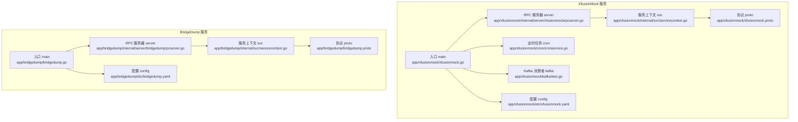
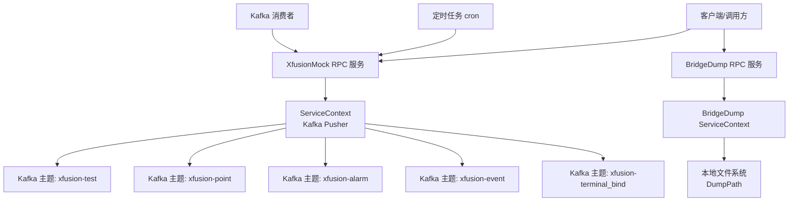
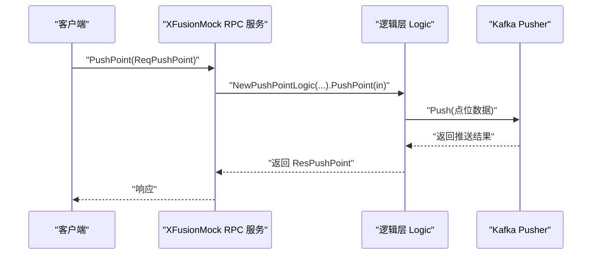
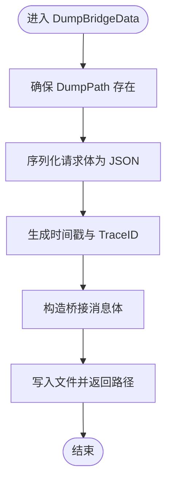
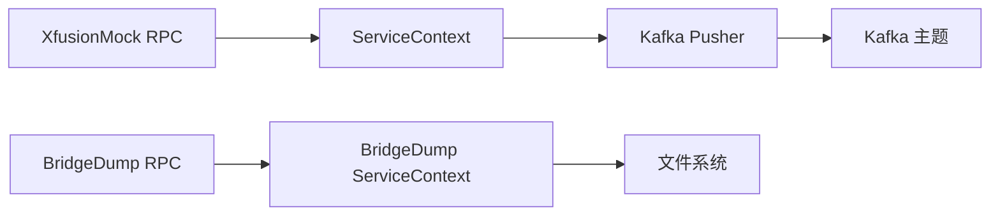

# 模拟测试服务

<cite>
**本文引用的文件**
- [app/xfusionmock/xfusionmock.go](file://app/xfusionmock/xfusionmock.go)
- [app/bridgedump/bridgedump.go](file://app/bridgedump/bridgedump.go)
- [app/xfusionmock/etc/xfusionmock.yaml](file://app/xfusionmock/etc/xfusionmock.yaml)
- [app/bridgedump/etc/bridgedump.yaml](file://app/bridgedump/etc/bridgedump.yaml)
- [app/xfusionmock/xfusionmock.proto](file://app/xfusionmock/xfusionmock.proto)
- [app/bridgedump/bridgedump.proto](file://app/bridgedump/bridgedump.proto)
- [app/xfusionmock/internal/config/config.go](file://app/xfusionmock/internal/config/config.go)
- [app/bridgedump/internal/config/config.go](file://app/bridgedump/internal/config/config.go)
- [app/xfusionmock/internal/svc/servicecontext.go](file://app/xfusionmock/internal/svc/servicecontext.go)
- [app/bridgedump/internal/svc/servicecontext.go](file://app/bridgedump/internal/svc/servicecontext.go)
- [app/xfusionmock/internal/server/xfusionmockrpcserver.go](file://app/xfusionmock/internal/server/xfusionmockrpcserver.go)
- [app/bridgedump/internal/server/bridgedumprpcserver.go](file://app/bridgedump/internal/server/bridgedumprpcserver.go)
- [app/xfusionmock/kafka/test.go](file://app/xfusionmock/kafka/test.go)
- [app/xfusionmock/cron/cronservice.go](file://app/xfusionmock/cron/cronservice.go)
</cite>

## 目录
1. [简介](#简介)
2. [项目结构](#项目结构)
3. [核心组件](#核心组件)
4. [架构总览](#架构总览)
5. [详细组件分析](#详细组件分析)
6. [依赖分析](#依赖分析)
7. [性能考虑](#性能考虑)
8. [故障排查指南](#故障排查指南)
9. [结论](#结论)
10. [附录](#附录)

## 简介
本文件面向“模拟测试服务”的技术文档，聚焦于两个核心服务在测试环境中的角色与配置：
- XfusionMock：提供千寻相关模拟数据的推送能力，支持测试、点位、报警、事件以及终端绑定的模拟推送，并通过 Kafka 主题分发；内置定时任务按策略周期性推送。
- BridgeDump：提供桥接数据落盘与回放能力，接收特定协议的数据并通过本地文件系统持久化，便于测试与回归。

文档将从系统架构、组件关系、数据流、处理逻辑、集成方式、测试策略与最佳实践等方面进行深入说明，帮助读者快速搭建与使用模拟测试环境。

## 项目结构
该仓库采用多模块微服务结构，XfusionMock 与 BridgeDump 分别位于 app/xfusionmock 与 app/bridgedump 目录下，均遵循 go-zero 的标准分层：config、internal（含 logic、server、svc）、etc 配置、proto 定义、Dockerfile、gen.sh 等。

图表来源
- [app/xfusionmock/xfusionmock.go:28-58](file://app/xfusionmock/xfusionmock.go#L28-L58)
- [app/bridgedump/bridgedump.go:23-45](file://app/bridgedump/bridgedump.go#L23-L45)
- [app/xfusionmock/etc/xfusionmock.yaml:1-39](file://app/xfusionmock/etc/xfusionmock.yaml#L1-L39)
- [app/bridgedump/etc/bridgedump.yaml:1-10](file://app/bridgedump/etc/bridgedump.yaml#L1-L10)
- [app/xfusionmock/xfusionmock.proto:274-303](file://app/xfusionmock/xfusionmock.proto#L274-L303)
- [app/bridgedump/bridgedump.proto:115-124](file://app/bridgedump/bridgedump.proto#L115-L124)
- [app/xfusionmock/internal/svc/servicecontext.go:8-26](file://app/xfusionmock/internal/svc/servicecontext.go#L8-L26)
- [app/bridgedump/internal/svc/servicecontext.go:16-64](file://app/bridgedump/internal/svc/servicecontext.go#L16-L64)
- [app/xfusionmock/internal/server/xfusionmockrpcserver.go:15-55](file://app/xfusionmock/internal/server/xfusionmockrpcserver.go#L15-L55)
- [app/bridgedump/internal/server/bridgedumprpcserver.go:15-48](file://app/bridgedump/internal/server/bridgedumprpcserver.go#L15-L48)
- [app/xfusionmock/cron/cronservice.go:12-54](file://app/xfusionmock/cron/cronservice.go#L12-L54)
- [app/xfusionmock/kafka/test.go:9-23](file://app/xfusionmock/kafka/test.go#L9-L23)

章节来源
- [app/xfusionmock/xfusionmock.go:28-58](file://app/xfusionmock/xfusionmock.go#L28-L58)
- [app/bridgedump/bridgedump.go:23-45](file://app/bridgedump/bridgedump.go#L23-L45)

## 核心组件
- XfusionMock RPC 服务
  - 提供 Ping、PushTest、PushPoint、PushAlarm、PushEvent、PushTerminalBind 六类接口，用于测试连通性与各类模拟数据推送。
  - 通过 ServiceContext 注入多个 Kafka Pusher，分别对应测试、点位、报警、事件、终端绑定主题。
  - 通过 cron 定时器按配置周期自动推送测试与点位数据，亦可手动触发。
- BridgeDump RPC 服务
  - 提供 Ping、CableWorkList、CableFault、CableFaultWave 四类接口，用于桥接与落盘。
  - 通过 ServiceContext 将请求体序列化后写入指定 DumpPath 下的子目录，文件名包含时间戳与 TraceID，便于追踪与回放。
- 配置与环境
  - XfusionMock.yaml：定义 RPC 监听地址、日志、Kafka 主题与消费者组、定时策略、终端绑定映射等。
  - Bridgedump.yaml：定义 RPC 监听地址、日志、DumpPath 等。

章节来源
- [app/xfusionmock/xfusionmock.proto:274-303](file://app/xfusionmock/xfusionmock.proto#L274-L303)
- [app/bridgedump/bridgedump.proto:115-124](file://app/bridgedump/bridgedump.proto#L115-L124)
- [app/xfusionmock/etc/xfusionmock.yaml:1-39](file://app/xfusionmock/etc/xfusionmock.yaml#L1-L39)
- [app/bridgedump/etc/bridgedump.yaml:1-10](file://app/bridgedump/etc/bridgedump.yaml#L1-L10)
- [app/xfusionmock/internal/svc/servicecontext.go:8-26](file://app/xfusionmock/internal/svc/servicecontext.go#L8-L26)
- [app/bridgedump/internal/svc/servicecontext.go:16-64](file://app/bridgedump/internal/svc/servicecontext.go#L16-L64)

## 架构总览
XfusionMock 与 BridgeDump 在测试环境中承担两类职责：
- 数据注入：通过 RPC 接口或定时任务向 Kafka 主题推送模拟数据，覆盖点位、报警、事件与终端绑定等场景。
- 数据落盘与回放：BridgeDump 将请求体序列化并写入本地文件，形成可追溯的桥接数据集，便于后续回放与回归测试。

图表来源
- [app/xfusionmock/xfusionmock.go:46-57](file://app/xfusionmock/xfusionmock.go#L46-L57)
- [app/bridgedump/bridgedump.go:32-44](file://app/bridgedump/bridgedump.go#L32-L44)
- [app/xfusionmock/etc/xfusionmock.yaml:6-31](file://app/xfusionmock/etc/xfusionmock.yaml#L6-L31)
- [app/bridgedump/etc/bridgedump.yaml:9](file://app/bridgedump/etc/bridgedump.yaml#L9)
- [app/xfusionmock/internal/svc/servicecontext.go:8-26](file://app/xfusionmock/internal/svc/servicecontext.go#L8-L26)
- [app/bridgedump/internal/svc/servicecontext.go:26-64](file://app/bridgedump/internal/svc/servicecontext.go#L26-L64)
- [app/xfusionmock/cron/cronservice.go:24-49](file://app/xfusionmock/cron/cronservice.go#L24-L49)
- [app/xfusionmock/kafka/test.go:19-22](file://app/xfusionmock/kafka/test.go#L19-L22)

## 详细组件分析

### XfusionMock 服务
- 启动流程
  - 解析配置文件，初始化 ServiceContext 并注册 RPC 服务。
  - 在开发/测试模式下启用 gRPC 反射，便于调试。
  - 启动 Kafka 消费队列与定时任务服务。
- 服务上下文
  - 为测试、点位、报警、事件、终端绑定分别创建 Kafka Pusher，统一管理消息推送。
- RPC 接口
  - Ping：健康检查。
  - PushTest/PushPoint/PushAlarm/PushEvent/PushTerminalBind：手动或定时推送模拟数据。
- 定时任务
  - 使用 cron 表达式按秒级调度，周期性触发各类推送逻辑。
- Kafka 消费
  - 提供一个空实现的消费者示例，便于扩展订阅其他主题。

图表来源
- [app/xfusionmock/internal/server/xfusionmockrpcserver.go:36-39](file://app/xfusionmock/internal/server/xfusionmockrpcserver.go#L36-L39)
- [app/xfusionmock/internal/svc/servicecontext.go:20-24](file://app/xfusionmock/internal/svc/servicecontext.go#L20-L24)

章节来源
- [app/xfusionmock/xfusionmock.go:28-58](file://app/xfusionmock/xfusionmock.go#L28-L58)
- [app/xfusionmock/internal/server/xfusionmockrpcserver.go:15-55](file://app/xfusionmock/internal/server/xfusionmockrpcserver.go#L15-L55)
- [app/xfusionmock/internal/svc/servicecontext.go:8-26](file://app/xfusionmock/internal/svc/servicecontext.go#L8-L26)
- [app/xfusionmock/cron/cronservice.go:24-49](file://app/xfusionmock/cron/cronservice.go#L24-L49)
- [app/xfusionmock/kafka/test.go:19-22](file://app/xfusionmock/kafka/test.go#L19-L22)

### BridgeDump 服务
- 启动流程
  - 解析配置文件，初始化 ServiceContext 并注册 RPC 服务。
- 数据落盘
  - 将请求体序列化为 JSON，包装成桥接消息体，写入 DumpPath 下按时间命名的文件，文件名包含 TraceID，便于链路追踪。
- RPC 接口
  - Ping：健康检查。
  - CableWorkList/CableFault/CableFaultWave：接收桥接数据并落盘。

图表来源
- [app/bridgedump/internal/svc/servicecontext.go:26-64](file://app/bridgedump/internal/svc/servicecontext.go#L26-L64)

章节来源
- [app/bridgedump/bridgedump.go:23-45](file://app/bridgedump/bridgedump.go#L23-L45)
- [app/bridgedump/internal/server/bridgedumprpcserver.go:15-48](file://app/bridgedump/internal/server/bridgedumprpcserver.go#L15-L48)
- [app/bridgedump/internal/svc/servicecontext.go:16-64](file://app/bridgedump/internal/svc/servicecontext.go#L16-L64)

### 配置与部署要点
- XfusionMock
  - 监听地址、日志、Kafka 主题与消费者组、定时策略、终端绑定映射等均在配置文件中集中管理。
  - 建议在测试环境将 Mode 设置为 dev 或 test，以便启用反射与更详细的日志。
- BridgeDump
  - DumpPath 必须具备写权限，建议为每个业务子域建立独立子目录，避免文件冲突。
  - 日志级别与输出路径可在配置中调整。

章节来源
- [app/xfusionmock/etc/xfusionmock.yaml:1-39](file://app/xfusionmock/etc/xfusionmock.yaml#L1-L39)
- [app/bridgedump/etc/bridgedump.yaml:1-10](file://app/bridgedump/etc/bridgedump.yaml#L1-L10)

## 依赖分析
- 组件耦合
  - XfusionMock 的 RPC 层仅依赖 ServiceContext，后者封装 Kafka Pusher，降低对底层消息系统的耦合。
  - BridgeDump 的 RPC 层仅依赖 ServiceContext，后者负责落盘逻辑，职责清晰。
- 外部依赖
  - Kafka：XfusionMock 通过 Pusher 向多个主题推送；BridgeDump 不直接依赖 Kafka。
  - go-zero：统一的服务框架、配置加载、服务编排与 gRPC 注册。
- 潜在风险
  - Kafka 主题与消费者组需与下游消费者一致，否则会出现数据无法消费或重复消费。
  - 文件系统权限与磁盘空间不足可能导致落盘失败。

图表来源
- [app/xfusionmock/internal/svc/servicecontext.go:8-26](file://app/xfusionmock/internal/svc/servicecontext.go#L8-L26)
- [app/bridgedump/internal/svc/servicecontext.go:16-64](file://app/bridgedump/internal/svc/servicecontext.go#L16-L64)

章节来源
- [app/xfusionmock/internal/svc/servicecontext.go:8-26](file://app/xfusionmock/internal/svc/servicecontext.go#L8-L26)
- [app/bridgedump/internal/svc/servicecontext.go:16-64](file://app/bridgedump/internal/svc/servicecontext.go#L16-L64)

## 性能考虑
- Kafka 写入
  - 使用批量写入与合适的并发度，避免频繁创建 Pusher 实例。
  - 控制消息大小，避免超大报文导致延迟与内存压力。
- 定时任务
  - cron 表达式应结合下游处理能力设置，避免瞬时洪峰。
  - 建议为不同主题设置不同的推送频率，以平衡负载。
- 文件落盘
  - 落盘操作为同步 IO，建议控制单次写入大小与频率，必要时引入缓冲或异步落盘策略。
  - 定期清理旧文件，防止磁盘占满。

## 故障排查指南
- 服务无法启动
  - 检查配置文件路径与字段是否正确，确认监听地址未被占用。
  - 查看日志输出，确认是否启用了 gRPC 反射（开发/测试模式）。
- Kafka 无数据
  - 核对 Kafka 地址、主题与消费者组是否与下游一致。
  - 检查消费者是否已启动且能连接 Kafka。
- 落盘失败
  - 确认 DumpPath 目录存在且具备写权限。
  - 检查磁盘空间与文件句柄限制。
- 定时任务不生效
  - 检查 cron 表达式是否正确，确认服务已调用 Start()。
  - 查看服务日志中是否打印了“Starting cron server”。

章节来源
- [app/xfusionmock/xfusionmock.go:32-35](file://app/xfusionmock/xfusionmock.go#L32-L35)
- [app/bridgedump/bridgedump.go:32-35](file://app/bridgedump/bridgedump.go#L32-L35)
- [app/bridgedump/etc/bridgedump.yaml:9](file://app/bridgedump/etc/bridgedump.yaml#L9)
- [app/xfusionmock/cron/cronservice.go:24-49](file://app/xfusionmock/cron/cronservice.go#L24-L49)

## 结论
XfusionMock 与 BridgeDump 在测试环境中提供了完整的“数据注入—落盘—回放”闭环：
- XfusionMock 通过 RPC 与定时任务向 Kafka 推送多种模拟数据，满足点位、报警、事件与终端绑定的测试需求。
- BridgeDump 将桥接数据落盘，形成可追溯的测试数据资产，便于回归与离线分析。
建议在测试环境中统一管理 Kafka 主题与消费者组，规范落盘目录结构，并结合日志与监控完善可观测性。

## 附录
- 测试场景构建建议
  - 单元测试：针对逻辑层函数进行隔离测试，使用内存或本地 Kafka 进行最小化验证。
  - 集成测试：启动 XfusionMock 与 BridgeDump，验证 RPC 与 Kafka/文件落盘链路。
  - 端到端测试：串联上游调用方与下游消费者，验证完整数据流。
- 数据注入与行为模拟
  - 使用 PushPoint/PushAlarm/PushEvent/PushTerminalBind 构建典型业务场景。
  - 通过定时任务模拟持续数据流，或通过手动调用进行可控注入。
- 测试数据管理与报告
  - 为每次测试生成唯一 TraceID，结合落盘文件与日志进行回溯。
  - 建立测试报告模板，记录场景、输入、期望输出与实际结果。