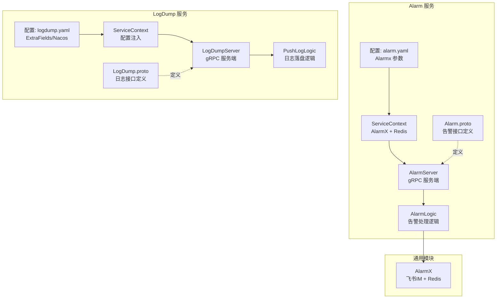
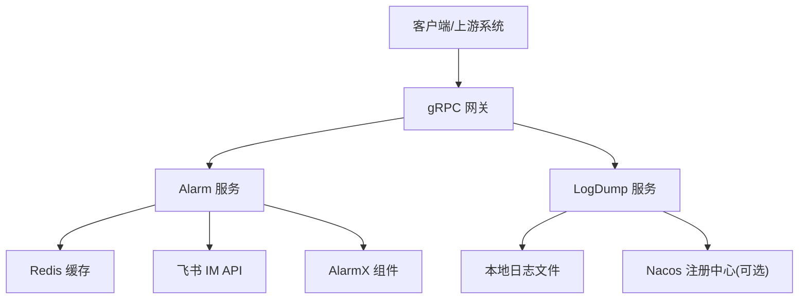
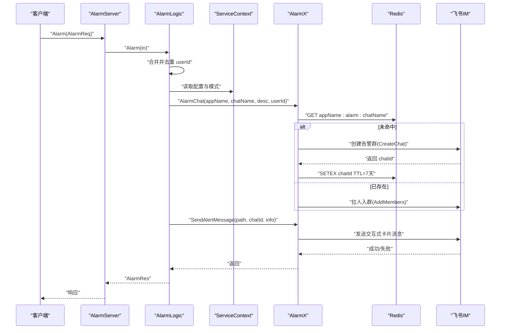
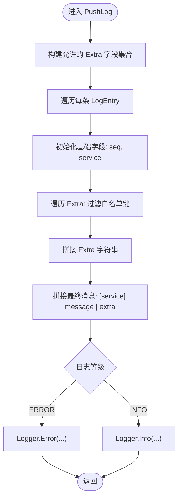
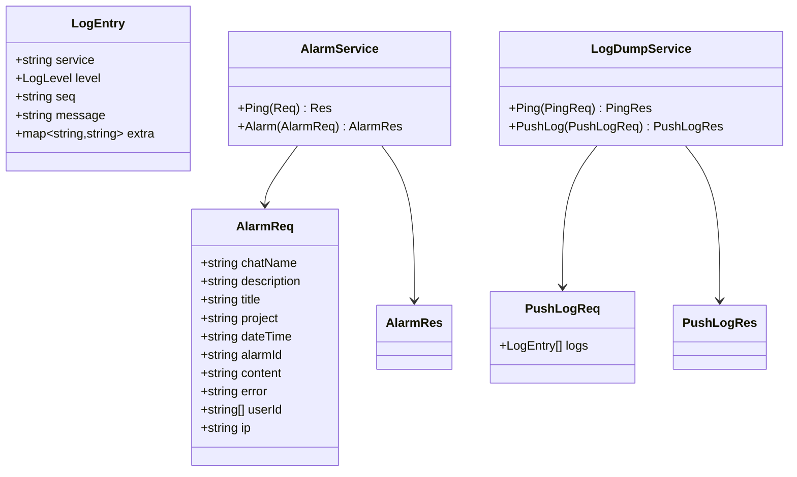
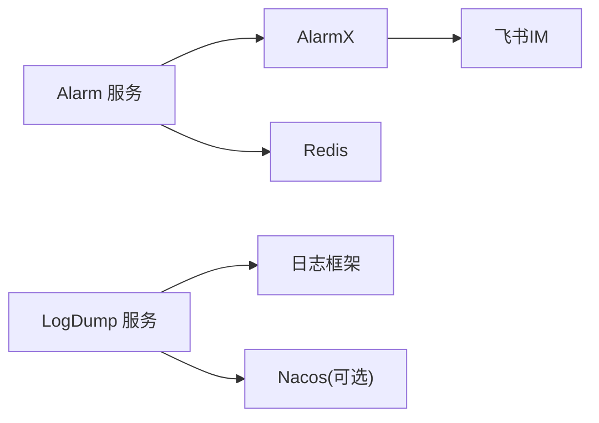

# 监控告警服务

<cite>
**本文引用的文件**
- [app/alarm/etc/alarm.yaml](file://app/alarm/etc/alarm.yaml)
- [app/logdump/etc/logdump.yaml](file://app/logdump/etc/logdump.yaml)
- [app/alarm/internal/config/config.go](file://app/alarm/internal/config/config.go)
- [app/logdump/internal/config/config.go](file://app/logdump/internal/config/config.go)
- [app/alarm/alarm.proto](file://app/alarm/alarm.proto)
- [app/logdump/logdump.proto](file://app/logdump/logdump.proto)
- [app/alarm/internal/logic/alarmlogic.go](file://app/alarm/internal/logic/alarmlogic.go)
- [app/logdump/internal/logic/pushloglogic.go](file://app/logdump/internal/logic/pushloglogic.go)
- [common/alarmx/alarmx.go](file://common/alarmx/alarmx.go)
- [app/alarm/internal/server/alarmserver.go](file://app/alarm/internal/server/alarmserver.go)
- [app/logdump/internal/server/logdumpserver.go](file://app/logdump/internal/server/logdumpserver.go)
- [app/alarm/internal/svc/servicecontext.go](file://app/alarm/internal/svc/servicecontext.go)
- [app/logdump/internal/svc/servicecontext.go](file://app/logdump/internal/svc/servicecontext.go)
- [app/alarm/alarm.go](file://app/alarm/alarm.go)
- [app/logdump/logdump.go](file://app/logdump/logdump.go)
</cite>

## 目录
1. [简介](#简介)
2. [项目结构](#项目结构)
3. [核心组件](#核心组件)
4. [架构总览](#架构总览)
5. [详细组件分析](#详细组件分析)
6. [依赖分析](#依赖分析)
7. [性能考虑](#性能考虑)
8. [故障排查指南](#故障排查指南)
9. [结论](#结论)
10. [附录](#附录)

## 简介
本文件面向监控告警服务与日志收集服务，系统性阐述 Alarm 服务的告警处理机制与 LogDump 服务的日志采集与落盘流程。文档覆盖告警规则配置、触发条件、通知渠道、日志聚合与可视化、告警策略制定与阈值设定、告警去重与性能监控等关键技术点，并通过图示展示服务架构、调用时序与处理流程，帮助读者快速理解与落地。

## 项目结构
- Alarm 服务：提供告警接口，对接飞书 IM，支持告警群创建与成员更新、交互式卡片消息发送、会话状态维护等。
- LogDump 服务：提供日志推送接口，按配置过滤与拼装日志字段，统一写入本地日志文件，支持 Nacos 注册与中间件统计。
- 通用模块：AlarmX 封装飞书 IM 能力与 Redis 缓存，实现告警会话持久化与消息发送。

图表来源
- [app/alarm/etc/alarm.yaml:1-26](file://app/alarm/etc/alarm.yaml#L1-L26)
- [app/logdump/etc/logdump.yaml:1-26](file://app/logdump/etc/logdump.yaml#L1-L26)
- [app/alarm/internal/server/alarmserver.go:15-35](file://app/alarm/internal/server/alarmserver.go#L15-L35)
- [app/logdump/internal/server/logdumpserver.go:15-36](file://app/logdump/internal/server/logdumpserver.go#L15-L36)
- [common/alarmx/alarmx.go:29-51](file://common/alarmx/alarmx.go#L29-L51)

章节来源
- [app/alarm/etc/alarm.yaml:1-26](file://app/alarm/etc/alarm.yaml#L1-L26)
- [app/logdump/etc/logdump.yaml:1-26](file://app/logdump/etc/logdump.yaml#L1-L26)
- [app/alarm/internal/config/config.go:5-15](file://app/alarm/internal/config/config.go#L5-L15)
- [app/logdump/internal/config/config.go:5-18](file://app/logdump/internal/config/config.go#L5-L18)

## 核心组件
- Alarm 服务
  - 配置项：监听地址、日志编码、Redis 连接、Alarmx 应用参数（AppId、AppSecret、EncryptKey、VerificationToken、UserId 列表）、模板路径。
  - 接口：Ping、Alarm；其中 Alarm 接收告警请求，内部完成用户合并去重、会话名格式化、群组创建或成员更新、消息卡片发送。
  - 通知渠道：飞书 IM 交互式卡片消息，支持按钮动作（如“跟进处理”），并可通过回调实现“已解决”状态维护。
- LogDump 服务
  - 配置项：监听地址、超时、中间件统计忽略方法、日志级别与保留天数、Nacos 注册开关与服务元数据、额外字段白名单 ExtraFields。
  - 接口：Ping、PushLog；PushLog 将日志条目按白名单过滤结构化字段，拼接输出，按等级写入日志。
  - 日志聚合：通过 ExtraFields 白名单控制结构化字段透传，避免噪声；通过中间件统计忽略特定方法，降低开销。
- 通用模块 AlarmX
  - 功能：基于 Redis 缓存会话标识，避免重复创建；封装飞书 IM 的聊天创建、成员添加、消息发送、聊天查询与更新；提供交互式卡片构建与安全转义。

章节来源
- [app/alarm/internal/logic/alarmlogic.go:31-63](file://app/alarm/internal/logic/alarmlogic.go#L31-L63)
- [app/logdump/internal/logic/pushloglogic.go:28-67](file://app/logdump/internal/logic/pushloglogic.go#L28-L67)
- [common/alarmx/alarmx.go:53-140](file://common/alarmx/alarmx.go#L53-L140)

## 架构总览
Alarm 与 LogDump 均基于 go-zero 的 zrpc 提供 gRPC 服务，Alarm 依赖 AlarmX 与 Redis 实现告警会话与消息通知；LogDump 依赖本地日志框架与可选 Nacos 注册能力。

图表来源
- [app/alarm/internal/svc/servicecontext.go:20-32](file://app/alarm/internal/svc/servicecontext.go#L20-L32)
- [app/logdump/logdump.go:46-63](file://app/logdump/logdump.go#L46-L63)

## 详细组件分析

### Alarm 服务：告警处理机制
- 请求处理流程
  - 合并用户：将请求中的 userId 与配置中的默认 userId 合并并去重。
  - 会话命名：在模式名后追加环境标签，形成稳定的会话名。
  - 会话管理：优先从 Redis 读取会话 ID；不存在则创建群并写入缓存；存在则更新成员。
  - 消息发送：读取模板文件，填充告警字段，发送交互式卡片消息。
  - 可扩展：预留事件回调与交互卡片动作处理，支持“已解决”状态与会话名称变更。

图表来源
- [app/alarm/internal/server/alarmserver.go:31-34](file://app/alarm/internal/server/alarmserver.go#L31-L34)
- [app/alarm/internal/logic/alarmlogic.go:31-63](file://app/alarm/internal/logic/alarmlogic.go#L31-L63)
- [common/alarmx/alarmx.go:53-140](file://common/alarmx/alarmx.go#L53-L140)

章节来源
- [app/alarm/internal/logic/alarmlogic.go:31-63](file://app/alarm/internal/logic/alarmlogic.go#L31-L63)
- [common/alarmx/alarmx.go:53-140](file://common/alarmx/alarmx.go#L53-L140)

### LogDump 服务：日志收集与落盘
- 请求处理流程
  - 白名单校验：将配置中的 ExtraFields 构建为允许集合。
  - 结构化字段：遍历每条日志的 Extra，仅对白名单键进行结构化记录。
  - 文本拼接：按服务名与消息体拼接基础文本，附加过滤后的 Extra 字段字符串。
  - 等级输出：根据日志等级选择 Info/Error 写入本地日志文件。

图表来源
- [app/logdump/internal/logic/pushloglogic.go:28-67](file://app/logdump/internal/logic/pushloglogic.go#L28-L67)
- [app/logdump/logdump.proto:22-44](file://app/logdump/logdump.proto#L22-L44)

章节来源
- [app/logdump/internal/logic/pushloglogic.go:28-67](file://app/logdump/internal/logic/pushloglogic.go#L28-L67)
- [app/logdump/etc/logdump.yaml:21-25](file://app/logdump/etc/logdump.yaml#L21-L25)

### 数据模型与接口定义
- Alarm 接口
  - 请求包含标题、描述、项目、时间、告警 ID、内容、错误、用户列表、IP 等字段。
  - 返回为空，表示异步通知已提交。
- LogDump 接口
  - 日志等级枚举：INFO、ERROR。
  - 日志条目包含服务名、等级、可选序列号、消息体与附加字段映射。
  - PushLog 批量接收日志条目并落盘。

图表来源
- [app/alarm/alarm.proto:14-33](file://app/alarm/alarm.proto#L14-L33)
- [app/logdump/logdump.proto:9-44](file://app/logdump/logdump.proto#L9-L44)

章节来源
- [app/alarm/alarm.proto:14-33](file://app/alarm/alarm.proto#L14-L33)
- [app/logdump/logdump.proto:9-44](file://app/logdump/logdump.proto#L9-L44)

## 依赖分析
- Alarm 服务
  - 依赖 AlarmX（飞书 IM + Redis）、Redis 缓存告警会话；依赖配置中的 Alarmx 参数与模式名。
- LogDump 服务
  - 依赖本地日志框架；可选注册 Nacos；受中间件统计影响，忽略特定方法以降低统计开销。
- 通用模块 AlarmX
  - 依赖飞书 SDK、go-zero Redis 与 httpc，负责会话生命周期与消息发送。

图表来源
- [app/alarm/internal/svc/servicecontext.go:20-32](file://app/alarm/internal/svc/servicecontext.go#L20-L32)
- [app/logdump/logdump.go:46-63](file://app/logdump/logdump.go#L46-L63)
- [common/alarmx/alarmx.go:29-51](file://common/alarmx/alarmx.go#L29-L51)

章节来源
- [app/alarm/internal/svc/servicecontext.go:20-32](file://app/alarm/internal/svc/servicecontext.go#L20-L32)
- [app/logdump/logdump.go:46-63](file://app/logdump/logdump.go#L46-L63)
- [common/alarmx/alarmx.go:29-51](file://common/alarmx/alarmx.go#L29-L51)

## 性能考虑
- Alarm 侧
  - 会话去重：通过 Redis 缓存会话 ID，避免重复创建与成员更新，降低 IM API 调用次数。
  - 用户合并：在服务端统一去重，减少重复消息发送。
  - 模板渲染：模板文件一次性读取，建议保持模板体积适中，避免频繁 IO。
- LogDump 侧
  - 白名单过滤：仅透传允许字段，减少日志冗余与解析成本。
  - 中间件统计：通过忽略 PushLog 方法，降低统计开销，提升吞吐。
  - 日志落盘：建议结合外部日志采集工具（如 Filebeat）进行集中化存储与可视化。

## 故障排查指南
- Alarm 服务
  - 会话创建失败：检查飞书 AppId/AppSecret、VerificationToken、EncryptKey 是否正确；确认网络可达与限流情况。
  - 成员更新失败：核对 userId 列表是否有效；检查 IM Chat Members 接口返回码。
  - 模板加载失败：确认模板路径存在且可读；检查变量替换占位符是否完整。
- LogDump 服务
  - 日志未落盘：检查日志目录权限与磁盘空间；确认日志级别与保留天数配置。
  - Nacos 注册失败：核对 Nacos 地址、账号密码、命名空间与服务名；确认网络连通性。
  - 白名单字段缺失：确认 ExtraFields 配置与请求中字段一致；检查大小写与空格。

章节来源
- [common/alarmx/alarmx.go:87-117](file://common/alarmx/alarmx.go#L87-L117)
- [app/logdump/etc/logdump.yaml:13-25](file://app/logdump/etc/logdump.yaml#L13-L25)

## 结论
Alarm 与 LogDump 服务分别承担“告警通知”与“日志采集”的核心职责。Alarm 通过 AlarmX 与 Redis 实现稳定高效的告警会话与消息投递；LogDump 通过白名单与中间件统计优化日志落盘性能。二者均可扩展接入更多通知渠道与日志分析平台，满足生产级监控与告警需求。

## 附录

### 告警规则配置与触发条件
- 触发条件
  - 业务异常或阈值越界时，由上游系统调用 Alarm 服务的 Alarm 接口，携带必要字段（标题、描述、项目、时间、告警 ID、内容、错误、用户列表、IP）。
- 通知渠道
  - 默认使用飞书 IM 交互式卡片消息；可通过扩展回调实现按钮动作与会话状态变更。
- 告警去重
  - 通过 Redis 缓存会话 ID，相同会话名在一定周期内复用同一会话，避免重复创建。

章节来源
- [app/alarm/internal/logic/alarmlogic.go:31-63](file://app/alarm/internal/logic/alarmlogic.go#L31-L63)
- [common/alarmx/alarmx.go:53-76](file://common/alarmx/alarmx.go#L53-L76)

### 日志聚合、分析与可视化
- 聚合策略
  - 通过 ExtraFields 白名单控制结构化字段透传，保证日志可检索性。
- 分析与可视化
  - 建议配合 Filebeat 将本地日志转发至集中式日志平台（如 ELK/日志服务），实现搜索、聚合与可视化。
- 性能监控
  - 使用中间件统计忽略高吞吐方法（如 PushLog），降低统计开销；结合 Nacos 注册便于服务治理与健康检查。

章节来源
- [app/logdump/etc/logdump.yaml:4-12](file://app/logdump/etc/logdump.yaml#L4-L12)
- [app/logdump/logdump.go:46-63](file://app/logdump/logdump.go#L46-L63)

### 告警策略制定与阈值设置示例
- 策略维度
  - 指标类型：CPU、内存、请求延迟、错误率、队列长度等。
  - 时间窗口：滚动窗口（如最近 5 分钟）与采样频率（如每 10 秒）。
  - 阈值：静态阈值与动态阈值（基于历史均值±Nσ）。
  - 告警等级：P0-P3 分级，对应响应时效与通知范围。
- 触发与收敛
  - 首次触发发送告警；在收敛窗口内（如 10 分钟）不再重复发送。
  - 支持静默时段与抑制规则，避免非工作时间噪音。

### 配置清单与说明
- Alarm 服务配置
  - 监听地址、日志编码、Redis 连接、Alarmx 应用参数、模板路径。
- LogDump 服务配置
  - 监听地址、超时、中间件统计忽略方法、日志级别与保留天数、Nacos 注册开关与服务元数据、额外字段白名单。

章节来源
- [app/alarm/etc/alarm.yaml:1-26](file://app/alarm/etc/alarm.yaml#L1-L26)
- [app/logdump/etc/logdump.yaml:1-26](file://app/logdump/etc/logdump.yaml#L1-L26)