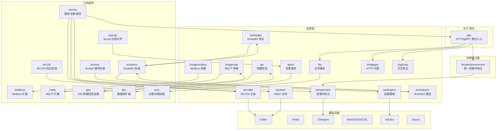
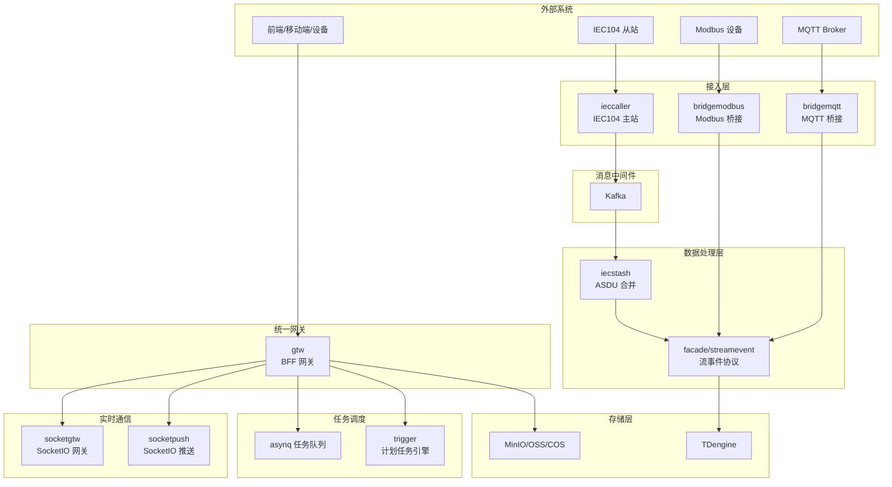
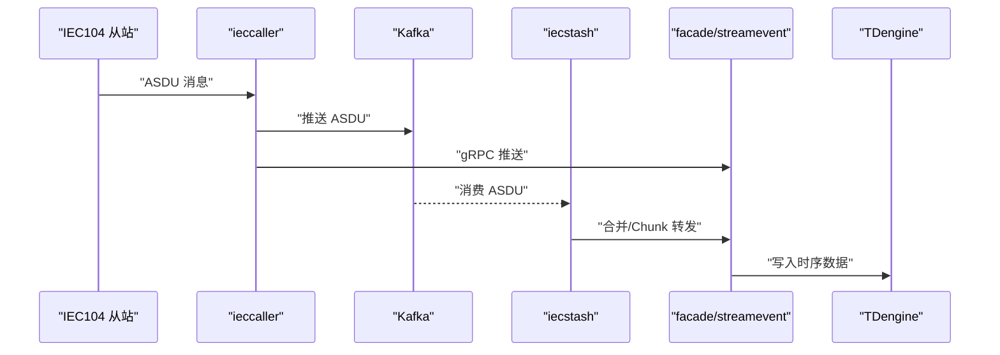
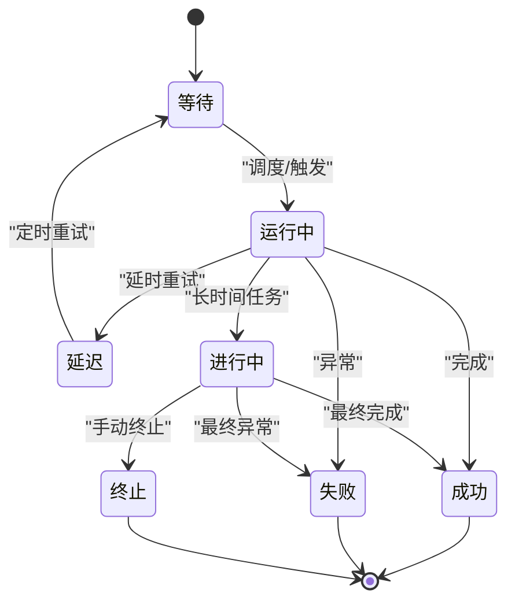
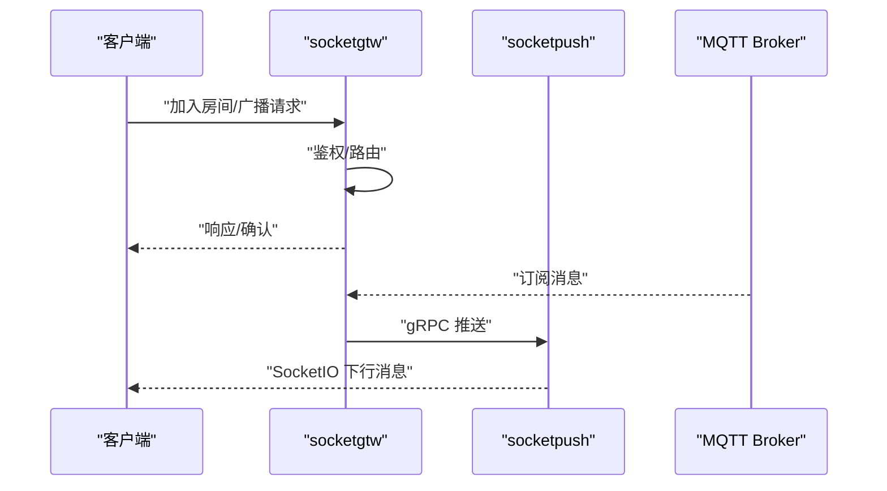
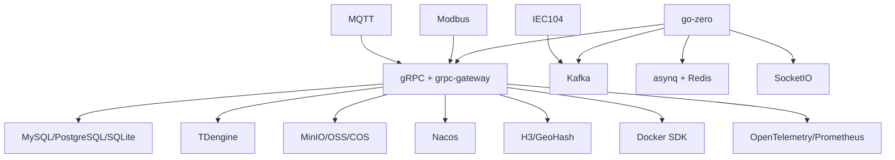

# 核心特性说明

<cite>
**本文引用的文件**
- [README.md](file://README.md)
- [go.mod](file://go.mod)
- [common/iec104/types/types.go](file://common/iec104/types/types.go)
- [common/modbusx/client.go](file://common/modbusx/client.go)
- [common/mqttx/mqttx.go](file://common/mqttx/mqttx.go)
- [common/socketiox/server.go](file://common/socketiox/server.go)
- [common/dockerx/dockerx.go](file://common/dockerx/dockerx.go)
- [common/gisx/gisx.go](file://common/gisx/gisx.go)
- [common/asynqx/tasktype.go](file://common/asynqx/tasktype.go)
- [gtw/gtw.go](file://gtw/gtw.go)
- [facade/streamevent/streamevent.go](file://facade/streamevent/streamevent.go)
- [deploy/docker-compose.yml](file://deploy/docker-compose.yml)
</cite>

## 目录
1. [简介](#简介)
2. [项目结构](#项目结构)
3. [核心组件](#核心组件)
4. [架构总览](#架构总览)
5. [详细组件分析](#详细组件分析)
6. [依赖分析](#依赖分析)
7. [性能考虑](#性能考虑)
8. [故障排查指南](#故障排查指南)
9. [结论](#结论)
10. [附录](#附录)

## 简介
Zero-Service 是一个基于 go-zero 的工业级微服务脚手架，聚焦物联网数采、异步任务调度、实时通信等场景，提供开箱即用的多协议接入与高性能数据处理能力。其核心特性包括：
- 多协议接入：IEC 60870-5-104、Modbus TCP/RTU、MQTT、gRPC、HTTP
- 数采平台：完整的 IEC 104 主站实现，支持 Kafka/MQTT/gRPC 三协议并行推送，内嵌 SQLite 轻量化配置管理
- 异步任务调度：基于 asynq 的分布式任务队列 + 自研计划任务管理引擎，支持 HTTP/gRPC 回调
- 实时通信：SocketIO 消息网关，支持房间管理、广播推送、MQTT 桥接和 Token 鉴权
- 容器管理：Docker 容器生命周期管理，提供 Kubernetes-like 的 Pod 抽象接口
- 地理信息：H3 网格、GeoHash 编解码、电子围栏、坐标系转换
- BFF 网关：统一的 API 入口，聚合 gRPC 后端服务并提供 grpc-gateway HTTP 访问

## 项目结构
项目采用“微服务 + 公共组件 + 外部接口层”的分层组织方式：
- app/：核心微服务集合，涵盖 IEC 104 数采、Modbus/MQTT 桥接、文件服务、容器管理、实时通信、告警、地理信息等
- common/：公共组件库，封装协议栈、任务队列、容器操作、GIS、SocketIO、MQTT、数据库扩展等
- facade/：对外接口层，提供跨语言流数据事件协议（gRPC），统一接入 MQTT/WebSocket/Kafka/IEC104 等上游
- gtw/：BFF 网关，统一 HTTP/gRPC 聚合入口，提供认证、CORS、文件上传下载等
- deploy/：Docker Compose 编排，包含 Kafka、Filebeat、ieccaller、bridgegtw、bridgedump 等核心服务
- model/：数据库模型与 SQL 脚本
- swagger/：各服务的 Swagger 文档
- third_party/：第三方 Proto 定义

图表来源
- [README.md](file://README.md)
- [gtw/gtw.go](file://gtw/gtw.go)
- [facade/streamevent/streamevent.go](file://facade/streamevent/streamevent.go)

章节来源
- [README.md](file://README.md)
- [go.mod](file://go.mod)

## 核心组件
本节对六大核心特性进行逐项说明，并给出技术优势与适用场景。

### 多协议接入能力
- IEC 60870-5-104（IEC104）
  - 实现要点：完整 IEC104 协议栈封装，支持多种 ASDU 信息体类型（单点/双点遥信、标度化/规一化/短浮点遥测、累计量、步位置、位串、继电保护事件等），提供主站侧的并发通信与消息解析
  - 技术优势：支持弱校验模式、内嵌 SQLite 动态配置、与 Kafka/MQTT/gRPC 并行推送
  - 适用场景：电力调度、变电站自动化、远动通信
- Modbus TCP/RTU
  - 实现要点：封装 grid-x/modbus 客户端，提供线圈/寄存器读写、批量读写、屏蔽写、FIFO 队列、设备识别等常用功能；支持 TLS 连接与连接池复用
  - 技术优势：连接池复用、超时与重连策略、日志与追踪增强
  - 适用场景：工业控制、PLC/RTU 通信、SCADA 系统
- MQTT
  - 实现要点：基于 eclipse/paho.mqtt.golang，支持自动重连、QoS 管理、主题订阅与事件映射、OpenTelemetry 追踪埋点
  - 技术优势：自动订阅恢复、默认处理器兜底、可观测性内置
  - 适用场景：IoT 设备消息采集、边缘计算、物联平台
- gRPC/HTTP
  - 实现要点：统一 gRPC 服务与 grpc-gateway HTTP 访问；BFF 网关提供认证、CORS、文件上传下载等
  - 技术优势：前后端一致的 API 设计、跨语言互通
  - 适用场景：微服务间通信、前端直连 API

章节来源
- [README.md](file://README.md)
- [common/iec104/types/types.go](file://common/iec104/types/types.go)
- [common/modbusx/client.go](file://common/modbusx/client.go)
- [common/mqttx/mqttx.go](file://common/mqttx/mqttx.go)
- [gtw/gtw.go](file://gtw/gtw.go)

### 数采平台（IEC 104）
- 架构组成
  - ieccaller：IEC 104 主站，负责与从站通信、Kafka/MQTT/gRPC 三协议并行推送、SQLite 动态配置
  - iecstash：ASDU 压缩合并、Chunk 批量处理、下游 RPC 转发
  - streamevent：统一流事件协议，接收并落库至 TDengine
- 数据流
  - IEC 104 从站 → ieccaller → Kafka → iecstash → streamevent → TDengine
  - 同时支持 MQTT/gRPC 直达下游系统
- 技术优势
  - 多协议并行推送，降低延迟与耦合
  - 支持弱校验模式，提升兼容性
  - 内嵌 SQLite，便于动态配置与运维
- 适用场景
  - 电力调度中心、变电站自动化、远动系统

章节来源
- [README.md](file://README.md)

### 异步任务调度系统（asynq + 计划任务引擎）
- asynq 任务队列
  - 基于 Redis 存储，支持定时/延时任务、HTTP POST 与 gRPC 回调、自动重试、归档与删除
  - 任务类型常量：延迟任务、触发任务、触发协议任务、调度器延迟任务
- 计划任务管理（自研引擎）
  - Plan → Batch → ExecItem 三层模型，完整状态机：WAITING → RUNNING → COMPLETED/FAILED/DELAYED/ONGOING/TERMINATED
  - 分布式锁防重、执行日志追踪、批次/计划自动状态聚合
- 技术优势
  - 任务生命周期管理完善，支持可视化与统计
  - 计划任务具备强一致性与可观测性
- 适用场景
  - 定时巡检、批量数据处理、告警联动、报表生成

章节来源
- [common/asynqx/tasktype.go](file://common/asynqx/tasktype.go)
- [README.md](file://README.md)

### 实时通信解决方案（SocketIO）
- 组件构成
  - socketgtw：SocketIO 网关，负责连接管理、房间管理、消息路由、Token 认证
  - socketpush：推送服务，提供 Token 生成/验证、gRPC 推送接口
- 能力特性
  - 房间加入/离开/广播、全局广播
  - 单播/批量推送（按 Session 或 Metadata 寻址）
  - 会话剔除与元数据管理
  - MQTT 桥接：将 MQTT Topic 映射到 SocketIO Room，支持事件映射配置
  - 统计信息推送与房间加载错误检测
- 技术优势
  - 事件驱动、低延迟、支持大规模并发
  - 与 MQTT 深度集成，便于统一消息生态
- 适用场景
  - 实时监控大屏、告警推送、远程控制、移动端消息

章节来源
- [common/socketiox/server.go](file://common/socketiox/server.go)
- [README.md](file://README.md)

### 容器管理功能（Docker）
- 能力范围
  - Docker 容器生命周期管理：创建、启动、停止、重启、删除、查询
  - Pod 抽象模型：资源统计（CPU/内存/网络/存储）、镜像管理
  - 环境变量解析、端口映射提取、卷挂载解析、资源限制解析
- 技术优势
  - 与 Kubernetes 思想一致的抽象，便于迁移与扩展
  - 内置资源解析与追踪，便于运维与审计
- 适用场景
  - 边缘节点容器编排、微服务运行时、DevOps 自动化

章节来源
- [common/dockerx/dockerx.go](file://common/dockerx/dockerx.go)
- [README.md](file://README.md)

### 地理信息系统（H3/GeoHash/围栏/坐标转换）
- 能力范围
  - H3 网格：网格编码/解码、电子围栏生成与检测
  - GeoHash：经纬度编码/解码
  - 电子围栏：支持多边形（含洞）与半径范围查询
  - 坐标系转换：WGS84/GCJ02/BD09
- 技术优势
  - 高效的空间索引与查询，适合海量点位场景
  - 多坐标系支持，满足不同地图与导航需求
- 适用场景
  - 轨迹分析、区域监控、资产定位、路径规划

章节来源
- [common/gisx/gisx.go](file://common/gisx/gisx.go)
- [README.md](file://README.md)

### BFF 网关（gtw）
- 职责与能力
  - gRPC 服务聚合，同时支持 grpc-gateway 提供 HTTP 访问
  - 用户认证（JWT）、微信支付回调、短信验证码
  - 文件上传（单文件/分片/流式）、文件下载
  - CORS 跨域支持
- 技术优势
  - 统一入口，简化前端对接
  - 与服务网格/注册中心结合，便于治理
- 适用场景
  - 前后端分离、多终端接入、统一鉴权与限流

章节来源
- [gtw/gtw.go](file://gtw/gtw.go)
- [README.md](file://README.md)

## 架构总览
下图展示了 Zero-Service 的整体架构与数据流，体现多协议接入、实时通信、任务调度与统一网关的协同：

图表来源
- [README.md](file://README.md)
- [facade/streamevent/streamevent.go](file://facade/streamevent/streamevent.go)
- [gtw/gtw.go](file://gtw/gtw.go)

## 详细组件分析

### IEC 104 数采平台（ieccaller/iecstash/streamevent）
- ieccaller
  - 多从站并行通信，支持弱校验模式
  - 三协议并行推送：Kafka、MQTT、gRPC
  - 内嵌 SQLite 动态配置
- iecstash
  - Kafka 消费、ASDU 压缩合并、Chunk 批量处理
  - 下游 RPC 转发至 streamevent
- streamevent
  - 统一跨语言流数据事件协议（gRPC）
  - 支持 MQTT/WebSocket/Kafka/IEC104 消息接收
  - 点位配置管理、TDengine 时序存储

图表来源
- [README.md](file://README.md)

章节来源
- [README.md](file://README.md)

### 异步任务调度（asynq + 计划任务引擎）
- asynq 任务类型
  - 延迟任务、触发任务、触发协议任务、调度器延迟任务
- 计划任务状态机
  - WAITING → RUNNING → COMPLETED/FAILED/DELAYED/ONGOING/TERMINATED
  - 分布式锁防重、执行日志追踪、批次/计划自动状态聚合

图表来源
- [common/asynqx/tasktype.go](file://common/asynqx/tasktype.go)
- [README.md](file://README.md)

章节来源
- [common/asynqx/tasktype.go](file://common/asynqx/tasktype.go)
- [README.md](file://README.md)

### 实时通信（SocketIO）
- socketgtw
  - 连接管理、房间管理、消息路由、Token 认证
  - 事件处理：加入/离开房间、房间广播、全局广播
- socketpush
  - Token 生成/验证、gRPC 推送接口、后端服务调用入口
- MQTT 桥接
  - 将 MQTT Topic 映射到 SocketIO Room，支持事件映射配置

图表来源
- [common/socketiox/server.go](file://common/socketiox/server.go)
- [README.md](file://README.md)

章节来源
- [common/socketiox/server.go](file://common/socketiox/server.go)
- [README.md](file://README.md)

### 容器管理（Docker）
- 能力概览
  - 容器 CRUD、Pod 抽象、资源统计、镜像管理
  - 环境变量解析、端口映射提取、卷挂载解析、资源限制解析
- 适用场景
  - 边缘节点容器编排、微服务运行时、DevOps 自动化

章节来源
- [common/dockerx/dockerx.go](file://common/dockerx/dockerx.go)
- [README.md](file://README.md)

### 地理信息（H3/GeoHash/围栏/坐标转换）
- 能力概览
  - H3 网格编码/解码、电子围栏生成与检测
  - GeoHash 编解码、半径范围查询
  - 坐标系转换：WGS84/GCJ02/BD09
- 适用场景
  - 轨迹分析、区域监控、资产定位、路径规划

章节来源
- [common/gisx/gisx.go](file://common/gisx/gisx.go)
- [README.md](file://README.md)

### BFF 网关（gtw）
- 能力概览
  - gRPC 服务聚合，grpc-gateway 提供 HTTP 访问
  - JWT 认证、微信支付回调、短信验证码
  - 文件上传/下载、CORS 跨域支持
- 适用场景
  - 前后端分离、多终端接入、统一鉴权与限流

章节来源
- [gtw/gtw.go](file://gtw/gtw.go)
- [README.md](file://README.md)

## 依赖分析
- 微服务框架：go-zero
- RPC：gRPC + grpc-gateway + Protocol Buffers
- 消息队列：Kafka（go-queue）
- 任务队列：asynq + Redis
- 实时通信：SocketIO（fork of socket.io-golang）
- 工业协议：IEC 60870-5-104（go-iecp5）/ Modbus（grid-x/modbus）/ MQTT（paho.mqtt）
- 关系数据库：MySQL / PostgreSQL / SQLite
- 时序数据库：TDengine
- 对象存储：MinIO / 阿里 OSS / 腾讯 COS
- 服务发现：Nacos
- 地理计算：H3（uber/h3-go）/ GeoHash / orb / go-geom
- 容器管理：Docker SDK
- 监控追踪：OpenTelemetry / Prometheus
- 容器编排：Docker Compose / Kubernetes（可选）

图表来源
- [go.mod](file://go.mod)
- [README.md](file://README.md)

章节来源
- [go.mod](file://go.mod)
- [README.md](file://README.md)

## 性能考虑
- IEC 104 数采平台
  - 多从站并行通信与 Kafka 并行推送，降低端到端延迟
  - iecstash 的 ASDU 压缩与 Chunk 批量处理，减少下游压力
- Modbus
  - 连接池复用与超时/重连策略，提升稳定性与吞吐
- MQTT
  - 自动重连与订阅恢复，保障消息可达性
- SocketIO
  - 事件驱动与房间管理，支持大规模并发与低延迟
- asynq
  - Redis 存储与 HTTP/gRPC 回调，支持高并发任务处理
- 容器管理
  - 资源解析与统计，便于容量规划与资源隔离

## 故障排查指南
- IEC 104
  - 关注弱校验模式与从站配置，检查 Kafka 消费进度与下游转发状态
- Modbus
  - 检查 TLS 证书、连接超时与重连参数、日志中的 session 标识
- MQTT
  - 核对 Broker 地址、QoS、事件映射配置，关注连接丢失与订阅恢复日志
- SocketIO
  - 核对 Token 验证、房间映射、会话元数据，查看统计推送与错误检测
- asynq
  - 检查 Redis 连接、任务类型与回调配置、重试与归档策略
- 容器管理
  - 核对 Docker API 权限、资源限制、环境变量与卷挂载

章节来源
- [common/iec104/types/types.go](file://common/iec104/types/types.go)
- [common/modbusx/client.go](file://common/modbusx/client.go)
- [common/mqttx/mqttx.go](file://common/mqttx/mqttx.go)
- [common/socketiox/server.go](file://common/socketiox/server.go)
- [common/asynqx/tasktype.go](file://common/asynqx/tasktype.go)
- [common/dockerx/dockerx.go](file://common/dockerx/dockerx.go)

## 结论
Zero-Service 通过多协议接入、数采平台、异步任务调度、实时通信、容器管理与地理信息等核心特性，形成了覆盖工业物联网全链路的解决方案。其统一的 BFF 网关与对外接口层进一步降低了集成复杂度，提升了系统的可维护性与扩展性。配合 Docker Compose 与 Nacos 等基础设施，可快速落地生产环境。

## 附录

### 特性对比表
| 特性 | 多协议接入 | 数采平台 | 异步任务调度 | 实时通信 | 容器管理 | 地理信息 | BFF 网关 |
|---|---|---|---|---|---|---|---|
| 协议支持 | IEC104/Modbus/TCP+RTU/MQTT/gRPC/HTTP | IEC104/Kafka/MQTT/gRPC | asynq + 计划任务 | SocketIO + MQTT 桥接 | Docker + Pod 抽象 | H3/GeoHash/围栏/坐标转换 | gRPC + grpc-gateway |
| 数据流 | 并行接入 | IEC104 → Kafka → iecstash → streamevent → TDengine | Redis 存储/回调 | SocketIO/推送 | Docker 生命周期 | 空间索引/查询 | 统一入口/鉴权 |
| 技术优势 | 覆盖电力/工业/IoT | 弱校验/动态配置/并行推送 | 任务生命周期/状态机 | 事件驱动/低延迟 | Kubernetes-like 抽象 | 高效空间索引 | 统一 API/跨域 |
| 适用场景 | 电力调度/工业控制/IoT | 电力数采/SCADA | 定时巡检/批量处理/告警 | 实时监控/远程控制 | 边缘编排/DevOps | 轨迹分析/区域监控 | 前后端分离/多终端 |