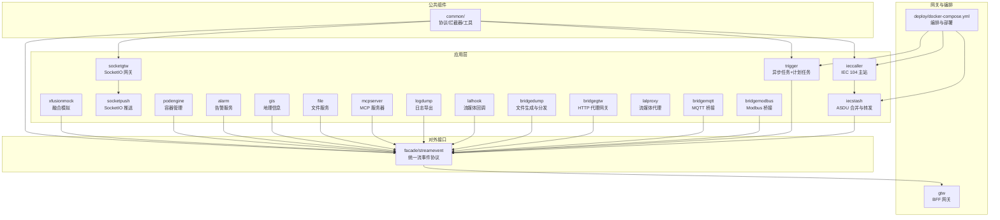
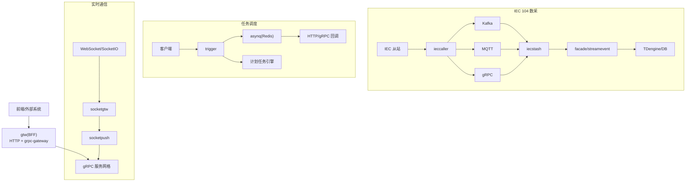
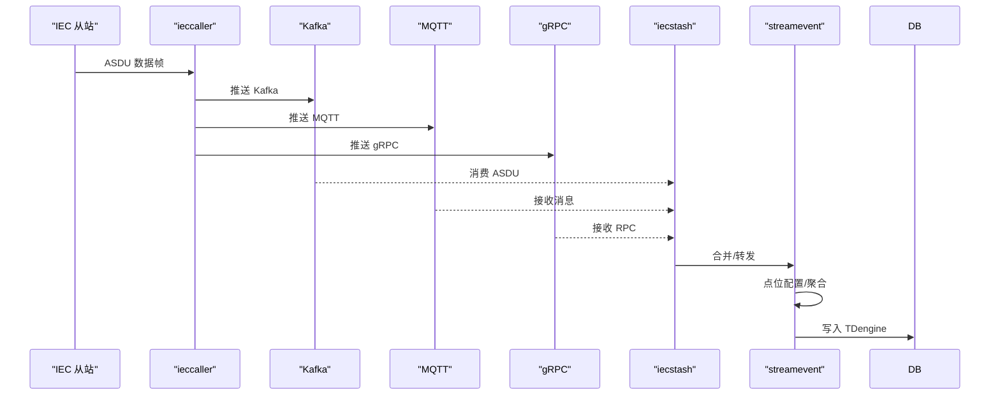
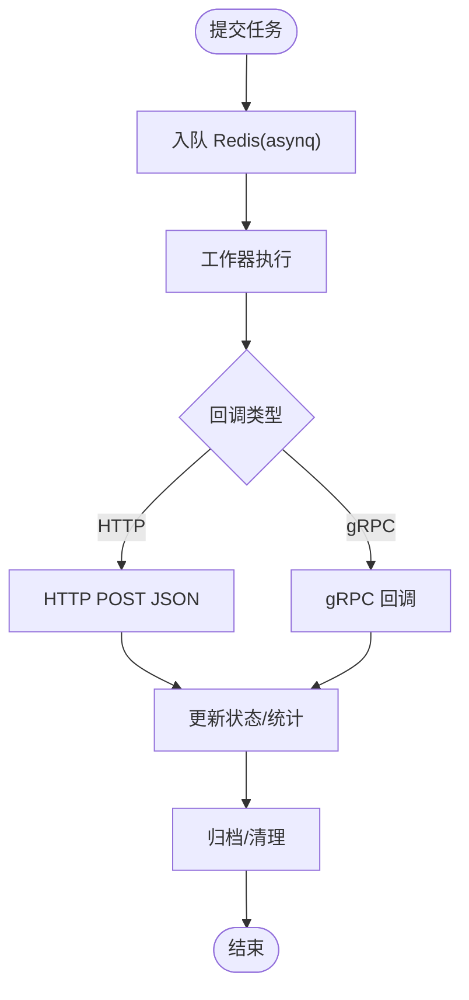
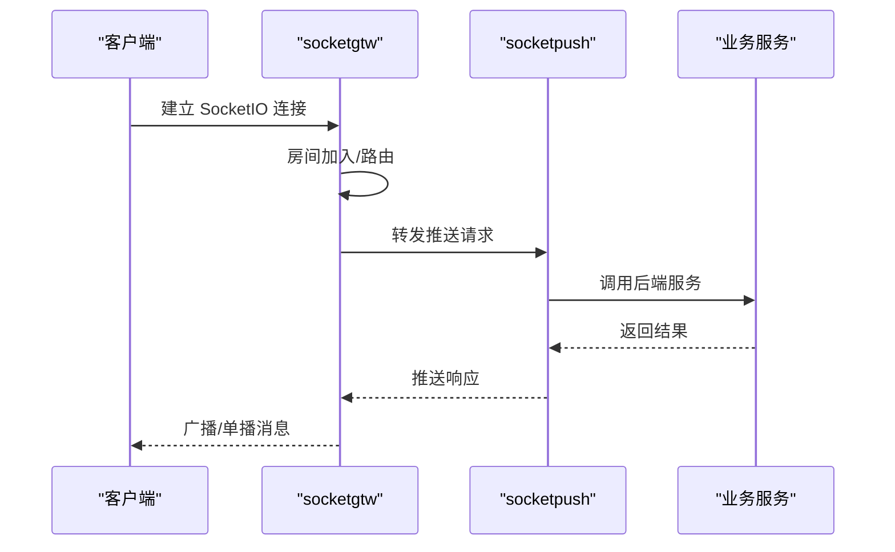
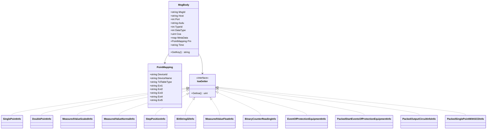
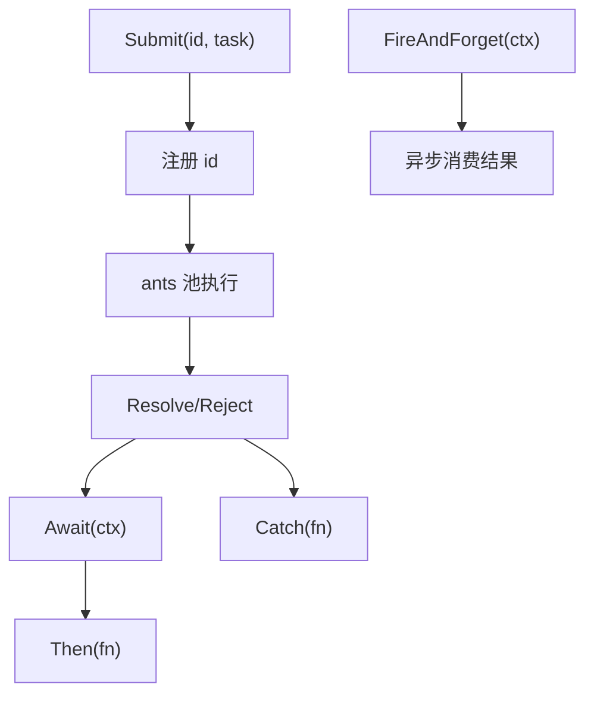
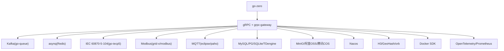

# 项目介绍

<cite>
**本文引用的文件**
- [README.md](file://README.md)
- [go.mod](file://go.mod)
- [common/type.go](file://common/type.go)
- [app/ieccaller/ieccaller.go](file://app/ieccaller/ieccaller.go)
- [app/trigger/trigger.go](file://app/trigger/trigger.go)
- [socketapp/socketgtw/socketgtw.go](file://socketapp/socketgtw/socketgtw.go)
- [common/iec104/types/types.go](file://common/iec104/types/types.go)
- [common/antsx/antsx.go](file://common/antsx/antsx.go)
- [facade/streamevent/streamevent.go](file://facade/streamevent/streamevent.go)
- [deploy/docker-compose.yml](file://deploy/docker-compose.yml)
- [docs/trigger.md](file://docs/trigger.md)
- [.trae/skills/zero-skills/README.md](file://.trae/skills/zero-skills/README.md)
- [.trae/skills/zero-skills/getting-started/cursor-guide.md](file://.trae/skills/zero-skills/getting-started/cursor-guide.md)
- [.trae/skills/zero-skills/getting-started/windsurf-guide.md](file://.trae/skills/zero-skills/getting-started/windsurf-guide.md)
- [.trae/skills/zero-skills/references/rpc-patterns.md](file://.trae/skills/zero-skills/references/rpc-patterns.md)
- [.trae/skills/zero-skills/skill-patterns/plan-architecture.md](file://.trae/skills/zero-skills/skill-patterns/plan-architecture.md)
</cite>

## 目录
1. [引言](#引言)
2. [项目结构](#项目结构)
3. [核心组件](#核心组件)
4. [架构总览](#架构总览)
5. [详细组件分析](#详细组件分析)
6. [依赖分析](#依赖分析)
7. [性能考虑](#性能考虑)
8. [故障排查指南](#故障排查指南)
9. [结论](#结论)
10. [附录](#附录)

## 引言
zero-service 是一个基于 go-zero 框架打造的工业级微服务脚手架，专注于物联网与工业自动化场景，提供开箱即用的多协议接入与高性能数据处理能力。项目围绕 IEC 60870-5-104 数采平台、异步任务调度、实时通信、容器管理、地理信息、协议桥接与 BFF 网关等能力进行模块化设计，帮助开发者快速搭建高性能、可扩展、可观测的微服务体系。

项目特性涵盖：
- 多协议接入：IEC 60870-5-104、Modbus TCP/RTU、MQTT、gRPC、HTTP
- 数采平台：IEC 104 主站、Kafka/MQTT/gRPC 三协议并行推送、SQLite 配置
- 异步任务调度：基于 asynq 的分布式任务队列 + 计划任务管理引擎
- 实时通信：SocketIO 网关与推送、MQTT 桥接、Token 鉴权
- 容器管理：Docker 生命周期管理与 Pod 抽象
- 地理信息：H3/GeoHash/电子围栏/坐标转换
- BFF 网关：统一 API 入口，聚合 gRPC 并提供 grpc-gateway HTTP 访问

## 项目结构
项目采用“服务分层 + 协议适配 + 公共组件”的组织方式，核心目录如下：
- app/：核心微服务集合（IEC 数采、任务调度、文件、GIS、告警、容器、协议桥接、流事件等）
- socketapp/：实时通信子系统（SocketIO 网关与推送）
- gtw/：BFF 网关（HTTP + grpc-gateway 聚合）
- facade/：对外统一接口层（streamevent）
- common/：公共组件库（协议实现、任务队列、服务注册、工具等）
- model/：数据库模型与 SQL 脚本
- deploy/：Docker Compose 编排与部署示例
- docs/swagger/third_party/util/：文档、Swagger、第三方 proto、工具集
- .trae/skills/zero-skills/：AI 辅助开发技能包（开发规范、最佳实践、模板）

图表来源
- [README.md:59-108](file://README.md#L59-L108)
- [deploy/docker-compose.yml:1-110](file://deploy/docker-compose.yml#L1-L110)

章节来源
- [README.md:59-108](file://README.md#L59-L108)
- [deploy/docker-compose.yml:1-110](file://deploy/docker-compose.yml#L1-L110)

## 核心组件
- IEC 104 数采平台：ieccaller（主站）、iecstash（ASDU 合并）、streamevent（落库与事件聚合）
- 异步任务调度：trigger（asynq + 计划任务引擎）
- 实时通信：socketgtw（连接/房间/路由）、socketpush（推送/鉴权）
- 协议桥接：bridgemodbus、bridgemqtt、bridgegtw、bridgedump
- 文件与地理：file、gis
- 容器与监控：podengine、lalhook/lalproxy、logdump、mcpserver、xfusionmock
- BFF 网关：gtw（HTTP + grpc-gateway 聚合）
- 对外接口：facade/streamevent（跨语言流事件协议）

章节来源
- [README.md:110-206](file://README.md#L110-L206)

## 架构总览
系统采用“服务网格 + 事件驱动”的架构风格：
- 外部系统通过 BFF 网关统一接入，内部服务通过 gRPC 通信
- IEC 104 数采链路：从站 → ieccaller → Kafka/MQTT/gRPC → iecstash → streamevent → TDengine
- 任务调度链路：客户端 → trigger → asynq/Redis → 业务回调 → 状态持久化
- 实时通信链路：客户端 → socketgtw → socketpush → 业务服务

图表来源
- [README.md:15-51](file://README.md#L15-L51)
- [README.md:112-131](file://README.md#L112-L131)
- [docs/trigger.md:18-46](file://docs/trigger.md#L18-L46)

章节来源
- [README.md:15-51](file://README.md#L15-L51)
- [docs/trigger.md:18-46](file://docs/trigger.md#L18-L46)

## 详细组件分析

### IEC 104 数采平台
- ieccaller：IEC 104 主站，支持多从站并行通信、Kafka/MQTT/gRPC 三协议推送、弱校验模式、动态配置
- iecstash：Kafka 消费、ASDU 压缩合并、Chunk 批量处理、下游 RPC 转发
- streamevent：统一流事件协议，接收多源消息（MQTT/WebSocket/Kafka/IEC），点位配置管理，TDengine 时序存储

图表来源
- [README.md:112-131](file://README.md#L112-L131)
- [app/ieccaller/ieccaller.go:90-117](file://app/ieccaller/ieccaller.go#L90-L117)
- [facade/streamevent/streamevent.go:28-71](file://facade/streamevent/streamevent.go#L28-L71)

章节来源
- [README.md:112-131](file://README.md#L112-L131)
- [app/ieccaller/ieccaller.go:90-117](file://app/ieccaller/ieccaller.go#L90-L117)
- [facade/streamevent/streamevent.go:28-71](file://facade/streamevent/streamevent.go#L28-L71)

### 异步任务调度（trigger）
- 异步任务：基于 asynq 的分布式队列，Redis 存储；支持 HTTP/gRPC 回调、自动重试、归档与删除
- 计划任务：基于数据库扫描的计划/批次/执行项三级模型，支持状态机与分布式锁防重

图表来源
- [docs/trigger.md:105-122](file://docs/trigger.md#L105-L122)
- [app/trigger/trigger.go:77-84](file://app/trigger/trigger.go#L77-L84)

章节来源
- [docs/trigger.md:18-46](file://docs/trigger.md#L18-L46)
- [docs/trigger.md:105-122](file://docs/trigger.md#L105-L122)
- [app/trigger/trigger.go:77-84](file://app/trigger/trigger.go#L77-L84)

### 实时通信（socketapp）
- socketgtw：SocketIO 网关，负责连接管理、房间管理、消息路由、Token 鉴权
- socketpush：推送服务，提供 Token 生成/验证、gRPC 推送接口、后端服务调用入口
- 支持 MQTT 桥接、广播/单播、会话剔除、统计信息推送

图表来源
- [README.md:156-173](file://README.md#L156-L173)
- [socketapp/socketgtw/socketgtw.go:30-90](file://socketapp/socketgtw/socketgtw.go#L30-L90)

章节来源
- [README.md:156-173](file://README.md#L156-L173)
- [socketapp/socketgtw/socketgtw.go:30-90](file://socketapp/socketgtw/socketgtw.go#L30-L90)

### 协议与数据模型
- IEC 104 类型：支持多种 ASDU 信息体（单点/双点遥信、标度化/短浮点遥测、累计量、步位置、位串、继电保护事件等），提供点位映射与键生成
- 通用类型：统一时间序列格式、交易结果常量、JSON 序列化策略

图表来源
- [common/iec104/types/types.go:11-323](file://common/iec104/types/types.go#L11-L323)

章节来源
- [common/iec104/types/types.go:11-323](file://common/iec104/types/types.go#L11-L323)
- [common/type.go:9-45](file://common/type.go#L9-L45)

### 通用并发与响应式工具（antsx）
- Promise：泛型 Promise，支持链式调用、错误捕获、FireAndForget
- Reactor：基于 ants 的任务池，支持去重提交、活动计数、释放

图表来源
- [common/antsx/antsx.go:13-214](file://common/antsx/antsx.go#L13-L214)

章节来源
- [common/antsx/antsx.go:13-214](file://common/antsx/antsx.go#L13-L214)

## 依赖分析
- 微服务框架：go-zero
- RPC 与网关：gRPC + grpc-gateway + Protocol Buffers
- 消息与任务：Kafka（go-queue）、asynq + Redis
- 协议栈：IEC 60870-5-104（go-iecp5）、Modbus（grid-x/modbus）、MQTT（eclipse/paho.mqtt.golang）
- 数据库：MySQL/PostgreSQL/SQLite、TDengine、MinIO/阿里OSS/腾讯COS
- 服务发现：Nacos
- 地理计算：H3（uber/h3-go）、GeoHash、orb/go-geom
- 容器与监控：Docker SDK、OpenTelemetry/Prometheus
- 编排：Docker Compose/Kubernetes

图表来源
- [go.mod:5-62](file://go.mod#L5-L62)
- [README.md:207-225](file://README.md#L207-L225)

章节来源
- [go.mod:5-62](file://go.mod#L5-L62)
- [README.md:207-225](file://README.md#L207-L225)

## 性能考虑
- 并发与吞吐：利用 go-zero 的高性能 RPC 与 asynq 的并发队列，合理设置消费者与处理器数量
- 缓存与降载：Redis 缓存热点数据、限流与熔断策略，避免上游抖动影响
- 数据落库：IEC 104 的 ASDU 合并与批量写入，减少数据库压力
- 网络与协议：Kafka 分区与副本、MQTT QoS、IEC 104 轮询周期与弱校验模式平衡
- 监控与可观测：OpenTelemetry 指标与链路追踪，Prometheus/Grafana 展示

## 故障排查指南
- IEC 104 数采
  - 从站不可达：检查 ieccaller 配置、网络连通性、弱校验开关
  - Kafka/MQTT/gRPC 推送失败：确认 brokers/topics、MQTT broker、回调地址可达
  - iecstash 合并异常：核对 ASDU 类型、Chunk 批量参数、下游 RPC 转发
- 异步任务
  - asynq 任务堆积：增加工作器并发、优化回调耗时、启用自动重试与指数退避
  - 计划任务重复执行：检查分布式锁、扫表标记与幂等设计
- 实时通信
  - SocketIO 连接失败：确认鉴权 Token、握手头升级、房间配置
  - MQTT 桥接异常：核对 Topic 映射、事件映射配置、Broker 连接
- 部署与编排
  - Docker Compose 服务无法启动：检查端口占用、卷挂载、环境变量、依赖服务健康
  - 网络模式与主机直连：host 模式下的端口冲突与安全限制

章节来源
- [docs/trigger.md:140-155](file://docs/trigger.md#L140-L155)
- [README.md:300-325](file://README.md#L300-L325)

## 结论
zero-service 以 go-zero 为核心，结合多协议接入、事件驱动与任务编排，形成覆盖工业物联网采集、调度与实时通信的完整能力矩阵。通过模块化设计与标准化的开发规范，开发者可以快速落地高性能、可扩展的微服务应用，并在生产环境中获得良好的可观测性与可维护性。

## 附录
- 开发与部署
  - 快速启动：单服务启动或 Docker Compose 编排
  - 代码生成：各服务通过 gen.sh 生成框架代码
  - Swagger：各服务提供 Swagger 文档
- 社区与生态
  - MIT 许可证，遵循 go-zero 生态与最佳实践
  - AI 辅助开发：提供 Cursor/Windsurf 等编辑器的零技能模板与规则

章节来源
- [README.md:226-350](file://README.md#L226-L350)
- [.trae/skills/zero-skills/README.md:226-229](file://.trae/skills/zero-skills/README.md#L226-L229)
- [.trae/skills/zero-skills/getting-started/cursor-guide.md:1-73](file://.trae/skills/zero-skills/getting-started/cursor-guide.md#L1-L73)
- [.trae/skills/zero-skills/getting-started/windsurf-guide.md:1-65](file://.trae/skills/zero-skills/getting-started/windsurf-guide.md#L1-L65)
- [.trae/skills/zero-skills/references/rpc-patterns.md:1-78](file://.trae/skills/zero-skills/references/rpc-patterns.md#L1-L78)
- [.trae/skills/zero-skills/skill-patterns/plan-architecture.md:5-72](file://.trae/skills/zero-skills/skill-patterns/plan-architecture.md#L5-L72)