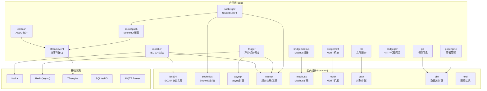
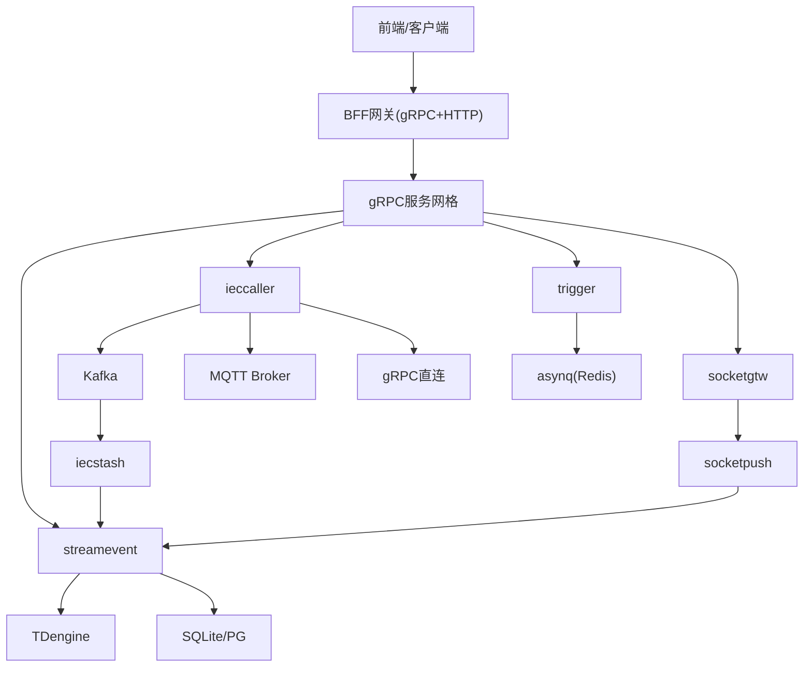
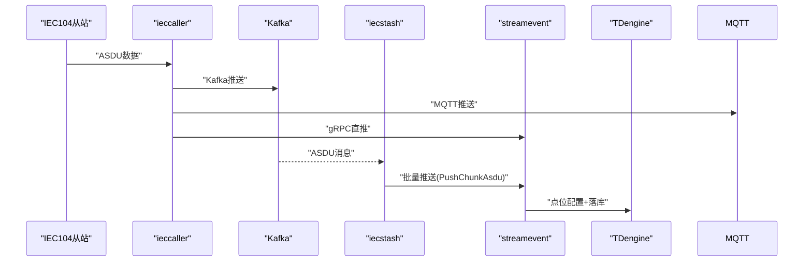
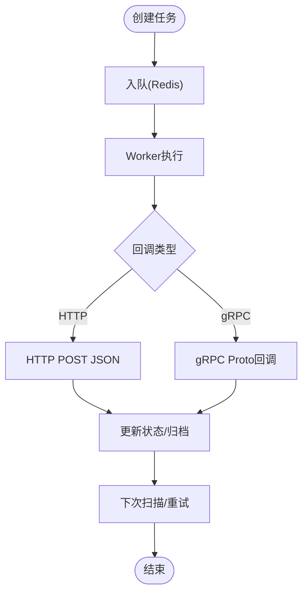
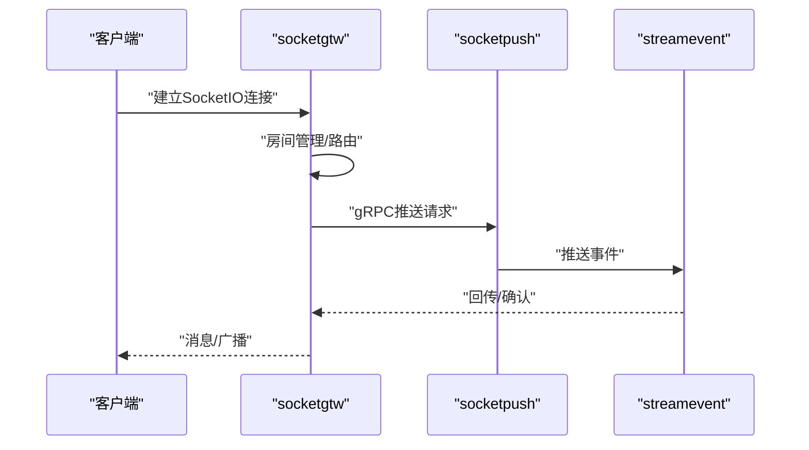
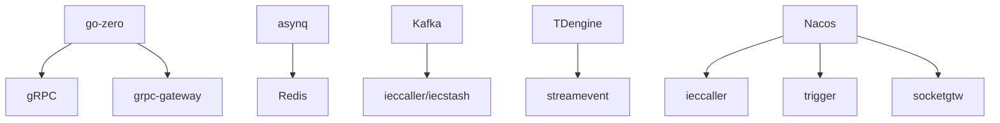

# 项目介绍与背景

<cite>
**本文引用的文件**
- [README.md](file://README.md)
- [go.mod](file://go.mod)
- [code.md](file://code.md)
- [app/ieccaller/ieccaller.go](file://app/ieccaller/ieccaller.go)
- [app/trigger/trigger.go](file://app/trigger/trigger.go)
- [socketapp/socketgtw/socketgtw.go](file://socketapp/socketgtw/socketgtw.go)
- [common/iec104/types/types.go](file://common/iec104/types/types.go)
- [common/asynqx/tasktype.go](file://common/asynqx/tasktype.go)
- [app/ieccaller/etc/ieccaller.yaml](file://app/ieccaller/etc/ieccaller.yaml)
- [app/trigger/etc/trigger.yaml](file://app/trigger/etc/trigger.yaml)
- [socketapp/socketgtw/etc/socketgtw.yaml](file://socketapp/socketgtw/etc/socketgtw.yaml)
- [common/nacosx/register.go](file://common/nacosx/register.go)
- [common/dbx/dbx.go](file://common/dbx/dbx.go)
- [docs/iec104.md](file://docs/iec104.md)
- [docs/trigger.md](file://docs/trigger.md)
</cite>

## 目录
1. [引言](#引言)
2. [项目结构](#项目结构)
3. [核心组件](#核心组件)
4. [架构总览](#架构总览)
5. [详细组件分析](#详细组件分析)
6. [依赖分析](#依赖分析)
7. [性能考虑](#性能考虑)
8. [故障排查指南](#故障排查指南)
9. [结论](#结论)
10. [附录](#附录)

## 引言
Zero-Service 是一个面向工业物联网与实时通信场景的工业级微服务脚手架，基于 go-zero 构建，提供开箱即用的多协议接入与高性能数据处理能力。项目聚焦三大核心痛点：
- 工业物联网数据采集：IEC 60870-5-104 主站、Kafka/MQTT/gRPC 三通道并行推送、ASDU 压缩合并与落库。
- 异步任务调度：基于 asynq 的分布式任务队列与自研计划任务引擎，支持 HTTP/gRPC 回调与全生命周期管理。
- 实时通信：SocketIO 网关与推送服务，支持房间管理、广播、MQTT 桥接与 Token 鉴权。

项目通过 go-zero 的工程化能力与高性能 RPC/网关生态，结合丰富的工业协议与中间件集成，形成从边缘到云端的一体化解决方案。其开源动机在于沉淀工业场景最佳实践，降低微服务落地成本，并通过标准化的跨语言接口（如 streamevent.proto）促进多语言协作。

## 项目结构
项目采用按领域分层的组织方式，核心目录与职责如下：
- app/：核心微服务集合，涵盖 IEC 104 数采、异步任务、文件/地理/容器/桥接、实时通信等。
- socketapp/：SocketIO 实时通信子系统（网关与推送）。
- gtw/：BFF 网关，统一聚合 gRPC 与 HTTP 访问。
- facade/：对外接口层（streamevent），定义跨语言流事件协议。
- common/：公共组件库，包含 IEC104、SocketIO、asynq、Nacos、Modbus、MQTT、OSS、数据库扩展、工具等。
- model/：数据库模型与 SQL 脚本。
- deploy/：Docker Compose 编排与部署样例。
- docs/swagger/third_party/util/：文档、Swagger 文档、第三方 proto 定义与工具集。

图表来源
- [README.md:59-108](file://README.md#L59-L108)
- [go.mod:5-62](file://go.mod#L5-L62)

章节来源
- [README.md:59-108](file://README.md#L59-L108)
- [go.mod:5-62](file://go.mod#L5-L62)

## 核心组件
- IEC 104 数采平台：由 ieccaller（主站）、iecstash（合并）、streamevent（落库）构成，支持 Kafka/MQTT/gRPC 三通道推送与 ASDU 压缩聚合。
- 异步任务调度：基于 asynq 的分布式队列与自研计划任务引擎，支持 HTTP/gRPC 回调、状态机与生命周期管理。
- SocketIO 实时通信：socketgtw（连接/房间/路由）与 socketpush（Token/推送）协同，支持 MQTT 桥接与统计推送。
- BFF 网关：统一入口，聚合 gRPC 与 grpc-gateway HTTP 访问，提供认证、文件上传/下载与跨域支持。
- 外部接口层：streamevent.proto 定义跨语言流事件协议，兼容 MQTT/WebSocket/Kafka/Socket 上行与计划任务事件。

章节来源
- [README.md:110-206](file://README.md#L110-L206)
- [docs/iec104.md:1-37](file://docs/iec104.md#L1-L37)
- [docs/trigger.md:1-14](file://docs/trigger.md#L1-L14)

## 架构总览
系统采用“服务网格 + 中间件 + 时序库”的架构，强调高吞吐、低延迟与可观测性：
- 服务网格：gRPC + grpc-gateway，配合拦截器与服务注册发现。
- 数据通道：Kafka（高吞吐多消费者）、MQTT（轻量动态 Topic）、gRPC（直连低延迟）。
- 数据存储：TDengine（时序）、SQLite/PG（配置与元数据）、Redis（队列与缓存）。
- 实时通信：SocketIO + MQTT 桥接，支持房间/广播/追踪。

图表来源
- [README.md:15-51](file://README.md#L15-L51)
- [README.md:112-131](file://README.md#L112-L131)
- [README.md:133-154](file://README.md#L133-L154)
- [README.md:156-173](file://README.md#L156-L173)

## 详细组件分析

### IEC 104 数采平台
- ieccaller：与多个 IEC 104 从站并行通信，支持自动重连；按配置将 ASDU 推送至 Kafka/MQTT/gRPC；内嵌 SQLite/PG 动态配置；支持集群广播同步命令；支持定时总召唤/累计量召唤；弱校验推送模式。
- iecstash：消费 Kafka 消息，按字节数（默认 1MB）聚合后批量转发至 streamevent。
- streamevent：统一流事件接口，接收 IEC104/WS/MQTT/Kafka/Socket 上行，负责点位配置与 TDengine 落库。

图表来源
- [docs/iec104.md:14-30](file://docs/iec104.md#L14-L30)
- [docs/iec104.md:157-173](file://docs/iec104.md#L157-L173)

章节来源
- [docs/iec104.md:1-37](file://docs/iec104.md#L1-L37)
- [docs/iec104.md:122-129](file://docs/iec104.md#L122-L129)
- [app/ieccaller/etc/ieccaller.yaml:22-79](file://app/ieccaller/etc/ieccaller.yaml#L22-L79)

### 异步任务调度（asynq + 计划任务引擎）
- asynq 模式：Redis 存储，支持定时/延时任务，HTTP POST JSON 与 gRPC 两种回调；自动重试、归档、删除；任务历史统计与仪表板。
- 计划任务引擎：基于数据库扫描的周期性任务，Plan -> Batch -> ExecItem 三级模型；完整状态机（WAITING/RUNNING/COMPLETED/FAILED/DELAYED/ONGOING/TERMINATED/PAUSED）；分布式锁防重、执行日志追踪、状态聚合。

图表来源
- [docs/trigger.md:14-70](file://docs/trigger.md#L14-L70)
- [common/asynqx/tasktype.go:1-10](file://common/asynqx/tasktype.go#L1-L10)

章节来源
- [docs/trigger.md:70-176](file://docs/trigger.md#L70-L176)
- [app/trigger/etc/trigger.yaml:19-37](file://app/trigger/etc/trigger.yaml#L19-L37)

### SocketIO 实时通信
- socketgtw：客户端连接管理、房间管理、消息路由、Token 认证；支持 HTTP 与 gRPC；可选中间件链。
- socketpush：Token 生成/验证、gRPC 推送接口、后端服务调用入口；支持按 Session/Metadata 寻址；支持 MQTT 桥接。

图表来源
- [socketapp/socketgtw/socketgtw.go:30-91](file://socketapp/socketgtw/socketgtw.go#L30-L91)
- [socketapp/socketgtw/etc/socketgtw.yaml:13-37](file://socketapp/socketgtw/etc/socketgtw.yaml#L13-L37)

章节来源
- [socketapp/socketgtw/socketgtw.go:1-91](file://socketapp/socketgtw/socketgtw.go#L1-L91)
- [socketapp/socketgtw/etc/socketgtw.yaml:1-37](file://socketapp/socketgtw/etc/socketgtw.yaml#L1-L37)

### BFF 网关与对外接口层
- gtw：统一 API 入口，聚合 gRPC 与 grpc-gateway HTTP；支持 JWT 认证、微信支付回调、短信验证码、文件上传/下载、CORS。
- facade/streamevent：跨语言流事件协议，支持 MQTT/WebSocket/Kafka/Socket 上行与计划任务事件。

章节来源
- [README.md:189-206](file://README.md#L189-L206)

## 依赖分析
- 技术栈与版本：Go 1.25+、go-zero、gRPC + grpc-gateway、Kafka、asynq + Redis、SocketIO、IEC104/Modbus/MQTT、MySQL/PostgreSQL/SQLite、TDengine、Nacos、H3/GeoHash、Docker、OpenTelemetry/Prometheus。
- 关键依赖关系：
  - go-zero 提供 RPC/网关/配置/日志/服务编排能力。
  - asynq 依赖 Redis；Kafka 依赖 Zookeeper/集群；TDengine 提供时序存储。
  - Nacos 用于服务注册与发现；SocketIO 与 MQTT 作为实时/消息通道。

图表来源
- [go.mod:5-62](file://go.mod#L5-L62)
- [README.md:207-225](file://README.md#L207-L225)

章节来源
- [go.mod:5-62](file://go.mod#L5-L62)
- [README.md:207-225](file://README.md#L207-L225)

## 性能考虑
- IEC 104 数采：
  - 多从站并行与并发度可控；Kafka 聚合（默认 1MB）减少下游压力；弱校验推送模式兼顾灵活性与吞吐。
- 异步任务：
  - asynq 默认并发与队列权重；指数退避重试；Redis 集群提升可用性。
- 实时通信：
  - SocketIO 房间/广播优化；MQTT 桥接减少重复开发；Token 鉴权与中间件链控制开销。
- 数据库与存储：
  - 多数据库类型自动识别与适配；TDengine 时序写入优化；SQLite/PG 用于配置与元数据。

## 故障排查指南
- 错误码规范：遵循 google.rpc.Code，HTTP 与 gRPC 映射关系清晰，便于统一诊断与上报。
- 服务注册与发现：Nacos 注册/注销流程，确保优雅上下线与健康检查。
- 数据库类型识别：dbx 自动识别 SQLite/TAOS/PG/MySQL，避免配置错误导致连接失败。
- 常见问题定位：
  - IEC 104：检查从站地址/端口、Kafka/MQTT/gRPC 目标、推送开关与点位配置。
  - asynq：确认 Redis 连通性、队列权重、任务类型与回调可达性。
  - SocketIO：验证 Token、房间/会话元数据、MQTT 桥接 Topic 映射。

章节来源
- [code.md:1-66](file://code.md#L1-L66)
- [common/nacosx/register.go:21-76](file://common/nacosx/register.go#L21-L76)
- [common/dbx/dbx.go:31-64](file://common/dbx/dbx.go#L31-L64)

## 结论
Zero-Service 以 go-zero 为基础，结合工业协议与中间件生态，提供了从数据采集、异步调度到实时通信的全栈能力。其设计理念在于：
- 以 go-zero 的工程化能力保障稳定性与可维护性；
- 通过多协议并行与中间件组合满足不同场景的吞吐与延迟需求；
- 通过标准化跨语言接口与统一错误码提升协作效率；
- 在工业级应用中强调高可用、可观测与可运维。

## 附录
- 快速开始与环境要求：Go 1.25+、Redis、可选 Kafka/MySQL/PostgreSQL/TDengine/Docker。
- 配置参考：各服务配置文件位于 app/{service}/etc/，包含服务监听、中间件与协议配置。
- 开发指南：新增服务流程、代码生成、Swagger 文档与错误码规范。

章节来源
- [README.md:226-350](file://README.md#L226-L350)