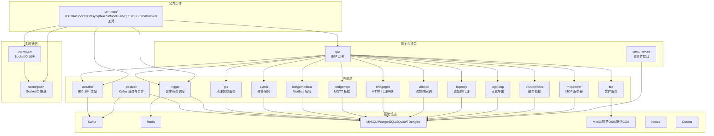
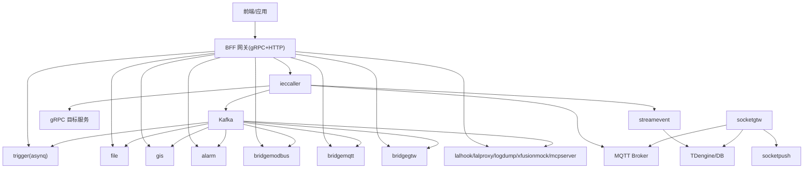
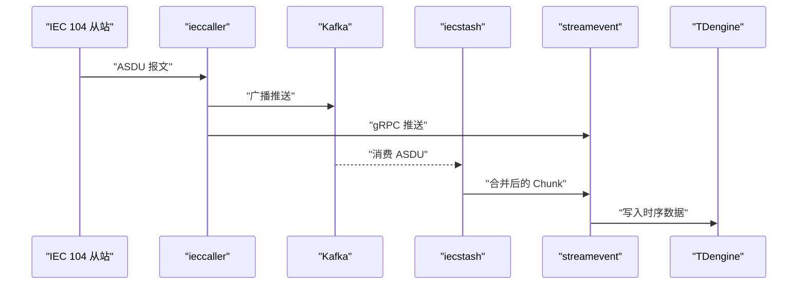
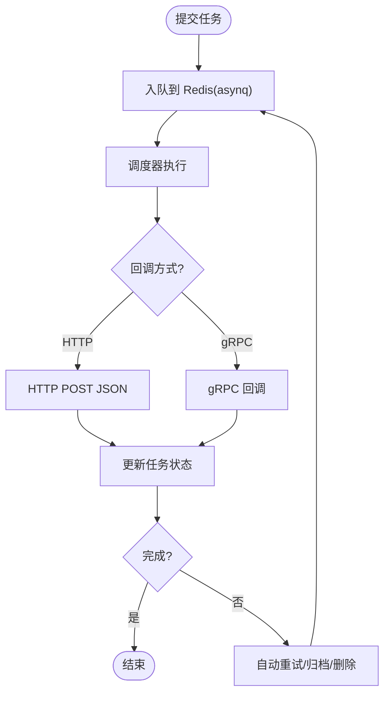
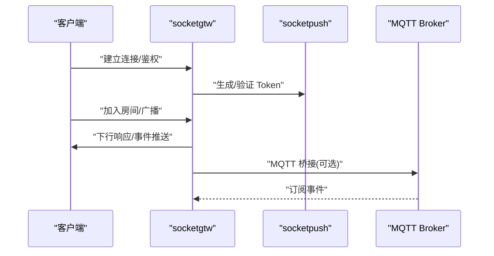
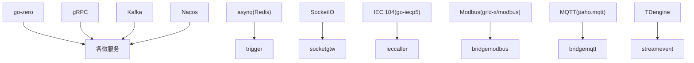

# 项目概述

<cite>
**本文引用的文件**
- [README.md](file://README.md)
- [go.mod](file://go.mod)
- [app/ieccaller/ieccaller.go](file://app/ieccaller/ieccaller.go)
- [app/trigger/trigger.go](file://app/trigger/trigger.go)
- [socketapp/socketgtw/socketgtw.go](file://socketapp/socketgtw/socketgtw.go)
- [facade/streamevent/streamevent.go](file://facade/streamevent/streamevent.go)
- [app/ieccaller/etc/ieccaller.yaml](file://app/ieccaller/etc/ieccaller.yaml)
- [app/trigger/etc/trigger.yaml](file://app/trigger/etc/trigger.yaml)
- [socketapp/socketgtw/etc/socketgtw.yaml](file://socketapp/socketgtw/etc/socketgtw.yaml)
- [common/iec104/types/types.go](file://common/iec104/types/types.go)
- [common/iec104/client/clientmanager.go](file://common/iec104/client/clientmanager.go)
- [common/socketiox/server.go](file://common/socketiox/server.go)
- [common/asynqx/tasktype.go](file://common/asynqx/tasktype.go)
- [deploy/docker-compose.yml](file://deploy/docker-compose.yml)
- [util/main.go](file://util/main.go)
- [model/vars.go](file://model/vars.go)
</cite>

## 目录
1. [简介](#简介)
2. [项目结构](#项目结构)
3. [核心组件](#核心组件)
4. [架构总览](#架构总览)
5. [详细组件分析](#详细组件分析)
6. [依赖分析](#依赖分析)
7. [性能考量](#性能考量)
8. [故障排查指南](#故障排查指南)
9. [结论](#结论)
10. [附录](#附录)

## 简介
zero-service 是一个基于 go-zero 的工业级微服务脚手架，聚焦于物联网数采、异步任务调度与实时通信三大场景，提供多协议接入与高性能数据处理能力。项目通过统一的 BFF 网关聚合 gRPC 服务，并以 gRPC-gateway 提供 HTTP 访问；在实时通信方面，采用 SocketIO 网关与推送服务实现房间管理、广播推送与 MQTT 桥接；在数据采集侧，提供 IEC 104 主站、Kafka/MQTT/gRPC 三路并行推送与数据落库的完整链路。

项目特性涵盖：
- 多协议接入：IEC 60870-5-104 / Modbus TCP/RTU / MQTT / gRPC / HTTP
- 数采平台：IEC 104 主站 + Kafka/MQTT/gRPC 并行推送 + SQLite 配置管理
- 异步任务调度：基于 asynq 的分布式任务队列 + 计划任务引擎
- 实时通信：SocketIO 网关与推送，支持 JWT 鉴权、MQTT 桥接、房间管理
- 容器管理：Docker 容器生命周期管理，提供 Kubernetes-like 的 Pod 抽象
- 地理信息：H3 网格、GeoHash 编解码、电子围栏、坐标转换
- BFF 网关：统一 API 入口，聚合 gRPC 后端服务并提供 grpc-gateway HTTP 访问

## 项目结构
项目采用“按服务分层”的组织方式，核心目录说明如下：
- app/：核心微服务集合，包含 IEC 104 数采、异步任务、文件、GIS、告警、容器管理、协议桥接、流媒体、日志导出等服务
- socketapp/：实时通信模块，包含 SocketIO 网关与推送服务
- gtw/：BFF 网关，统一 HTTP/gRPC 聚合入口
- facade/：对外接口层，提供跨语言流数据事件协议（streamevent）
- common/：公共组件库，包含 IEC 104、SocketIO、asynq、Nacos、Modbus、MQTT、OSS、DB 扩展、GIS、Docker、图像处理、工具等
- model/：数据库模型与 SQL 脚本
- deploy/：Docker Compose 编排配置
- docs/swagger/third_party/util：文档、API 文档、第三方 proto、工具集

图表来源
- [README.md:59-108](file://README.md#L59-L108)
- [deploy/docker-compose.yml:1-110](file://deploy/docker-compose.yml#L1-L110)

章节来源
- [README.md:59-108](file://README.md#L59-L108)
- [deploy/docker-compose.yml:1-110](file://deploy/docker-compose.yml#L1-L110)

## 核心组件
- IEC 104 数采平台：由 ieccaller（主站）、iecstash（Kafka 消费与合并）、streamevent（数据落库）构成，支持 Kafka/MQTT/gRPC 三路推送与 ASDU 压缩合并
- 异步任务调度：基于 asynq 的分布式任务队列，结合计划任务引擎（Plan/Batch/ExecItem 三级模型），支持 HTTP/gRPC 回调与状态机管理
- SocketIO 实时通信：socketgtw（连接管理、房间、消息路由、JWT 鉴权）+ socketpush（Token 生成/验证、gRPC 推送接口）
- BFF 网关（gtw）：统一 API 入口，聚合 gRPC 服务并通过 grpc-gateway 提供 HTTP 访问
- 外部接口层（facade/streamevent）：跨语言流数据事件协议，统一接收 MQTT/WebSocket/Kafka 消息并推送 IEC 104 ASDU
- 公共组件：IEC 104 完整实现、SocketIO 服务器封装、asynq 任务队列扩展、Nacos 服务注册/发现、Modbus/MQTT/OSS/DB 扩展、GIS 地理信息处理、Docker 操作封装、图像处理与工具集

章节来源
- [README.md:110-225](file://README.md#L110-L225)
- [common/iec104/types/types.go:1-323](file://common/iec104/types/types.go#L1-L323)
- [common/socketiox/server.go:1-814](file://common/socketiox/server.go#L1-L814)
- [common/asynqx/tasktype.go:1-10](file://common/asynqx/tasktype.go#L1-L10)

## 架构总览
项目采用“服务网格 + 多协议接入 + 实时通信 + 数据落库”的整体架构。BFF 网关统一对外，内部通过 gRPC 聚合各微服务；IEC 104 数采链路通过 ieccaller 将 ASDU 推送到 Kafka/MQTT/gRPC；iecstash 消费 Kafka 并进行压缩合并，随后通过 streamevent 推送至 TDengine；实时通信通过 SocketIO 网关与推送服务实现房间管理、广播与 MQTT 桥接。

图表来源
- [README.md:15-51](file://README.md#L15-L51)
- [README.md:112-131](file://README.md#L112-L131)
- [README.md:156-173](file://README.md#L156-L173)
- [README.md:189-206](file://README.md#L189-L206)

章节来源
- [README.md:15-51](file://README.md#L15-L51)
- [README.md:112-131](file://README.md#L112-L131)
- [README.md:156-173](file://README.md#L156-L173)
- [README.md:189-206](file://README.md#L189-L206)

## 详细组件分析

### IEC 104 数采平台
- ieccaller：IEC 104 主站，负责与多个从站并行通信，支持总召唤、累计量召唤、指令下发与回调；通过 Kafka 广播推送、MQTT 发布与 gRPC 转发至 streamevent
- iecstash：Kafka 消费者，对 ASDU 进行压缩合并，支持批量 Chunk 推送，下游转发至 streamevent
- streamevent：统一流事件协议服务，接收来自 Kafka/MQTT/gRPC 的消息，进行点位配置管理与 TDengine 时序存储

图表来源
- [README.md:122-127](file://README.md#L122-L127)
- [app/ieccaller/ieccaller.go:41-123](file://app/ieccaller/ieccaller.go#L41-L123)
- [app/ieccaller/etc/ieccaller.yaml:1-79](file://app/ieccaller/etc/ieccaller.yaml#L1-L79)

章节来源
- [README.md:112-131](file://README.md#L112-L131)
- [app/ieccaller/ieccaller.go:41-123](file://app/ieccaller/ieccaller.go#L41-L123)
- [app/ieccaller/etc/ieccaller.yaml:1-79](file://app/ieccaller/etc/ieccaller.yaml#L1-L79)
- [common/iec104/types/types.go:1-323](file://common/iec104/types/types.go#L1-L323)

### 异步任务调度（asynq + 计划任务）
- 任务队列：基于 asynq 的 Redis 存储，支持定时/延时任务、HTTP POST 与 gRPC 回调、自动重试与生命周期管理
- 计划任务引擎：Plan -> Batch -> ExecItem 三级模型，状态机覆盖 WAITING/RUNNING/COMPLETED/FAILED/DELAYED/ONGOING/TERMINATED，支持分布式锁、执行日志追踪与状态聚合

图表来源
- [README.md:133-154](file://README.md#L133-L154)
- [common/asynqx/tasktype.go:1-10](file://common/asynqx/tasktype.go#L1-L10)
- [app/trigger/trigger.go:34-89](file://app/trigger/trigger.go#L34-L89)
- [app/trigger/etc/trigger.yaml:1-38](file://app/trigger/etc/trigger.yaml#L1-L38)
- [model/vars.go:125-153](file://model/vars.go#L125-L153)

章节来源
- [README.md:133-154](file://README.md#L133-L154)
- [common/asynqx/tasktype.go:1-10](file://common/asynqx/tasktype.go#L1-L10)
- [app/trigger/trigger.go:34-89](file://app/trigger/trigger.go#L34-L89)
- [app/trigger/etc/trigger.yaml:1-38](file://app/trigger/etc/trigger.yaml#L1-L38)
- [model/vars.go:125-153](file://model/vars.go#L125-L153)

### SocketIO 实时通信
- socketgtw：SocketIO 网关，负责连接管理、房间管理、消息路由与 JWT 鉴权；支持 HTTP 升级与中间件处理
- socketpush：推送服务，提供 Token 生成/验证与 gRPC 推送接口，支持按 Session/Metadata 寻址与广播

图表来源
- [README.md:156-173](file://README.md#L156-L173)
- [socketapp/socketgtw/socketgtw.go:30-91](file://socketapp/socketgtw/socketgtw.go#L30-L91)
- [socketapp/socketgtw/etc/socketgtw.yaml:1-35](file://socketapp/socketgtw/etc/socketgtw.yaml#L1-L35)
- [common/socketiox/server.go:1-814](file://common/socketiox/server.go#L1-L814)

章节来源
- [README.md:156-173](file://README.md#L156-L173)
- [socketapp/socketgtw/socketgtw.go:30-91](file://socketapp/socketgtw/socketgtw.go#L30-L91)
- [socketapp/socketgtw/etc/socketgtw.yaml:1-35](file://socketapp/socketgtw/etc/socketgtw.yaml#L1-L35)
- [common/socketiox/server.go:1-814](file://common/socketiox/server.go#L1-L814)

### BFF 网关与对外接口层
- gtw：统一 API 入口，聚合 gRPC 服务并通过 grpc-gateway 提供 HTTP 访问，支持用户认证、文件上传/下载、CORS 等
- facade/streamevent：跨语言流数据事件协议，统一接收 MQTT/WebSocket/Kafka 消息并推送 IEC 104 ASDU 与计划任务事件

章节来源
- [README.md:189-206](file://README.md#L189-L206)
- [facade/streamevent/streamevent.go:28-72](file://facade/streamevent/streamevent.go#L28-L72)

## 依赖分析
- 技术栈概览：go-zero、gRPC + grpc-gateway + Protocol Buffers、Kafka、asynq + Redis、SocketIO、IEC 104/Modbus/MQTT、MySQL/PostgreSQL/SQLite、TDengine、MinIO/阿里OSS/腾讯COS、Nacos、H3/GeoHash、Docker、OpenTelemetry/Prometheus、Docker Compose/Kubernetes
- 关键依赖关系：各服务通过 go-zero 框架构建，使用 zrpc 注册服务；公共组件通过 common 目录复用；部署通过 docker-compose 编排

图表来源
- [README.md:207-225](file://README.md#L207-L225)
- [go.mod:1-245](file://go.mod#L1-L245)

章节来源
- [README.md:207-225](file://README.md#L207-L225)
- [go.mod:1-245](file://go.mod#L1-L245)

## 性能考量
- 高性能：基于 go-zero 的高性能 RPC 框架，支持并发连接与低延迟处理
- 可扩展性：服务网格化设计，支持水平扩展与弹性伸缩；Kafka/Redis 集群化部署提升吞吐
- 多协议支持：统一 BFF 网关聚合多种协议，减少重复开发与运维成本
- 实时性：SocketIO 网关与推送服务支持房间管理、广播与 MQTT 桥接，满足实时通信需求
- 数据处理：IEC 104 ASDU 压缩合并与批量推送，降低网络与存储压力

## 故障排查指南
- 服务注册与发现：检查 Nacos 配置与服务注册状态，确认 gRPC 端口与元数据正确
- Kafka 消费：确认 Kafka Broker 地址、Topic 与消费者组配置，关注分区与偏移量
- Redis 任务队列：检查 Redis 连接与任务队列状态，确认 asynq 任务类型与调度器运行
- SocketIO 连接：验证 JWT 鉴权、Token 生成与验证、房间加入/离开与广播事件
- 数据落库：确认 streamevent 与 TDengine 连接，检查点位配置与表结构

章节来源
- [app/ieccaller/etc/ieccaller.yaml:13-20](file://app/ieccaller/etc/ieccaller.yaml#L13-L20)
- [app/trigger/etc/trigger.yaml:11-18](file://app/trigger/etc/trigger.yaml#L11-L18)
- [socketapp/socketgtw/etc/socketgtw.yaml:21-28](file://socketapp/socketgtw/etc/socketgtw.yaml#L21-L28)
- [common/socketiox/server.go:337-350](file://common/socketiox/server.go#L337-L350)

## 结论
zero-service 以 go-zero 为核心，构建了面向工业物联网的高性能微服务架构，具备完善的多协议接入、实时通信与异步任务调度能力。通过 IEC 104 数采平台、SocketIO 实时通信与 BFF 网关，项目能够快速落地工业场景的数据采集、任务调度与实时交互需求。公共组件与统一接口层进一步提升了可维护性与扩展性，适合在复杂工业环境中进行规模化部署与演进。

## 附录
- 快速开始与部署：参考 README 中的环境要求、安装步骤与 Docker Compose 启动方式
- 配置管理：各服务配置文件位于 app/{service}/etc/，包含服务监听、Redis/Kafka/数据库连接、Nacos 服务注册与协议特定配置
- 开发指南：新增服务流程、代码生成与数据库模型生成脚本，便于团队快速扩展

章节来源
- [README.md:226-350](file://README.md#L226-L350)
- [deploy/docker-compose.yml:1-110](file://deploy/docker-compose.yml#L1-L110)
- [util/main.go:46-136](file://util/main.go#L46-L136)