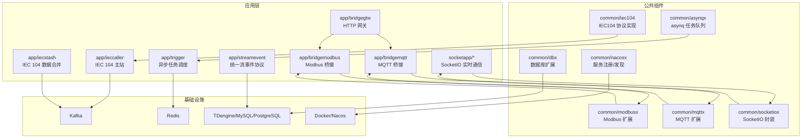
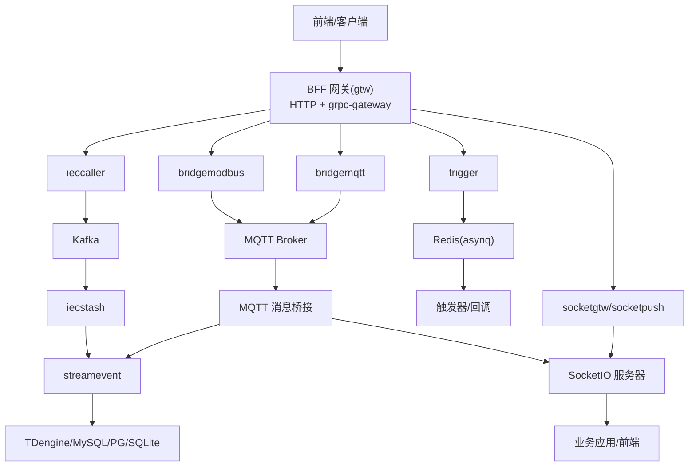
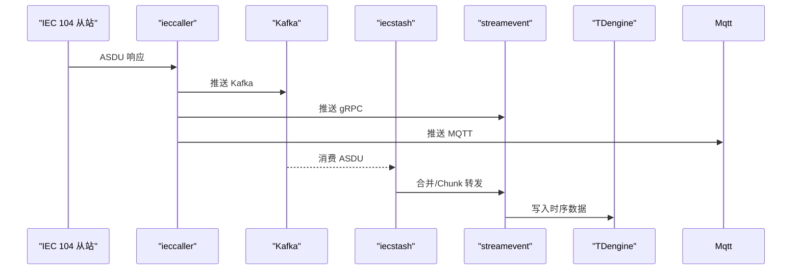
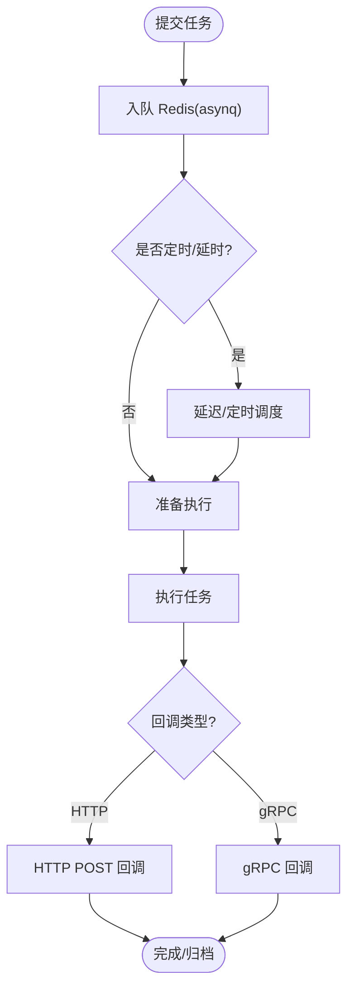
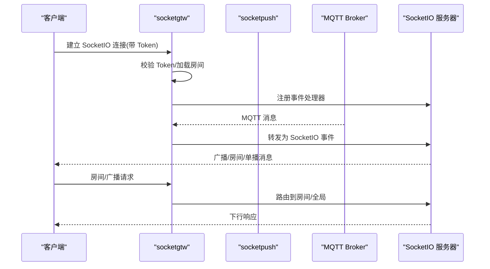
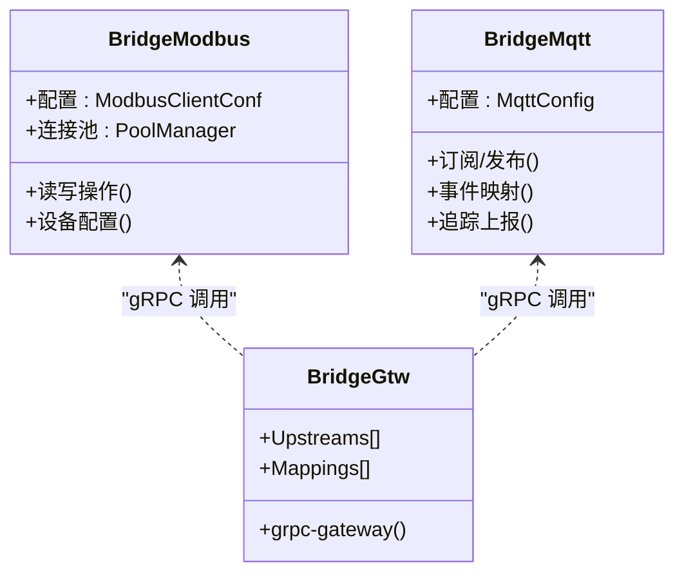

# 项目概述

<cite>
**本文引用的文件**
- [README.md](file://README.md)
- [go.mod](file://go.mod)
- [bridgegtw.go](file://app/bridgegtw/bridgegtw.go)
- [bridgemodbus.go](file://app/bridgemodbus/bridgemodbus.go)
- [bridgemqtt.go](file://app/bridgemqtt/bridgemqtt.go)
- [iecagent.go](file://app/iecagent/iecagent.go)
- [types.go](file://common/iec104/types/types.go)
- [config.go](file://common/modbusx/config.go)
- [mqttx.go](file://common/mqttx/mqttx.go)
- [asynqClient.go](file://common/asynqx/asynqClient.go)
- [server.go](file://common/socketiox/server.go)
- [docker-compose.yml](file://deploy/docker-compose.yml)
- [trigger.yaml](file://app/trigger/etc/trigger.yaml)
- [bridgegtw.yaml](file://app/bridgegtw/etc/bridgegtw.yaml)
- [bridgemodbus.yaml](file://app/bridgemodbus/etc/bridgemodbus.yaml)
- [bridgemqtt.yaml](file://app/bridgemqtt/etc/bridgemqtt.yaml)
- [iecagent.yaml](file://app/iecagent/etc/iecagent.yaml)
</cite>

## 目录
1. [引言](#引言)
2. [项目结构](#项目结构)
3. [核心组件](#核心组件)
4. [架构总览](#架构总览)
5. [详细组件分析](#详细组件分析)
6. [依赖分析](#依赖分析)
7. [性能考虑](#性能考虑)
8. [故障排查指南](#故障排查指南)
9. [结论](#结论)
10. [附录](#附录)

## 引言
Zero-Service 是一个基于 go-zero 的工业级微服务脚手架，聚焦物联网数采、异步任务调度、实时通信等场景，提供开箱即用的多协议接入与高性能数据处理能力。项目通过统一的 BFF 网关聚合 gRPC 与 HTTP，结合 IEC 60870-5-104 主站、Modbus/TCP、MQTT、gRPC、HTTP 等协议桥接，形成覆盖电力、工业自动化、物联网的完整数据采集与处理链路；并通过 asynq 分布式任务队列与计划任务引擎支撑异步与定时业务；借助 SocketIO 实现实时通信与 MQTT 桥接；通过 Docker 容器管理与编排实现弹性与可观测。

## 项目结构
项目采用“服务分层 + 协议桥接 + 公共组件库”的组织方式：
- app/：核心微服务集合，按业务域划分（如 ieccaller、bridgeXxx、trigger、socketapp、gtw 等）
- common/：公共组件库，包含 IEC104、Modbus、MQTT、SocketIO、asynq、Nacos、数据库扩展等
- model/：数据库模型与 SQL 脚本
- deploy/：Docker Compose 编排与基础设施示例
- docs/swagger/third_party：文档、Swagger API 文档与第三方 proto
- facade/：对外统一接口层（如 streamevent）

图表来源
- [README.md:15-51](file://README.md#L15-L51)
- [README.md:59-108](file://README.md#L59-L108)

章节来源
- [README.md:59-108](file://README.md#L59-L108)

## 核心组件
- 多协议接入：IEC 60870-5-104（主站）、Modbus TCP/RTU、MQTT、gRPC、HTTP
- 数采平台：IEC 104 主站 + Kafka/MQTT/gRPC 三通道推送 + SQLite 配置管理
- 异步任务调度：asynq + Redis，支持 HTTP/gRPC 回调与计划任务管理
- 实时通信：SocketIO 网关与推送，支持房间管理、广播、MQTT 桥接与 Token 鉴权
- 容器管理：Docker 容器生命周期管理，提供 Kubernetes-like Pod 抽象
- 地理信息：H3/GeoHash/电子围栏/坐标转换
- BFF 网关：统一 API 入口，聚合 gRPC 并提供 grpc-gateway HTTP 访问

章节来源
- [README.md:5-14](file://README.md#L5-L14)
- [README.md:110-188](file://README.md#L110-L188)

## 架构总览
系统采用“网关 + 微服务 + 协议桥接 + 消息中间件 + 存储”的分层架构。BFF 网关（gtw）统一对外，内部聚合各类后端服务；IEC 104 数采平台由 ieccaller、iecstash、streamevent 协同完成从站采集、Kafka 消费、ASDU 合并与落库；Modbus/MQTT 桥接服务将工业协议与 SocketIO、Kafka/MQTT、gRPC 等打通；asynq 负责异步任务与回调；SocketIO 提供实时通信与 MQTT 桥接；Nacos 实现服务注册与发现；Kafka/Redis/TDengine/MySQL/PostgreSQL/SQLite 等构成数据与消息基础设施。

图表来源
- [README.md:15-51](file://README.md#L15-L51)
- [README.md:110-188](file://README.md#L110-L188)

## 详细组件分析

### IEC 104 数采平台
- ieccaller：IEC 104 主站，支持多从站并行通信、Kafka/MQTT/gRPC 三协议推送、弱校验模式与动态配置
- iecstash：Kafka 消费、ASDU 压缩合并、Chunk 批量处理、下游 RPC 转发
- streamevent：统一流事件协议，接收多源消息（MQTT/WebSocket/Kafka/IEC104），推送至 TDengine 等存储
- 数据模型与点位映射：支持设备/点位映射、表类型拆分、扩展字段用于主题/告警等

图表来源
- [README.md:112-127](file://README.md#L112-L127)
- [types.go:11-40](file://common/iec104/types/types.go#L11-L40)

章节来源
- [README.md:112-127](file://README.md#L112-L127)
- [types.go:11-323](file://common/iec104/types/types.go#L11-L323)

### 异步任务调度（Trigger）
- 基于 asynq 的分布式任务队列，Redis 存储，支持定时/延时任务、HTTP POST 与 gRPC 回调、自动重试与生命周期管理
- 计划任务管理引擎：Plan/Batch/ExecItem 三层模型，状态机（WAITING/RUNNING/COMPLETED/FAILED/DELAYED/ONGOING/TERMINATED），分布式锁防重、执行日志追踪、自动聚合

图表来源
- [README.md:133-154](file://README.md#L133-L154)
- [asynqClient.go:17-31](file://common/asynqx/asynqClient.go#L17-L31)

章节来源
- [README.md:133-154](file://README.md#L133-L154)
- [asynqClient.go:17-31](file://common/asynqx/asynqClient.go#L17-L31)

### 实时通信（SocketIO）
- socketgtw：SocketIO 网关，负责连接管理、房间管理、消息路由、Token 认证、MQTT 桥接
- socketpush：推送服务，提供 Token 生成/验证、gRPC 推送接口、后端服务调用入口
- 能力：房间加入/离开/广播、全局广播、单播/批量推送、会话剔除、元数据管理、MQTT 桥接与事件映射

图表来源
- [README.md:156-172](file://README.md#L156-L172)
- [server.go:337-676](file://common/socketiox/server.go#L337-L676)

章节来源
- [README.md:156-172](file://README.md#L156-L172)
- [server.go:250-312](file://common/socketiox/server.go#L250-L312)

### 协议桥接组件
- Modbus 桥接（bridgemodbus）：TCP/RTU 读写、设备配置管理、gRPC 集成，连接池管理
- MQTT 桥接（bridgemqtt）：消息发布/订阅、带追踪的推送、gRPC 集成、事件映射
- HTTP 网关（bridgegtw）：gRPC 聚合、HTTP 路由映射、ProtoSets 配置

图表来源
- [bridgemodbus.go:27-71](file://app/bridgemodbus/bridgemodbus.go#L27-L71)
- [bridgemqtt.go:28-72](file://app/bridgemqtt/bridgemqtt.go#L28-L72)
- [bridgegtw.go:19-42](file://app/bridgegtw/bridgegtw.go#L19-L42)
- [config.go:32-125](file://common/modbusx/config.go#L32-L125)
- [mqttx.go:51-178](file://common/mqttx/mqttx.go#L51-L178)

章节来源
- [bridgemodbus.go:27-71](file://app/bridgemodbus/bridgemodbus.go#L27-L71)
- [bridgemqtt.go:28-72](file://app/bridgemqtt/bridgemqtt.go#L28-L72)
- [bridgegtw.go:19-42](file://app/bridgegtw/bridgegtw.go#L19-L42)
- [config.go:32-125](file://common/modbusx/config.go#L32-L125)
- [mqttx.go:51-178](file://common/mqttx/mqttx.go#L51-L178)

### IEC 104 协议实现与类型
- 支持多种 ASDU 信息体类型（单点/双点遥信、标度化/规一化/短浮点遥测、累计量、步位置、位串、保护事件等）
- 提供点位映射结构，便于主题拆分与存储表类型管理

章节来源
- [types.go:60-323](file://common/iec104/types/types.go#L60-L323)

### 配置与启动流程
- 各服务均通过命令行参数加载配置文件（etc/*.yaml），支持开发/测试/生产模式、日志路径、超时、Redis/Kafka/数据库连接、Nacos 注册等
- 启动流程：解析配置 → 初始化上下文 → 注册拦截器/反射 → 启动服务/网关 → 注册到 Nacos（可选）

章节来源
- [trigger.yaml:1-37](file://app/trigger/etc/trigger.yaml#L1-L37)
- [bridgegtw.yaml:1-40](file://app/bridgegtw/etc/bridgegtw.yaml#L1-L40)
- [bridgemodbus.yaml:1-26](file://app/bridgemodbus/etc/bridgemodbus.yaml#L1-L26)
- [bridgemqtt.yaml:1-48](file://app/bridgemqtt/etc/bridgemqtt.yaml#L1-L48)
- [iecagent.yaml:1-14](file://app/iecagent/etc/iecagent.yaml#L1-L14)
- [bridgegtw.go:19-42](file://app/bridgegtw/bridgegtw.go#L19-L42)
- [bridgemodbus.go:27-71](file://app/bridgemodbus/bridgemodbus.go#L27-L71)
- [bridgemqtt.go:28-72](file://app/bridgemqtt/bridgemqtt.go#L28-L72)
- [iecagent.go:30-59](file://app/iecagent/iecagent.go#L30-L59)

## 依赖分析
- 微服务框架：go-zero
- RPC 与网关：gRPC + grpc-gateway + Protocol Buffers
- 消息队列：Kafka（go-queue）
- 任务队列：asynq + Redis
- 实时通信：SocketIO（fork 版本）
- 工业协议：IEC 60870-5-104（go-iecp5）、Modbus（grid-x/modbus）、MQTT（paho.mqtt）
- 数据库：MySQL / PostgreSQL / SQLite（含 TDengine 驱动）
- 服务发现：Nacos
- 地理计算：H3（uber/h3-go）、GeoHash、orb/go-geom
- 容器管理：Docker SDK
- 监控追踪：OpenTelemetry / Prometheus
- 编排：Docker Compose / Kubernetes（可选）

章节来源
- [go.mod:5-62](file://go.mod#L5-L62)
- [README.md:207-225](file://README.md#L207-L225)

## 性能考虑
- 连接池与并发：Modbus 连接池管理、asynq 任务并发控制、SocketIO 会话并发安全
- 超时与重试：协议超时、重连间隔、任务重试策略、MQTT 自动重连
- 消息吞吐：Kafka 分区数、批量写入、压缩策略；IEC104 ASDU 合并与 Chunk 批处理
- 资源限制：Docker 内存限制、服务端口复用、Nacos 服务发现减少网络开销
- 监控与追踪：OpenTelemetry 链路追踪、Prometheus 指标采集、日志轮转

## 故障排查指南
- 网关与上游服务连通性：检查 bridgegtw 的 Upstreams 与 Mappings，确认 gRPC 端点可达
- 协议桥接问题：核对 bridgemodbus/bridgemqtt 的 Broker/Address/ClientId/Username/Password/Qos 等配置
- IEC 104 从站通信：确认 iecagent 的 Host/Port/LogMode，查看 ieccaller/iecstash 的 Kafka 消费与推送
- 任务执行异常：检查 asynq Redis 连接、任务回调地址、重试次数与归档策略
- 实时通信异常：验证 SocketIO Token、房间加入/离开事件、MQTT 桥接事件映射
- 容器与编排：使用 docker-compose 检查 Kafka/Filebeat/ieccaller/bridgegtw/bridgedump 等服务状态

章节来源
- [bridgegtw.yaml:12-40](file://app/bridgegtw/etc/bridgegtw.yaml#L12-L40)
- [bridgemodbus.yaml:23-26](file://app/bridgemodbus/etc/bridgemodbus.yaml#L23-L26)
- [bridgemqtt.yaml:19-48](file://app/bridgemqtt/etc/bridgemqtt.yaml#L19-L48)
- [trigger.yaml:19-37](file://app/trigger/etc/trigger.yaml#L19-L37)
- [docker-compose.yml:1-110](file://deploy/docker-compose.yml#L1-L110)

## 结论
Zero-Service 以 go-zero 为核心，围绕 IEC 104 数采、异步任务调度、实时通信与协议桥接构建了高内聚、低耦合的工业级微服务体系。通过 Kafka/Redis/TDengine 等基础设施与 SocketIO、MQTT、Modbus 等协议的深度融合，项目能够满足电力、工业自动化、物联网等复杂场景下的数据采集、处理与实时交互需求。配套的 Docker 编排与 Nacos 服务治理进一步提升了系统的可运维性与弹性。

## 附录

### 快速开始
- 环境要求：Go 1.25+、Redis（任务队列与缓存）、可选 Kafka/MySQL/PostgreSQL/TDengine/Docker
- 安装与启动：克隆仓库后执行 go mod tidy；进入单个服务目录运行入口文件或使用 docker-compose 启动
- 配置：各服务配置位于 app/{service}/etc/ 目录，包含服务监听、Redis/Kafka/数据库连接、Nacos 与协议特定配置

章节来源
- [README.md:226-261](file://README.md#L226-L261)
- [docker-compose.yml:1-110](file://deploy/docker-compose.yml#L1-L110)