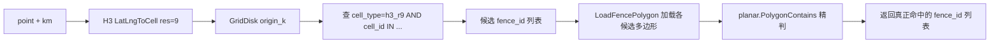

# GIS 服务与 gisx 包规范

> 涵盖 `common/gisx/` 通用包和 `app/gis/` 服务的架构约定。

## common/gisx/ 包边界

 | 可以放 | 不可以放 |
 |--------|----------|
 | 纯几何计算（坐标校验、线段相交、多边形相交） | 引用 `app/*/` 下的 pb 类型 |
 | orb/H3 类型转换（OrbPolygonToH3GeoPolygon） | 引用 gRPC generated 代码 |
 | GEOS 工具层（go-geos 封装，见下文 GEOS 工具层章节，位于 `common/gisx/geos` 子包） | 让 `app/gis/internal/logic` 直接依赖 `github.com/twpayne/go-geos` |
 | `FenceStore` 接口定义 + `NoopFenceStore` | 具体 store 实现（放 `app/gis/model/`） |
 | `FenceInfo` 通用结构体 | 业务错误码 (`extproto`) |

 参考文件：
 - `common/gisx/validate.go` — 坐标校验
 - `common/gisx/gisx.go` — H3 多边形转换、ring 自动闭合
 - `common/gisx/store.go` — FenceStore 接口定义
 - `common/gisx/geos/*.go` — GEOS 工具层（独立子包 `geos`，零 orb 依赖）
 - `common/gisx/geos/orbconv/*.go` — orb 类型转换层

## 坐标系约定

**关键规则**：不同库的坐标参数顺序不同，混用是常见 bug 来源。

| 库/类型 | 顺序 | 示例 |
|---------|------|------|
| `orb.Point` | `[经度, 纬度]` (lon, lat) | `orb.Point{116.4, 39.9}` |
| `h3.LatLng` | `{纬度, 经度}` (lat, lng) | `h3.LatLng{Lat: 39.9, Lng: 116.4}` |
| `geohash.Encode` | `(纬度, 经度)` (lat, lon) | `geohash.EncodeWithPrecision(39.9, 116.4, 7)` |
| pb `Point` | `lat`, `lon` 独立字段 | `&gis.Point{Lat: 39.9, Lon: 116.4}` |

pb→orb 转换时必须翻转：`orb.Point{p.Lon, p.Lat}`。

## GEOS 工具层约定

`common/gisx/geos` 子包（包名 `geos`）薄封装 `github.com/twpayne/go-geos`。GEOS 是 CGO 动态库依赖，不是纯 Go 包。

### 架构

```
common/gisx/geos/               ← 零 orb 依赖，直接使用 *gogeos.Geom
├── context.go                  # GEOSVersion / safeRun / errNil
├── construct.go                # NewPoint/LineString/LinearRing/Polygon/BoundsRect
├── convert.go                  # WKT/WKB/GeoJSON 互转
├── predicate.go                # 11 谓词（Intersects/Contains/Covers/...）
├── prepared.go                 # PreparedGeom + 12 方法
├── overlay.go                  # Overlay/Valid/Measure/Simplify/Transform/Meta
├── relation.go                 # DE-9IM/Hausdorff/NearestPoints
├── introspect.go               # IsEmpty/Simple/Closed/Ring/HasZ
├── strtree.go                  # STRtree R-Tree
└── geos_test.go                # 45+ 测试

common/gisx/geos/orbconv/       ← orb 转换 + 便捷包装
├── orbconv.go                  # 5 转换 + 6 便捷谓词
└── orbconv_test.go             # 12+ 测试
```

### 核心原则

- **Context 私有**：`getDefaultContext()`（sync.Once 单例）包内私有，业务层不感知
- **panic → error**：所有 GEOS 调用经过 `safeRun`/`safeRunErr`，统一 recover
- **无包装层**：直接使用 `*gogeos.Geom`，不自建 `Geometry` 包装类型
- **无冗余字段**：`PreparedGeom`、`STRtree` 不存储 Context 引用

### Docker / CGO 依赖

`app/gis/Dockerfile` 两阶段：
- builder：`CGO_ENABLED=1`，安装 `pkgconf geos-dev`，执行 `geos-config --version`
- runtime：安装 `geos`（不要用 `geos-dev`）

反模式：builder 只装 `geos` 缺少头文件；runtime 不装 `geos` 二进制找不到动态库。

### 对外 API 边界

- 业务层推荐通过 `orbconv` 使用（接受 `orb` 类型）
- 纯坐标场景直接使用 `geos.NewPoint/NewPolygon` 等
- `app/gis/internal/logic` **不直接** import `github.com/twpayne/go-geos`
- `Close()` 置空 Go 引用帮助 GC，go-geos 通过 `runtime.AddCleanup` 管理 C 内存

### safeRun 机制

所有公开函数必须通过 `safeRun(func() (T, error))` 执行业务逻辑。go-geos 非法调用会 panic，`safeRun` 统一 recover 转 error，前缀 `geos: `。

构造函数（需 `*gogeos.Context`）在 `safeRun` 闭包内调用 `getDefaultContext()`：
```go
func NewPoint(x, y float64) (*gogeos.Geom, error) {
    return safeRun(func() (*gogeos.Geom, error) {
        return getDefaultContext().NewPointFromXY(x, y), nil
    })
}
```

### 谓词语义

- `Covers`/`IntersectsXY`（PreparedGeom）：**边界点算命中**，围栏场景用这个
- `Contains`/`ContainsXY`：OGC 严格语义，边界点不算
- `Intersects`：任意公共点（含边界接触）

### PreparedGeom 使用

```go
prep, _ := geos.NewPreparedGeom(fenceGeom)
defer prep.Close()
for _, pt := range points {
    hit, _ := prep.IntersectsXY(pt.Lon, pt.Lat)
}
```

单次判断用普通谓词，避免预处理开销。

### STRtree

go-geos 标注 STRtree "currently broken"（`Nearest` segfault）。本封装只暴露 Insert/Query/Iterate/Remove。查询只做空间过滤，业务层需精判。

### 距离计算

GEOS `Distance` 是**平面笛卡尔距离**（单位=坐标单位）。经纬度场景结果无物理意义（度），应使用 `orb/geo.Distance`（Haversine 球面距离，米）。

`HausdorffDistance`/`FrechetDistance` 用于形状比较（不依赖球面）。

## FenceStore 接口模式

所有 store 方法必须传 `context.Context` 作为第一个参数：

```go
type FenceStore interface {
    CreateFence(ctx context.Context, fenceId, name string, points []orb.Point, h3Resolution, geohashPrecision int, h3Cells, geohashCells []string) error
    LoadFencePolygon(ctx context.Context, fenceId string) ([]orb.Point, error)
    // ...
}
```

### 召回索引自动生成规则

store 层实现（`GormFenceStore`）在 `CreateFence` / `UpdateFence` 内部自动做以下工作：

- 根据 `points` 和 `h3RecallResolution=9` 生成 `h3_r9` 召回 cells
- 与业务 `h3` / `geohash` cells 一起写入 `gis_fence_cell` 表
- `h3_r9` cells 不暴露给 logic 层，不出现在 `FenceInfo.H3Cells` 中
- `FindNearbyFenceIds` 固定查询 `cell_type = "h3_r9"`，不和 `h3` 混查

注入规则（`app/gis/internal/svc/servicecontext.go`）：
- 配置了 `DB.DataSource` → 使用 `model.NewGormFenceStore(db)`
- 未配置 → 使用 `&gisx.NoopFenceStore{}`

## app/gis/ 服务架构

### RPC 分类

 | 类别 | 示例 | 特点 |
 |------|------|------|
 | 纯计算 | `Distance`, `EncodeH3`, `EncodeGeoHash`, `GenerateFenceCells`, `RoutePoints` | 无 DB 依赖，无状态 |
 | 多精度编码 | `EncodeH3Multi`, `EncodeGeoHashMulti` | 单点 multi-resolution 编码，repeated 入参 |
 | GridDisk 邻域查询 | `GridDisk` (h3_index), `GridDiskByPoint` (经纬度) | 两个独立 RPC 分别处理 origin 输入形式 |
 | 围栏 CRUD | `CreateFence`, `UpdateFence`, `DeleteFence`, `ListFences`, `GetFence` | 依赖 FenceStore |
 | 围栏判断 | `PointInFence`, `PointInFences`, `NearbyFences` | 支持直传 polygon 或 fenceId 两种模式；`NearbyFences` 新增 H3 召回 + polygon 精判链路 |
 | 坐标转换 | `TransformCoord`, `BatchTransformCoord` | WGS84/GCJ02/BD09 互转 |

### logic 层 helper 模式

`logic/helper.go` 存放 pb↔领域类型的转换和通用校验：
- `ValidatePoints` — pb Point 批量校验（非空、非 nil、经纬度范围）
- `ValidateH3Resolution` — 校验 H3 分辨率 0-15，返回 int
- `ValidateGeoHashPrecision` — 校验 geohash 精度 1-12，返回 int
- `EncodeH3Cell` — 将 pb Point 编码为 H3 cell
- `pbPointToOrbPolygon` — pb Point 切片→orb.Polygon（单外环，自动闭合）

校验规则：
- `ValidateH3Resolution(0)` 合法返回 0（H3 官方分辨率 0 允许），不默认置为 9
- `ValidateGeoHashPrecision` 要求 1-12，不允许 0
- `EncodeH3Cell` 依赖 `h3.LatLngToCell`，调用方需自行校验 resolution 后再调用

反模式：不要把 pb 类型的转换函数放到 `common/gisx/`。

### 批量接口校验规则

单点接口和批量接口必须保持相同的校验逻辑。每个入参 Point 都要经过 `ValidatePoints` 校验经纬度范围。

参考：`batchtransformcoordlogic.go`、`batchdistancelogic.go`。

### Model 层

```
app/gis/model/
├── gormmodel/fence.go    → GORM 模型定义
└── fencestore.go         → GormFenceStore 实现
```

模型主键约定：
- `gormx.LegacyIDMixin` — int64 自增主键（DB 性能）
- `FenceId string` uniqueIndex — 业务 UUID（API 暴露）

## 算法说明

> GEOS 工具层 API 和约定见上方 [GEOS 工具层约定](#geos-工具层约定) 章节。以下为 geohash/H3 算法说明。

### Geohash 网格扫描（GenerateFenceCells / computeGeohashCells）

算法：bbox 半步长网格扫描 + 双重过滤。本接口为纯计算，不再支持按 `fence_id` 从 store 加载围栏。

1. 计算多边形 bounding box
2. 以 `geohashCellSize / 2` 为步长遍历 bbox（半步长确保不遗漏边界格子）
3. 对每个采样点生成 geohash，构造格子矩形多边形
4. 精过滤：格子中心在围栏内 **或** 格子与围栏边界相交（相交判断已迁移到 `orbconv.IntersectsOrb`）
5. 可选：扩展命中格子的 8 邻居

参考：`app/gis/internal/logic/generatefencecellslogic.go`。

### geohashCellSize 返回值约定

```go
func geohashCellSize(precision int, lat float64) (widthDeg, heightDeg float64)
```

- `widthDeg` = 经度方向跨度（lon step）
- `heightDeg` = 纬度方向跨度（lat step）
- 必须按 geohash 位划分公式精确计算角度跨度：`lonBits=(precision*5+1)/2`、`latBits=precision*5/2`、`widthDeg=360/2^lonBits`、`heightDeg=180/2^latBits`
- 不要用米制经验表再按纬度换算为度数；geohash 编码本身是在经纬度区间二分，格子角度跨度不依赖中心纬度

**调用方必须按 `lonStep, latStep := geohashCellSize(...)` 接收**，不要反写成 `latStep, lonStep`。

### H3 召回索引（推荐，替代 Nearby geohash 查询）

`FindNearbyFenceIds` 使用固定的 `h3_r9` 召回索引做粗过滤。设计要点：

- 召回索引精度固定为 **H3 resolution = 9**（`cell_type = "h3_r9"`），不按 `km` 动态选择。
- `CreateFence` / `UpdateFence` 在 store 层根据多边形自动生成 `h3_r9` 召回 cells，logic 层不感知内部召回索引。
- 查询链路：`LatLngToCell(point, 9)` → `GridDisk(origin, k)` → `cell_type = "h3_r9" AND cell_id IN ?`。
- `km` 只换算 H3 网格圈数 `k`：`k = ceil(km / 0.2)`（基于 res=9 平均边长约 200m），最小 1。
- `FenceInfo.H3Cells` 业务上暴露 `cell_type = "h3"`，不暴露内部 `h3_r9`。
- 未来升级召回精度时，新增 `cell_type = "h3_r10"` 重建索引，再切换查询条件；不改主表结构。

参考文件：`app/gis/model/fencestore.go`，常量定义：

```go
const (
    h3RecallResolution    = 9
    h3RecallCellType      = "h3_r9"
    h3RecallAverageEdgeKm = 0.2  // res=9 平均边长 km
)
```

优势：
- 查询 resolution 和入库 resolution 始终对齐，不会因精度不一致漏查候选。
- 按 km 变 resolution 的老方案不准确且不可靠，已在本轮废弃。

### 老方案（已废弃）：Nearby geohash 查询

> 该方案已被 H3 召回索引替代，旧代码保留但不应在新路径中使用。

`FindNearbyFenceIds` 曾使用 geohash 粗过滤，查询时必须兼容入库 geohash 精度与本次查询精度不同的情况：

- 同精度：查询候选 geohash 和 8 邻居的 exact match
- 入库更粗：最多回退 2 级前缀 exact match（再粗则空间跨度过大，不适合作"附近"过滤）
- 入库更细：查询候选 geohash 的 `LIKE prefix%`

否则 `CreateFence` 默认 precision=7、`NearbyFences` 按 km 选择 precision=4/5/6 时会漏查候选围栏。

### NearbyFences 完整链路（H3 召回 + 多边形精判）



注意：
- `km` 只控制 H3 召回圈的广度，不控制精判后的结果范围。
- 如果围栏入库时没有生成 `h3_r9` cells（例如为回填的老数据），`NearbyFences` 查不到该围栏。

### GridDisk 圈层查询

两个独立 RPC 分别处理不同的 origin 输入形式，不在单个 request 中塞多个主输入字段：

```proto
message GridDiskReq {
  string h3_index = 1;     // H3 origin index
  uint32 k = 2;            // 周围圈数，默认 1；0 表示只返回 origin
}

message GridDiskByPointReq {
  Point point = 1;
  uint32 resolution = 2;   // H3 分辨率 0-15，默认 9
  uint32 k = 3;            // 周围圈数，默认 1；0 表示只返回 origin
}

message GridDiskRes {
  string origin = 1;
  repeated GridDiskCell cells = 2;
}

message GridDiskCell {
  string h3_index = 1;
  uint32 ring = 2;         // H3 圈数：0=origin，1=第一圈，依此类推；不是米级距离
}
```

响应字段用 `ring` 而非 `distance`，H3 网格圈数不是米级距离，调用方不会误解。

k=0 传透到 `GridDiskDistances(origin, 0)` 只返回 origin；不做 `if k <= 0 { k = 1 }` 覆盖。

### 多精度编码（EncodeH3Multi / EncodeGeoHashMulti）

单点 multi-resolution 编码模式：

```proto
message EncodeH3MultiReq {
  Point point = 1;
  repeated uint32 resolutions = 2; // H3 分辨率 0-15，必填
}

message EncodeH3MultiRes {
  repeated H3Index h3_indexes = 1; // 按 resolutions 顺序对齐
}
```

- `resolutions` / `precisions` 必填，为空时返回参数缺失错误
- 返回顺序与请求顺序保持一致，不去重
- 响应结构复用 `H3Index` / `GeoHashIndex`（resolution + value）

### PointsWithinRadius 响应精简

```proto
message RadiusHit {
  int32 index = 1;
  double distance_meters = 2;
}

message PointsWithinRadiusRes {
  repeated RadiusHit hits = 1;
}
```

不再返回 Point 坐标，避免响应体膨胀。用 orb `geo.Distance` 算精确球面距离。

### 路径优化（RoutePoints）

近似求解开放式 TSP：
1. **最近邻贪心**（O(n²)）生成初始访问顺序
2. **2-opt 局部搜索** — 枚举所有可翻转子段，若缩短总距离则翻转

2-opt 边界规则：仅在 `j+1 < n` 时比较（开放路径末端无后继边）。

参考：`app/gis/internal/logic/routepointslogic.go`。

### H3 多边形覆盖（GenerateFenceH3Cells / CreateFence）

直接调用 `h3.PolygonToCellsExperimental` 计算所有与多边形重叠的六边形 cell。
需先通过 `gisx.OrbPolygonToH3GeoPolygon` 转换坐标格式。
`GenerateFenceH3Cells` 为纯计算接口，不支持按 `fence_id` 从 store 加载围栏。

## Proto 规范

- 字段命名统一 snake_case（`fence_id`, `h3_resolution`, `page_size`）
- 业务 ID 字段名为 `fence_id`（不用 `id`，避免与 DB 主键混淆）
- 精度/分辨率参数提供默认值说明：`uint32 h3_resolution = 3; // 默认 9`
- 时间字段用毫秒时间戳：`int64 created_at = 8;`
- 专有名词作为原子词：`geohashes`（不是 `geo_hashes`），`geohash_precision`
- Circle 语义不叫 `distance`：H3 GridDisk 返回的层数用 `ring` 表达，`distance` 只用于米级球面距离（`distance_meters`）

## 常见陷阱

| 陷阱 | 说明 | 参考文件 |
|------|------|----------|
| 坐标顺序混淆 | orb 用 [lon,lat]，H3 用 {lat,lng}，pb 用独立字段 | `logic/helper.go` |
| geohashCellSize 返回值 | 第一个是 widthDeg(lon)，第二个是 heightDeg(lat)，按 geohash 位数算角度跨度，不用米制经验表 | `logic/generatefencecellslogic.go` |
| H3 召回精度不一致 | 查询 resolution 必须和入库 `h3_r9` 一致，否则 `GridDisk` 查不到对应 cells；已按固定 res=9 消除了此问题 | `model/fencestore.go` |
| 老数据缺少 h3_r9 cells | 未回填的旧围栏没有 `h3_r9` 行，`NearbyFences` 查不到；旧代码保留的 geohash 查询也不应该再被用作唯一召回路径 | `model/fencestore.go` |
| km 只控制候选广度 | `NearbyFences` 的 `km` 只影响 H3 候选集大小，不决定最终结果；polygon 精判后只返回真正命中的围栏 | `logic/nearbyfenceslogic.go` |
| uint32 默认值判断 | `resolution == 0` 而非 `<= 0`（unsigned 不会负） | `logic/generatefenceh3cellslogic.go` |
| 批量接口漏校验 | BatchXxx 必须与单点版本保持相同的入参校验 | `logic/batchtransformcoordlogic.go` |
| 2-opt 开放路径边界 | 末端无后继边，`j+1 >= n` 时跳过 | `logic/routepointslogic.go` |
| polygon holes 死代码 | 当前 proto 只支持单环，OrbPolygonToH3GeoPolygon 的 holes 循环不会执行 | `common/gisx/gisx.go` |
| `h3.CellFromString` 无 error | `CellFromString` 返回单值（非 `Cell, error`），需用 `.IsValid()` 检查无效 index | `logic/griddisklogic.go` |
| `h3.GridDiskDistances` 返回 `[][]Cell` | 返回值是 `[][]Cell`（按环分层），不是 `[]DistanceEntry`。用 `ringNum, ringCells := range result` 遍历 | `logic/griddisklogic.go` |
| `resolutions` 必填不默认 | `EncodeH3Multi` 的 `resolutions` 空时返回参数错误，不设默认值；单精度由 `EncodeH3` 承担 | `logic/encodeh3multilogic.go` |

## 单测覆盖

`common/gisx/gisx_test.go` 必须覆盖：
- `ValidateCoordinate` 边界值（±90/±180）
- `IsOrbPointsEqual` 浮点精度
- `OrbRingToH3LatLng` 自动闭合
- `OrbPolygonToH3GeoPolygon` 正常/带洞/异常

`common/gisx/geos/geos_test.go` 必须覆盖：
- GEOSVersion 非空
- 构造：Point/Polygon/BoundsRect/LineString/LinearRing
- WKT/WKB/GeoJSON 往返 + 无效输入
- 全部 11 谓词 + Contains vs Covers 边界语义
- PreparedGeom 全部 12 方法
- Overlay（Intersection/Union/Difference/SymDifference）面积校验
- Valid/IsValidReason/MakeValid（bowtie 自相交场景）
- Buffer/Simplify/ConvexHull/ConcaveHull 面积校验
- Area/Length/Distance/Centroid/PointOnSurface 精度校验
- Relate/Hausdorff/Frechet/DistanceWithin/NearestPoints
- SRID/SetSRID/Precision/Normalize/Reverse 基本功能
- STRtree Insert/Query/Iterate/Remove
- safeRun panic recover（无效 WKT→error）

`common/gisx/geos/orbconv/orbconv_test.go` 必须覆盖：
- PolygonToGeom/GeomToPolygon/PointToGeom/RingToGeom/GeomToRing 往返
- IntersectsOrb/ContainsOrb/CoversOrb 重叠+远离
- CoversPointOrb/ContainsPointOrb 边界语义
- ValidOrb
- nil 输入返回 nil
