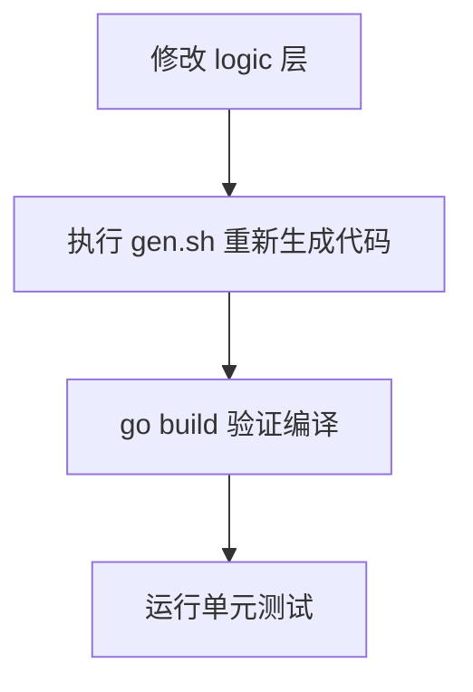

# 实现计划

## 执行顺序



## 步骤

### 1. 修改 logic 文件（5 个文件）

| 顺序 | 文件 | 操作 |
|------|------|------|
| 1.1 | `decodegeohashlogic.go` | 返回体中加 `Precision: uint32(len(in.Geohash))` |
| 1.2 | `decodeh3logic.go` | 加 `Resolution: uint32(cell.Resolution())` |
| 1.3 | `pointinfencelogic.go` | `Fence.Id` → `Fence.FenceId`（两处） |
| 1.4 | `pointinfenceslogic.go` | `fence.Id` → `fence.FenceId`（四处） |
| 1.5 | `listfenceslogic.go` | 移除 `int32()` 强转 |
| 1.6 | `generatefencecellslogic.go` | 删除 `else if in.FenceId != ""` 分支 |
| 1.7 | `generatefenceh3cellslogic.go` | 删除 `else if in.FenceId != ""` 分支 |

### 2. 重新生成 pb/grpc 代码

```bash
cd app/gis && bash gen.sh
```

验证 `gisserver.go` 的 import 和字段引用与新 pb 一致。

### 3. 编译验证

```bash
go build ./app/gis/...
```

### 4. 执行单元测试

```bash
go test ./app/gis/... -v -count=1
```

### 验证命令

```bash
# 编译检查
go build ./app/gis/...

# 单元测试
go test ./app/gis/... -v -count=1

# go vet
go vet ./app/gis/...
```
