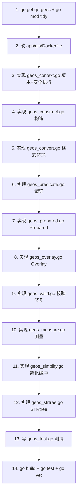

# 实现计划

## 执行顺序



## 步骤

### 1. 引入依赖

```bash
go get github.com/twpayne/go-geos
go mod tidy
```

验证：`go build ./common/gisx/...` 能解析 import（此时还没有使用，不会报错）。

### 2. 修改 `app/gis/Dockerfile`

builder 阶段 `apk add` 增加 `pkgconf geos-dev`，新增 `RUN geos-config --version`。
runtime 阶段 `apk add --no-cache geos`。

### 3. `geos_context.go`

- `GEOSVersion()` / `GEOSVersionString()`
- `getDefaultContext()` + `sync.Once`
- `safeRun[T any](fn)` 泛型 recover 封装
- `safeRunBool` / `safeRunGeom` 便捷变体

### 4. `geos_construct.go`

- `Geometry` 结构体（持有 `*geos.Geom`）
- `NewPoint` / `NewLineString` / `NewLinearRing` / `NewPolygon` / `NewBoundsRect`
- `orb.Ring` → `[][]float64` 内部转换
- `orb.Polygon` → `[][][]float64` 内部转换（外环 + 洞）
- `Close()` 方法

### 5. `geos_convert.go`

- `FromWKT` / `ToWKT`
- `FromWKB` / `ToWKB`
- `FromGeoJSON` / `ToGeoJSON`
- `ToOrbPoint` / `ToOrbRing` / `ToOrbPolygon`
- 处理 MultiPolygon → orb.Polygon（MakeValid 场景）

### 6. `geos_predicate.go`

便捷函数（接受 orb 类型，内部构造 GEOS geom 并销毁）：
- `Intersects` / `Contains` / `Covers` / `Within` / `Touches` / `Disjoint` / `Equals` / `Overlaps` / `Crosses`
- `ContainsPoint` / `CoversPoint` / `IntersectsPoint`

### 7. `geos_prepared.go`

- `PreparedPolygon` 结构体
- `NewPreparedPolygon` / `Intersects` / `Contains` / `ContainsPoint` / `Covers` / `CoversPoint` / `Disjoint` / `Close`

### 8. `geos_overlay.go`

- `Intersection` / `Union` / `Difference` / `SymDifference`
- 返回 `orb.Polygon`，结果空时返回 `orb.Polygon{}` + nil

### 9. `geos_valid.go`

- `IsValid` / `IsValidReason` / `MakeValid`

### 10. `geos_measure.go`

- `Area` / `Length` / `Distance` / `Centroid` / `PointOnSurface`

### 11. `geos_simplify.go`

- `Buffer` / `Simplify` / `TopologyPreserveSimplify` / `ConvexHull` / `ConcaveHull`

### 12. `geos_strtree.go`

- `STRtree` 结构体
- `NewSTRtree` / `Insert` / `Query` / `Close`

### 13. `geos_test.go`

按 design.md §9 测试设计，覆盖所有能力分组。

### 14. 验证命令

```bash
# 编译
go build ./common/gisx/...

# 测试
go test ./common/gisx/... -v -count=1

# vet
go vet ./common/gisx/...

# 全量编译验证（不破坏其他模块）
go build ./app/gis/...
```

## 验证门

每个步骤完成后：
- 步骤 3-12：`go build ./common/gisx/...` 通过
- 步骤 13-14：`go test ./common/gisx/... -v -count=1` 全部通过
- Docker 镜像构建：手动 `docker build -f app/gis/Dockerfile .` 验证（可选，本地 GEOS 已装）

## 回滚点

- 步骤 1-2 后若 Docker 构建失败：回滚 Dockerfile 变更，保留 go.mod（不影响编译）
- 步骤 3-12 后若测试失败：按文件定位，不回滚整包
- 任何步骤不修改 `intersect.go` / `validate.go` / `gisx.go` / `store.go`，现有纯 Go 工具不受影响
