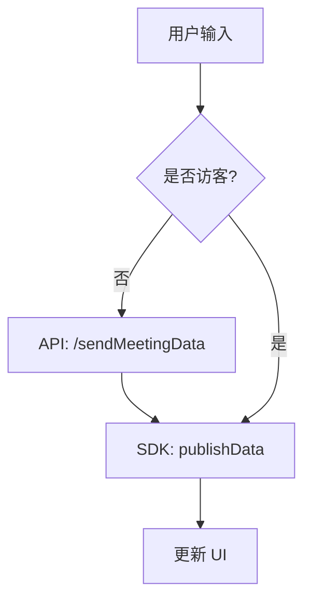

# 技术设计：数据发送与 RPC 解耦

## 架构
- **ChatPane**: 负责核心聊天逻辑，区分用户类型。
- **RealtimeTools**: 负责调试与演示，包含 API 调用和 SDK 交互。

## 数据流

### 1. 聊天消息流 (`ChatPane`)

### 2. 调试工具流 (`RealtimeTools`)
- **Send Data**: UI -> `api.sendMeetingData` -> Toast
- **Perform RPC**: UI -> `api.performRpc` -> Toast
- **Client RPC**: 
  - Register: UI -> `room.localParticipant.registerRpcMethod`
  - Handle: SDK Event -> Modal -> `data.response()`

## 契约
- **Chat**: Topic `lk.chat`, 消息格式 `{ messageId, content, messageType }`.
- **Debug Data**: Topic 自定义或默认。
- **RPC**: Method `echo`.

## 实施要点
1.  **ChatPane**: 修改 `send` 函数，增加 `if (!guest)` 判断，先调用 API。
2.  **RealtimeTools**: 
    - 保留 `send` (改名为 `sendDataViaApi`) 和 `rpc` (改名为 `performRpcViaApi`)。
    - 新增 `clientRpc` 逻辑（注册、弹窗）。
