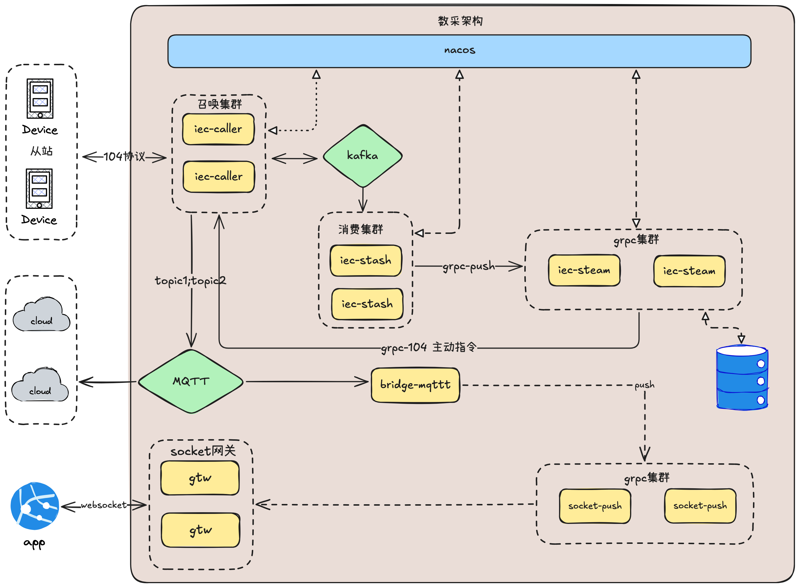
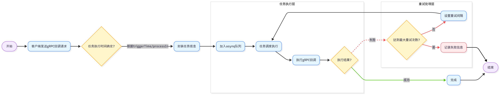

# zero-service
## go-zero 脚手架
是一个基于 [go-zero](https://github.com/zeromicro/go-zero) 的微服务脚手架，旨在帮助开发者快速搭建高性能的微服务应用 `zero-service`

## 系统架构

### 1. 数采平台架构

  

### 2. Trigger 服务架构

  

## 核心功能模块

### 1. BFF 网关 (`gtw`)
`gtw` 是项目的 BFF 层网关，负责聚合后端微服务并为前端提供统一接口。它是整个系统的核心入口，可以作为 grpc 服务的入口，同时支持 grpc-gateway 的功能。

### 2. `app` 模块
`app` 模块是整个项目的核心部分，包含多个子服务，主要用于实现业务逻辑和外部系统交互。

#### 2.1 服务 `iec104` IEC 104 数采平台
`iec104` 模块提供了完整的 IEC 104 数采平台解决方案，包含三个核心服务组件：

1. **ieccaller 服务**：对接 104 从站，实现 IEC 104 主站功能，负责与多个子站通信，支持 Kafka/MQTT/GRPC 多协议数据推送，支持动态数据库（SQLite、MySQL、PostgreSQL）实现动态配置点位推送策略，通过 `enable_push` 字段控制数据是否推送，可选择开启或关闭数据库功能

2. **iecstash 服务**：负责消费 Kafka 消息，对 ASDU 数据进行压缩合并处理，并使用 chunk 任务处理机制将数据发送到下游 RPC 服务

3. **streamevent 服务**：接收 iecstash 压缩合并后的 ASDU 数据，使用 gRPC 实现，目前只实现采集原生指令数据功能

- 详细介绍请查看 [IEC 104 数采平台](./docs/iec104.md)
- 消息对接协议请查看 [IEC 104 消息对接文档](./docs/iec104-protocol.md)

#### 2.2 服务 `file`
`file` 模块提供文件服务功能，支持通过 gRPC 实现分片流上传，并集成了对象存储（OSS）上传能力。

#### 2.3 服务 `trigger` 异步任务调度服务
- ⏱️ 基于 `https://github.com/hibiken/asynq` ，实现定时/延时任务调度/计划任务拆分调度
- 📦 使用 Redis 存储任务队列，支持多节点部署与高可用
- 🔁 支持 HTTP/gRPC 回调，适配多种业务场景
- 🔧 支持任务归档、删除与自动重试等管理能力
- 📄 协议定义：[`trigger.proto`](app/trigger/trigger.proto)

#### 2.4 服务 `lalhook` 流媒体钩子服务
- 🔧 集成 LAL 回调接口
- 📦 集成 ts 录制记录回调，提供分片播放能力

#### 2.5 服务 `bridgegtw` HTTP 代理转发网关
- 🌉 提供高性能的 HTTP 请求代理转发功能
- 🔀 支持多后端服务负载均衡与请求路由
- 🔒 内置访问控制与安全防护机制
- 📊 提供请求监控与统计功能

#### 2.6 服务 `bridgedump` 南瑞反向隔离装置文件生成服务
- 📄 生成符合南瑞反向隔离装置要求的文本文件，格式为 `<Bridge:=Free...>JSON数据</Bridge:=Free>`
- 📑 支持多种数据类型的文件生成：
  - 电缆工作列表数据（输出到 `/opt/bridgedump/cable_work_list/*_json.txt`）
  - 电缆故障数据（输出到 `/opt/bridgedump/cable_fault/*_json.txt`）
  - 电缆故障波形数据（输出到 `/opt/bridgedump/cable_fault_wave/*_json.txt`）
- 📤 与 filebeat 无缝集成，自动采集生成的 txt 文件
- 📥 通过 filebeat 将数据分类发送至不同的 Kafka topic：
  - 电缆工作列表数据：`cable_work_list`
  - 电缆故障数据：`cable_fault`
  - 电缆故障波形数据：`cable_fault_wave`

#### 2.7 服务 `bridgemodbus` modbus协议处理服务
- 📦 提供 Modbus TCP/RTU 协议处理能力
- 🔗 集成 GRPC 服务
- 📄 协议定义：[`bridgemodbus.proto`](app/bridgemodbus/bridgemodbus.proto)

#### 2.8 服务 `bridgemqtt` mqtt协议处理服务
- 📦 提供 mqtt 协议处理能力
- 🔗 集成 GRPC 服务
- 📄 协议定义：[`bridgemqtt.proto`](app/bridgemqtt/bridgemqtt.proto)
- 📄 转发协议定义：[`streamevent.proto`](facade/streamevent/streamevent.proto)

#### 2.9 服务 `podengine` 容器管理服务
- 📦 提供 Docker 容器管理能力，支持容器的创建、启动、停止、重启、删除和列表查询
- 🔗 集成 GRPC 服务，提供 Kubernetes-like 的 Pod 管理接口
- 📊 支持容器统计信息获取，包括 CPU、内存、网络和存储使用情况
- 🖼️ 支持镜像管理，包括镜像列表查询
- 📄 协议定义：[`podengine.proto`](app/podengine/podengine.proto)

### 3. 对外接口层 (`facade`)
`facade` 模块提供了系统的对外接口，基于 gRPC 协议，支持多语言客户端。

#### 3.1 streamevent 协议
基于 [streamevent.proto](facade/streamevent/streamevent.proto) 协议，用于处理流式数据事件，支持与语言无关的数据推送。通过实现该协议，任何语言的客户端都可以与平台进行数据交互，将数据推送到系统中。系统会根据动态数据库（SQLite、MySQL、PostgreSQL）的轻量化配置，将数据采集到 TDengine 数据库中。

### 4. SocketIO 实时通信模块 (`socketapp`)
`socketapp` 模块提供了简单的 SocketIO 实时通信解决方案，包含两个核心服务：

#### 4.1 socketgtw 服务 - SocketIO 网关
`socketgtw` 是 SocketIO 网关服务，负责处理客户端连接、房间管理、消息路由和 Token 认证。

**前端对接文档**：[SocketIO 消息网关客户端对接文档](./common/socketiox/client-documentation.md)

#### 4.2 socketpush 服务 - SocketIO 推送服务
`socketpush` 是 SocketIO 推送服务，负责 Token 生成和提供 SocketIO 推送相关的 gRPC 接口，支持房间广播、全局广播、消息推送等功能。

#### 4.3 核心特性
1. **集群部署支持**：支持网关和推送服务的集群部署，实现高可用和水平扩展
2. **无中间件依赖**：不依赖 Redis、MQTT 等外部中间件，部署简单高效
3. **Token 认证机制**：支持 Token 生成和验证，实现安全的客户端认证
4. **实时双向通信**：基于 SocketIO 协议，支持浏览器和移动端实时双向通信
5. **房间管理**：支持动态房间创建、加入和离开，实现灵活的消息广播机制
6. **消息可靠性**：支持 ack 回调机制，确保消息可靠传递
7. **轻量级设计**：采用 go-zero 框架，性能优异，资源占用低

## 注意事项
1. **依赖管理**：确保 `go.mod` 文件中的依赖项已正确安装
2. **日志路径**：检查配置文件中的日志路径是否有效
3. **Kafka 配置**：确保 Kafka 集群地址和主题名称正确无误
4. **配置管理**：系统使用动态数据库（SQLite、MySQL、PostgreSQL）进行轻量化配置管理
5. **Java 接入**：如需与 Java
   应用集成，可参考 [grpc-spring-boot-starter](https://yidongnan.github.io/grpc-spring-boot-starter/zh-CN/)。

## 相关链接
- [go-zero 微服务框架](https://github.com/zeromicro/go-zero)
- [go-queue](https://github.com/zeromicro/go-queue)
- [asynq 异步任务调度](https://github.com/hibiken/asynq/)
- [lancet 高效Go工具库](https://github.com/duke-git/lancet)
- [squirrel SQL生成器](https://github.com/Masterminds/squirrel)
- [IEC104协议实现包](https://github.com/wendy512/iec104)
