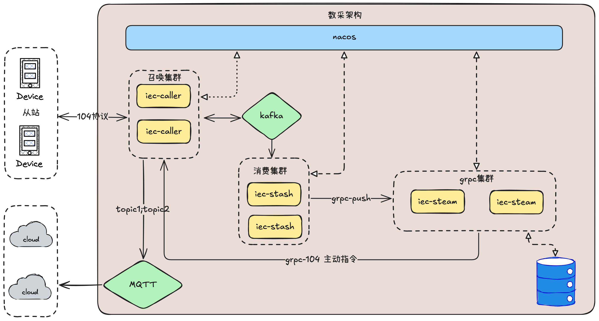

# zero-service

## 项目简介

`zero-service` 是一个基于 [go-zero](https://github.com/zeromicro/go-zero) 的微服务脚手架，旨在帮助开发者快速搭建高性能、可扩展的微服务应用。

- 🚀 基于 go-zero 框架，提供高性能的微服务架构
- 📦 集成多种协议处理能力，包括 gRPC、HTTP、IEC 104、Modbus、MQTT
- ⏱️ 支持异步任务调度和计划任务管理
- 📊 提供完整的数采平台解决方案
- 🔧 内置多种工具和组件，简化开发流程
- 📱 支持实时通信和消息推送

## 系统架构

### 1. 整体架构

项目采用分层架构设计，主要包括以下几层：

- **接入层**：包括 BFF 网关和 SocketIO 实时通信，负责处理外部请求和实时消息
- **核心服务层**：包含多个微服务，如 IEC 104 数采平台、异步任务调度服务、文件服务等
- **对外接口层**：提供统一的 gRPC 接口，支持多语言客户端
- **基础设施层**：包括 Kafka 消息队列、Redis 缓存、数据库和 Docker 容器等

### 2. 数采平台架构

<div align="center">
  
</div>

### 3. Trigger 服务架构

Trigger 服务提供两种核心业务模式：
- **异步任务调度**：基于 asynq 实现的分布式任务队列，支持 HTTP/gRPC 回调
- **计划任务管理**：基于数据库扫描的定时巡检任务调度，支持计划、批次、执行项的全生命周期管理

详细介绍请查看：[Trigger 服务架构](./docs/trigger.md)

## 核心功能模块

### 1. BFF 网关 (`gtw`)

- 🔗 项目的 BFF 层网关，负责聚合后端微服务并为前端提供统一接口
- 📡 作为 gRPC 服务的入口，同时支持 grpc-gateway 功能
- 🌐 提供 HTTP 和 gRPC 两种访问方式
- 🛡️ 内置认证和授权机制，保障 API 安全
- 📊 提供请求监控和统计功能

### 2. 核心服务 (`app`)

#### 2.1 IEC 104 数采平台 (`iec104`)

- 📊 完整的 IEC 104 数采平台解决方案
- **ieccaller 服务**：对接 104 从站，实现 IEC 104 主站功能，支持多协议数据推送
- **iecstash 服务**：消费 Kafka 消息，对 ASDU 数据进行压缩合并处理
- **streamevent 服务**：接收压缩合并后的 ASDU 数据，使用 gRPC 实现
- 📄 详细文档：[IEC 104 数采平台](./docs/iec104.md)
- 📋 协议文档：[IEC 104 消息对接文档](./docs/iec104-protocol.md)

#### 2.2 异步任务调度服务 (`trigger`)

- ⏱️ 基于 asynq 实现定时/延时任务调度
- 📅 基于数据库扫描的计划任务管理（自定义实现）
- 🔁 支持 HTTP/gRPC 回调，确保任务的最终一致性
- 📦 使用 Redis 存储任务队列，支持多节点部署与高可用
- 🔧 支持任务归档、删除与自动重试等管理能力
- 📊 提供执行项仪表板统计信息
- 📄 协议定义：[`trigger.proto`](app/trigger/trigger.proto)

#### 2.3 文件服务 (`file`)

- 📁 提供文件服务功能
- 📤 支持通过 gRPC 实现分片流上传
- ☁️ 集成对象存储（OSS）上传能力
- 📱 支持视频流捕获和处理
- 🔒 提供文件访问控制和权限管理

#### 2.4 流媒体钩子服务 (`lalhook`)

- 🔧 集成 LAL 回调接口
- 📦 集成 ts 录制记录回调，提供分片播放能力
- 📱 支持直播推流和拉流事件处理
- 📊 提供流媒体事件统计和监控

#### 2.5 HTTP 代理转发网关 (`bridgegtw`)

- 🌉 提供高性能的 HTTP 请求代理转发功能
- 🔀 支持多后端服务负载均衡与请求路由
- 🔒 内置访问控制与安全防护机制
- 📊 提供请求监控与统计功能
- 🚀 支持高并发处理和低延迟转发

#### 2.6 南瑞反向隔离装置文件生成服务 (`bridgedump`)

- 📄 生成符合南瑞反向隔离装置要求的文本文件
- 📑 支持多种数据类型的文件生成
- 📤 与 filebeat 无缝集成，自动采集生成的 txt 文件
- 📥 通过 filebeat 将数据分类发送至不同的 Kafka topic
- 🔧 提供文件生成状态监控和错误处理

#### 2.7 Modbus 协议处理服务 (`bridgemodbus`)

- 📦 提供 Modbus TCP/RTU 协议处理能力
- 🔗 集成 GRPC 服务
- 📄 协议定义：[`bridgemodbus.proto`](app/bridgemodbus/bridgemodbus.proto)
- 🔧 支持寄存器读写、线圈操作等 Modbus 标准功能
- 📊 提供 Modbus 设备通信状态监控

#### 2.8 MQTT 协议处理服务 (`bridgemqtt`)

- 📦 提供 MQTT 协议处理能力
- 🔗 集成 GRPC 服务
- 📄 协议定义：[`bridgemqtt.proto`](app/bridgemqtt/bridgemqtt.proto)
- 📄 转发协议定义：[`streamevent.proto`](facade/streamevent/streamevent.proto)
- 🔧 支持 MQTT 消息发布和订阅
- 📊 提供 MQTT 消息传输状态监控

#### 2.9 容器管理服务 (`podengine`)

- 📦 提供 Docker 容器管理能力
- 🔗 集成 GRPC 服务，提供 Kubernetes-like 的 Pod 管理接口
- 📊 支持容器统计信息获取，包括 CPU、内存、网络和存储使用情况
- 🖼️ 支持镜像管理，包括镜像列表查询
- 📄 协议定义：[`podengine.proto`](app/podengine/podengine.proto)
- 🔧 支持容器的创建、启动、停止、重启、删除等操作

### 3. 对外接口层 (`facade`)

- 🌐 提供系统的对外接口，基于 gRPC 协议
- 🔄 支持多语言客户端
- 📡 **streamevent 协议**：用于处理流式数据事件，支持与语言无关的数据推送
- 📦 提供统一的接口规范和错误处理机制
- 🔧 支持接口版本管理和向后兼容

### 4. SocketIO 实时通信模块 (`socketapp`)

- 📱 提供简单的 SocketIO 实时通信解决方案
- **socketgtw 服务**：SocketIO 网关服务，负责处理客户端连接、房间管理、消息路由和 Token 认证
- **socketpush 服务**：SocketIO 推送服务，负责 Token 生成和提供 SocketIO 推送相关的 gRPC 接口
- 📄 前端对接文档：[SocketIO 消息网关客户端对接文档](docs/socketiox-documentation.md)
- 🔧 支持集群部署和负载均衡
- 📊 提供连接状态监控和消息统计

## 技术栈

| 类别 | 技术/框架 | 用途 |
|------|-----------|------|
| **基础框架** | go-zero | 微服务框架，提供高性能的 RPC 和 HTTP 服务 |
| **任务调度** | asynq | 异步任务调度，支持定时/延时任务 |
| **消息队列** | Kafka | 高吞吐量的分布式消息队列 |
| **缓存** | Redis | 用于任务队列存储和缓存 |
| **数据库** | SQLite、MySQL、PostgreSQL | 关系型数据库，用于存储业务数据 |
| **时序数据库** | TDengine | 用于存储时序数据，如采集的传感器数据 |
| **容器** | Docker | 容器化部署和管理 |
| **实时通信** | SocketIO | 实时双向通信，支持浏览器和移动端 |
| **RPC 框架** | gRPC | 高性能的远程过程调用框架 |
| **协议** | HTTP、IEC 104、Modbus、MQTT | 支持多种通信协议 |
| **云存储** | OSS | 对象存储服务，用于存储文件 |
| **地理位置** | H3、GeoHash | 地理位置索引和计算 |
| **监控** | OpenTelemetry | 分布式追踪和监控 |

## 快速开始

### 1. 环境要求

- Go 1.18+ 
- Docker (可选，用于容器管理)
- Kafka (可选，用于消息队列)
- Redis (可选，用于任务队列和缓存)
- MySQL/PostgreSQL (可选，用于持久化存储)

### 2. 安装依赖

```bash
go mod tidy
```

### 3. 配置文件

各服务的配置文件位于 `app/{service}/etc/` 目录下，根据实际环境修改配置。

### 4. 启动服务

#### 启动单个服务

```bash
# 启动 trigger 服务
cd app/trigger
go run trigger.go -f etc/trigger.yaml
```

#### 启动多个服务

可以使用 Docker Compose 启动多个服务：

```bash
cd deploy
docker-compose up -d
```

## 开发指南

### 1. 代码结构

```
zero-service/
├── app/             # 核心服务
│   ├── iec104/      # IEC 104 数采平台
│   ├── trigger/     # 异步任务调度服务
│   ├── file/        # 文件服务
│   └── ...          # 其他服务
├── common/          # 公共组件和工具
│   ├── asynqx/      # asynq 扩展
│   ├── socketiox/   # SocketIO 扩展
│   ├── tool/        # 工具函数
│   └── ...          # 其他组件
├── docs/            # 文档
├── facade/          # 对外接口
└── deploy/          # 部署配置
```

### 2. 服务开发流程

1. **定义服务协议**：在 `.proto` 文件中定义服务接口
2. **生成代码**：使用 `gen.sh` 脚本生成服务代码
3. **实现业务逻辑**：在 `internal/logic/` 目录下实现业务逻辑
4. **配置服务**：在 `etc/` 目录下配置服务参数
5. **启动服务**：运行服务主文件

### 3. 代码规范

- 遵循 Go 语言规范和最佳实践
- 使用 go-zero 框架的代码风格
- 保持代码简洁、可读性强
- 适当添加注释，特别是公共接口和复杂逻辑

## 部署指南

### 1. 单机部署

1. **安装依赖**：安装所需的外部服务（Kafka、Redis、数据库等）
2. **配置服务**：修改各服务的配置文件
3. **启动服务**：按顺序启动各个服务

### 2. Docker 部署

1. **构建镜像**：使用各服务目录下的 Dockerfile 构建镜像
2. **配置 Docker Compose**：修改 `deploy/docker-compose.yml` 文件
3. **启动服务**：运行 `docker-compose up -d` 启动所有服务

### 3. 集群部署

1. **负载均衡**：使用 Nginx 或其他负载均衡器分发请求
2. **服务发现**：使用 Nacos 等服务发现机制
3. **数据一致性**：确保 Redis、Kafka 等服务的高可用
4. **监控告警**：部署监控系统，及时发现和处理问题

## API 文档

### 1. gRPC API

各服务的 gRPC API 定义在对应的 `.proto` 文件中，可使用 gRPC 客户端工具生成对应语言的客户端代码。

### 2. HTTP API

对于启用了 grpc-gateway 的服务，可以通过 HTTP 请求访问 gRPC API。

### 3. 接口文档

- [IEC 104 数采平台](./docs/iec104.md)
- [IEC 104 消息对接文档](./docs/iec104-protocol.md)
- [SocketIO 消息网关客户端对接文档](docs/socketiox-documentation.md)

## 监控与运维

### 1. 日志管理

- 各服务的日志默认输出到 `logs/` 目录
- 可以配置日志级别和输出格式
- 推荐使用 ELK 等日志收集和分析系统

### 2. 指标监控

- 集成 OpenTelemetry 进行分布式追踪
- 可以使用 Prometheus 采集和监控指标
- 可以使用 Grafana 展示监控面板

### 3. 常见问题排查

- **服务启动失败**：检查配置文件和依赖服务
- **任务执行失败**：查看日志和任务状态
- **消息传递延迟**：检查 Kafka 集群状态
- **性能问题**：分析系统资源使用情况和瓶颈

## 贡献指南

1. **Fork 仓库**：在 GitHub 上 Fork 项目仓库
2. **创建分支**：创建特性分支或修复分支
3. **提交代码**：提交代码并编写清晰的提交信息
4. **运行测试**：确保代码通过测试
5. **创建 Pull Request**：提交 Pull Request 并描述更改内容

## 许可证

本项目采用 MIT 许可证，详见 [LICENSE](LICENSE) 文件。

Copyright (c) 2026 zero-service

## 联系方式

- 项目地址：[https://github.com/maomao94/zero-service](https://github.com/yourusername/zero-service)
- 问题反馈：[GitHub Issues](https://github.com/maomao94/zero-service/issues)

## 鸣谢

- [go-zero](https://github.com/zeromicro/go-zero) - 高性能的微服务框架
- [asynq](https://github.com/hibiken/asynq/) - 可靠的异步任务队列
- [IEC104协议实现包](https://github.com/wendy512/iec104) - IEC 104 协议实现
- 所有贡献者和支持者

---

**零服务，无限可能！** 🚀