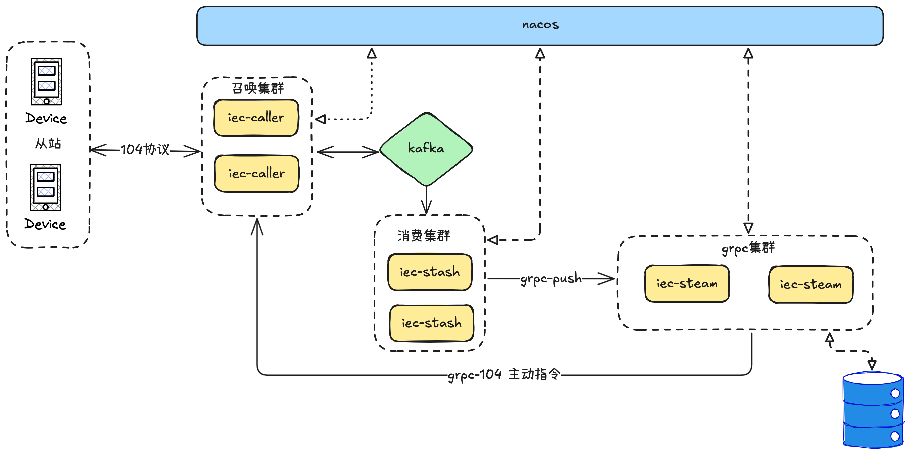

# zero-service
##### go-zero 脚手架
是一个基于 [go-zero](https://github.com/zeromicro/go-zero) 的微服务脚手架，旨在帮助开发者快速搭建高性能的微服务应用 `zero-service`
``` 
zero-service/
├── app              # 应用核心逻辑
├── common           # 公共工具和常量
├── gtw              # 网关模块
├── iec104           # IEC 104 协议相关实现
├── model            # 数据模型定义
├── util             # 工具库（如 Docker 工具等）
├── zeroalarm        # 告警服务
├── zerorpc          # RPC 服务
├── .gitignore       # Git 忽略文件配置
├── Dockerfile       # Docker 配置文件
├── go.mod           # Go 模块依赖管理
└── README.md        # 项目说明文档
```
## 业务系统框架图

## 核心功能模块

### 1. BFF 网关 (`gtw`)
`gtw` 是项目的 BFF 层网关，负责聚合后端微服务并为前端提供统一接口。它是整个系统的核心入口，可以作为 grpc 服务的入口，同时支持 grpc-gateway 的功能。

### 2. `app` 模块
`app` 模块是整个项目的核心部分，包含多个子服务，主要用于实现业务逻辑和外部系统交互。以下是 `app` 模块的主要功能和服务说明：

#### 2.1 服务 `iec-stash`
`iec-stash` 模块类似于 `go-stash` 或 `log-stash`，主要用于消费 Kafka 消息队列中的数据，并使用 chunk 任务处理机制将数据发送到下游 RPC 服务。该服务的功能包括：

- **Kafka 数据消费**：从指定的 Kafka 主题消费数据。
- **Chunk 任务处理**：使用 chunk 任务处理机制对消费的数据进行批量处理。
- **处理能力** 使用 go-queue 实现海量数据消费下发，理论最大处理能力为 15W/s
- **下游 RPC 调用**：将处理后的数据发送到下游 RPC 服务。pb协议：[iecstream.proto](facade/iecstream/iecstream.proto)

#### 2.2 `iec104` IEC 104 协议处理模块
`iec104` 模块提供了对 IEC 104 协议中 ASDU 消息的全面处理功能。该模块旨在解析、生成和处理 ASDU 消息，支持与电力系统设备的通信。主要功能包括：

- **ASDU 消息解析与生成**：支持多种类型 ASDU 消息的解析和生成。
- **协议模拟**：提供 IEC 104 协议的模拟功能，用于测试和开发。
- **Kafka 集成**：可与 Kafka 消息队列集成，实现高效的数据流处理。 对接文档：[Kafka 消息对接文档](common/iec104/kafka.md)

#### 2.3 服务 `file`
`file` 模块提供文件服务功能，支持通过 gRPC 实现分片流上传，并集成了对象存储（OSS）上传能力。

#### 2.4 服务 `trigger`
`trigger` 模块提供基于 [asynq](https://github.com/hibiken/asynq) 的异步任务处理能力。该服务主要负责定时任务触发，支持 HTTP 和 gRPC 两种回调方式，同时提供任务存档与删除等管理功能。

- **使用流程图**
  <div align="center">
    
  </div>
- 仅依赖 Redis 作为数据存储和消息队列，支持多节点，高可用，部署成本低。
- 支持 HTTP 和 gRPC 回调，灵活适配不同客户端。
- 可注册至 Nacos，实现服务发现和负载均衡。
- 支持多语言环境下的服务交互。
- pb协议：[trigger.proto](app/trigger/trigger.proto)

## 注意事项
1. **依赖管理**：确保 文件中的依赖项已正确安装。 `go.mod`
2. **日志路径**：检查配置文件中的日志路径是否有效。
3. **Kafka 配置**：确保 Kafka 集群地址和主题名称正确无误。
4. 如果需要与 **Java** 应用混合开发，并入微服务体系，请参考  [Java 接入文档](https://yidongnan.github.io/grpc-spring-boot-starter/zh-CN/)

## 相关链接
- [go-zero 微服务框架](https://github.com/zeromicro/go-zero)
- [go-queue](https://github.com/zeromicro/go-queue)
- [asynq 异步任务队列](https://github.com/hibiken/asynq/)
- [lancet 工具包](https://github.com/duke-git/lancet)
- [squirrel SQL 构建器](https://github.com/Masterminds/squirrel)
- [IEC104协议实现包](https://github.com/wendy512/iec104)