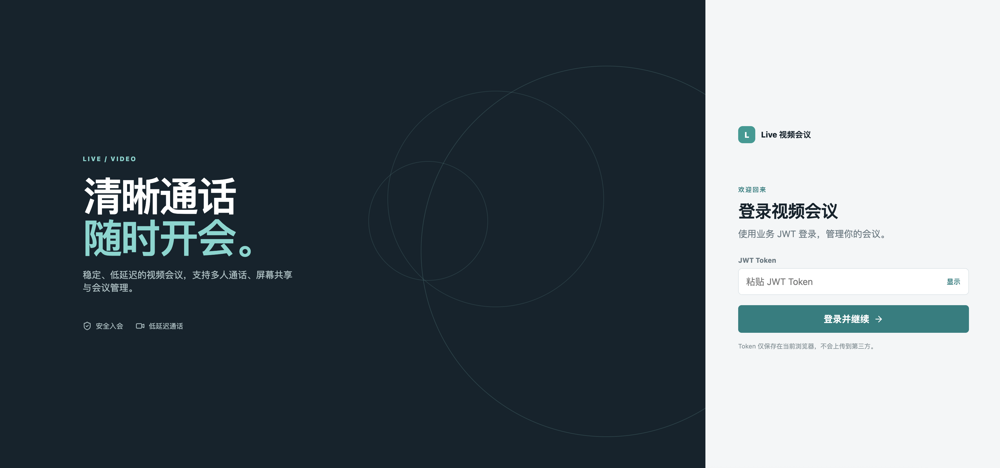
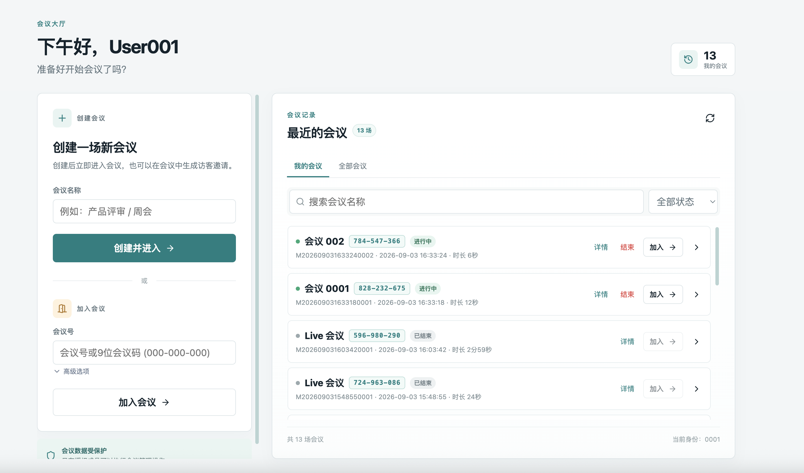
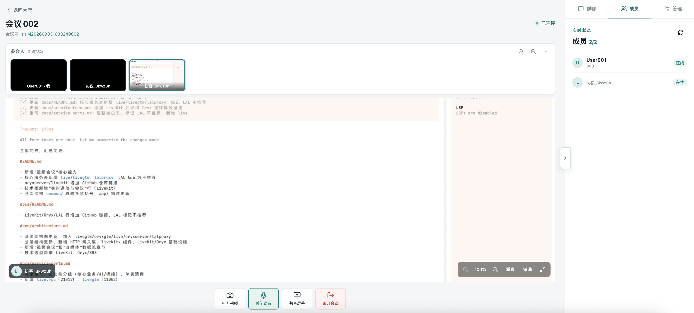
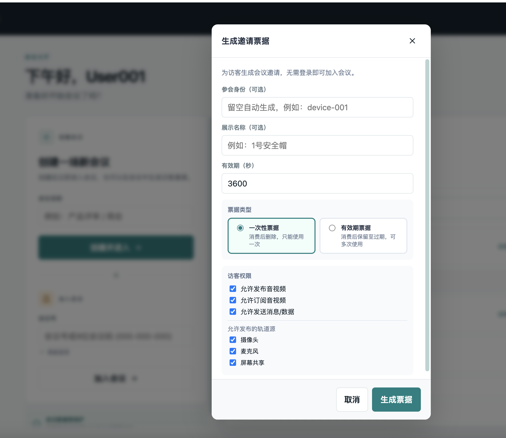
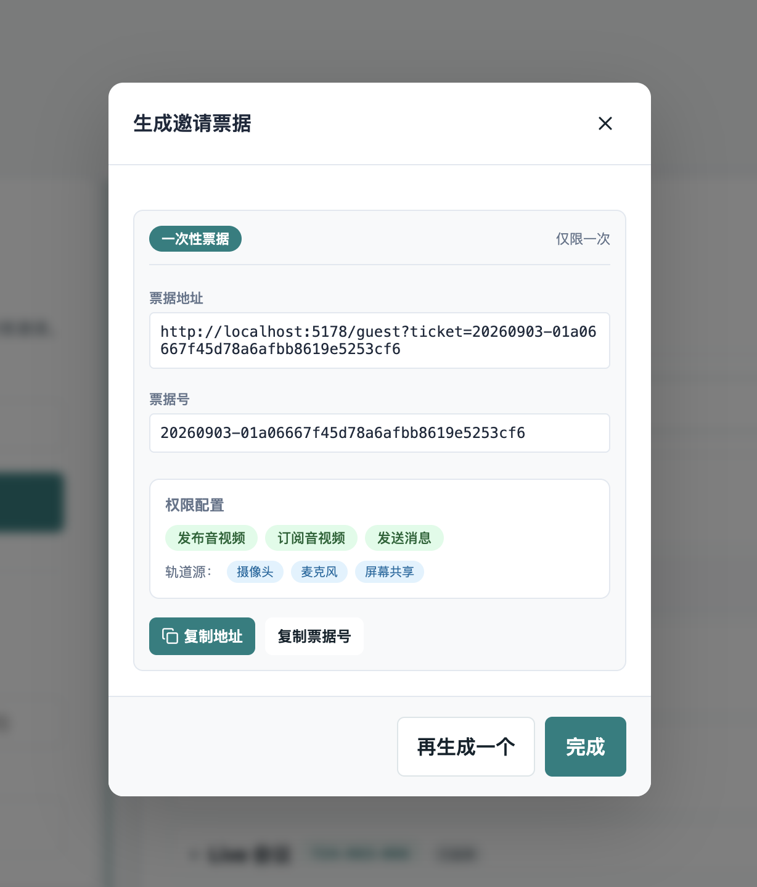

# 会议服务（Live）

基于 [LiveKit](https://github.com/livekit/livekit) 的实时音视频会议服务，提供会议管理、入会 token 签发、票据邀请、Webhook 状态同步和聊天消息能力。

## 服务组成

| 服务 | 职责 | 端口 | 文档 |
| --- | --- | --- | --- |
| `live` | gRPC 业务服务：会议 CRUD、token 签发、Webhook、票据 | 21017 | [live.proto](../../app/live/live.proto) |
| `livegtw` | HTTP 网关：业务 API + LiveKit Webhook 接收 | 11002 | [livegtw.api](../../app/livegtw/livegtw.api) |

## 核心特性

### 1. 会议生命周期

创建会议 → 加入会议 → 会议进行中 → 结束会议。支持多人同时在线，通过 LiveKit SFU 媒体服务器实现音视频转发。

- **创建会议**：落库 + 创建 LiveKit 房间，支持设置最大人数、超时时间
- **加入会议**：校验会议状态后发放 join token，浏览器直连 LiveKit Server
- **结束会议**：删除 LiveKit 房间 + 状态流转，Redis lock 防重入
- **踢人/静音**：服务端管理 API 操作参与者

### 2. Token 认证

用户通过 HTTP 网关 `POST /live/v1/joinMeeting` 获取 join token，浏览器使用该 token 直连 LiveKit Server 建立音视频连接。token 包含参与者身份、权限（发布/订阅/数据）等 grant 信息。



**API 端点**：

```http
POST /live/v1/joinMeeting
Content-Type: application/json
Authorization: Bearer <jwt>

{
  "meetingNo": "xxx",
  "canPublish": true,
  "canSubscribe": true,
  "canPublishData": true
}
```

返回 token 和 WebSocket 地址，前端使用 [LiveKit Client SDK](https://github.com/livekit/client-sdk-js) 连接。

### 3. 会议大厅

会议大厅展示当前用户可加入的会议列表，支持按状态筛选、分页查询。



**API 端点**：

```http
GET /live/v1/listMeetings?status=2&page=1&pageSize=20
GET /live/v1/myMeetings?status=2&page=1&pageSize=20
```

### 4. 会议房间

会议房间内展示参与者列表、音视频画面、聊天消息。支持多人同时在线，通过 LiveKit SFU 媒体服务器实现音视频转发。



**会控操作**：

```http
POST /live/v1/kickParticipant          # 踢人
POST /live/v1/muteParticipant          # 静音/取消静音
POST /live/v1/sendMeetingData          # 发送数据（广播/定向）
POST /live/v1/performMeetingRpc        # 服务端 RPC 调用
```

### 5. 票据邀请

支持生成会议邀请票据，用于访客（无需登录）通过链接加入会议。票据可配置权限（发布/订阅/数据）、有效期和类型（一次性/有效期）。





**API 端点**：

```http
POST /live/v1/generateMeetingTicket    # 生成票据（需要鉴权）
GET  /live/v1/joinMeetingByTicket      # 票据加入（无需鉴权）
```

票据类型：
- **一次性票据**（默认）：消费后自动删除，适合单次邀请
- **有效期票据**：消费后保留至过期，可多次使用，适合固定链接

### 6. 聊天消息

支持会议内实时聊天，消息通过 LiveKit DataChannel 传输，同时落库存储支持历史查询。

```http
POST /live/v1/reportMeetingMessage     # 上报消息
GET  /live/v1/listMeetingMessages      # 查询历史
```

### 7. Webhook 同步

`livegtw` 接收 LiveKit Webhook 事件（`/webhook/livekit`），验签后转发给 `live` 服务处理。事件包括：
- `room_started` / `room_finished`：房间开始/结束
- `participant_joined` / `participant_left`：参与者入会/离会
- `track_published` / `track_unpublished`：轨道发布/取消

处理逻辑：基于 `event.Id` 幂等去重，更新会议状态和参与者记录。

## gRPC 接口一览

| 方法 | 说明 |
| --- | --- |
| `CreateMeeting` | 创建会议（落库 + 创建 LiveKit 房间） |
| `JoinMeeting` | 加入会议（发放 join token） |
| `GetMeeting` | 查询会议详情 |
| `ListMeetings` | 分页查询会议列表 |
| `EndMeeting` | 结束会议 |
| `KickParticipant` | 踢出参与者 |
| `MuteParticipant` | 静音/取消静音 |
| `ListParticipants` | 查询参与者列表 |
| `SendMeetingData` | 向会议发送数据 |
| `PerformMeetingRpc` | 服务端对参与者执行 RPC |
| `GenerateMeetingTicket` | 生成邀请票据 |
| `JoinMeetingByTicket` | 票据加入会议 |
| `ReportMeetingMessage` | 上报聊天消息 |
| `ListMeetingMessages` | 查询聊天记录 |
| `WebhookNotify` | 接收 LiveKit Webhook 事件 |

## HTTP 接口一览

所有 HTTP 接口通过 `livegtw` 网关暴露，前缀 `/live/v1`。

### 需要鉴权

| 方法 | 路径 | 说明 |
| --- | --- | --- |
| POST | `/live/v1/createMeeting` | 创建会议 |
| POST | `/live/v1/joinMeeting` | 加入会议 |
| GET | `/live/v1/getMeeting` | 查询会议详情 |
| GET | `/live/v1/listMeetings` | 查询会议列表 |
| GET | `/live/v1/myMeetings` | 查询我的会议 |
| GET | `/live/v1/getCurrentUser` | 获取当前用户 |
| POST | `/live/v1/endMeeting` | 结束会议 |
| POST | `/live/v1/kickParticipant` | 踢人 |
| POST | `/live/v1/muteParticipant` | 静音/取消静音 |
| GET | `/live/v1/listParticipants` | 查询参与者 |
| POST | `/live/v1/sendMeetingData` | 发送数据 |
| POST | `/live/v1/performMeetingRpc` | 服务端 RPC |
| POST | `/live/v1/generateMeetingTicket` | 生成票据 |
| POST | `/live/v1/reportMeetingMessage` | 上报消息 |
| GET | `/live/v1/listMeetingMessages` | 查询历史消息 |

### 无需鉴权

| 方法 | 路径 | 说明 |
| --- | --- | --- |
| GET | `/live/v1/joinMeetingByTicket` | 票据加入 |
| POST | `/webhook/livekit` | LiveKit Webhook |

## 依赖

- **LiveKit Server**：SFU 媒体服务器，负责音视频转发
- **PostgreSQL**：会议单据、参与者记录、聊天消息存储
- **Redis**：分布式锁（防重入）、票据存储
- **common/livekitx**：LiveKit Go Server SDK 封装

## livekitx 封装层

`common/livekitx` 是 LiveKit Server SDK v2.18.1 的机制层封装，提供统一配置、管理 API、Token、Room API 和 Webhook 验签。

### 初始化

```go
client, err := livekitx.New(
    livekitx.WithURL("http://127.0.0.1:7880"),
    livekitx.WithAPIKey("devkey", "secret"),
)
if err != nil { panic(err) }
defer client.Close()
```

### 管理 API

`client.API()` 返回管理 API 聚合入口：

- `Room()`：创建/查询/删除房间、参与者管理、Data 发送、RPC
- `Egress()`：录制管理
- `Ingress()`：外部输入流管理
- `SIP()`：SIP trunk 和电话管理
- `AgentDispatch()`：Agent 派发

### Room API

| 方法 | 说明 |
| --- | --- |
| `JoinRoom(ctx, roomName, identity, opts...)` | 加入房间，返回 SDK 原生 `*lksdk.Room` |
| `CreateRoom(ctx, name)` | 创建房间 |
| `CreateAndJoinRoom(ctx, roomName, identity, opts...)` | 创建并加入 |
| `DeleteRoom(ctx, name)` | 删除房间（结束会议） |
| `RemoveParticipant(ctx, roomName, identity)` | 踢人 |
| `InviteParticipant(ctx, roomName, identity, topic, payload)` | 邀请（Data 消息） |
| `MuteParticipant(ctx, roomName, identity, muted)` | 音频静音 |
| `MuteParticipantVideo(ctx, roomName, identity, muted)` | 视频静音 |
| `SendData(ctx, roomName, topic, payload, destinations...)` | 富媒体发送 |

### Token

```go
token, err := client.JoinToken("room-name", "user-1", 2*time.Hour)
```

或使用底层 `NewJoinToken` 自定义 grant：

```go
token, err := livekitx.NewJoinToken(livekitx.JoinTokenOptions{
    APIKey:         "devkey",
    APISecret:      "secret",
    Room:           "room-name",
    Identity:       "user-1",
    ValidFor:       2 * time.Hour,
    CanPublish:     true,
    CanSubscribe:   true,
    CanPublishData: true,
})
```

### Webhook

```go
event, err := webhook.ReceiveWebhookEvent(req, livekitx.NewWebhookKeyProvider(cfg.WebhookKey))
if err != nil {
    return err // 验签失败
}
// 持久化 event.GetId() 做幂等
```

### 实时回调

`JoinRoom`/`CreateAndJoinRoom` 通过 `WithCallback` 传入 SDK 原生 `RoomCallback`，livekitx 原样透传，不桥接不合成：

```go
room, err := client.JoinRoom(ctx, "room-name", "user-1",
    livekitx.WithCallback(&lksdk.RoomCallback{
        OnParticipantConnected: func(rp *lksdk.RemoteParticipant) { /* ... */ },
        ParticipantCallback: lksdk.ParticipantCallback{
            OnDataPacket: func(data lksdk.DataPacket, params lksdk.DataReceiveParams) { /* ... */ },
        },
    }),
)
```

## 相关文档

- [LiveKit 对接指南](./integration-guide.md)：Server SDK、Token、Webhook、房间管理
- [LiveKit 回调说明](./callbacks-guide.md)：RoomCallback 场景与字段
