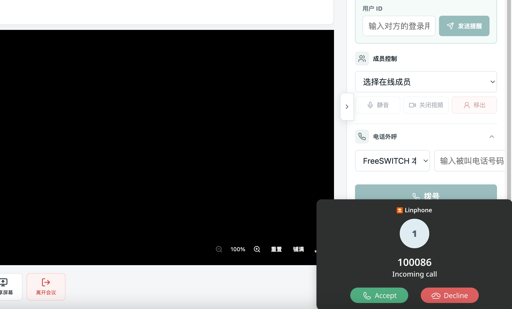

# SIP 电话集成指南

## 概述

LiveKit SIP 集成允许浏览器用户（WebRTC）和电话用户（SIP）在同一个 Room 中通话。
支持两种场景：拨打电话（创建新会议）和电话会议（加入已有会议）。

## 架构总览

```
┌──────────────┐     ┌──────────────┐     ┌──────────────┐     ┌──────────────┐
│   浏览器     │     │  LiveKit     │     │  LiveKit     │     │  SIP 供应商  │
│   (WebRTC)   │◄───►│  Server      │◄───►│  SIP Server  │◄───►│  (FreeSWITCH │
│              │     │              │     │              │     │   /Telnyx)   │
│  音视频通话   │     │  房间管理    │     │  协议转换    │     │  SIP 路由    │
│  Data/RPC    │     │  参与者管理  │     │  SIP↔WebRTC  │     │  电话网络    │
└──────────────┘     └──────────────┘     └──────────────┘     └──────────────┘
     :7880                :7880                :5070                :5060/5080
   (WebRTC)           (HTTP API)           (SIP 信令)           (SIP 信令)
```

## 各组件职责

| 组件 | 职责 | 生产环境 |
|------|------|---------|
| **LiveKit Server** | WebRTC 媒体服务器，管理房间和参与者 | 必须 |
| **LiveKit SIP Server** | SIP↔WebRTC 协议转换桥接 | 必须 |
| **SIP 供应商** | SIP 路由，连接电话网络 | 必须（Telnyx/Twilio/Plivo） |
| **FreeSWITCH** | 本地测试用 SIP 服务器 | 不需要 |

### LiveKit SIP Server 的角色

LiveKit SIP Server 是**协议转换层**，不管连什么供应商都必须存在：
- 浏览器使用 WebRTC 协议
- 电话使用 SIP 协议
- LiveKit SIP Server 负责两者之间的转换

### FreeSWITCH 的角色

FreeSWITCH **仅用于本地测试**，模拟 SIP 供应商：
- 提供分机注册（软电话可以注册到它）
- 接收 SIP INVITE 并路由到分机
- 生产环境不需要，直接连真实供应商

### SIP 供应商的角色

生产环境的真实 SIP 服务提供商（Telnyx、Twilio、Plivo 等）：
- 提供外部电话号码
- 连接公共电话网络（PSTN）
- 处理 SIP 认证和路由

## 供应商管理

供应商配置持久化到数据库（`live_sip_providers`），通过 `provider_code` 关联。

### 数据模型

```go
type LiveSipProvider struct {
    gormx.LegacyStringBaseModel  // 无 VersionMixin（低并发配置表）
    Code         string          // 供应商编码（唯一索引）
    Name         string          // 供应商名称
    Address      string          // SIP 服务器地址
    Numbers      string          // 主叫号码池 JSON 数组
    AuthUsername  string          // SIP 认证用户名
    AuthPassword  string          // SIP 认证密码
    Status       int32           // 1-启用 2-禁用
}
```

### API

```protobuf
rpc CreateSipProvider(CreateSipProviderReq) returns (CreateSipProviderRes);
rpc UpdateSipProvider(UpdateSipProviderReq) returns (UpdateSipProviderRes);
rpc ListSipProviders(ListSipProvidersReq) returns (ListSipProvidersRes);
rpc DeleteSipProvider(DeleteSipProviderReq) returns (DeleteSipProviderRes);
```

## 外呼拨号

### API

```protobuf
rpc DialSip(DialSipReq) returns (DialSipRes);

message DialSipReq {
    string callee_number = 1;      // 被叫号码（必填）
    string meeting_no = 2;         // 会议号（可选，空=S前缀自动创建）
    string participant_name = 3;   // 显示名（可选）
    string provider_code = 4;      // 供应商编码（必填）
}
```

### 两种场景

| 场景 | meeting_no | 行为 |
|------|-----------|------|
| 拨打电话 | 不传 | 自动创建 S 前缀会议，拨号后跳转进入房间 |
| 电话会议 | 传当前会议号 | 将电话参会者加入已有会议 |

会议中可从右侧管理面板选择 SIP 供应商并输入被叫号码发起外呼；电话接听后作为语音参与者加入当前会议。



### DialSipLogic 流程

1. **确定会议**：`meeting_no` 为空 → 自动创建 S 前缀会议（含锁 + meeting_code 生成）；不为空 → 校验会议存在且进行中
2. **查询供应商**：按 `provider_code` 查询 `live_sip_providers`，查不到报错
3. **选择/创建 trunk**：`ListSIPOutboundTrunk` 复用已有 outbound trunk；没有则用供应商配置 `CreateSIPOutboundTrunk`
4. **发起外呼**：`CreateSIPParticipant`（`WaitUntilAnswered=false`）
5. **返回**：meeting info + sip_call_id

### 会议号前缀

| 前缀 | 场景 | 生成方式 |
|------|------|---------|
| M | 正常创建的会议 | `IdUtil.NextId("M", "live")` |
| S | 电话通话（自动创建） | `IdUtil.NextId("S", "live")` |

## Trunk 管理

Trunk 是 LiveKit 侧的 SIP 出站配置，**不持久化到数据库**：
- 一个 SIP 供应商对应一个 trunk，所有外呼复用
- `ListSIPOutboundTrunk` 查询已有 trunk，复用第一个；没有才创建
- 创建 trunk 时使用供应商配置（address、numbers、auth）

### Trunk 与供应商的关系

```
SipProvider（DB）          Trunk（LiveKit 侧）
┌─────────────────┐       ┌─────────────────┐
│ code: freeswitch│       │ address:        │
│ address:        │──────►│ freeswitch:5080 │
│   freeswitch:5080│      │ numbers: ["1000"]│
│ numbers: ["1000"]│      │ auth: ...       │
└─────────────────┘       └─────────────────┘
```

供应商配置存在 DB，trunk 配置存在 LiveKit。DialSipLogic 从 DB 读供应商配置，然后创建/复用 trunk。

## SIP 协议交互

LiveKit SIP Server 和供应商之间使用标准 SIP 协议：

```
LiveKit SIP Server                    供应商(Telnyx/FreeSWITCH)
      |                                      |
      |--- SIP INVITE (被叫号码) ------------>|  发起呼叫
      |<-- 100 Trying ------------------------|  处理中
      |<-- 180 Ringing -----------------------|  振铃
      |<-- 200 OK (SDP) ----------------------|  接听
      |--- ACK ------------------------------>|  确认
      |                                      |
      |<========= RTP 音频流 ================>|  双向通话
      |                                      |
      |--- BYE ------------------------------>|  挂断
      |<-- 200 OK ----------------------------|  确认
```

Trunk 配置告诉 LiveKit SIP Server：
- `address`：INVITE 发到哪里
- `numbers`：用哪个号码作为主叫显示
- `auth_username/password`：认证信息

## 部署配置

### Docker Compose（本地测试）

```yaml
services:
  livekit-server:
    image: livekit/livekit-server:latest
    ports:
      - "7880:7880"
      - "60000-60100:60000-60100/udp"

  freeswitch:  # 仅本地测试用，生产环境不需要
    image: safarov/freeswitch:latest
    ports:
      - "5060:5060/udp"
      - "5080:5080/udp"
      - "16384-16484:16384-16484/udp"
    volumes:
      - ../freeswitch-vars.xml:/etc/freeswitch/vars.xml:ro
      - ../freeswitch-switch.conf.xml:/etc/freeswitch/autoload_configs/switch.conf.xml:ro

  livekit-sip:
    image: livekit/sip:latest
    ports:
      - "5070:5060/udp"
      - "11000-11100:11000-11100/udp"
```

### 关键配置项

| 配置 | 说明 |
|------|------|
| FreeSWITCH `domain` | 必须与软电话注册 IP 一致（如 `10.10.11.25`） |
| FreeSWITCH `external_rtp_ip` | 宿主机局域网 IP，不能用 `host.docker.internal` |
| FreeSWITCH RTP 端口范围 | ≤100（如 16384-16484），Docker Desktop 上限 16k |
| LiveKit SIP Server `ws_url` | `ws://livekit-server:7880`（Docker 内部网络） |
| Outbound Trunk `address` | FreeSWITCH 用 `freeswitch:5080`（external profile） |

### 生产环境部署

去掉 FreeSWITCH，LiveKit SIP Server 直连供应商：

```yaml
services:
  livekit-server:
    image: livekit/livekit-server:latest
    ports:
      - "7880:7880"
      - "60000-60100:60000-60100/udp"

  livekit-sip:
    image: livekit/sip:latest
    ports:
      - "5070:5060/udp"
      - "11000-11100:11000-11100/udp"
```

供应商配置通过 `CreateSipProvider` API 写入 DB，trunk 自动创建。

## 常见问题

### RTP 不通（packets: 0）

**原因**：`external_rtp_ip` 设为 `host.docker.internal`（Docker Desktop 解析为内部网关 192.168.65.254）

**解决**：改为宿主机局域网 IP（如 `10.10.11.25`）

### Docker Desktop 卡死

**原因**：FreeSWITCH RTP 端口范围 16384-32768（16k 端口）达到 Docker Desktop 上限

**解决**：缩小到 ≤100（如 16384-16484）

### 浏览器听不到声音

**原因**：Chrome 自动播放策略要求用户交互后才能播放音频

**解决**：用户点击页面后音频自动播放，这是预期行为
