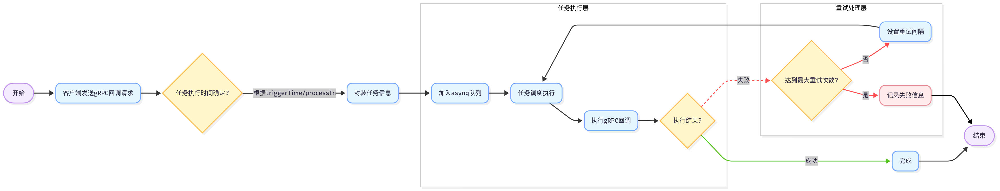

# Trigger 服务架构

## 服务简介

Trigger 服务是一个基于 go-zero 框架的异步任务调度服务，提供两种核心业务模式：
- **异步任务调度**：基于 asynq 实现的分布式任务队列，支持 HTTP/gRPC 回调
- **计划任务管理**：基于数据库扫描的定时巡检任务调度，支持计划、批次、执行项的全生命周期管理

## 核心功能

- ⏱️ 基于 asynq 实现定时/延时任务调度
- 📅 基于数据库扫描的计划任务管理（自定义实现）
- 🔁 支持 HTTP/gRPC 回调，确保任务的最终一致性
- 📦 使用 Redis 存储任务队列，支持多节点部署与高可用
- 🔧 支持任务归档、删除与自动重试等管理能力
- 📊 提供执行项仪表板统计信息

## 架构设计

### 1. 异步任务回调流程（基于 asynq）

  

**流程说明**：
1. 客户端通过 gRPC 接口发送任务请求
2. 服务将任务存储到 Redis 队列中
3. asynq 工作器从队列中取出任务执行
4. 任务执行完成后，通过 HTTP/gRPC 回调通知客户端
5. 任务状态更新到 Redis 中，支持查询和管理

### 2. 计划任务管理流程（基于数据库扫描）

**执行流程**：
1. **创建计划任务**：定义执行规则、时间范围和执行项
2. **生成批次**：系统根据计划规则计算执行日期，生成对应的批次
3. **扫描执行项**：CronService 定时扫描待执行的计划项
4. **锁定执行项**：防止重复执行，确保任务的唯一性
5. **更新扫表标记**：更新计划和批次的扫表状态
6. **调用业务系统**：通过 gRPC 接口执行具体任务
7. **处理执行结果**：根据业务系统返回的结果更新执行项状态
8. **记录执行日志**：跟踪任务执行情况，便于后续查询和分析
9. **更新批次和计划状态**：检查是否完成，更新整体状态
10. **发送通知事件**：批次和计划完成时发送通知

**核心组件**：
- **CronService**：定时扫描待执行的计划执行项，处理执行和回调
- **Plan**：计划任务定义，包含执行规则和基本信息
- **Batch**：计划的执行批次，对应具体的执行日期
- **ExecItem**：具体的任务执行单元，包含业务负载和执行状态
- **PlanExecLog**：执行日志，记录任务执行的详细信息

**状态流转**：
- `EXEC_ITEM_STATUS_WAITING` → `EXEC_ITEM_STATUS_RUNNING` → `EXEC_ITEM_STATUS_COMPLETED`/`EXEC_ITEM_STATUS_FAILED`/`EXEC_ITEM_STATUS_DELAYED`/`EXEC_ITEM_STATUS_ONGOING`/`EXEC_ITEM_STATUS_TERMINATED`

## 核心 API

### 异步任务相关

- `SendTrigger`：发送 HTTP POST JSON 回调
- `SendProtoTrigger`：发送 gRPC 回调
- `Queues`：获取队列列表
- `GetQueueInfo`：获取队列信息
- `ArchiveTask`：归档任务
- `DeleteTask`：删除任务
- `GetTaskInfo`：获取任务信息
- `DeleteAllCompletedTasks`：删除所有已完成任务
- `DeleteAllArchivedTasks`：删除所有已归档任务
- `HistoricalStats`：获取任务历史统计
- `ListActiveTasks`：获取活跃任务列表
- `ListPendingTasks`：获取待处理任务列表
- `ListAggregatingTasks`：获取聚合任务列表
- `ListScheduledTasks`：获取预定任务列表
- `ListRetryTasks`：获取重试任务列表
- `ListArchivedTasks`：获取已归档任务列表
- `ListCompletedTasks`：获取已完成任务列表
- `RunTask`：运行任务

### 计划任务相关

- `CalcPlanTaskDate`：计算计划任务日期
- `CreatePlanTask`：创建计划任务
- `PausePlan`：暂停计划
- `TerminatePlan`：终止计划
- `ResumePlan`：恢复计划
- `PausePlanBatch`：暂停计划批次
- `TerminatePlanBatch`：终止计划批次
- `ResumePlanBatch`：恢复计划批次
- `PausePlanExecItem`：暂停执行项
- `TerminatePlanExecItem`：终止执行项
- `RunPlanExecItem`：立即执行计划项
- `ResumePlanExecItem`：恢复执行项
- `GetPlan`：获取计划详情
- `ListPlans`：分页获取计划列表
- `GetPlanBatch`：获取计划批次详情
- `ListPlanBatches`：分页获取计划批次列表
- `GetPlanExecItem`：获取执行项详情
- `ListPlanExecItems`：分页获取执行项列表
- `GetPlanExecLog`：获取计划触发日志详情
- `ListPlanExecLogs`：分页获取计划触发日志列表
- `GetExecItemDashboard`：获取执行项仪表板统计信息
- `CallbackPlanExecItem`：回调计划执行项 ongoing 回执

## 技术实现

### 1. 异步任务调度

- **基于 asynq**：使用 asynq 库实现任务队列管理
- **Redis 存储**：任务队列和状态存储在 Redis 中
- **多节点支持**：支持多个工作节点同时处理任务
- **自动重试**：任务失败后自动重试，支持指数退避策略
- **任务监控**：提供任务状态查询和统计功能

### 2. 计划任务管理

- **数据库存储**：计划、批次和执行项存储在关系型数据库中
- **CronService**：定时扫描待执行的计划项
- **分布式锁**：使用 Redis 实现分布式锁，防止任务重复执行
- **状态管理**：完整的状态流转机制，支持执行项的各种状态变化
- **日志记录**：详细的执行日志，便于问题排查和审计

## 部署与配置

### 配置文件

服务配置文件位于 `app/trigger/etc/trigger.yaml`，主要配置项包括：

- **Redis 配置**：用于存储任务队列和分布式锁
- **数据库配置**：用于存储计划、批次和执行项
- **服务配置**：监听地址、日志级别等
- **StreamEvent 配置**：用于回调业务系统的 gRPC 客户端配置

### 部署方式

- **单机部署**：直接运行服务主文件
- **Docker 部署**：使用 Dockerfile 构建镜像，通过 Docker Compose 部署
- **集群部署**：多个服务节点同时运行，通过 Redis 实现任务队列共享

## 监控与运维

### 监控指标

- **任务执行情况**：成功/失败/重试次数
- **队列长度**：各队列的任务数量
- **执行延迟**：任务从创建到执行的时间
- **系统资源**：CPU、内存使用情况

### 常见问题排查

- **任务执行失败**：检查回调地址是否可达，业务系统是否正常
- **计划任务未执行**：检查 CronService 是否正常运行，数据库连接是否正常
- **任务重复执行**：检查分布式锁是否正常工作
- **性能问题**：检查 Redis 性能，调整工作线程数量

## 最佳实践

1. **合理设置任务重试次数**：根据业务重要性设置合适的重试次数
2. **优化计划任务规则**：避免过于频繁的执行，合理设置执行间隔
3. **监控任务执行状态**：定期检查任务执行情况，及时发现和处理异常
4. **合理使用资源**：根据系统负载调整工作线程数量和队列大小
5. **备份重要数据**：定期备份计划、批次和执行项数据

## 协议定义

- 📄 协议定义：[`trigger.proto`](../app/trigger/trigger.proto)

## 总结

Trigger 服务是一个功能强大、设计灵活的异步任务调度和计划任务管理服务，通过结合 asynq 和自定义的数据库扫描机制，提供了可靠的任务执行能力。它不仅支持简单的定时任务，还支持复杂的计划任务管理，满足各种业务场景的需求。